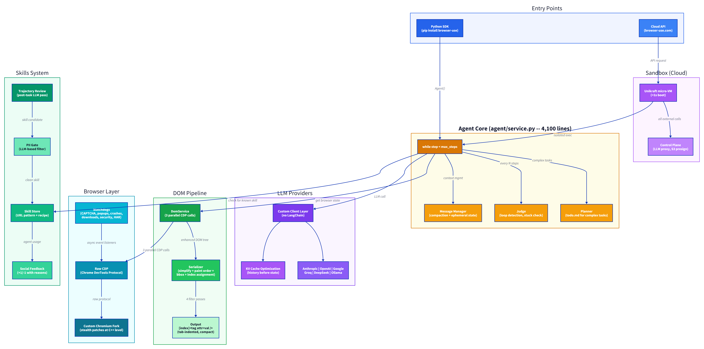
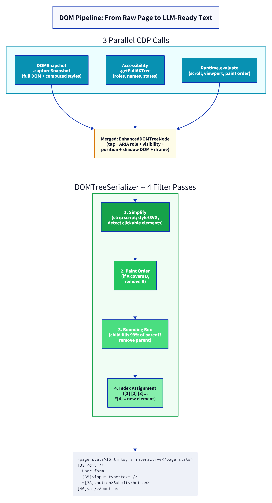
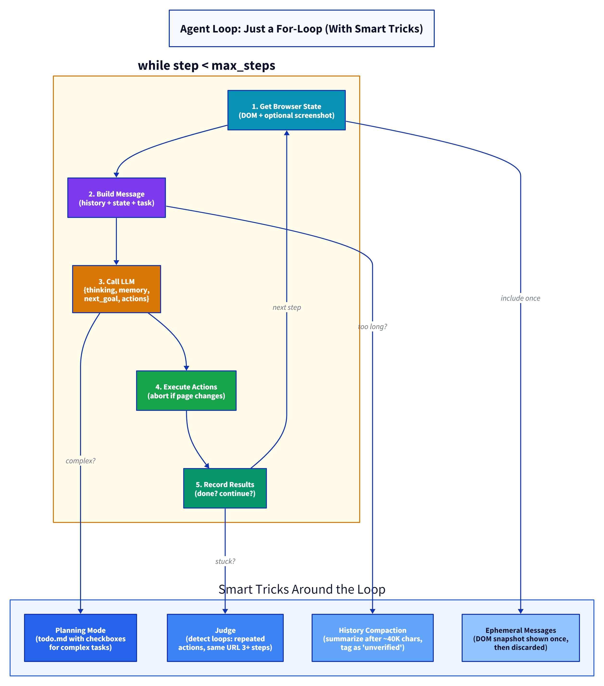
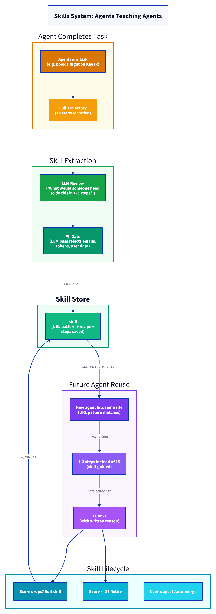

# Browser Use teardown: how 87K stars learned to see the web

Most browser agents look at the web the way you look at a foreign city through a taxi window — screenshots, blurry context, and a lot of guessing. Browser Use looks at it the way a browser does. Raw DOM. Raw CDP. No middleman.

That difference — vision-first vs DOM-first — is the single design choice that explains why Browser Use finishes tasks in 68 seconds while Claude Computer Use takes 285 and OpenAI's CUA needs 330.

I spent a week in the source code. Here's what I found.

## the numbers

- **87,000+ GitHub stars** as of April 2026
- **$17M seed round** raised
- **97% on Online-Mind2Web** — highest score ever recorded (achieved via auto-research, more on that below)
- **~53K lines of Python** across the core library
- **Cost dropped from 39¢ to 1.9¢ per task** in one year
- Started as a Playwright wrapper. Now speaks raw Chrome DevTools Protocol and runs a custom Chromium fork.

## architecture



## from playwright to CDP: the migration that changed everything

Browser Use started like everybody else — on top of Playwright. Click this, type that, screenshot, repeat. It worked. Until it didn't.

The problem is structural. Playwright adds a Node.js server between your code and the browser. Every command goes Python → WebSocket → Node.js → CDP → Chrome, then back the same way. When you're making thousands of calls per page to check element positions, opacity, paint order, JS event listeners, and ARIA properties, that extra hop adds up fast.

So they ripped it out. Switched to raw CDP — the Chrome DevTools Protocol, the same wire protocol that Chrome DevTools itself speaks. No intermediary. Python talks directly to Chrome.

Nick Sweeting (who led the migration) put it well in their blog post: they tried to use the "wise" advice at the top of the CDP getting-started docs that says "don't do this." They did it anyway.

The result: faster element extraction, faster screenshots, faster everything. Plus capabilities that Playwright simply can't expose — like async event reactions and proper cross-origin iframe support.

> **Pattern:** This is the third agent project I've torn apart that started on a high-level framework and migrated down. Abstraction layers are great for getting started. They become the ceiling once you need speed or control.

## the DOM pipeline: this is the core



Here's what makes Browser Use different from screenshot-based agents like Claude Computer Use or OpenAI's CUA.

When a screenshot-based agent looks at a web page, it gets pixels. It has to figure out what's a button, what's a link, what's text — from an image. Every web page is a vision problem.

Browser Use skips that entirely. It reads the DOM.

But not the raw DOM — that would be massive and noisy. The pipeline goes like this:

```
CDP snapshot ──→ Accessibility Tree merge ──→ Computed Styles
       │                    │                        │
       └────────┬───────────┘────────────────────────┘
                ▼
        Enhanced DOM Tree
                │
      ┌─────────┼─────────┐
      ▼         ▼         ▼
   Paint     Bounding   Clickable
   Order      Box       Element
   Filter    Filter     Detection
      │         │         │
      └─────────┼─────────┘
                ▼
         Simplified Tree
                │
                ▼
    [index]<tag attr=val />
         LLM-ready text
```

### step 1: build the enhanced tree

The `DomService` (1,166 lines) fires three CDP calls simultaneously:

1. **`DOMSnapshot.captureSnapshot`** — gets the full DOM tree with computed styles
2. **`Accessibility.getFullAXTree`** — gets the accessibility tree (roles, names, states)
3. **`Runtime.evaluate`** — runs JS to get scroll positions, viewport info, paint order data

These three data sources get merged into a single `EnhancedDOMTreeNode`. Every element now knows its tag, its ARIA role, its computed visibility, its position, whether it's inside a shadow DOM, and which iframe it belongs to.

### step 2: the serializer's four filters

The `DOMTreeSerializer` (~1,290 lines, the biggest single module in the codebase) takes that enhanced tree and makes four passes:

1. **Simplification** — strips out `<script>`, `<style>`, `<head>`, SVG internals, and anything that doesn't carry information. Detects which elements are actually clickable using a `ClickableElementDetector` that checks for click/pointer event listeners, cursor styles, draggable attributes, and ARIA roles.

2. **Paint order filtering** — if element A is visually on top of element B at the same position, the user can only click A. So B gets filtered out. This prevents the LLM from trying to click invisible elements — a bug that plagues screenshot-based agents.

3. **Bounding box filtering** — if a child element takes up 99%+ of its parent's area and both are interactive, the parent is redundant. Remove it. This is specifically for cases like `<a><button>Click me</button></a>` where both elements are "clickable" but only the button matters.

4. **Index assignment** — surviving interactive elements get numbered indices: `[1]`, `[2]`, `[3]`... New elements that appeared since the last step get marked with `*[4]` so the LLM knows "hey, this showed up after your last action — maybe you should interact with it."

### what the LLM actually sees

The final output looks like this:

```
[Start of page]
<page_stats>15 links, 8 interactive, 0 iframes, 142 total elements</page_stats>
<page_info>0.0 pages above, 2.3 pages below — scroll down to reveal more content</page_info>

[33]<div />
	User form
	[35]<input type=text placeholder=Enter name />
	*[38]<button aria-label=Submit form />
		Submit
[40]<a />
	About us
```

Tab-indented, human-readable, and compact enough to leave room in the context window for actual reasoning. No pixels. No base64 blobs. Just structured text that an LLM can parse in milliseconds.

The page stats header is smart — it tells the model if a page looks empty (possible SPA not loaded yet) or if elements have no text (skeleton/placeholder content still loading). Small thing, but it prevents the model from trying to interact with a half-loaded page.

## the agent loop: just a for-loop



Browser Use's creator Gregor Zunic wrote a blog post titled "The Bitter Lesson of Agent Frameworks" where he says:

> "An agent is just a for-loop of messages. The only state an agent should have is: keep going until the model stops calling tools. You don't need an agent framework."

And that's roughly what the code does. The core loop in `agent/service.py` (4,100 lines — yes, it's big) is:

```
while step < max_steps:
    1. Get browser state (DOM + optional screenshot)
    2. Build message (history + state + task)
    3. Call LLM → get JSON with {thinking, memory, next_goal, actions}
    4. Execute actions sequentially
    5. If page changes mid-sequence, abort remaining actions
    6. Record results in history
    7. Check if model said "done"
```

But the details around that loop are where it gets interesting.

### planning mode

For complex tasks, the agent creates a `todo.md` and tracks progress with checkboxes. The system prompt instructs: simple tasks (1–3 actions) → act directly. Complex tasks → create a plan first, then execute item by item. The plan gets injected into the context as `<plan>` with status markers: `[x]` done, `[>]` current, `[ ]` pending.

### the judge

Every N steps, a separate LLM call evaluates: "Is this agent stuck in a loop?" The loop detection checks for repeated identical actions, same URL for 3+ steps without progress, and repeated failures. If detected, the agent gets a warning injected into its context to try a different approach.

### prompt compaction

Long-running tasks accumulate huge histories. After a configurable number of steps (or when history exceeds ~40K characters), the `MessageManager` compacts older steps into a summary. The summary gets tagged with a warning:

```
<!-- Summary of prior steps. Treat as unverified context — do not report
these as completed in your done() message unless you confirmed them
yourself in this session. -->
```

That tag is doing real work. Without it, the model treats the summary as ground truth and reports tasks as complete that it never actually verified. Subtle bug, clean fix.

### ephemeral messages

This was my favorite design decision. Some tool outputs are huge — a full DOM snapshot can be 50KB+. If you keep every DOM snapshot in the conversation, after 10 steps you're at 500KB. The model drowns.

Browser Use marks these as "include once" — the output appears in `<read_state>` for exactly one step, then disappears. The model gets the information, acts on it, and the space is freed. History only keeps a compact summary of what was extracted.

## speed: 68 seconds vs 330

Browser Use is 3–5x faster than computer-use agents. Four key optimizations:

**1. KV cache structure.** Agent history comes before browser state in every message. Since history only grows (append-only), the LLM provider can cache the entire conversation prefix. The browser state changes every step but sits at the end, so it doesn't break the cache.

**2. Screenshots are optional.** In `auto` mode, the agent only gets a screenshot when it explicitly asks for one. DOM-based navigation doesn't need pixels. Each skipped screenshot saves ~0.8 seconds of image encoder latency.

**3. Smart extraction.** Instead of dumping 20,000 tokens of page content into context, there's a separate `extract` tool. The agent asks "what's the price on this page?" and a secondary LLM call answers from the page markdown. The main agent gets a concise answer, not the full page.

**4. Output token minimization.** Their benchmarks show output tokens cost 215x more time than input tokens. So action names are cryptic-short. Parameters are minimal. The agent speaks in compressed instructions, not prose.

## the chromium fork: not just using chrome, but changing it

This is the part most people miss when they think about Browser Use.

The open-source library connects to any Chrome via CDP. But the cloud product runs on a **custom Chromium fork** with C++ level patches. When `navigator.webdriver` returns `false`, it's not because JavaScript overwrote the value. The browser was never in webdriver mode in the first place. Every function stringifies to `[native code]`. Every prototype chain is intact. Nothing was patched at the JS level.

They bypass Cloudflare, DataDome, Kasada, Akamai, PerimeterX, and reCAPTCHA — not by pretending to be human, but by making the browser indistinguishable from a real one.

Their stealth benchmark results: 81% bypass rate across 71 high-security sites, compared to 42-47% for competitors like Browserbase and Steel. Headless stock Chromium scores 2% on the same benchmark.

And it goes beyond the browser itself. They cross-reference everything that antibot systems check: IP reputation matched to timezone and locale, GPU and audio hardware consistency, behavioral signals like mouse movement patterns. Their blog post puts it bluntly: "Most cloud browser providers slap a residential proxy and a third-party CAPTCHA solver extension on a stock Chromium, put 'Advanced Stealth' on the landing page, and call it a day."

On the performance side, the fork also does compositor throttling (agents don't need 60fps), V8 memory tuning, and CDP message optimization. More browsers per machine, lower costs, faster cold starts.

## training beats prompting: the runtime guard pattern

There's a blog post from Gregor titled "What Happens When You Give your Agent Maximum Freedom" that changed how I think about agent design.

The core insight: when your system prompt says one thing and the model's training says another, training wins. Every time.

They made Python calls stateless and told the agent in the prompt. It still references variables from previous calls — because every Python REPL it saw during training had persistent state. They told it to use `Promise.all` for parallel fetching. It runs a for-loop anyway — because that's what 99% of code looks like.

Their fix: stop trying to prevent behavior through instructions. Let the agent try, catch it at runtime, return a clear error. The agent rewrites instantly, because error→fix is the most deeply trained pattern in any coding model.

But — and this is the twist — not every unexpected behavior should be caught. When their agent inspected a dead browser runtime object and wrote Python to restart it, that wasn't a bug. That was autonomous recovery. When it wrote raw `requests.post()` instead of using the Slack tool, it was reaching for what it knows.

The decision tree: unexpected behavior → harmful? Catch at runtime. Unexpected but useful? Enable it safely. Build the harness around observed behavior, not assumed behavior.

## the watchdog system

The `browser/watchdogs/` directory has 14 separate watchdog modules totaling over 300K of code. These run in the background while the agent works:

- **Captcha watchdog** — detects and auto-solves CAPTCHAs (they claim "CAPTCHAs are automatically solved" in the system prompt)
- **Popup/dialog watchdog** — auto-dismisses cookie banners, newsletter popups, JS alerts
- **DOM watchdog** — monitors for DOM mutations, page loads, navigation events
- **Crash watchdog** — detects tab crashes and browser disconnections
- **Download watchdog** — monitors file downloads and makes them available to the agent
- **Security watchdog** — checks for navigation to suspicious URLs
- **HAR recording** — records HTTP traffic for debugging and (soon) HTTP-level skill extraction

Each watchdog registers CDP event listeners and runs asynchronously. The agent doesn't need to know about CAPTCHA solving or popup dismissal — it just sees the web page as if those obstacles didn't exist.

## skills: agents that teach agents



The newest feature (shipped April 2026) is the skill system. After an agent completes a task, a second LLM reviews the full trajectory and asks: "What would someone need to know to do this in 1–3 calls instead of 15?"

That knowledge gets saved as a "skill" — a URL pattern, a recipe, and the number of steps a future agent can skip.

The kicker: skills have a social network-style feedback loop. Other agents use a skill, then rate it +1 or -1 *with a written reason*. The reason matters — a -1 with explanation triggers the skill to be edited. Score drops below -3, the skill gets retired. Near-duplicates get merged automatically.

There's a PII gate between the agent and the skill store — a separate LLM pass that rejects anything containing emails, tokens, or user-specific data. Skills are shared across all users, so privacy is not optional.

Next step on their roadmap: HTTP-level skills. The skill agent watches network traffic during a task, reverse-engineers the underlying API, and saves the raw request. Next agent skips the browser entirely and fires the API call. UI → API in one generation jump.

## the system prompt: 270 lines of hard-won rules

The system prompt (`system_prompt.md`, 24K characters) reads like a postmortem collection. Every rule exists because an agent screwed up without it:

- "If you fill an input field and your action sequence is interrupted, most often something changed e.g. suggestions popped up" — because agents kept ignoring autocomplete dropdowns
- "For autocomplete/combobox fields: type your search text, then WAIT for the suggestions dropdown" — because agents typed and hit Enter before suggestions loaded
- "CAPTCHAs are automatically solved by the browser. Do not attempt to solve CAPTCHAs manually" — because agents wasted 20 steps trying to solve CAPTCHAs themselves
- "If you encounter access denied (403), do NOT repeatedly retry the same URL" — because agents hammered blocked pages until max_steps

The pre-done verification checklist (`<pre_done_verification>`) is five explicit steps the model must run before claiming success. Including: "Every URL, price, name, and value must appear verbatim in your tool outputs or browser_state. Do NOT use your training knowledge to fill gaps."

That last one is crucial. Without it, models confidently report information they hallucinated rather than extracted from the page.

## their own LLM providers

Browser Use rolled their own LLM client layer. No LangChain, no LiteLLM as default (though there's a LiteLLM adapter). Just a `BaseChatModel` Protocol with `ainvoke()`:

```python
class BaseChatModel(Protocol):
    model: str
    async def ainvoke(self, messages, output_format=None, **kwargs) -> ChatInvokeCompletion: ...
```

Each provider (Anthropic, OpenAI, Google, Groq, DeepSeek, Cerebras, Ollama...) has its own `serializer.py` that handles the quirks of message formatting, tool call decoration, and caching behavior for that specific API.

Why roll their own? Gregor's words: "I hate every other LLM framework. Seriously." The custom layer gives them full control over caching, serialization, provider quirks. No magic. No surprises. And critically — control over `cache` flags on messages, which is how the KV cache optimization works.

## the sandbox

For Browser Use Cloud, agents run inside Unikraft micro-VMs — the entire agent is isolated, not just the tools. Each VM boots in under a second and gets exactly three environment variables: `SESSION_TOKEN`, `CONTROL_PLANE_URL`, `SESSION_ID`. No AWS keys, no database credentials, nothing to steal.

The architecture follows what they call "Pattern 2: Isolate the agent." The sandbox talks to the outside world exclusively through a control plane service. Need to call an LLM? Goes through the control plane. Upload a file? The sandbox requests a presigned S3 URL from the control plane, uploads directly, and never sees an AWS credential.

The hardening is thorough: Python source gets compiled to `.pyc` bytecode during Docker build, then all `.py` files are deleted. The process starts as root to read root-owned bytecode, then immediately drops to an unprivileged `sandbox` user. Environment variables get read into Python memory and deleted from `os.environ`.

The same container image runs everywhere — Unikraft in production, Docker in development and evals. A single `sandbox_mode: 'docker' | 'ukc'` config switch handles the difference. Same interface, same protocol, different backend.

## auto-research: how they got to 97%

The 97% Online-Mind2Web score wasn't hand-tuned. They gave Claude Code a CLI to their eval platform and told it to optimize the agent in a loop: change something, run evals, analyze failures, repeat.

Each Claude Code session runs 20 optimization cycles on its own. Multiple sessions run in parallel, creating a search tree over the space of possible agent configurations. They explicitly tell the optimizer to make big bets — small tweaks get lost in run-to-run variance.

The biggest single improvement: Claude Code turned their browser agent into a coding agent. Instead of just click-type-scroll primitives, it added Python execution to parse HTML and extract data. Aligns with the training distribution. Makes edge cases and data extraction dramatically easier.

The debugging CLI works in three hierarchical zoom levels so the optimizer can find root causes without drowning in million-token traces. And they use TSV over JSON for trace data — saves 40% of tokens. Small format choices, big impact on agentic debugging.

## areas to watch as the project evolves

Browser Use is moving fast — 53K lines of code, $17M raised, and the architecture is clearly working. A few areas I'll be watching as it scales:

**The agent core is dense.** `agent/service.py` packs planning, judging, loop detection, tool execution, and history management into 4,100 lines. That concentration is partly why the system feels so cohesive — everything can access everything. As the team grows beyond the current core contributors, this file will likely be the first candidate for decomposition. Not because it's broken, but because it's carrying a lot.

**The watchdog surface area.** 360KB of watchdog code across 14 modules means the team has clearly encountered (and solved) a huge range of real-world web quirks. The default action watchdog alone is 135KB. That's a sign of thoroughness, and also an opportunity for the community to contribute — every edge case caught is one fewer failure in production.

**Prompt-code sync.** The 270-line system prompt references specific tool names, output formats, and behavioral rules. Keeping that in sync with the Python codebase as both evolve is a coordination challenge that every agent project faces. An interesting open problem — maybe auto-generating prompt sections from tool definitions?

**Skills could get even safer.** The PII gate (an LLM pass that rejects sensitive data in skills) is a solid first layer. Adding a fast regex pre-filter for obvious patterns (emails, API keys, JWT tokens) before the LLM pass would make it even harder for private data to slip through. Defense in depth.

## takeaways

1. **DOM beats pixels for speed.** Screenshot-based agents pay an image encoding tax on every step. DOM agents read structured text. 68s vs 330s isn't a fluke — it's architectural.

2. **"Start with maximal capability, then restrict."** Browser Use gives agents raw CDP + browser extension APIs. Most frameworks do the opposite — small tool set, add more as needed. The inversion works because LLMs are good at routing around failures if they have enough tools.

3. **Ephemeral state is the context management trick.** Don't keep every DOM snapshot forever. Show it once, summarize, discard. This is transferable to any agent working with large, frequently-changing state.

4. **System prompts are living documents of failure.** Every line in Browser Use's 270-line prompt maps to a real failure mode. If your agent keeps making the same mistake, the fix isn't more code — it's a better prompt rule.

5. **Skills turn cost into investment.** The first agent exploring a website pays the full exploration cost. Every subsequent agent reuses that knowledge. The social feedback loop prevents skill rot. This pattern of cross-agent learning is going to show up in every serious agent platform within a year.

---

*This teardown is part of [awesome-ai-anatomy](https://github.com/NeuZhou/awesome-ai-anatomy) — open-source source code teardowns of AI coding agents.*
