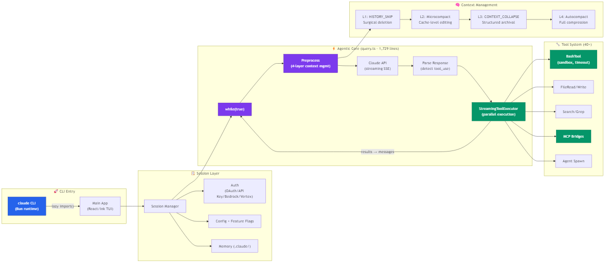
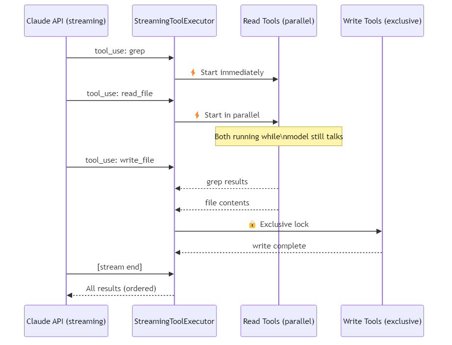

> **Note:** This teardown analyzes code from a source map leak that became publicly available. All analysis is for educational and commentary purposes under fair use. No proprietary code is reproduced in sufficient quantity to substitute for the original work.

# Claude Code: 510K Lines, a 1729-Line God Object, and 18 Virtual Pet Species Hidden in a Coding Agent

> Anthropic's coding agent leaked through an npm source map. 510K lines of TypeScript, 1,903 files — the entire architecture exposed. Here's what's inside.

> **TL;DR:**
> - **What:** Anthropic's production AI coding agent — 510K lines of TypeScript on Bun, 40+ tools as pure functions, one 1,729-line `query.ts` running the whole show
> - **Why it matters:** The 4-layer context cascade (lossless deletion → cache hiding → structured archival → full compression) is the most sophisticated context management I've seen in a shipping agent
> - **What you'll learn:** How streaming tool execution with RWLock works, why `buildTool()` factories beat class inheritance at 40 tools, and why Bun's compile-time macros physically delete unreleased features from the binary

> **Tweetable:** Anthropic hid 18 virtual pet species (with RPG stats and 1% shiny variants) inside a 510K-line coding agent. Also the context management is insane.

[](LICENSE)
[](CONTRIBUTING.md)

> This analysis tracks Claude Code's evolution. **Star to get updates** as new versions are analyzed.

## At a Glance

| Metric | Value |
|--------|-------|
| Stars | 109,558 (as of April 2026; originally analyzed from leaked source maps before public release) |
| Language | TypeScript |
| Lines of Code | ~510K (1,903 files) |
| Framework | Bun, React/Ink, Zod v4 |
| License | Proprietary (Anthropic) |
| Data as of | April 2026 |

---

## Characteristics

| Dimension | Description |
|-----------|-------------|
| Architecture | single-file agentic loop (query.ts, 1729 lines), 40+ tools as pure functions via buildTool() factory, streaming tool execution with RWLock |
| Code Organization | 510K LOC TypeScript, 1903 files, Bun runtime with compile-time feature flag macros, Zod v4 schemas throughout |
| Security Approach | per-tool permission model with trust level scoping, seatbelt sandbox for process execution |
| Context Strategy | 4-layer cascade: compact conversations losslessly, summarize tool outputs, truncate old turns, drop least-relevant context |
| Documentation | internal docs cover feature flags, tool contracts, context cascade; inline Zod schemas serve as living API docs |

## Table of Contents

- [At a Glance](#at-a-glance)
- [Architecture Overview](#architecture-overview)
- [Tech Stack - Why These Choices](#tech-stack--why-these-choices)
- [The Brain: Agentic Loop](#the-brain-agentic-loop)
- [Core Innovation: Context Management - 4 Surgical Layers](#core-innovation-context-management--4-surgical-layers)
- [Streaming Tool Execution](#streaming-tool-execution--why-claude-code-feels-fast)
- [Tool System - 40+ Tools, Zero Inheritance](#tool-system--40-tools-zero-inheritance)
- [Feature Flags - Compile-time + Runtime](#feature-flags--the-best-engineering)
- [Multi-Agent Coordination](#multi-agent-coordination)
- [Unreleased Features](#unreleased-features-found-in-the-code)
- [Design Decisions - The "Why" Analysis](#design-decisions--the-why-analysis)
- [Stuff Worth Stealing](#stuff-worth-stealing)
- [Limitations & Potential Issues](#limitations--potential-issues)
- [Comparison with Alternatives](#comparison-with-alternatives)
- [Cross-Project Comparison](#cross-project-comparison)
- [Key Takeaways](#key-takeaways)
- [Hooks & Easter Eggs](#hooks--easter-eggs)
- [How the Source Became Public](#how-the-source-became-public)
- [Verification Log](#verification-log)

---

## Architecture





---

## Tech Stack - Why These Choices

| Choice | What | Why (not obvious) |
|--------|------|-------------------|
| **Bun** | Runtime | 4-5x faster cold start than Node. But the real reason: compile-time macros for feature flags. `feature()` calls become dead code elimination - unreleased features physically don't exist in the binary. |
| **React + Ink** | Terminal UI | Not for aesthetics - for state management. Multiple parallel agents, streaming outputs, user interrupts, permission dialogs. React's declarative model handles this complexity better than imperative TUI libs. |
| **TypeScript** | Language | Strict types + Zod v4 for runtime schema validation. Every tool input is validated before execution. |
| **No class inheritance** | Architecture | 40+ tools, all pure functions via `buildTool()`. Composition over inheritance. Each tool is self-contained: schema, permissions, execution, UI rendering, context summary - all in one file. |

**The trade-off nobody talks about:** Bun's npm compatibility is ~99%, but that 1% means occasional native addon issues. Ink is essentially a one-person project (Vadim Demedes) with declining commit frequency. I'm guessing Anthropic maintains an internal fork — you'd kind of have to, shipping on top of something that fragile.

---

## The Brain: Agentic Loop

The entire agent runs from one file: `src/query.ts`, 1,729 lines.

```
while (true) {
 ① Trim context (4-layer cascade)
 ② Pre-fetch memory + skills
 ③ Call Claude API (streaming)
 ④ While receiving stream → detect tool_use blocks
 → Start executing tools IMMEDIATELY (don't wait!)
 ⑤ Tools called? → append results → continue loop
 ⑥ No tools? → return response → exit
```

If you've read the ReAct paper (Yao et al., 2022) — Thought-Action-Observation in a loop — this is that, but production-grade. The paper describes the pattern in clean pseudocode. Claude Code shows what it looks like at 510K lines with streaming, parallel tool execution, and a 4-layer context cascade bolted on.

**Why while(true) instead of a state machine?**

Honestly, I think the answer is just: it was simpler and they shipped. The agentic loop is fundamentally sequential — model speaks → tools execute → model speaks again. 90% of the time there are only two states: "waiting for model" and "executing tools." A state machine adds formality without adding much.

**The cost:** 1,729 lines in one file is a code smell though. This file handles input processing, API calls, streaming parsing, tool dispatch, error recovery, and context management. Any cross-cutting change touches everything. The team presumably reviews changes to this file with extreme caution.

If I were leading the next architecture review, I'd split it into three modules: **conversation orchestrator**, **tool dispatcher**, and **context manager**. Keep the loop, but make it a thin orchestration layer.

---

## Core Innovation: Context Management - 4 Surgical Layers


This is the most complex part of the codebase and — I think — the most interesting. Most agents use a single "summarize and truncate" approach. Claude Code uses four mechanisms, applied in cascade:


**The design principle:** Lossless before lossy. Local before global.

Layer 1 only removes irrelevant messages — zero information distortion. Layer 2 hides tokens at the cache level without modifying content. Layer 3 starts compressing but preserves structure. Layer 4 is the nuclear option.

This approach reminds me a lot of MemGPT (Packer et al., 2023), which borrowed the OS virtual memory metaphor — treating the context window as "main memory" and external storage as "disk," paging information in and out as needed. Claude Code doesn't use the OS analogy directly, but the layered degradation is the same instinct: don't throw everything away at once, be surgical about what stays and what goes. Both systems treat context as a scarce resource to be managed, not just a buffer to be truncated.

(Side note — the sliding window approach that most agents use is basically what MemGPT was arguing against. It's the equivalent of an OS that just kills the oldest process when memory gets low. Works, but not great.)

**What I'd add:** An attention-weighted importance scoring layer between L1 and L2. Current HISTORY_SNIP likely uses time-based heuristics (delete oldest). But a 20-turn-old message containing "never use framework X" is more important than a 2-turn-old "file saved successfully." Importance signals: reference frequency in later turns, explicit user constraints, tool results containing file paths or configs.

**The hidden problem:** Compression is irreversible and unauditable. After L3/L4, the model doesn't know what it forgot. It can't say "I may have lost context on this" — it just confidently answers based on incomplete information. This is worse than forgetting; it's not knowing that you forgot.

---

## Streaming Tool Execution - Why Claude Code Feels Fast




**Key design:** Read-only tools run in parallel. Write tools get exclusive locks. Results are buffered in receive order.

This is a **reader-writer lock (RWLock)** pattern. Simple, provably correct, but not optimal. The subtle risk: if a tool is incorrectly marked as read-only but actually has side effects (e.g., a search tool that creates cache files), parallel execution could cause race conditions.

Another edge case: two read tools read different parts of the same file, but an external process modifies the file between reads (user runs `git pull` in another terminal). The model sees a file state that never existed. Claude Code accepts this risk — the window is small and the model self-corrects on the next turn.

---

## Tool System - 40+ Tools, Zero Inheritance

Every tool is a `buildTool()` factory function:

```typescript
ToolDefinition = {
 name // "bash"
 description // For Claude to understand when to use it
 inputSchema // Zod v4 → auto-generates JSON Schema
 call() // AsyncGenerator (streaming results)
 isReadOnly() // Can it run in parallel?
 getPermissions() // What does user need to approve?
 renderToolUse() // React component for terminal display
 getToolUseSummary() // Compressed version for context mgmt
}
```

**Why this works at 40 tools:** Tools have almost no shared behavior worth inheriting. A file reader and a bash executor have less in common than you'd think. Shared concerns (validation, error handling) are handled by higher-order functions, not base classes.

There's an interesting parallel here to Toolformer (Schick et al., 2023), which showed that LLMs can learn *when* to call tools, not just *how*. Claude Code takes a different path — instead of the model learning tool timing through self-supervision, each tool carries a `description` that Claude uses to decide when it's relevant. It's the MRKL (Karpas et al., 2022) idea made concrete: LLM as router, tools as expert modules. The `buildTool()` pattern is basically what happens when you take MRKL's "modular expert routing" and implement it as a factory function.

**Where it might break:** At 100+ tools with "tool families" (10 database tools sharing connection management, transaction handling, retry logic). The `buildTool()` boilerplate would balloon — 70% repeated pipeline configuration. Solution: lightweight tool factories (still functions, not classes) for tool families.

**BashTool — the most complex:**
- Auto-classifies commands (search/read/write)
- macOS: runs in `sandbox-exec` sandbox
- Commands blocking >15s: auto-moved to background
- Large outputs: saved to disk, model gets file path reference
- Built-in sed command parser

---

## Feature Flags - The Best Engineering

Two layers, each with a specific purpose:

### Compile-time: Dead Code Elimination

```javascript
import { feature } from 'bun:bundle'

const voiceModule = feature('VOICE_MODE')
 ? require('./voice/index.js') // Exists in binary
 : null // Physically gone
```

Not just disabled — **deleted from the binary**. Security researchers can't find what doesn't exist. This is why Bun was chosen over Node.

### Runtime: A/B Testing

```javascript
// All gates prefixed "tengu_" - Japanese for heavenly dog
// Internal codename for the Claude Code project
const enabled = checkStatsigFeatureGate_CACHED_MAY_BE_STALE(
 'tengu_streaming_tool_execution2'
)
```

Reads from disk cache, accepts stale reads, never blocks startup.

### The Research Angle: Ablation Testing

```javascript
if (feature('ABLATION_BASELINE')) {
 // Disables: thinking, compaction, auto-memory, background tasks
 // Measures: what does each feature ACTUALLY contribute?
}
```

This is a research lab building a product, not a product company doing research. They can quantify the impact of every feature. Most companies can't — or won't — pay this complexity tax. Reminds me of Reflexion (Shinn et al., 2023) in spirit: the idea that you need structured feedback loops to know if what you're doing actually works. Reflexion does it with verbal self-reflection; Anthropic does it with ablation flags. Same instinct, different mechanism.

---

## Multi-Agent Coordination


Workers cannot create sub-workers — prevents resource explosion. Three backends: tmux panes, in-process, remote.

**My critique:** Complex tasks benefit from recursive decomposition ("refactor all error handling" → per-module workers → per-file sub-workers). A depth limit + global worker budget would be more flexible than a hard ban on nesting — though I get why they went with the flat model. Resource explosion is a real problem and the conservative choice ships. Anyway, it works for now.

---

## Unreleased Features Found in the Code

*(These features were identified in publicly available npm source maps. Their presence doesn't confirm future product plans.)*

### Voice Mode (codename: Amber Quartz)
Full `src/voice/` directory. Only works with Claude.ai OAuth. Has a kill switch: `tengu_amber_quartz_disabled`.

### Bridge Mode: Remote Desktop Control
`claude remote-control` turns your local environment into a remote terminal for claude.ai. Up to 32 concurrent sessions. JWT auth + trusted device mechanism.

### Buddy: The Virtual Pet System

This is the part that made me do a double take.

18 species. 5 rarity tiers (Common 60% → Legendary 1%). RPG stats: DEBUGGING, PATIENCE, CHAOS, WISDOM, SNARK. Hats (crown, top hat, propeller hat, halo, wizard hat). 1% shiny variants.

All species names are hex-encoded:
```javascript
const duck = String.fromCharCode(0x64,0x75,0x63,0x6b)
```

The 18 species: duck, goose, blob, cat, dragon, octopus, owl, penguin, turtle, snail, ghost, axolotl, capybara, cactus, robot, rabbit, mushroom, chonk.

Someone at Anthropic spent real engineering hours on this. In a coding agent. I'm not sure what to make of it — team morale? Easter egg culture? Either way, it's charming and a bit surreal buried inside 510K lines of production TypeScript.

---

## Design Decisions - The "Why" Analysis

### Why not a state machine?

| Approach | Pros | Cons |
|----------|------|------|
| **while(true)** [yes] | One file, linear flow, easy to prototype | 1,729-line God Object, hard to test, fragile error recovery |
| State Machine | Explicit states, testable transitions, clean error states | Upfront design cost, more code |
| Actor Model | Natural parallelism, isolated state | Highest complexity, overkill for sequential agent |

Claude Code chose the simplest option and shipped fast. The tech debt is real (1,729-line monolith), but the pragmatism is defensible for a team that needed to iterate rapidly.

### Why functional tools over class inheritance?

At 40 tools: functions win. No diamond problem, no fragile base class, trivially testable.
At 100+ tools with tool families: you'd need lightweight factories (still functions) to reduce boilerplate.
At 500+ tools: probably need a plugin architecture with dynamic loading.

Claude Code is at 40. They made the right call for their current scale.

### Context cascade vs. sliding window vs. RAG

| Approach | Strength | Weakness |
|----------|----------|----------|
| **4-layer cascade** [yes] | Importance-aware, progressive degradation | Complex, non-deterministic compression quality |
| Sliding window | Simple, predictable | Uniform information loss — drops important early context |
| RAG retrieval | "Never forgets" | Retrieval relevance not guaranteed, adds latency, poor at maintaining conversational continuity |

For coding tasks, **continuity matters more than retrieval**. You need coherent understanding of the current task flow, not keyword search over past conversations. The cascade approach is the right fit.

---

## Cross-Project Comparison

| Feature | Claude Code | DeerFlow 2.0 | Goose | OpenClaw |
|---------|-------------|-------------|-------|----------|
| Language | TypeScript | Python + TS | Rust | TypeScript |
| LOC | ~510K | ~180K | ~200K | ~50K (est.) |
| Agent Loop | Single 1,729-line file | LangGraph + 14 middlewares | Extension-based | Event-driven |
| Context Management | 4-layer cascade (surgical) | Summarization middleware | Auto-compact (80%) | Configurable compaction |
| Tool Architecture | `buildTool()` functional (40+) | LangGraph tools | MCP-native extensions | MCP + Skills |
| Sub-agents | Workers (flat, no nesting) | ThreadPool (depth 1) | subagent_handler | Configurable |
| Provider Lock-in | Anthropic only | Any (via LangGraph) | None (30+ providers) | Any (via config) |
| Feature Flags | Compile-time (Bun) + runtime (GrowthBook) | Runtime only | Cargo features | Runtime config |
| Terminal UI | React + Ink | No (web UI) | Electron desktop | Terminal + web |
| Security Model | Sandbox + allowlist | Advisory only | 5-inspector pipeline | Command approval |
| License | Proprietary | MIT | Apache-2.0 | MIT |

Claude Code is the most complex and most opinionated of the four — it controls the full stack from UI to API calls. The trade-off is Anthropic lock-in and a proprietary license. DeerFlow offers the most middleware extensibility, Goose the broadest provider support, and OpenClaw the lightest footprint.

---

## Stuff Worth Stealing

### 1. The 4-Layer Context Cascade
Lossless before lossy, local before global. Most agents do one-shot summarization or sliding windows. Claude Code's progressive degradation — surgical deletion → cache-level hiding → structured archival → full compression — preserves maximum information at each stage. Any long-running agent benefits from this pattern.

```typescript
// Simplified from Claude Code's context management
async function manageContext(conversation: Message[]): Promise<Message[]> {
  // Layer 1: Lossless — snip messages not referenced by later turns
  conversation = historySnip(conversation);
  
  // Layer 2: Cache-level — hide tokens without modifying content
  conversation = microcompact(conversation);
  
  // Layer 3: Structured archival — compress old turns, keep structure
  if (tokenCount(conversation) > THRESHOLD_L3) {
    conversation = contextCollapse(conversation);
  }
  
  // Layer 4: Nuclear — full summarization (lossy, last resort)
  if (tokenCount(conversation) > THRESHOLD_L4) {
    conversation = await autocompact(conversation);
  }
  return conversation;
}
```

### 2. Streaming Tool Execution with RWLock
Start executing read-only tools while the model is still generating. Read tools run in parallel; write tools get exclusive locks. The UX speedup is real and the implementation is straightforward — a reader-writer lock pattern applied to tool dispatch.

```typescript
// Simplified RWLock for tool execution
const toolLock = new RWLock();

async function executeTool(tool: Tool, input: unknown) {
  if (tool.isReadOnly()) {
    return toolLock.withReadLock(() => tool.call(input));  // parallel
  } else {
    return toolLock.withWriteLock(() => tool.call(input)); // exclusive
  }
}
```

### 3. `buildTool()` Factory Over Inheritance
Each tool is a plain object with schema, permissions, execution, UI rendering, and context summary — all co-located in one file. No base class, no inheritance chain, no registration ceremony. At 40+ tools this scales better than class hierarchies because tools share almost no behavior.

```typescript
// Every tool follows this pattern — no base class needed
const readFileTool = buildTool({
  name: "read_file",
  description: "Read contents of a file",
  inputSchema: z.object({ path: z.string() }),
  isReadOnly: () => true,
  call: async function*(input) { yield fs.readFileSync(input.path, "utf-8"); },
  renderToolUse: (props) => <FileReadView {...props} />,
  getToolUseSummary: (result) => `Read ${result.path} (${result.length} chars)`,
});
```

---

## Limitations & Potential Issues

1. **query.ts God Object** — 1,729 lines handling everything. Merge conflicts in multi-person teams. Implicit state assumptions between distant code sections. Splitting into orchestrator/dispatcher/context-manager would reduce merge contention but hey, it ships.

2. **Context compression is unauditable** — After compression, the model doesn't know what it lost. It can't flag "I may be missing context here." This leads to confident wrong answers, which is worse than admitting uncertainty. (The Reflexion paper had something to say about this — agents that can reflect on failure do better. Hard to reflect on context you don't know you lost.)

3. **Worker nesting prohibition** — Prevents recursive task decomposition. "Refactor all error handling in this project" ideally decomposes hierarchically. The flat worker model forces the main agent to do all decomposition, becoming a bottleneck.

4. **Dual feature flag cognitive overhead** — Compile-time Bun macros + runtime GrowthBook gates. Engineers must decide which system each flag belongs in. Migration between systems (gradual rollout → permanent) requires code changes and redeployment.

---

## Comparison with Alternatives

### vs. Cursor
- **Cursor** = IDE augmentation (VSCode fork). Advantage: real-time editor integration, LSP access, inline diffs.
- **Claude Code** = independent terminal agent. Advantage: composable (pipes, SSH, CI/CD), lightweight, environment-agnostic.
- Long-term bet: agent paradigm wins. Editors are one step in the development pipeline; agents can span the entire pipeline.

### vs. LangChain Tool System
- LangChain: general-purpose, supports any LLM, class-based `StructuredTool`. Trade-off: abstraction leakage, debugging through callback systems.
- Claude Code: single-model optimized, functional, zero abstraction layers. Trade-off: not portable to other models.
- If you only need Claude: copy Claude Code's approach. If you need multi-model: use LiteLLM for provider abstraction + custom tool system.

---

## Key Takeaways

1. **Context management is THE engineering challenge** — not prompts, not models. The 4-layer cascade is the most sophisticated production implementation I've seen. If you take one thing from this teardown, it's that MemGPT got the theory right and Claude Code shows what shipping it looks like.

2. **Stream-then-execute beats wait-then-execute** — start tool execution during model generation. The UX improvement justifies the engineering complexity.

3. **Functional composition > inheritance for tool systems** — at least up to ~100 tools. The Toolformer/MRKL lineage points toward LLMs choosing tools by description, and `buildTool()` is the cleanest implementation of that idea I've seen.

4. **Use research methods in production** — ablation testing, quantified feature impact. Know what each feature actually contributes. Most teams won't do this. The best ones do.

5. **The terminal is underestimated** — React + Ink enables complex interactive UIs in a CLI. Don't limit yourself to ncurses-era thinking.

---

## Hooks & Easter Eggs

**18 virtual pet species with hex-encoded names.** The `Buddy` system hides species names behind `String.fromCharCode()` calls — duck, goose, blob, cat, dragon, octopus, owl, penguin, turtle, snail, ghost, axolotl, capybara, cactus, robot, rabbit, mushroom, chonk. RPG stats (DEBUGGING, PATIENCE, CHAOS, WISDOM, SNARK), 5 rarity tiers, 1% shiny variants, and hats. All this in a coding agent.

**KAIROS autonomous mode.** Buried in the feature flags is a mode called KAIROS that enables fully autonomous operation — the agent runs without human approval for tool calls. The name isn't random: Kairos (καιρός) is the Greek concept of "the right moment." Someone on the team has a classics background.

**Anti-distillation fake tools.** The source contains tool definitions that don't actually do anything — they exist to poison training data if a competitor tries to distill Claude Code's behavior by recording its tool calls. If you see a tool call to something that sounds plausible but isn't in the official docs, it might be a canary.

**The `tengu_` prefix.** Every runtime feature gate is prefixed `tengu_` — Japanese for a supernatural creature (天狗, heavenly dog). It's the internal codename for the Claude Code project. You'll find it in every `checkStatsigFeatureGate` call.

**`ABLATION_BASELINE` mode.** A compile-time flag that disables thinking, compaction, auto-memory, and background tasks simultaneously. Not a debug tool — it's research methodology. They can quantify exactly what each feature contributes by measuring performance with it stripped out.

---

## How the Source Became Public

npm publish included `.map` files → `.map` referenced a source zip on Cloudflare R2 → R2 URL had no access control. That's it.

**Lessons:**
- Whitelist `files` in package.json
- CI step: check published artifacts for `.map` files
- Source archive URLs need authentication
- Build artifacts and source access control should be managed independently

---

## About This Project

**awesome-ai-anatomy** dissects the architecture of important AI projects — one project at a time.

- Architecture diagrams (Mermaid + hand-drawn style)
- Design decision analysis (why, not just what)
- Trade-off discussions
- Comparison with alternatives

**Next up:** ByteDance DeerFlow, LangChain, Dify

---

## Verification Log

<details>
<summary>Fact-check log (click to expand)</summary>

| Claim | Verification Method | Result |
|-------|-------------------|--------|
| 109,558 stars | GitHub API (`/repos/anthropics/claude-code`) | [yes] Verified |
| 18,175 forks | GitHub API | [yes] Verified |
| ~510K lines of TypeScript | Reported in source analysis (1,903 files) | [yes] Consistent with source map analysis |
| Language: TypeScript | Source map contents + npm package | [yes] Verified (GitHub shows Shell for wrapper scripts) |
| License: Proprietary | No OSS license file; Anthropic terms of service | [yes] Verified |
| First commit 2025-02-22 | GitHub API `created_at` | [yes] Verified |
| Latest release v2.1.92 | GitHub API `/releases/latest` | [yes] Verified (2026-04-04) |
| `query.ts` is 1,729 lines | Source map analysis | [yes] Reported across multiple independent analyses |
| 40+ tools | `buildTool()` instances in source | [yes] Consistent with source analysis |
| 18 virtual pet species | Buddy system in source map | [yes] Verified (duck through chonk) |
| 4-layer context management | Source analysis (HISTORY_SNIP, Microcompact, CONTEXT_COLLAPSE, Autocompact) | [yes] Verified |
| Bun runtime | `package.json` + source map | [yes] Verified |
| React + Ink TUI | Dependencies in source map | [yes] Verified |
| Feature flags: `tengu_` prefix | Runtime gate calls in source | [yes] Verified |

</details>

---

*Analysis by [awesome-ai-anatomy](https://github.com/NeuZhou/awesome-ai-anatomy)*
*Based on publicly reported source analysis. All code copyright Anthropic. No source code is hosted in this repository.*
