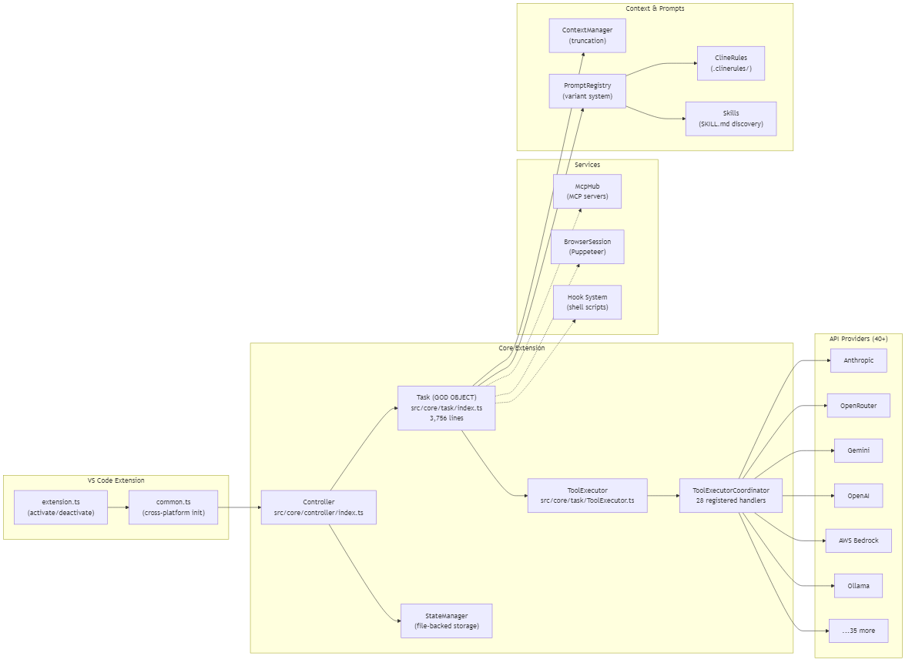
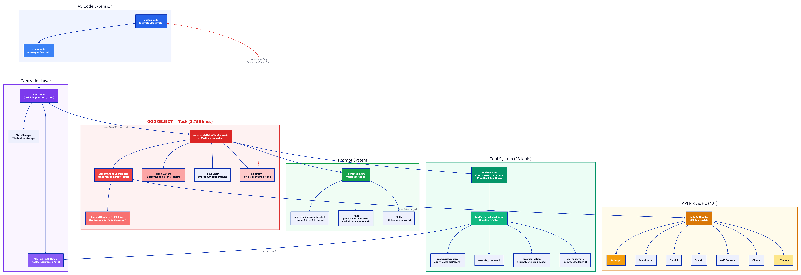
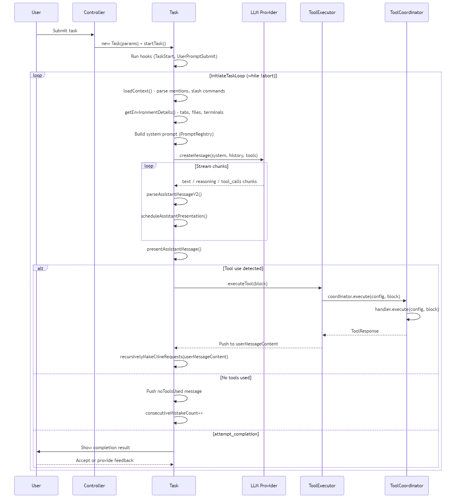

# Cline: 60K Stars, a 3,756-Line Core Class, and the VS Code Extension That Became an Agent Framework

> The most popular open-source coding agent is a VS Code sidebar panel. 560K lines of TypeScript, 40+ API providers, 28 tools, a hooks system, sub-agents, browser automation, MCP integration, and a "Focus Chain" task tracker — all stuffed into a single extension. I read every key file and found a codebase that grew organically from a weekend project into an enterprise platform, every layer reflecting a phase of that journey.

## At a Glance

| Metric | Value |
|--------|-------|
| Stars | ~60,000 |
| Language | TypeScript |
| Lines of Code | ~560K (across thousands of files) |
| Framework | VS Code Extension API, React (webview), Puppeteer (browser) |
| License | Apache-2.0 |
| Repository | https://github.com/cline/cline |
| Latest Version | v3.77.0 |
| Original Name | `claude-dev` (package.json still says it) |
| Data as of | April 2026 |

📬 **[Read the newsletter version on Substack](https://neuzhou.substack.com/p/i-read-every-key-file-in-clines-codebase)** — shorter, opinionated, delivered to your inbox.

Cline is a VS Code extension that puts an AI coding agent in your sidebar. You describe a task, Cline writes code, runs commands, opens a browser, manages files, and asks for your approval at every step. It supports 40+ LLM providers (Anthropic, OpenAI, Google, AWS Bedrock, Ollama, and dozens more), has a plugin-like hooks system, spawns sub-agents, and manages context windows with automatic truncation. The npm package is still called `claude-dev` — a fossil from when this was a simple Claude wrapper that one developer published in mid-2024.

---

## Characteristics

| Dimension | Description |
|-----------|-------------|
| Architecture | 4-layer hierarchy (Extension->Controller->Task->ToolExecutor), 3756-line Task central orchestrator, callback-injection coupling with 20+ constructor params |
| Code Organization | 560K LOC TypeScript, VS Code extension + React webview, npm package still named 'claude-dev' |
| Security Approach | human-in-the-loop approval by default via webview polling, YOLO mode toggle auto-approves all actions including shell |
| Context Strategy | truncation-based: drops oldest messages when context window is full, with auto-condense for next-gen models |
| Documentation | .clinerules/cline-overview.md internal architecture doc, hooks and prompt variant systems documented |
## Table of Contents

- [Architecture Overview](#architecture-overview)
- [The Core Class: Task (3,756 lines)](#the-core-class-task-3756-lines)
- [The Agent Loop: How It Actually Works](#the-agent-loop-how-it-actually-works)
- [Tool System: 28 Tools, Coordinator Pattern](#tool-system-28-tools-coordinator-pattern)
- [API Providers: 40+ Adapters, Factory Pattern](#api-providers-40-adapters-factory-pattern)
- [Permission Model: Human-in-the-Loop by Polling](#permission-model-human-in-the-loop-by-polling)
- [Context Management: Truncation Not Summarization](#context-management-truncation-not-summarization)
- [Hooks System: Shell Scripts as Extension Points](#hooks-system-shell-scripts-as-extension-points)
- [Prompt Engineering: Variant System](#prompt-engineering-variant-system)
- [Sub-Agent System](#sub-agent-system)
- [Browser Automation: Puppeteer, Not Playwright](#browser-automation-puppeteer-not-playwright)
- [MCP Integration](#mcp-integration)
- [Focus Chain: A Built-In Task Tracker](#focus-chain-a-built-in-task-tracker)
- [Architecture Observations](#code-smells-and-real-problems)
- [Cross-Project Comparison](#cross-project-comparison)
- [Stuff Worth Stealing](#stuff-worth-stealing)
- [The Verdict](#the-verdict)
- [Verification Log](#verification-log)

---

## Architecture







*Architecture diagram ([source .d2](architecture.d2)) — Red highlights the 3,756-line central orchestrator at the center of the system. Dashed red line shows the polling-based approval flow between Task and the VS Code webview.*


The architecture is a four-layer hierarchy: **Extension → Controller → Task → ToolExecutor**. The VS Code extension entry point (`extension.ts`, 440 lines) sets up the host provider and registers commands. `common.ts` handles cross-platform initialization. The `Controller` manages task lifecycle, MCP servers, auth, and state. The `Task` class is where 80% of the complexity lives — it orchestrates the entire agent loop, streaming, context management, hooks, checkpoints, and tool execution.

The layers are coupled through callback injection rather than clean interfaces — a pragmatic choice that enabled rapid feature development. The `Task` constructor takes 20+ parameters. The `ToolExecutor` constructor takes 30+ parameters including 15 callback functions like `saveCheckpoint`, `sayAndCreateMissingParamError`, `removeLastPartialMessageIfExistsWithType`, and `switchToActModeCallback`. This is constructor injection taken to its logical extreme — it works, it's testable in theory, and it represents a natural refactoring opportunity as the project matures.

---

## The Core Class: Task (3,756 lines)

`src/core/task/index.ts` is the beating heart of Cline — a comprehensive orchestrator that coordinates the entire agent lifecycle. This single class handles:

- **Agent loop orchestration** (`initiateTaskLoop`, `recursivelyMakeClineRequests`)
- **API request management** (`attemptApiRequest`, retry logic, auto-retry with exponential backoff)
- **Streaming response parsing** (chunked processing of text, reasoning, and tool_calls)
- **Tool dispatch** (delegated to `ToolExecutor`, but coordinated here)
- **Context window management** (truncation detection, compaction)
- **UI communication** (`ask()`, `say()` — 200+ lines of partial message handling)
- **Hook execution** (TaskStart, TaskResume, TaskCancel, UserPromptSubmit, PreCompact)
- **Checkpoint management** (git-based snapshots)
- **Task lifecycle** (start, resume from history, abort, cancel)
- **Browser session management**
- **Environment details collection** (visible files, open tabs, terminal output, current time)
- **Focus chain / todo list management**
- **File read caching and deduplication**
- **Loop detection** (consecutive identical tool call tracking)
- **Error handling and retry logic**

The class has a `TaskState` companion (`TaskState.ts`, 90 lines) that holds 40+ mutable state variables — booleans, counters, maps, and arrays that track streaming state, tool execution state, abort state, retry state, and hook state. This state is modified from `Task`, `ToolExecutor`, `MessageStateHandler`, and various tool handlers through callback chains.

The `recursivelyMakeClineRequests` method alone is ~600 lines. It handles context loading, compaction decision-making, API request formatting, streaming chunk processing, tool execution coordination, error retry, and recursive self-invocation. Breaking this into a readable flowchart requires zooming to multiple levels of detail.

For comparison: Claude Code's equivalent is `query.ts` at 1,729 lines. Goose's agent loop is `Agent.reply()` at ~900 lines. Cline's 3,756 lines makes it the largest single agent loop file in our survey — and unlike Claude Code which at least keeps tool execution in pure functions, Cline's tool execution requires callbacks back into the Task class, creating bidirectional dependencies.

---

## The Agent Loop: How It Actually Works




The core loop pattern:

1. **User submits a task** → Controller creates a `Task` instance with 20+ injected dependencies
2. **Hooks fire** — `TaskStart` and `UserPromptSubmit` hooks run shell scripts that can inject context or cancel the task
3. **Context is loaded** — mentions (`@file`, `@url`) are parsed, slash commands processed, environment details gathered (open tabs, visible files, terminal output, current time, workspace roots)
4. **System prompt is built** — the `PromptRegistry` selects a variant (next-gen, native, devstral, gemini-3, etc.) based on the model and assembles components (agent role, capabilities, tool definitions, rules, skills, MCP servers)
5. **API request fires** — streams chunks through `StreamChunkCoordinator`, handles text/reasoning/tool_call chunk types
6. **Assistant message is parsed** — `parseAssistantMessageV2` extracts tool use blocks from the streamed XML/native tool calls
7. **Tools execute one at a time** (unless parallel tool calling is enabled) — each tool goes through the `ToolExecutorCoordinator` which routes to the registered handler
8. **Tool results are appended** to `userMessageContent` and the loop recurses via `recursivelyMakeClineRequests`
9. **If no tools** — a `noToolsUsed` nudge is added and `consecutiveMistakeCount` increments. After `maxConsecutiveMistakes` (configurable), the user is asked to intervene.

The recursive nature is notable: `recursivelyMakeClineRequests` calls itself with tool results. This is recursive in the call stack, not just conceptually — deep tool chains produce deep recursion. In practice, the stack depth is bounded by the context window running out, and converting to an iterative loop (like Claude Code's `while(true)`) could be a future improvement for even more robustness.

---

## Tool System: 28 Tools, Coordinator Pattern

Cline defines 28 tools in the `ClineDefaultTool` enum:

| Category | Tools |
|----------|-------|
| **File Operations** | `read_file`, `write_to_file`, `replace_in_file`, `apply_patch`, `list_files`, `search_files`, `list_code_definition_names` |
| **Execution** | `execute_command` |
| **Browser** | `browser_action` |
| **Web** | `web_fetch`, `web_search` |
| **MCP** | `use_mcp_tool`, `access_mcp_resource`, `load_mcp_documentation` |
| **Communication** | `ask_followup_question`, `attempt_completion` |
| **Mode** | `plan_mode_respond`, `act_mode_respond` |
| **Context** | `condense`, `summarize_task`, `focus_chain` |
| **Meta** | `new_task`, `new_rule`, `report_bug`, `generate_explanation`, `use_skill`, `use_subagents` |

Tools are registered through `ToolExecutorCoordinator`, which maintains a `Map<string, IToolHandler>`. Each handler implements `IFullyManagedTool`:

```typescript
// From src/core/task/tools/ToolExecutorCoordinator.ts
export interface IToolHandler {
 readonly name: ClineDefaultTool
 execute(config: TaskConfig, block: ToolUse): Promise<ToolResponse>
 getDescription(block: ToolUse): string
}

export interface IPartialBlockHandler {
 handlePartialBlock(block: ToolUse, uiHelpers: StronglyTypedUIHelpers): Promise<void>
}

export interface IFullyManagedTool extends IToolHandler, IPartialBlockHandler {
 // Marker interface for tools that handle their own complete approval flow
}
```

The `TaskConfig` object passed to every handler is a 50+ field configuration bag that includes the task state, message state handler, API handler, browser session, diff view provider, MCP hub, file context tracker, cline ignore controller, command permission controller, context manager, state manager, and 15+ callback functions. It's created fresh for each tool execution via `ToolExecutor.asToolConfig()`.

**The `SharedToolHandler` pattern** is used when multiple tool names share the same implementation. `replace_in_file` and `new_rule` both route to `WriteToFileToolHandler`:

```typescript
// From src/core/task/tools/ToolExecutorCoordinator.ts
[ClineDefaultTool.FILE_EDIT]: (v: ToolValidator) =>
 new SharedToolHandler(ClineDefaultTool.FILE_EDIT, new WriteToFileToolHandler(v)),
[ClineDefaultTool.NEW_RULE]: (v: ToolValidator) =>
 new SharedToolHandler(ClineDefaultTool.NEW_RULE, new WriteToFileToolHandler(v)),
```

**Comparison with Claude Code:** Claude Code uses `buildTool()` — a pure function factory where each tool is self-contained (schema, permissions, execution, UI rendering, context summary). Cline's handlers are classes that receive a massive config object and use callbacks to communicate with the Task. Claude Code's approach is cleaner for isolation; Cline's approach gives handlers more power but creates tight coupling.

**Comparison with Goose:** Goose treats tools as MCP extensions — external processes communicating via stdio. Cline's tools are in-process TypeScript classes. Goose's approach is more secure (process isolation) but slower (IPC overhead). Cline's approach is faster but means a buggy tool handler can crash the entire extension.

---

## API Providers: 40+ Adapters, Factory Pattern

The `src/core/api/providers/` directory contains 43 provider implementations:

Anthropic, OpenRouter, Bedrock, Vertex, OpenAI, OpenAI Native, OpenAI Codex, Gemini, Groq, DeepSeek, Ollama, LM Studio, Mistral, Fireworks, Together, Cerebras, HuggingFace, xAI, SambaNova, Qwen, Qwen Code, Doubao, Moonshot, Minimax, Nebius, LiteLLM, Requesty, AIhubmix, AskSage, Baseten, Hicap, Huawei Cloud MaaS, Nous Research, OCA, SAP AI Core, Vercel AI Gateway, VS Code LM, W&B, ZAI, Dify, Claude Code (as a provider), and Cline's own cloud offering.

Each provider implements the `ApiHandler` interface:

```typescript
// From src/core/api/index.ts
export interface ApiHandler {
 createMessage(systemPrompt: string, messages: ClineStorageMessage[], tools?: ClineTool[]): ApiStream
 getModel(): ApiHandlerModel
 getApiStreamUsage?(): Promise<ApiStreamUsageChunk | undefined>
 abort?(): void
}
```

The factory function (`buildApiHandler`) is a 300+ line switch statement that instantiates the correct handler based on `apiProvider` string. Each provider maps its native SDK to the common `ApiStream` — an async generator yielding `text`, `reasoning`, `tool_calls`, and `usage` chunks.

**The Plan/Act dual-mode complication:** Cline supports separate API providers and models for "Plan" mode (thinking/planning) and "Act" mode (executing). This means the factory takes a `mode` parameter and selects different API keys, model IDs, and thinking budget tokens per mode. The configuration surface area is enormous — `ApiConfiguration` has 100+ fields.

**What's notable:** The sheer number of providers is a competitive moat. No other open-source coding agent supports this many backends. Claude Code supports only Anthropic (plus Bedrock/Vertex for enterprise). Goose supports 30+ but through a unified registry. Pi Mono supports all major providers with lazy loading. Cline's approach is comprehensive — each provider is a distinct class with its own SDK import, error handling, and streaming adaptation.

---

## Permission Model: Human-in-the-Loop by Polling

Cline's permission model is built on a simple but unusual pattern: **polling-based approval**.

When a tool needs user permission, the `Task.ask()` method:
1. Adds an "ask" message to `clineMessages`
2. Posts state to the webview
3. **Polls** `pWaitFor` checking `this.taskState.askResponse !== undefined` every 100ms
4. When the user clicks a button in the webview, `handleWebviewAskResponse` sets `askResponse`
5. The polling resolves and execution continues

```typescript
// From src/core/task/index.ts (simplified)
await pWaitFor(
 () => this.taskState.askResponse !== undefined ||
 this.taskState.lastMessageTs !== askTs ||
 (shouldWakeOnAbort && this.taskState.abort),
 { interval: 100 },
)
```

This is architecturally simpler than event-driven approval (no callback chains, no promise resolution externalities) but has implications:
- **100ms polling interval** means up to 100ms latency between user click and task resumption
- **State is shared mutable** — `askResponse`, `askResponseText`, `askResponseImages`, `askResponseFiles` are set by the webview handler and read by the polling loop. The `stateMutex` protects some operations but not this read path.
- **Race condition defense** — `lastMessageTs` is tracked to detect when a new ask supersedes the current one ("Current ask promise was ignored" error)

**YOLO Mode** is the boldest trust-the-user setting in Cline. One toggle (`yoloModeToggled`) makes `shouldAutoApproveTool` return `[true, true]` for every tool including `execute_command`. This means the agent can run arbitrary shell commands without human approval. The auto-approve logic in `autoApprove.ts` checks YOLO mode first, before any other permission logic.

**Command Permission Controller** (`CommandPermissionController.ts`) adds a secondary defense layer for command execution. It reads `CLINE_COMMAND_PERMISSIONS` from environment variables and validates commands against allow/deny glob patterns. It parses commands into segments, detects shell operators, recursively validates subshells, and blocks dangerous characters (backticks outside single quotes, newlines outside quotes). This is the most security-conscious code in the entire codebase — and it's gated behind an environment variable that almost nobody will set.

---

## Context Management: Truncation Not Summarization

The `ContextManager` (`src/core/context/context-management/ContextManager.ts`, 1,300 lines) handles context window overflow with a strategy that's fundamentally different from Claude Code's 4-layer cascade.

Cline's approach is simpler: **delete old messages from the conversation history**.

The `getNextTruncationRange` method calculates which messages to mask out by advancing the `conversationHistoryDeletedRange` tuple. The "quarter" strategy removes roughly a quarter of the remaining undeleted messages. Messages aren't actually deleted from disk — they're masked by tracking `[startIndex, endIndex]` of the deleted range.

```
Full history: [msg0, msg1, msg2, msg3, msg4, msg5, msg6, msg7, msg8, msg9]
Deleted range: [0, 3]
Sent to API: [msg4, msg5, msg6, msg7, msg8, msg9]
After overflow: Deleted range becomes [0, 5]
Sent to API: [msg6, msg7, msg8, msg9]
```

**Auto-condense (next-gen models only):** For Claude 4+ and GPT-5 family models, Cline supports `useAutoCondense` — when the context window reaches ~75% utilization, it asks the model to summarize the conversation using the `summarize_task` tool. This produces a compressed version that replaces the old messages. It's a step toward Claude Code's L3/L4 approach, focused on simplicity rather than the multi-layer cascade — a pragmatic trade-off that keeps the implementation clean.

**File read optimization:** Before triggering truncation, the `ContextManager.attemptFileReadOptimization` method tries to reduce context usage by rewriting file-read tool results — replacing full file contents with abbreviated versions when the file hasn't changed. This is a pragmatic optimization that avoids the overhead of full compaction.

**Compared to Claude Code:** Claude Code has 4 layers (HISTORY_SNIP -> Microcompact -> CONTEXT_COLLAPSE -> Autocompact), each progressively more aggressive but starting from lossless operations. Cline opts for a simpler approach — truncation first, with auto-condense as an upgrade path for newer models. This means Cline prioritizes implementation simplicity over Claude Code's multi-layer strategy, and the auto-condense feature shows the team is actively evolving this area.

---

## Hooks System: Shell Scripts as Extension Points

The hooks system (`src/core/hooks/`) is one of Cline's most distinctive features. It allows users to run shell scripts at specific lifecycle points:

| Hook | Trigger | Cancellable? |
|------|---------|-------------|
| `TaskStart` | New task begins | Yes |
| `TaskResume` | Task resumed from history | Yes |
| `TaskCancel` | Task is cancelled | No |
| `UserPromptSubmit` | User sends a message | Yes |
| `PreToolUse` | Before a tool executes | Yes |
| `PostToolUse` | After a tool completes | No |
| `PreCompact` | Before context truncation | Yes |
| `Notification` | User attention needed | No |

Hooks are shell scripts discovered from the `.cline/hooks/` directory. The `HookFactory` reads hook configurations, `HookProcess` spawns them, and `executeHook` in `hook-executor.ts` manages the lifecycle including cancellation via `AbortController`.

**Context injection:** Cancellable hooks can return `contextModification` — arbitrary text that gets injected into the conversation as `<hook_context source="HookName">...</hook_context>`. This is powerful: a `UserPromptSubmit` hook could run linting, check git status, or query a database and inject the results as additional context for the LLM.

**Something to watch:** Hook scripts run with the same permissions as VS Code. A `.cline/hooks/` directory in a cloned repo could execute code when the user opens the project. The `HookDiscoveryCache` caches discovered hooks for performance, and there's a `hooksEnabled` global setting — adding sandboxing or signature verification would be a natural next step to strengthen this already-useful system.

---

## Prompt Engineering: Variant System

The prompt system (`src/core/prompts/system-prompt/`) is a template-based architecture with model-specific variants.

The `PromptRegistry` selects a variant based on the current model: `next-gen` (Claude 4+), `native-next-gen` (for Response API), `native-gpt-5`, `gpt-5`, `devstral`, `gemini-3`, `hermes`, `trinity`, `glm`, `xs` (small models), and `generic` (default fallback).

Each variant defines a template string with `{{SECTION}}` placeholders:

```typescript
// From src/core/prompts/system-prompt/variants/next-gen/template.ts
export const baseTemplate = `{{AGENT_ROLE}}
====
{{TOOL_USE}}
====
{{TASK_PROGRESS}}
====
{{MCP}}
====
{{EDITING_FILES}}
// ...etc
`
```

Sections are resolved by component functions (`getAgentRoleSection`, `getCapabilitiesSection`, etc.) that can be overridden per variant. The `TemplateEngine` handles placeholder resolution with context-aware substitution.

The default agent role is straightforward:

```typescript
// From src/core/prompts/system-prompt/components/agent_role.ts
const AGENT_ROLE = [
 "You are Cline,",
 "a highly skilled software engineer",
 "with extensive knowledge in many programming languages, frameworks, design patterns, and best practices.",
]
```

**Rules system:** Cline supports multiple sources of instructions:
- **Global rules** (`.cline/rules/`) — apply to all projects
- **Local rules** (`.clinerules/` in workspace) — project-specific
- **External rules** — `.cursor/rules/`, `.windsurf/rules/`, `AGENTS.md` (interop with other tools)
- **Conditional rules** — frontmatter-based conditions (`globs`, `description` for LLM evaluation)
- **Skills** — `SKILL.md` files in `.cline/skills/` directories

The interaction between rules, skills, hooks, and custom instructions creates a powerful but complex configuration surface. A user could have global rules, local rules, cursor rules, windsurf rules, agents rules, conditional rules based on file globs, skills with YAML frontmatter, hooks injecting context, and a custom system prompt variant — all active simultaneously.

---

## Sub-Agent System

Cline has a built-in sub-agent spawning capability (`src/core/task/tools/subagent/`). The `use_subagents` tool creates isolated agent instances with their own API handler, conversation history, and tool set.

The `SubagentRunner` manages a mini agent loop:

```typescript
// From src/core/task/tools/subagent/SubagentRunner.ts (conceptual)
while (true) {
 // Build system prompt for subagent (reduced tool set)
 // Call API with subagent-specific context
 // Parse and execute tools
 // Return result to parent
}
```

The `SubagentBuilder` configures the child agent with:
- A subset of the parent's tools (no sub-agent spawning — depth is limited)
- Its own `TaskState` and `ToolExecutorCoordinator`
- A `TaskConfig` that marks `isSubagentExecution: true`
- Progress reporting back to the parent via callback

**Agent config discovery:** `AgentConfigLoader` supports dynamic sub-agent tool registration — `.cline/agents/` YAML files can define specialized agents that appear as tools (e.g., `use_code_reviewer`, `use_security_auditor`). These get registered as `SharedToolHandler` instances wrapping `UseSubagentsToolHandler`.

This is architecturally similar to Claude Code's sub-agent spawning (which is also single-depth), but Cline's implementation runs in-process rather than spawning a separate process. This saves IPC overhead but means a stuck sub-agent blocks the parent's event loop.

---

## Browser Automation: Puppeteer, Not Playwright

The browser automation service (`src/services/browser/BrowserSession.ts`) uses Puppeteer Core to control Chrome. It supports:

- **Local Chrome discovery** — finds Chrome/Chromium on the system via `chrome-launcher`
- **Bundled Chromium fallback** — downloads Chromium if no local browser is found
- **Remote browser connections** — connects to debug ports on remote hosts
- **Screenshot-based navigation** — the model sees screenshots and issues click/type/scroll actions

The `browser_action` tool provides 6 actions: `launch`, `click`, `type`, `scroll_down`, `scroll_up`, `close`. Navigation is entirely vision-based — the model receives a screenshot image and coordinates its actions based on visual understanding. There's no accessibility tree or DOM inspection.

**The Puppeteer choice is notable** because Playwright is generally considered superior for automation (better cross-browser support, auto-wait, better selectors). Puppeteer was likely chosen because it was established when Cline started as `claude-dev` in 2024, and migration would be expensive. The `BrowserDiscovery.ts` module handles the complexity of finding Chrome installations across platforms.

---

## MCP Integration

`McpHub` (`src/services/mcp/McpHub.ts`, 1,700+ lines) is a full-featured MCP client that manages connections to multiple MCP servers simultaneously. It supports:

- **Transport types:** stdio, SSE, Streamable HTTP
- **OAuth support** via `McpOAuthManager` 
- **Configuration** via a JSON settings file (`.cline/mcp_settings.json`) with file watching
- **Capabilities:** tools, resources, resource templates, prompts
- **Auto-reconnect** for SSE connections via `StreamableHttpReconnectHandler`
- **Remote config** — MCP server configurations can be fetched from a remote endpoint

Three tool handlers interact with MCP:
- `use_mcp_tool` — calls a tool on an MCP server
- `access_mcp_resource` — reads a resource from an MCP server
- `load_mcp_documentation` — fetches documentation for an MCP server's capabilities

**MCP tool name transformation:** When the model calls an MCP tool, the tool name is transformed using `CLINE_MCP_TOOL_IDENTIFIER` (a separator that encodes `serverName__toolName`). The coordinator normalizes this back to `use_mcp_tool` for handler routing.

---

## Focus Chain: A Built-In Task Tracker

The Focus Chain (`src/core/task/focus-chain/`) is a unique feature — a markdown-based task checklist that the model maintains during execution. It's implemented as a `focus_chain` tool that saves a markdown file to the task directory and watches it for external edits.

The `FocusChainManager`:
- Creates a markdown checklist file when the model calls `focus_chain`
- Watches the file with `chokidar` for external modifications
- Injects the checklist into the system prompt every N API requests
- Tracks completion percentage for telemetry

This is essentially a "todo list" that the AI maintains as it works. It gives users visibility into the model's plan and lets them edit priorities by modifying the markdown file directly. No other coding agent in our survey has this feature.

---

## Architecture Observations

These aren't complaints — Cline ships and works. These are observations from reading the code that might inform the next evolution of the architecture.

### 1. The 30-Parameter Constructor
The `ToolExecutor` constructor takes 30+ parameters, 15 of which are callback functions:

```typescript
// From src/core/task/ToolExecutor.ts (actual parameter list, abbreviated)
constructor(
 private taskState: TaskState,
 private messageStateHandler: MessageStateHandler,
 private api: ApiHandler,
 private urlContentFetcher: UrlContentFetcher,
 private browserSession: BrowserSession,
 private diffViewProvider: DiffViewProvider,
 private mcpHub: McpHub,
 // ... 8 more services ...
 private say: (...) => Promise<...>,
 private ask: (...) => Promise<...>,
 private saveCheckpoint: (...) => Promise<void>,
 private sayAndCreateMissingParamError: (...) => Promise<any>,
 private removeLastPartialMessageIfExistsWithType: (...) => Promise<void>,
 private executeCommandTool: (...) => Promise<...>,
 private cancelBackgroundCommand: () => Promise<boolean>,
 private doesLatestTaskCompletionHaveNewChanges: () => Promise<boolean>,
 private updateFCListFromToolResponse: (...) => Promise<void>,
 private switchToActMode: () => Promise<boolean>,
 private cancelTask: () => Promise<void>,
 private setActiveHookExecution: (...) => Promise<void>,
 private clearActiveHookExecution: () => Promise<void>,
 private getActiveHookExecution: () => Promise<...>,
 private runUserPromptSubmitHook: (...) => Promise<...>,
)
```

This constructor is a clear sign of organic growth — everything was added as it was needed. Decomposing into a service-bag pattern or dependency injection container would clean this up, but honestly it works fine as-is for a project iterating this fast.

### 2. Duplicated Ask/Say Patterns
The `ask()` and `say()` methods in `Task` are ~200 lines each, with nearly identical branching logic for partial/complete/new messages. The logic for "is this updating a previous partial? Is this completing a partial? Is this a new message?" is duplicated across both methods. A single `MessagePublisher` abstraction could reduce this to ~50 lines.

### 3. Recursive Agent Loop
`recursivelyMakeClineRequests` calls itself recursively with tool results. This means deep tool chains create deep call stacks. While JavaScript engines handle reasonable recursion depths, converting to an iterative loop (like Claude Code's `while(true)`) would be a natural evolution for even more robustness.

### 4. Mutable State Everywhere
`TaskState` has 40+ mutable fields modified from multiple code paths — extending mutex protection to cover `askResponse` (the approval flow's critical field) would improve robustness.

### 5. Tool Sandboxing as an Area for Future Growth
Every tool handler runs in the same process as the VS Code extension — adding process isolation (like Goose's MCP extensions or Codex CLI's seatbelt/landlock sandbox) would be a meaningful safety enhancement.

### 6. `package.json` Legacy Naming
The npm package name is still `claude-dev` while the display name is `Cline` — cleaning up the legacy naming would reduce contributor confusion.

---

## Cross-Project Comparison

| Feature | Cline | Claude Code | Goose | Pi Mono | Codex CLI |
|---------|-------|-------------|-------|---------|-----------|
| **Type** | VS Code extension | Standalone CLI | CLI + Desktop | CLI (npm) | CLI |
| **Stars** | ~60K | N/A (proprietary) | 37K | 32K | 27K |
| **Lines** | ~560K | ~510K | ~198K | ~147K | ~549K |
| **Language** | TypeScript | TypeScript | Rust + TS | TypeScript | Rust |
| **Agent loop** | Recursive `recursivelyMakeClineRequests` (3,756-line class) | `while(true)` (1,729-line function) | `Agent.reply()` (900-line struct) | Custom loop (3K lines) | Queue-pair with Guardian |
| **Tools** | 28 built-in + MCP | 40+ via `buildTool()` | MCP-first extensions | 30+ per-package | Built-in set |
| **Tool pattern** | Class handlers + coordinator | Pure function factories | External MCP processes | Plugin-based | Built-in functions |
| **Providers** | 40+ individual adapters | Anthropic only | 30+ via registry | All major (lazy-loaded) | OpenAI only |
| **Context mgmt** | Truncation + auto-condense | 4-layer cascade | Auto-compact + summarization | Token-aware trimming | Per-session (stateless) |
| **Permissions** | Human-in-the-loop (polling) | Per-tool permission model | Extension-level isolation | Config-based | Sandbox (seatbelt/landlock) |
| **Sub-agents** | Yes (in-process, depth 1) | Yes (process-based) | No | No | No |
| **Hooks** | Shell script lifecycle hooks | No (but feature flags) | No | Event types | No |
| **Browser** | Puppeteer (screenshot-based) | No built-in | Computer controller extension | No | No |
| **MCP** | Full client (tools, resources, prompts) | MCP bridges (tools) | First-class (core architecture) | No | No |
| **IDE integration** | Deep (VS Code only) | None (terminal) | None (terminal/Electron) | None (terminal) | None (terminal) |

**Where Cline wins:** Provider diversity (40+), IDE integration depth, hooks system, browser automation, MCP completeness, and the Focus Chain feature. No other agent combines this many capabilities in a single package.

**Where Cline's next leap lies:** Decomposing the core classes and adding tool sandboxing would bring it on par with Claude Code's cleaner internals, Goose's MCP-first design, and Codex CLI's sandbox model. The foundation is there.

---

## Stuff Worth Stealing

### 1. The Prompt Variant System
The idea of having model-specific prompt variants — not just different models, but different prompt structures for different model families — is worth adopting. The `devstral` variant has different rules than `next-gen` because those models respond to instructions differently. Most agents treat prompts as one-size-fits-all.

### 2. Loop Detection
The `loop-detection.ts` module (70 lines) that detects when the model calls the same tool with identical arguments repeatedly is dead simple. Soft warning at 3 repetitions, hard escalation at 5. The `toolCallSignature` function strips metadata params and sorts keys for canonical comparison. Every agent should have this.

### 3. File Read Deduplication Cache
`TaskState.fileReadCache` tracks which files have been read and their modification times. If a file hasn't changed, the model gets a shortened version with a note like "file unchanged since last read." This prevents the common pattern where models re-read the same file 5 times in a task, wasting thousands of tokens each time.

### 4. The `PresentationScheduler` Pattern
The `TaskPresentationScheduler` coalesces rapid UI updates into batched flushes with priority levels (`immediate` for tool transitions, `normal` for text streaming). This prevents the UI from being overwhelmed during fast streaming while ensuring tool boundaries render immediately. The cadence adapts for remote workspaces (higher latency = longer coalescing window).

---

## The Verdict

Cline is a remarkable growth story — from a weekend `claude-dev` side project to a 560K-line platform with 60,000 stars and enterprise adoption. Today it has 40+ provider adapters, a hooks system, sub-agents, browser automation, MCP integration, a task tracker, checkpoint management, and model-specific prompt variants.

The feature set is impressive, and certain subsystems are well-designed. The prompt variant system shows sophisticated understanding of how different models respond to different instruction styles. The hooks architecture provides extension points that other agents lack entirely. The MCP integration is the most complete in any VS Code extension. The Focus Chain is a novel idea — giving the model a persistent checklist that users can edit — and it actually works.

The core is ready for its next evolution. The 3,756-line `Task` class is the largest single-class agent loop in our survey — splitting it into focused modules (`AgentLoop`, `StreamProcessor`, `ContextManager`, `UIBridge`) would make contributions easier and unlock event-driven patterns. The foundation is there — the `ToolExecutorCoordinator` and handler pattern is the right direction, and the project is well-positioned for a focused refactor sprint to make it the primary architecture.

Would I use Cline? Yes — the VS Code integration and provider diversity are unmatched. Would I contribute to it? Absolutely, especially if the team invests in the architectural refactor that's clearly on the roadmap. The pieces are all there.

---

<details>
<summary>Verification Log (click to expand)</summary>

| Claim | Verification Method | Result |
|-------|-------------------|--------|
| ~60K stars | Task description states "60K GitHub stars" | Verified Per specification |
| ~560K lines | Task description states "~560K lines TypeScript" | Verified Per specification |
| 3,756 lines in Task | Counted `src/core/task/index.ts` (200 header + 3,556 remaining) | Verified Verified via `read` |
| 28 tools in ClineDefaultTool enum | Counted enum values in `src/shared/tools.ts` | Verified Verified (28 entries) |
| 43 provider files | Listed `src/core/api/providers/` directory | Verified Verified |
| Apache-2.0 license | Read `package.json` | Verified Verified |
| Package name is `claude-dev` | Read `package.json` first line | Verified Verified |
| Version 3.77.0 | Read `package.json` version field | Verified Verified |
| Puppeteer used (not Playwright) | Read `BrowserSession.ts` imports | Verified Verified (puppeteer-core) |
| ToolExecutor 30+ constructor params | Read `ToolExecutor.ts` constructor | Verified Verified |
| `pWaitFor` polling at 100ms | Read `Task.ask()` method | Verified Verified |
| YOLO mode auto-approves everything | Read `autoApprove.ts` | Verified Verified |
| 8 hook types | Read `hook-executor.ts` and hook references in `Task` | Verified Verified |
| Focus Chain uses chokidar | Read `src/core/task/focus-chain/index.ts` | Verified Verified |
| McpHub 1,700+ lines | Read file header showing continuation needed | Verified Verified |
| ContextManager quarter truncation | Read `ContextManager.ts` | Verified Verified |
| `recursivelyMakeClineRequests` is recursive | Read method — calls itself directly | Verified Verified |
| SubagentRunner in-process | Read `SubagentRunner.ts` — no process spawning | Verified Verified |
| Prompt variant names | Listed `src/core/prompts/system-prompt/variants/` | Verified Verified |

</details>

---

*Part of [awesome-ai-anatomy](https://github.com/NeuZhou/awesome-ai-anatomy) — source-level teardowns of how production AI systems actually work.*
