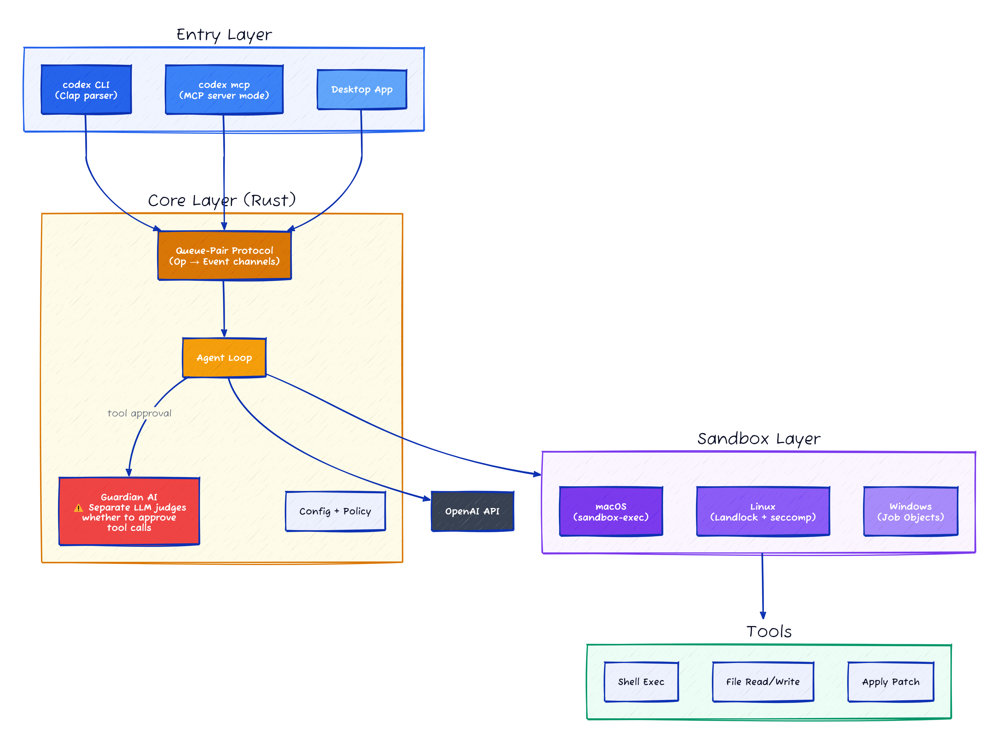
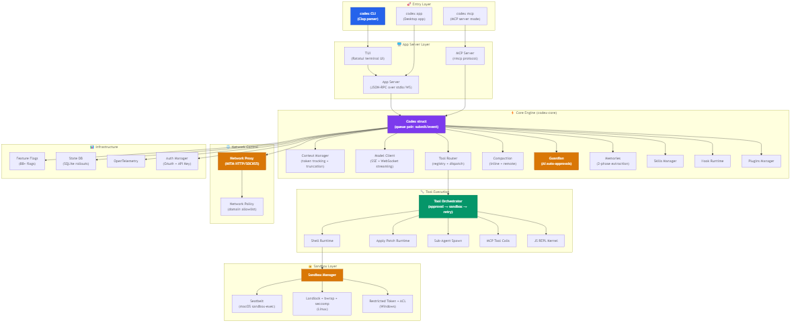

# OpenAI Codex CLI: 549K Lines of Rust, a Guardian AI That Reviews Its Own AI, and the Most Paranoid Sandbox in Any Coding Agent

> **The first production Rust-native AI coding agent, dissected.**
> 549,000 lines of Rust across 1,389 files. 88 workspace crates. A three-layer sandbox that runs on macOS, Linux, and Windows. All open source under Apache-2.0.

> **Who is this for:** Engineers building AI agents, coding tools, or anyone curious about what happens when you rebuild "Claude Code but in Rust" from scratch — and end up with something architecturally quite different.

[](https://github.com/openai/codex/blob/main/LICENSE)
[](https://github.com/openai/codex/blob/main/docs/contributing.md)

> This analysis is based on the public open-source repository at [github.com/openai/codex](https://github.com/openai/codex).

## At a Glance

| Metric | Value |
|--------|-------|
| Repository | [openai/codex](https://github.com/openai/codex) |
| Language | Rust (549K LoC), TypeScript SDK |
| Files | 1,389 `.rs` files (162 test files) |
| Workspace Crates | 88 |
| Framework | Tokio async runtime, Ratatui TUI, Clap CLI |
| Build System | Cargo + Bazel (dual) |
| License | Apache-2.0 |
| Sandbox | Seatbelt (macOS), Landlock+bubblewrap+seccomp (Linux), Restricted Token + ACL (Windows) |
| Data as of | April 2026 |

---

## Overall Rating

| Dimension | Grade | Notes |
|-----------|-------|-------|
| Architecture | A | 88 workspace crates, queue-pair submit/event model cleanly separates concerns |
| Code Quality | A | 549K LOC Rust with 162 test files, dual Cargo+Bazel build, strict type boundaries |
| Security | A | Three-platform sandbox (Seatbelt/Landlock+seccomp/Restricted Token), Guardian AI reviews tool calls |
| Documentation | B+ | Crate-level docs exist but cross-crate architecture requires reading the code |
| **Overall** | **A** | **Strongest sandbox design in the group; Guardian auto-approval is a novel trust delegation pattern** |

---

## Table of Contents

- [At a Glance](#at-a-glance)
- [Architecture Overview](#architecture-overview)
- [Core Module Analysis](#core-module-analysis)
 - [codex-core — The Brain](#codex-core--the-brain-176k-lines)
 - [codex-tui — Terminal UI](#codex-tui--terminal-ui-112k-lines)
 - [codex-cli — Entry Point](#codex-cli--entry-point-5k-lines)
 - [Tool System — codex-tools + core/tools](#tool-system--codex-tools--coretools)
 - [Sandbox Stack — Three-Platform Security](#sandbox-stack--three-platform-security)
 - [Hook System — Lifecycle Interception](#hook-system--lifecycle-interception)
 - [Skills System — Markdown-Driven Extensions](#skills-system--markdown-driven-extensions)
 - [Protocol — The Contract Layer](#protocol--the-contract-layer)
 - [MCP Integration — Model Context Protocol](#mcp-integration--model-context-protocol)
 - [Exec & Exec-Server — Process Execution](#exec--exec-server--process-execution)
 - [Guardian — AI Reviews AI](#guardian--ai-reviews-ai)
 - [Network Proxy — MITM for Safety](#network-proxy--mitm-for-safety)
 - [App Server — Multi-Client Architecture](#app-server--multi-client-architecture)
- [Design Decisions (ADR)](#design-decisions-adr)
- [Comparison with Claude Code](#comparison-with-claude-code)
- [Security Analysis](#security-analysis)
- [Code Metrics](#code-metrics)
- [Stuff Worth Stealing](#stuff-worth-stealing)
- [Limitations & Technical Debt](#limitations--technical-debt)
- [Key Takeaways](#key-takeaways)

---

## Architecture Overview




**The key architectural insight:** Codex CLI is built as a **queue-pair** system. The `Codex` struct exposes a `Sender<Submission>` and a `Receiver<Event>`. You push operations in, you receive events out. Everything else — model calls, tool execution, sandbox management, approval flows — happens inside this async loop. This makes the system composable: the TUI, App Server, and MCP Server are all just different frontends submitting to the same queue.

---

## Core Module Analysis

### codex-core — The Brain (176K lines)

**Path:** `codex-rs/core/`

This is the largest crate and the team knows it's too big — their `AGENTS.md` explicitly says "**resist adding code to codex-core!**"

The central type is `Codex` in `codex-rs/core/src/codex.rs` — a 7,786-line file (well beyond the team's own 500-line module guideline). It implements:

1. **Session lifecycle** — `spawn()` initializes auth, config, skills, plugins, MCP connections, then enters the main submission loop
2. **Turn execution** — Each user message triggers a turn: build context → call model API → dispatch tool calls → loop until no more tool calls
3. **Compaction** — When context exceeds model window, triggers inline or remote compaction (summarization)
4. **Sub-agent orchestration** — Can spawn child `Codex` instances for multi-agent workflows

```
Codex::spawn() {
 ① Initialize auth, config, skills, plugins, MCP
 ② Enter submission loop:
 match submission {
 Op::UserInput → start_turn()
 Op::Compact → run_compact_task() 
 Op::Interrupt → cancel current turn
 Op::Shutdown → graceful exit
 }
 ③ start_turn():
 - Build context (ContextManager + initial injections) 
 - Stream from ModelClient (SSE or WebSocket)
 - For each response item:
 - Text → emit to UI
 - ToolCall → dispatch via ToolRouter
 - Tool results → append to context → next model call
 - No tools? → turn complete
}
```

**Key sub-modules within core:**

| Module | Lines | Purpose |
|--------|-------|---------|
| `tools/` | ~8K | Tool routing, parallel execution, sandbox orchestration |
| `context_manager/` | ~1.5K | Token tracking, history management, truncation |
| `compact.rs` + `compact_remote.rs` | ~500 | Context window compaction (summarization) |
| `guardian/` | ~1.5K | AI-powered auto-approval for dangerous actions |
| `memories/` | ~2K | Two-phase memory extraction from past sessions |
| `agent/` | ~1K | Multi-agent registry over sub-threads |
| `plugins/` | ~3K | Plugin discovery, marketplace, injection |
| `config/` | ~2K | Layered configuration, permissions, schema |
| `unified_exec/` | ~2K | PTY-backed persistent shell processes |

**The `Codex` struct (simplified):**

```rust
// codex-rs/core/src/codex.rs
pub struct Codex {
 tx_sub: Sender<Submission>, // push operations
 rx_event: Receiver<Event>, // receive events
 agent_status: watch::Receiver<AgentStatus>,
 session: Arc<Session>, // shared state
 session_loop_termination: Shared<BoxFuture<'static, ()>>,
}
```

The `Session` arc holds everything shared across turns: config, auth, tool router, approval store, context manager, skills, hooks, network proxy, feature flags, and more. This is the "god object" of the system — necessary because a turn needs access to nearly everything.

---

### codex-tui — Terminal UI (112K lines)

**Path:** `codex-rs/tui/`

Built on [Ratatui](https://ratatui.rs/) (Rust's dominant TUI framework) + [Crossterm](https://github.com/crossterm-rs/crossterm).

The TUI implements a full-featured chat interface with:

- **Chat widget** with markdown rendering, syntax highlighting (via `syntect`), and diff display
- **Bottom pane** with chat composer, approval dialogs, selection views, MCP elicitation forms
- **File search** overlay (fuzzy matching via `nucleo`)
- **Multiple agent tabs** for multi-agent workflows
- **Streaming** with chunked output and frame rate limiting
- **Clipboard integration** via `arboard`
- **Alternate screen** mode for clean terminal restoration

`app.rs` is the main event loop — 10,851+ lines, the single largest file in the project. Their `AGENTS.md` explicitly lists it as a "high-touch file" where new functionality should go into separate modules.

**Why Ratatui instead of React/Ink (like Claude Code)?**

Rust doesn't have an Ink equivalent. Ratatui is imperative, not declarative — you draw each frame explicitly. This gives maximum control but means more code for complex UIs. The 112K lines vs Claude Code's ~510K total (including all of core) tells you how much work terminal UI is in Rust.

---

### codex-cli — Entry Point (5K lines)

**Path:** `codex-rs/cli/src/main.rs`

A Clap-based multi-tool dispatcher. The `MultitoolCli` struct routes to:

- **Default** (no subcommand) → launches TUI
- `exec` → headless single-prompt mode
- `mcp` → starts as an MCP server
- `app` → launches desktop app (macOS only, via `app_cmd.rs`)
- `login` / `logout` → auth management
- `config` → configuration editing
- `review` → code review mode
- `landlock` / `seatbelt` / `windows-sandbox` → sandbox debugging subcommands

The `arg0` crate (`codex-rs/arg0/`) enables symlink-based dispatch: if the binary is invoked as `codex-linux-sandbox`, it routes directly to the sandbox helper — single binary, multiple personalities.

---

### Tool System — codex-tools + core/tools

**Paths:** `codex-rs/tools/` (definitions) + `codex-rs/core/src/tools/` (runtime)

The tool system uses a **three-layer architecture**:

1. **Tool Definitions** (`codex-tools/`) — Pure data structures. `ToolDefinition` specifies name, description, JSON schema for input, and tool type. No execution logic.
2. **Tool Router** (`core/tools/router.rs`) — Maps tool names to handlers. Builds specs from config, MCP tools, dynamic tools, and discoverable tools.
3. **Tool Handlers** (`core/tools/handlers/`) — Actual execution. Each tool type gets a handler implementing the `ToolHandler` trait.

```rust
// codex-rs/core/src/tools/registry.rs
pub trait ToolHandler: Send + Sync {
 type Output: ToolOutput + 'static;
 fn kind(&self) -> ToolKind; // Function or MCP
 fn is_mutating(&self, inv: &ToolInvocation) -> bool;
 fn handle(&self, invocation: ToolInvocation) -> BoxFuture<Result<Self::Output>>;
 fn pre_tool_use_payload(&self, ...) -> Option<PreToolUsePayload>;
 fn post_tool_use_payload(&self, ...) -> Option<PostToolUsePayload>;
}
```

**Available tool types:**

| Tool | Handler | Notes |
|------|---------|-------|
| `shell` / `shell_command` | `ShellHandler` | Classic exec or `zsh_fork` backend |
| `apply_patch` | `ApplyPatchHandler` | Unified diff application, JSON or freeform |
| `agent_spawn` / `agent_wait` | `MultiAgentsV2` | Sub-agent lifecycle management |
| `js_repl` | `JsReplHandler` | Persistent Node.js kernel (experimental) |
| `code_mode` | `CodeModeHandler` | V8-backed JavaScript sandbox (experimental) |
| MCP tools | `McpHandler` | Delegated to MCP server connections |
| Dynamic tools | `DynamicHandler` | Runtime-registered tools |
| `tool_search` / `tool_suggest` | Discoverable | Lazy tool discovery for large tool sets |
| `request_user_input` | `RequestUserInputHandler` | Pause for human input |
| `request_permissions` | `RequestPermissionsHandler` | Runtime permission elevation |
| `view_image` | `ViewImageHandler` | Image content display |

**Tool Orchestrator** (`core/tools/orchestrator.rs`) — This is the most interesting piece. Every tool call flows through:

```
Approval → Sandbox Selection → Execution Attempt → Retry (on sandbox denial)
```

The orchestrator implements a **progressive sandbox escalation** strategy: if a sandboxed execution fails due to permission denial, it can retry with modified sandbox parameters without re-prompting for approval (because the approval was cached).

**Parallel Execution** (`core/tools/parallel.rs`) — Uses a `RwLock<()>` pattern: read-only tools acquire a read lock (parallel), mutating tools acquire a write lock (exclusive). This is simpler than Claude Code's approach but equally correct.

---

### Sandbox Stack — Three-Platform Security

**Paths:** `codex-rs/sandboxing/`, `codex-rs/linux-sandbox/`, `codex-rs/windows-sandbox-rs/`

This is the crown jewel of the engineering. Codex CLI supports **native OS-level sandboxing** on all three major platforms:

#### macOS — Seatbelt (`sandbox-exec`)

**File:** `sandboxing/src/seatbelt.rs` (~530 lines)

Uses Apple's `sandbox-exec` with custom SBPL (Sandbox Profile Language) policies:

- `seatbelt_base_policy.sbpl` — Default denials for process control, IPC, and system modifications
- `seatbelt_network_policy.sbpl` — Network access rules
- Dynamic path allowlists for workspace directory access

**Security detail:** Only invokes `/usr/bin/sandbox-exec` (hardcoded path), never from `$PATH`. This prevents path injection attacks where a malicious binary masquerades as `sandbox-exec`.

#### Linux — Landlock + bubblewrap + seccomp

**File:** `linux-sandbox/src/` (~4,736 lines)

Three-layer defense:

1. **Landlock** — Kernel-level filesystem access restrictions (Linux 5.13+)
2. **bubblewrap (bwrap)** — User-namespace filesystem isolation. Vendored bwrap binary included (`vendored_bwrap.rs`)
3. **seccomp** — System call filtering via `seccompiler`

The Linux sandbox is a **separate binary** (`codex-linux-sandbox`) invoked via arg0 dispatch. It:
- Sets `PR_SET_NO_NEW_PRIVS` to prevent privilege escalation
- Applies seccomp filters
- Wraps commands in bubblewrap namespaces with read-only bind mounts
- Injects proxy routing for network control

#### Windows — Restricted Tokens + ACLs

**File:** `windows-sandbox-rs/src/` (~8,870 lines — the largest sandbox implementation!)

The most complex sandbox because Windows lacks a unified sandboxing API:

- **Restricted tokens** — Strip privileges from the process token
- **DACL (ACL) manipulation** — Deny write access to files outside workspace
- **Private desktop** — Isolate the sandboxed process from the user's desktop (prevents clipboard/keyboard snooping)
- **ConPTY** — Windows pseudo-terminal for process I/O capture
- **DPAPI** — Data Protection API for secret encryption
- **Elevated helper** — A separate process runs with admin rights to set up sandbox infrastructure, communicates via named pipes (IPC)

This is the most detailed Windows sandboxing implementation in any open-source AI agent.

#### Sandbox Manager

**File:** `sandboxing/src/manager.rs`

Unified API that selects the right sandbox per platform:

```rust
pub fn get_platform_sandbox(windows_sandbox_enabled: bool) -> Option<SandboxType> {
 if cfg!(target_os = "macos") { Some(SandboxType::MacosSeatbelt) }
 else if cfg!(target_os = "linux") { Some(SandboxType::LinuxSeccomp) }
 else if cfg!(target_os = "windows") {
 if windows_sandbox_enabled { Some(SandboxType::WindowsRestrictedToken) }
 else { None }
 } else { None }
}
```

---

### Hook System — Lifecycle Interception

**Path:** `codex-rs/hooks/` (~4,939 lines)

Five lifecycle events:

| Event | When | Can Block? |
|-------|------|-----------|
| `session_start` | Session initialization | Yes |
| `user_prompt_submit` | Before user prompt is sent to model | Yes (can modify) |
| `pre_tool_use` | Before a tool executes | Yes (can deny/override) |
| `post_tool_use` | After a tool completes | No (informational) |
| `stop` | Session termination | No |

Hooks are configured via `hooks.json` in the config layer stack. Each hook is a **shell command** that receives JSON on stdin and returns JSON on stdout. The hook engine:

1. **Discovers** hooks from config layers (`engine/discovery.rs`)
2. **Dispatches** them with timeout enforcement (`engine/dispatcher.rs`)
3. **Parses** structured output (`engine/output_parser.rs`)

This is similar to Git hooks but with structured I/O. The `pre_tool_use` hook is particularly powerful — it can approve, deny, or modify a tool call before execution.

---

### Skills System — Markdown-Driven Extensions

**Paths:** `codex-rs/skills/` (system skills installer) + `codex-rs/core-skills/` (loading + injection)

Skills are markdown files (`SKILLS.md`) that inject instructions into the model's system prompt. They're **not code** — they're prompt engineering packaged as a file system convention.

```rust
// codex-rs/core-skills/src/model.rs
pub struct SkillMetadata {
 pub name: String,
 pub description: String,
 pub short_description: Option<String>,
 pub interface: Option<SkillInterface>,
 pub dependencies: Option<SkillDependencies>,
 pub policy: Option<SkillPolicy>,
 pub path_to_skills_md: PathBuf,
 pub scope: SkillScope,
}
```

Skills can declare:
- **Dependencies** — MCP servers, environment variables, or tools they require
- **Interface** — Display name, icon, brand color, default prompt
- **Policy** — Which products they work with, whether implicit invocation is allowed

System skills are **embedded at compile time** via `include_dir!` and extracted to `CODEX_HOME/skills/.system` on first run, with fingerprint-based cache invalidation.

---

### Protocol — The Contract Layer

**Path:** `codex-rs/protocol/` (~13K lines)

The protocol crate defines the **entirely typed interface** between all layers. It's the most important crate for understanding the system because everything flows through its types:

- **`Event`** / **`Submission`** — The bidirectional message types for the queue pair
- **`ResponseItem`** / **`ResponseInputItem`** — Conversation history items
- **`SandboxPolicy`** / **`FileSystemSandboxPolicy`** / **`NetworkSandboxPolicy`** — Security policy types
- **`AskForApproval`** — Permission level enum: `Never`, `OnFailure`, `UnlessSafe`, `Always`
- **`TurnItem`** — Individual items within a model turn
- **`ExecToolCallOutput`** — Structured output from shell execution

This is pure data — no logic, no I/O. Every crate depends on protocol; protocol depends on nothing significant. This is textbook dependency inversion.

---

### MCP Integration — Model Context Protocol

**Paths:** `codex-rs/codex-mcp/` (client) + `codex-rs/mcp-server/` (server) + `codex-rs/rmcp-client/` (low-level)

Codex CLI integrates MCP in **both directions**:

1. **As MCP Client** — `McpConnectionManager` connects to external MCP servers (configured in `codex.toml`), aggregates their tools into the tool router, and handles lifecycle (startup, reconnection, elicitation)
2. **As MCP Server** — `mcp-server` exposes Codex itself as an MCP server, allowing other tools to invoke Codex as a tool provider

Tool names from MCP servers are namespaced: `"<server_name>__<tool_name>"` using a double-underscore delimiter to avoid collisions.

The elicitation protocol (`CreateElicitationRequestParams`) allows MCP servers to request interactive user input during tool calls — a bidirectional communication channel that most agent frameworks lack.

---

### Exec & Exec-Server — Process Execution

**Paths:** `codex-rs/exec/` + `codex-rs/exec-server/`

Two execution modes:

1. **`codex exec`** — Headless single-prompt execution. Runs a prompt, streams tool calls, outputs result. Supports `--json` for structured JSONL output.
2. **`exec-server`** — A persistent daemon that manages sandboxed environments. Provides a client-server API for:
 - Process spawning and management
 - File system operations (read, write, copy, mkdir, remove)
 - PTY allocation
 - Output streaming

The exec-server enables **remote execution** — Codex can run commands on a different machine (or in a container) via its RPC protocol, while the core engine runs locally. This is the foundation for cloud-based execution (referenced by `cloud-tasks` and `cloud-tasks-client` crates).

---

### Guardian — AI Reviews AI

**Path:** `codex-rs/core/src/guardian/` (~1,500 lines)

Perhaps the most innovative module. When a tool call requires approval (e.g., writing a file), the Guardian system can **automatically approve or deny** it using a second AI call:

```rust
// codex-rs/core/src/guardian/mod.rs
const GUARDIAN_PREFERRED_MODEL: &str = "gpt-5.4";
const GUARDIAN_REVIEW_TIMEOUT: Duration = Duration::from_secs(90);
const GUARDIAN_APPROVAL_RISK_THRESHOLD: u8 = 80;
```

The Guardian:
1. Reconstructs a compact transcript (limited to `GUARDIAN_MAX_MESSAGE_TRANSCRIPT_TOKENS`)
2. Sends a structured review request to a **different model instance** (gpt-5.4)
3. Expects a `GuardianAssessment` response with `risk_level`, `risk_score` (0-100), `rationale`, and `evidence`
4. **Approves** if `risk_score < 80`, **denies** otherwise
5. **Fails closed** — any timeout, parse error, or execution failure results in denial

This is basically an "AI security review" that runs in real-time, before each potentially dangerous action.

---

### Network Proxy — MITM for Safety

**Path:** `codex-rs/network-proxy/` (~7,800 lines)

A full **MITM (Man-in-the-Middle) proxy** that intercepts all network traffic from sandboxed processes:

- HTTP proxy with TLS interception
- SOCKS5 proxy support
- Domain-based allowlist/blocklist
- Per-request policy decisions
- Audit metadata for blocked requests
- Certificate generation for TLS interception (`certs.rs`)

The proxy is injected into sandboxed processes via `HTTP_PROXY`/`HTTPS_PROXY` environment variables. On Linux, the sandbox helper additionally routes all traffic through the proxy. This gives Codex **complete visibility and control** over what network calls an AI-generated command makes.

---

### App Server — Multi-Client Architecture

**Path:** `codex-rs/app-server/` (~56K lines)

A JSON-RPC server that enables **multiple clients** to control Codex simultaneously:

- **stdio transport** — For CLI and MCP server integration
- **WebSocket transport** — For desktop apps and remote clients
- **Thread management** — Create, resume, list, subscribe to conversation threads
- **Turn lifecycle** — Start, interrupt, subscribe to turn events
- **Plugin management** — Install, list, uninstall plugins at runtime

This is what makes the desktop app (macOS) possible — it's the same core engine, just with a different frontend connected via WebSocket.

---

## Design Decisions (ADR)

### Why Rust Instead of TypeScript?

Claude Code chose TypeScript. Codex CLI chose Rust. Here's why each choice makes sense for its context:

| Factor | Codex CLI (Rust) | Claude Code (TypeScript) |
|--------|------------------|--------------------------|
| **Cold start** | ~50ms binary startup | ~200ms Bun startup (still fast) |
| **Memory** | ~20MB baseline | ~100MB+ Node/Bun baseline |
| **Sandbox depth** | Native OS integration (seccomp, Landlock, Seatbelt APIs) | Shells out to `sandbox-exec` |
| **Distribution** | Single static binary, no runtime deps | npm install, requires Bun |
| **Type safety** | Compile-time guarantees, no runtime | Zod runtime validation layer |
| **Development speed** | Slower iteration, longer compile times | Faster iteration, hot reload |
| **Ecosystem** | Fewer AI/LLM libraries | Rich npm AI ecosystem |
| **Concurrency** | Zero-cost async, no GC pauses | Event loop, occasional GC pauses |
| **Binary size** | ~30MB single binary | N/A (interpreted) |

**The real reason:** OpenAI wanted the sandbox to be **part of the agent**, not bolted on. Rust's FFI capabilities let them call `seccomp(2)`, `landlock_add_rule(2)`, and Windows ACL APIs directly. In TypeScript, you'd need native addons for each platform — fragile, hard to distribute, and a security risk in themselves.

### Why This Sandbox Architecture?

The three-platform sandwich (Seatbelt/Landlock+bwrap/RestrictedToken) is the most expensive architectural decision in the codebase — 17K+ lines just for sandbox code, plus another 8K for the network proxy.

**Alternative considered:** Docker/container-based sandboxing (what Cursor and some cloud agents use). 

**Why they didn't:** 
1. Docker adds 2-5 second startup latency per command
2. Docker Desktop licensing on macOS
3. Can't easily sandbox network at the domain level inside Docker
4. Users on corporate machines often can't install Docker

The trade-off: massive implementation effort, but zero external dependencies and sub-100ms sandbox overhead per command.

### Why a Queue-Pair Instead of Direct Function Calls?

The `Sender<Submission>` / `Receiver<Event>` design is unusual. Most agents use direct async function calls. But it enables:

1. **Multiple frontends** — TUI, App Server, MCP Server all submit to the same queue
2. **Backpressure** — Bounded channel (`SUBMISSION_CHANNEL_CAPACITY = 512`) prevents overload
3. **Clean shutdown** — Drop the sender, receiver drains, session exits
4. **Testability** — Feed scripted submissions, assert on events

---

## Comparison with Claude Code

| Dimension | Codex CLI | Claude Code |
|-----------|-----------|-------------|
| **Language** | Rust (549K LoC) | TypeScript (510K LoC) |
| **Runtime** | Native binary | Bun |
| **UI Framework** | Ratatui (imperative) | React/Ink (declarative) |
| **Agentic Loop** | Queue-pair (`Submission` → `Event`) | Single `while(true)` in `query.ts` |
| **Tool Execution** | Trait-based `ToolHandler` + `ToolOrchestrator` | `buildTool()` factory functions |
| **Sandbox** | Native OS APIs (3 platforms, 17K LoC) | macOS `sandbox-exec` only |
| **Windows Support** | Full (with native sandbox) | Partial (WSL recommended) |
| **Context Management** | Token-counting `ContextManager` + inline/remote compaction | 4-layer cascade (SNIP → Microcompact → COLLAPSE → Autocompact) |
| **Auto-Approval** | Guardian AI review (risk scoring) | Implicit yes/no from permission mode |
| **Network Control** | Full MITM proxy with domain policies | None (trusts sandbox) |
| **Multi-Agent** | Native sub-thread spawning | `Agent` tool spawning |
| **MCP** | Both client + server | Client only (MCP bridges) |
| **Feature Flags** | 88+ flags with lifecycle stages | Compile-time `feature()` + runtime |
| **Memory** | Two-phase extraction + consolidation pipeline | `.claude/` directory persistence |
| **Codebase Organization** | 88 workspace crates | ~1,900 files, flat-ish modules |

**Philosophical Difference:**

Claude Code optimizes for **developer velocity** — TypeScript, single-file loops, composition-over-inheritance, fast iteration. The codebase accepts complexity in one file (`query.ts`) to keep the mental model simple.

Codex CLI optimizes for **security and correctness** — Rust's type system, native sandboxing, formal protocol types, Guardian AI reviews. The codebase accepts complexity in module count (88 crates!) to keep each module focused.

Claude Code says "trust the model, sandbox loosely." Codex CLI says "verify everything, sandbox tightly."

---

## Security Analysis

### Threat Model

Codex CLI's security model is **defense in depth** with four layers:

```
Layer 1: Approval Policy (user consent)
 ↓
Layer 2: Guardian AI Review (automated risk assessment)
 ↓ 
Layer 3: OS Sandbox (filesystem + process isolation)
 ↓
Layer 4: Network Proxy (traffic interception + domain filtering)
```

### Approval Policies

```rust
// codex-rs/protocol/src/protocol.rs
pub enum AskForApproval {
 Never, // Full auto (dangerous)
 OnFailure, // Auto-approve, ask on failure
 UnlessSafe, // Auto-approve known-safe commands
 Always, // Always ask (safest)
}
```

The `is_known_safe_command()` function in `codex-shell-command` maintains an allowlist of commands considered safe for auto-execution (read-only operations like `cat`, `ls`, `grep`, etc.).

### Attack Surface

| Vector | Mitigation | Residual Risk |
|--------|-----------|---------------|
| Prompt injection in tool output | Hook system (`pre_tool_use`) can filter | Model may still be influenced |
| Malicious command execution | Sandbox + approval flow | Sandbox escape (OS-level vuln) |
| Network exfiltration | MITM proxy + domain allowlist | DNS tunneling, steganography |
| File system escape | Landlock/Seatbelt path restrictions | Symlink race conditions |
| Supply chain (MCP servers) | MCP tool names are namespaced | Malicious server can return bad tool results |
| Memory injection | Memories are model-summarized, not raw | Poisoned memory summaries |
| Privilege escalation | `PR_SET_NO_NEW_PRIVS` (Linux), restricted tokens (Windows) | Kernel vulnerabilities |

### What I'd Add

1. **Tool output sanitization** — The Guardian reviews *actions* before execution but doesn't filter *outputs* after execution. A malicious command could return output that influences the model's next action. A post-execution output sanitizer (scanning for known prompt injection patterns) would close this gap.

2. **Sandbox escape detection** — Runtime monitoring for signs of sandbox evasion: unexpected network connections, file access outside allowed paths, process spawning. Currently, failed sandbox operations are silent — they return errors but don't trigger alerts.

3. **MCP server attestation** — No verification that an MCP server is who it claims to be. A name collision (`"my-server__dangerous-tool"`) could shadow a legitimate tool. Certificate pinning or signed tool manifests would help.

---

## Code Metrics

### Lines of Code by Module

| Module | Lines | Files | % of Total |
|--------|-------|-------|-----------|
| `core` | 176,101 | — | 32.1% |
| `tui` | 111,805 | — | 20.4% |
| `app-server` | 56,207 | — | 10.2% |
| `app-server-protocol` | 16,154 | — | 2.9% |
| `protocol` | 13,423 | — | 2.4% |
| `state` | 11,213 | — | 2.0% |
| `tools` | 8,953 | — | 1.6% |
| `windows-sandbox-rs` | 8,870 | — | 1.6% |
| `network-proxy` | 7,806 | — | 1.4% |
| `codex-api` | 7,377 | — | 1.3% |
| `exec` | 7,194 | — | 1.3% |
| `login` | 6,868 | — | 1.3% |
| `config` (standalone) | 6,097 | — | 1.1% |
| `rollout` | 6,098 | — | 1.1% |
| `otel` | 5,102 | — | 0.9% |
| `cli` | 5,097 | — | 0.9% |
| `exec-server` | 4,951 | — | 0.9% |
| `hooks` | 4,939 | — | 0.9% |
| `linux-sandbox` | 4,736 | — | 0.9% |
| All others | ~83K | — | ~15% |
| **Total** | **548,910** | **1,389** | **100%** |

### Workspace Crate Count

88 crates in the Cargo workspace. For comparison:
- Claude Code: ~1 monolithic package
- Cursor: closed source
- Aider: ~1 Python package

88 crates is extreme granularity. Benefits: compile-time dependency boundaries, parallel compilation, forced API design. Cost: 88 `Cargo.toml` files, complex dependency graph, and the `MODULE.bazel.lock` is 1.2MB.

### Test Coverage

- 162 dedicated `*_tests.rs` files (~12% of file count)
- Tests are colocated with source (Rust convention)
- Snapshot testing via `insta` for complex output assertions
- `core_test_support` and `mcp_test_support` test harness crates

---

## Stuff Worth Stealing

### 1. The Guardian Pattern — AI Auto-Approval via Second Opinion

Instead of binary approve/deny, use a **separate, cheaper AI model** to risk-score actions in real-time. The Guardian pattern reduces approval fatigue without sacrificing security:

```rust
// Risk scoring with structured output
struct GuardianAssessment {
 risk_level: RiskLevel, // Low, Medium, High, Critical
 risk_score: u8, // 0-100
 rationale: String,
 evidence: Vec<GuardianEvidence>,
}
// Auto-approve if risk_score < 80
```

**Steal this for:** Any AI system that needs human-in-the-loop but wants to minimize interruptions.

### 2. Queue-Pair Architecture for Agent Systems

Decouple the agent core from its frontends via typed message channels:

```rust
struct Agent {
 tx: Sender<Command>, // push commands
 rx: Receiver<Event>, // receive events
}
```

**Steal this for:** Any agent that needs to support multiple interfaces (CLI, API, desktop app, IDE extension).

### 3. Progressive Sandbox Escalation

Try the tightest sandbox first. If it fails, retry with looser constraints — without re-asking for permission:

```
Attempt 1: Full sandbox (filesystem + network restricted)
 → Permission denied?
Attempt 2: Filesystem sandbox only (network allowed)
 → Still fails?
Attempt 3: Report failure to model for alternative approach
```

**Steal this for:** Any system that needs to balance security with functionality in unpredictable environments.

### 4. Arg0-Based Multi-Binary Dispatch

Ship one binary that behaves differently based on its executable name:

```rust
// If invoked as "codex-linux-sandbox", skip CLI parsing and go straight to sandbox
fn main() {
 arg0_dispatch_or_else(|paths| {
 if paths.matches("codex-linux-sandbox") { sandbox::run_main() }
 else { cli::run_main() }
 })
}
```

**Steal this for:** Any Rust project that needs helper binaries without the distribution complexity of multiple executables.

### 5. Network Proxy as Security Primitive

Instead of trying to block network at the syscall level (fragile, platform-specific), run a **local MITM proxy** and force all traffic through it. You get:
- Domain-level visibility
- Request/response logging 
- Policy enforcement at the application layer

**Steal this for:** Any sandboxed execution environment where you need network auditing.

### 6. Two-Phase Memory Extraction

Phase 1 (per-rollout): Extract raw memories from each session transcript independently, in parallel.
Phase 2 (consolidation): Merge and deduplicate across all rollouts into a coherent memory store.

This avoids the "summarize everything at once" problem that degrades quality as session count grows.

### 7. Feature Flag Lifecycle Stages

```rust
pub enum Stage {
 UnderDevelopment, // Internal only
 Experimental { name, description, announcement }, // User-visible opt-in
 Stable, // Default on, flag kept for rollback
 Deprecated, // Warn on use
 Removed, // Flag accepted but ignored
}
```

This lifecycle prevents the "500 boolean flags with no documentation" problem.

---

## Limitations & Technical Debt

### 1. The `codex-core` Bloat Problem

176K lines in one crate. The team knows it's a problem — their AGENTS.md literally says "resist adding code to codex-core." But `codex.rs` alone is 7,786 lines, and `app.rs` in the TUI is 10,851+ lines. The gravitational pull of large modules is strong.

**Impact:** Compile times. Changing one line in core recompiles 176K lines. In a Rust workspace, this matters — incremental builds for `codex-core` alone take 30-60 seconds.

**What I'd do:** Split the `Session` struct. Currently it holds *everything* — config, auth, tool router, approval store, context manager, skills, hooks, network proxy, feature flags, and more. Extract `SessionServices` (already partially exists), `SessionSecurity` (sandbox + approvals + guardian), and `SessionModel` (client + context + compaction) into their own crates with narrow interfaces.

### 2. No Windows Seatbelt Equivalent for Cheap Sandboxing

macOS has `sandbox-exec` (1 API call). Linux has Landlock (a few syscalls). Windows needs 8,870 lines of ACL manipulation, token restriction, private desktop creation, and an elevated helper process. The asymmetry is real.

**Impact:** Windows sandbox is more fragile, harder to test, and has more edge cases. The `windows_sandbox_enabled` flag defaults to off for a reason.

### 3. Feature Flag Explosion

88+ feature flags, many with `Experimental` stage. This creates a combinatorial testing problem — testing all flag combinations is infeasible. Some flags interact in non-obvious ways (e.g., `CodeModeOnly` conflicts with `ShellTool`).

**What I'd do:** Add a `conflicts_with` field to `Feature` definitions and runtime validation that detects conflicting flag combinations at startup.

### 4. codex-core God Object

The `Session` struct in `codex.rs` holds 40+ fields. It's passed as `Arc<Session>` to every turn context, tool handler, and background task. This makes testing hard (you need to construct a full Session for any unit test) and creates implicit coupling.

### 5. TUI Code Volume

112K lines for a terminal UI is enormous. For comparison, Helix editor (a full terminal code editor) is ~80K lines. The TUI handles a lot (multi-agent tabs, approval dialogs, file search, diff rendering, streaming), but the code-to-feature ratio suggests opportunities for abstraction.

### 6. Dual Build System

Both Cargo and Bazel are maintained. `MODULE.bazel.lock` is 1.2MB. The `AGENTS.md` requires running `just bazel-lock-update` after any dependency change. This is a maintenance burden that creates friction for contributors.

### 7. Missing Context Window Innovation

Compared to Claude Code's four-layer compaction cascade (HISTORY_SNIP → Microcompact → CONTEXT_COLLAPSE → Autocompact), Codex CLI's compaction is simpler: inline summarization or remote API-based compaction. There's no surgical deletion layer, no cache-level editing. When context overflows, it summarizes — which loses more information than necessary.

---

## Key Takeaways

### 1. Rust Is a Viable Choice for AI Agents — But It Costs

549K lines of Rust vs 510K lines of TypeScript for comparable (though different) functionality. Rust gives you native sandbox integration, zero-overhead async, and single-binary distribution. It costs you development velocity and a massive codebase for things that are trivial in dynamically-typed languages.

### 2. The Sandbox Is the Product Differentiator

Most coding agents treat sandboxing as an afterthought. Codex CLI treats it as the **primary feature**. The 17K lines of sandbox code + 8K lines of network proxy are not technical debt — they're the product. This is especially significant in enterprise contexts where security isn't optional.

### 3. Guardian AI Review Is the Future of Approval UX

Human-approve-everything is too slow. Auto-approve-everything is too dangerous. Having an AI assess risk and auto-approve low-risk actions is the sweet spot. Expect every major agent framework to adopt this pattern within 12 months.

### 4. Queue-Pair Architecture Enables Multi-Surface Agents

The `Submission`/`Event` queue pair lets Codex run as a CLI, a desktop app, an MCP server, or a cloud task worker — all from the same core. This is the right architecture for agents that need to serve multiple interfaces.

### 5. 88 Crates Is Probably Too Many, But...

The extreme modularity means any crate can be tested, compiled, and understood in isolation. It also means the dependency graph enforces architectural boundaries that would otherwise erode over time. The cost (Bazel complexity, lockfile management) is real but the benefit (architectural integrity) is too.

### 6. The Real Competition Isn't Features — It's Trust

Claude Code has more sophisticated context management (4 layers vs 1). Codex CLI has more sophisticated security (4 layers vs 1). The bet is that enterprise buyers will pay for trust. If that bet is right, the 17K lines of sandbox code are the best investment in the codebase.

---

## Appendix: File Structure Reference

```
codex-rs/
├── cli/ # CLI entry point (Clap)
├── tui/ # Terminal UI (Ratatui)
├── core/ # Core engine (the "brain")
│ ├── src/
│ │ ├── codex.rs # Main Codex struct (7,786 lines)
│ │ ├── client.rs # Model API client (SSE + WebSocket)
│ │ ├── compact.rs # Context compaction
│ │ ├── tools/ # Tool system (router, handlers, orchestrator)
│ │ ├── guardian/ # AI auto-approval
│ │ ├── memories/ # Memory extraction pipeline
│ │ ├── context_manager/ # History + token tracking
│ │ ├── agent/ # Multi-agent registry
│ │ ├── plugins/ # Plugin system
│ │ ├── config/ # Configuration management
│ │ └── unified_exec/ # PTY-backed persistent shells
├── tools/ # Tool definitions (data only)
├── protocol/ # Typed protocol (the contract)
├── sandboxing/ # Cross-platform sandbox manager
├── linux-sandbox/ # Linux sandbox binary (Landlock+bwrap+seccomp)
├── windows-sandbox-rs/ # Windows sandbox (RestrictedToken+ACL)
├── hooks/ # Lifecycle hook system
├── skills/ # System skills installer
├── core-skills/ # Skills loader + injection
├── codex-mcp/ # MCP client connections
├── mcp-server/ # Codex-as-MCP-server
├── exec/ # Headless execution mode
├── exec-server/ # Remote execution daemon
├── app-server/ # JSON-RPC multi-client server
├── app-server-protocol/ # App server message types
├── network-proxy/ # MITM network proxy
├── features/ # Feature flag system
├── state/ # SQLite state persistence
├── config/ # Configuration loading
├── login/ # Auth (OAuth + API key)
├── codex-api/ # OpenAI API client
├── rollout/ # Session recording
├── otel/ # OpenTelemetry instrumentation
└── ... (60+ utility crates)
```

---

*Analysis based on the public [openai/codex](https://github.com/openai/codex) repository (Apache-2.0 license). All code references are to the open-source codebase.*


## Additional Diagrams


