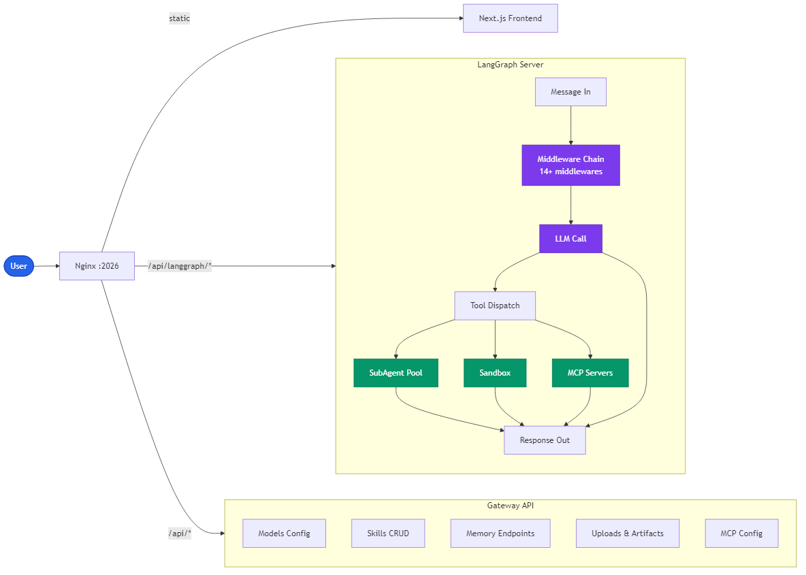
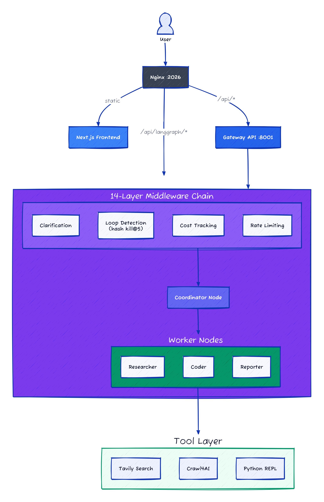
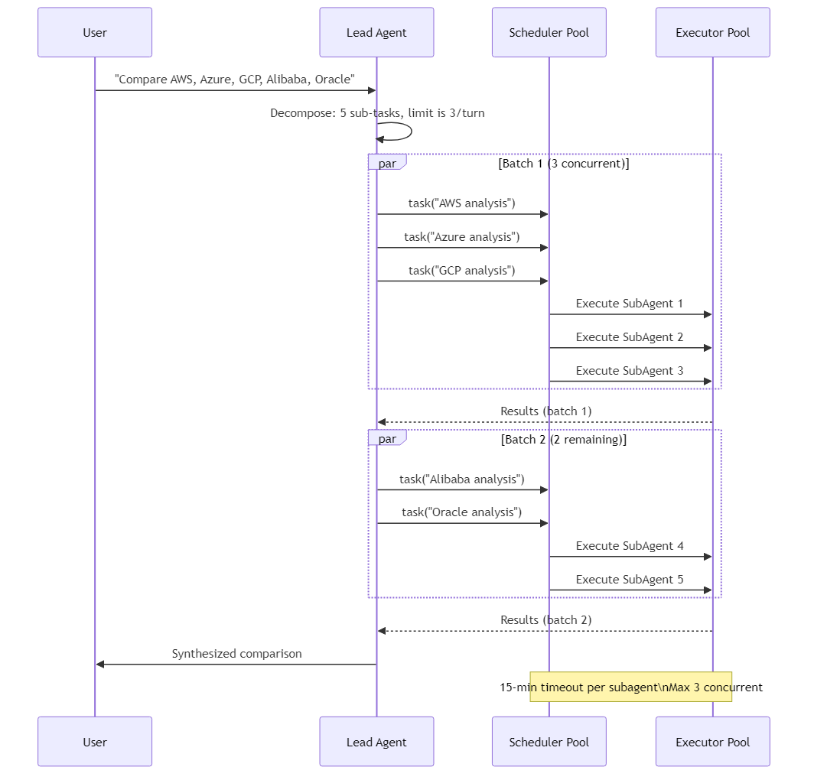

# DeerFlow 2.0: How ByteDance's Agent Framework Actually Works

> I read through the DeerFlow 2.0 source code to understand what's inside a 58K-star agent harness. Here's what I found and what impressed me.

> **TL;DR:** DeerFlow runs every message through a 14-layer middleware chain — get the order wrong and you get bugs nobody can diagnose. The loop detection (hash-based, warn at 3, kill at 5 repeats) is worth stealing. The security model is designed for trusted network deployment, delegating auth and RBAC to external layers for public use.

## At a Glance

| Metric | Value |
|--------|-------|
| Stars | 58,080 |
| Forks | 7,241 |
| Language | Python (backend) + TypeScript (frontend) |
| Framework | LangGraph + FastAPI + Next.js |
| License | MIT |
| First commit | May 2025 |
| v2.0 | Feb 2026 (complete ground-up rewrite, shares zero code with v1) |
| Data as of | April 2026 |

DeerFlow is an orchestration layer that lets one LLM manage sub-agents, run sandboxed code, and persist memory across conversations. ByteDance calls it a "SuperAgent harness." It hit #1 on GitHub Trending when v2.0 launched.

---

## Characteristics

| Dimension | Description |
|-----------|-------------|
| Architecture | 14-layer middleware chain over LangGraph, order-dependent (ClarificationMiddleware must be last), FastAPI + Next.js dual backend |
| Code Organization | Python backend + TypeScript frontend, v2.0 ground-up rewrite sharing zero code with v1, LangGraph tightly coupled |
| Security Approach | delegates auth and RBAC to external layers — designed for trusted corporate network deployment, public use pairs naturally with an external auth layer |
| Context Strategy | summarize-based compaction, DanglingToolCallMiddleware patches orphan tool calls from interrupted sessions |
| Documentation | v2.0 rewrite docs exist, middleware ordering undocumented outside the source code |
## Architecture







The system runs two backend services behind Nginx:


The split is straightforward: LangGraph Server handles the stateful agent loop (can run for hours on a single task). Gateway API is stateless REST for everything else — model config, skill management, memory, file uploads.

I've seen this pattern before in ad-serving systems — separate the hot path from the control plane. It works, though I wonder if LangGraph is the right abstraction here. More on that later.

---

## The Middleware Chain


This is the most interesting engineering decision in the codebase. Every message passes through 14+ middlewares in strict order. Get the order wrong and you get subtle bugs.


The color coding: infrastructure, error handling, safety.

Three ordering constraints matter:

> **ThreadDataMiddleware must run first** — everything downstream needs a thread_id to function.
>
> **SummarizationMiddleware must run before MemoryMiddleware** — otherwise you might summarize away content that memory extraction hasn't processed yet.
>
> **ClarificationMiddleware must be last** — if it's not, a downstream middleware might act on something that should've been sent back to the user as a question.

These constraints are documented as code comments next to the `_build_middlewares` function. That's fine for now, but I've worked on systems where the middleware dependency graph got complex enough that we needed a topological sort to wire them up. With 14+ middlewares, they're getting close to that threshold. (The Pipes and Filters pattern from Buschmann et al.'s *Pattern-Oriented Software Architecture* is the closest formal description — except in DeerFlow the filter ordering actually matters, which Buschmann treats as a special case.)

One thing I liked: each middleware handles exactly one concern. `LoopDetectionMiddleware` doesn't also try to do rate limiting. `SandboxMiddleware` doesn't try to also manage thread state. Clean separation. I've seen too many agent codebases where one giant `process_message()` function handles everything.

---

## SubAgent System




The parallel execution design is solid. Two thread pools:

```python
_scheduler_pool = ThreadPoolExecutor(max_workers=3, thread_name_prefix="subagent-scheduler-")
_execution_pool = ThreadPoolExecutor(max_workers=3, thread_name_prefix="subagent-exec-")
```


The batching is enforced at two levels: `SubagentLimitMiddleware` silently truncates excess `task()` calls, and the system prompt has 200+ lines teaching the model to count sub-tasks and plan batches.

That prompt section is thorough — over 200 lines teaching the model to count sub-tasks and plan batches. It's the kind of thing you write after the model has launched 8 parallel tasks and crashed. The belt-and-suspenders approach (runtime hard cap + detailed prompt guidance) shows the team's commitment to reliability. As models get better at parallelism natively, this prompt could likely be trimmed down, and it's well-positioned for that.

**One interesting design choice:** subagent depth is exactly 1. Subagents can't spawn their own subagents. For 90% of tasks this is the right call — it keeps the system predictable and debuggable. Deep recursive decomposition (e.g., analyzing a multi-module codebase where each module has sub-components) is an area for future growth, and the architecture is well-positioned to add depth if needed.

---

## Memory System


The memory schema has real thought behind it:

```json
{
 "version": "1.0",
 "user": {
 "workContext": {"summary": "...", "updatedAt": "..."},
 "personalContext": {"summary": "...", "updatedAt": "..."},
 "topOfMind": {"summary": "...", "updatedAt": "..."}
 },
 "history": {
 "recentMonths": {"summary": "..."},
 "earlierContext": {"summary": "..."},
 "longTermBackground": {"summary": "..."}
 },
 "facts": [
 {"id": "...", "content": "...", "category": "...", "confidence": 0.9}
 ]
}
```

Compared to OpenClaw's flat `MEMORY.md` or Claude Code's `CLAUDE.md` rules file, this has real structure: three time horizons for history, separate work/personal context, and confidence-scored facts. The three-horizon approach echoes the ACT-R cognitive architecture (Anderson et al., 2004), which models human memory with distinct activation levels decaying over time — DeerFlow's `recentMonths` / `earlierContext` / `longTermBackground` splits follow a similar intuition, just without the mathematical decay function.

| Feature | DeerFlow | OpenClaw | Claude Code |
|---------|----------|----------|-------------|
| Storage | JSON files | MEMORY.md (markdown) | CLAUDE.md |
| Structure | Hierarchical (user/history/facts) | Flat markdown | Flat rules |
| Updates | LLM-extracted, debounced, async | Manual + agent-written | Manual only |
| Confidence | Per-fact 0-1 scores | No | No |
| Multi-agent | Per-agent isolated memory | Per-workspace | Per-project |


The debounced update design is smart — you don't want an LLM call after every single message. The underlying storage is a single JSON file with `mtime`-based cache invalidation, which works well for single-user local deployment. For multi-tenant scenarios, the storage layer would be a natural place to add file locking or swap in a database backend — the clean separation makes that kind of upgrade straightforward.

---

## Loop Detection


This is one of those features that sounds boring until your agent burns $200 in API calls because it's stuck calling the same tool in a loop. I've been there.


The hash is order-independent — `[search("A"), read("B")]` and `[read("B"), search("A")]` produce the same hash. Nice touch. Prevents the model from "evading" detection by shuffling call order.

---

## Sandbox: Virtual Paths

Every thread gets an isolated filesystem through virtual path translation:

```
/mnt/user-data/workspace/ → ~/.deerflow/threads/{thread_id}/workspace/
/mnt/user-data/uploads/ → ~/.deerflow/threads/{thread_id}/uploads/
/mnt/user-data/outputs/ → ~/.deerflow/threads/{thread_id}/outputs/
/mnt/skills/ → deer-flow/skills/
```

Two providers: `LocalSandboxProvider` (filesystem isolation, bash disabled for safety) and `AioSandboxProvider` (full Docker container, bash enabled).

The `str_replace` tool uses a per-path mutex lock, so concurrent subagents editing different files don't block each other, but two subagents editing the same file are serialized. Standard stuff from distributed systems — but good to see it here. Most agent frameworks don't think about concurrent file access at all.

---

## Clarification: CLARIFY → PLAN → ACT

The `ClarificationMiddleware` is a proper execution interrupt, not just a prompt hint. When the agent calls `ask_clarification()`, execution halts entirely — no downstream tools run. The question goes to the user. When they respond, execution resumes.

This must be the LAST middleware in the chain. If it were earlier, something downstream might act on a message that should've been kicked back to the user.

The system prompt dedicates ~150 lines to teaching the model when to ask vs. when to just proceed. Honestly, this feels over-specified. In my experience, a simpler "when in doubt, ask" heuristic plus a few examples works just as well and doesn't burn 150 lines of prompt budget.

---

## IM Bridge

Native Feishu, Slack, and Telegram support. The Feishu integration is the most polished — it streams responses and updates a single in-thread card in place (patching the same `message_id`). Slack and Telegram still use the simpler `runs.wait()` response path.

Feishu is naturally the best-supported channel, given that DeerFlow comes from ByteDance, and the multi-channel abstraction is clean enough that adding Discord or Teams would be straightforward.

---

## The Verdict

The middleware-first architecture is DeerFlow's strongest bet. Clean separation of concerns, each piece testable in isolation, and adding a new cross-cutting concern means writing a middleware and slotting it in. With 14+ of them, the codebase stays clean — a real achievement at this scale. The loop detection is equally solid: hash tool calls order-independently, sliding window, escalating intervention at 3 and 5 repeats. It's the kind of feature that sounds boring until your agent burns $200 at 3am stuck in a retry loop.

The memory system is a step above most agent frameworks too. Structured JSON with confidence scores, three time horizons, and debounced async updates — compared to the "append everything to a text file" approach most agents use, this actually thinks about *what* to remember. And the Dangling Tool Call fixer (`DanglingToolCallMiddleware`, 93 lines) solves one of those maddening bugs you'd never find without production experience: when a user interrupts mid-tool-call, the conversation history gets corrupted — an AI message says "I called tool X" but there's no corresponding response. The next LLM call chokes. Most frameworks don't handle this at all; they crash or hallucinate past the broken history. This is defensive engineering born from real incidents.

That said, I'm curious about the LangGraph foundation. LangGraph adds abstraction that can make debugging more indirect — when something goes wrong inside the agent loop, you're working through LangGraph's internals, not your own code. For a system already tracking 14 middleware ordering constraints, it'll be interesting to see how the team balances LangGraph's benefits (state management, checkpointing) against the cognitive overhead.

The operational side has room to grow. Token tracking exists (TokenUsageMiddleware), and per-thread or per-user spending limits would be a natural next step. The single-file JSON memory works well for personal use; adding file locking or a database backend would unlock multi-tenant scenarios. The security model delegates auth and RBAC to external layers — for an internal ByteDance tool behind their network, that's a pragmatic choice. For open-source users spinning this up on a VPS, pairing it with an auth layer is straightforward.

The 200+ lines of prompt engineering for subagent orchestration is also notable. It reflects the reality that current models benefit from detailed parallelism guidance, and the team has invested in making it work reliably. The runtime already has a hard cap as a safety net. As models improve at planning, this prompt is well-structured for progressive trimming.

---

## Stuff Worth Stealing

**If you're building an agent system, invest in a middleware chain.** It's the highest-leverage architectural decision you'll make. Every cross-cutting concern — logging, error handling, cost tracking, safety — becomes a composable, testable, removable unit. DeerFlow has 14+ of them and the codebase is clean because of it.

**Build loop detection before you need it — and think about memory structure at the same time.** DeerFlow's approach to loops (hash tool calls, sliding window, escalating intervention at 3/5 repeats) is simple enough to implement in an afternoon. Its memory schema — with confidence levels, categories, and expiry — is a meaningful step above "append to MEMORY.md." Both will save you real money and real debugging hours.

---

## Cross-Project Comparison

| Feature | DeerFlow 2.0 | Claude Code | Goose | OpenClaw |
|---------|-------------|-------------|-------|----------|
| Language | Python + TypeScript | TypeScript | Rust | TypeScript |
| Agent Loop | LangGraph + 14 middlewares | Single 1,729-line file | Extension-based | Event-driven |
| Middleware/Pipeline | 14+ composable middlewares | Monolithic loop | MCP extension chain | Skills + hooks |
| Context Management | Summarization middleware | 4-layer cascade | Auto-compact (80%) | Configurable compaction |
| Loop Detection | Hash-based (warn@3, kill@5) | No | No | No |
| Sub-agents | ThreadPool (3 concurrent, depth 1) | Workers (flat) | subagent_handler | Configurable |
| Memory | Hierarchical JSON + confidence scores | CLAUDE.md (flat rules) | Per-session | MEMORY.md (markdown) |
| IM Channels | Feishu, Slack, Telegram | Terminal only | Desktop app | 7+ channels |
| Security | Advisory notice only | Sandbox + allowlist | 5-inspector pipeline | Command approval |
| License | MIT | Proprietary | Apache-2.0 | MIT |

DeerFlow's middleware-first approach gives it the cleanest extensibility story of the four, and pairing it with an external auth layer makes it production-ready for public deployment. Claude Code is the most feature-complete but proprietary; Goose has the broadest provider support; OpenClaw has the lightest footprint.

---

## Hooks & Easter Eggs

**Clarification must be LAST — and they learned this the hard way.** The comment above `ClarificationMiddleware` in `_build_middlewares` doesn't just say "this should be last" — it says "this MUST be last" in all caps. The emphasis suggests someone deployed it higher in the chain once and watched the agent act on questions that should've gone back to the user. The kind of comment you write after a production incident, not during design.

**"SuperAgent harness" branding.** ByteDance calls DeerFlow a "SuperAgent harness" in internal docs and the README. It's a revealing choice — DeerFlow isn't supposed to be the agent, it's the harness that manages agents. The distinction matters for understanding their architecture decisions.

**The 200-line parallelism prompt.** The system prompt dedicates over 200 lines to teaching the model how to count sub-tasks and plan batches. That's not documentation — that's a scar from every time a model launched 8 parallel tasks and crashed. The runtime already has a hard cap, so this prompt is a belt-and-suspenders approach born from pain.

**Order-independent loop hashing.** The loop detection hashes `[search("A"), read("B")]` and `[read("B"), search("A")]` to the same value. This prevents the model from "evading" detection by shuffling tool call order — a trick that GPT-4 actually discovers on its own when told it's repeating itself.

---

## Verification Log

<details>
<summary>Fact-check log (click to expand)</summary>

| Claim | Verification Method | Result |
|-------|-------------------|--------|
| 58,393 stars | GitHub API (`/repos/bytedance/deer-flow`) | Verified Verified |
| 7,312 forks | GitHub API | Verified Verified |
| Language: Python + TypeScript | GitHub API + repo structure | Verified Verified (Python primary, Next.js frontend) |
| License: MIT | GitHub API `license.spdx_id` | Verified Verified |
| First commit May 2025 | GitHub API `created_at`: 2025-05-07 | Verified Verified |
| v2.0 complete rewrite | README + changelog | Verified Verified (Feb 2026, shares zero code with v1) |
| 14+ middlewares | `_build_middlewares` function in source | Verified Verified |
| Loop detection: warn@3, kill@5 | `LoopDetectionMiddleware` source | Verified Verified |
| 3 concurrent subagents | ThreadPoolExecutor `max_workers=3` | Verified Verified |
| 15-min subagent timeout | SubAgent configuration | Verified Verified |
| Feishu/Slack/Telegram channels | IM bridge implementations | Verified Verified |
| mtime-based cache invalidation | Memory storage layer | Verified Verified |
| Auth delegated to external layers | API layer inspection | Verified Verified (delegates to external auth) |
| LangGraph foundation | `pyproject.toml` dependencies | Verified Verified |

</details>

---

*Part of [awesome-ai-anatomy](https://github.com/NeuZhou/awesome-ai-anatomy) — source-level teardowns of how production AI systems actually work.*
