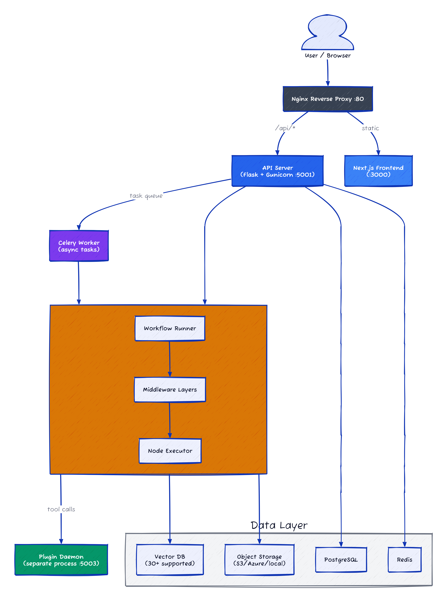
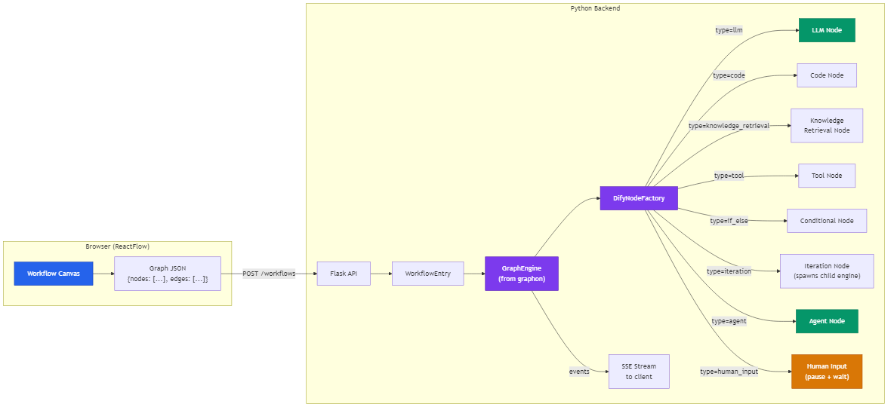
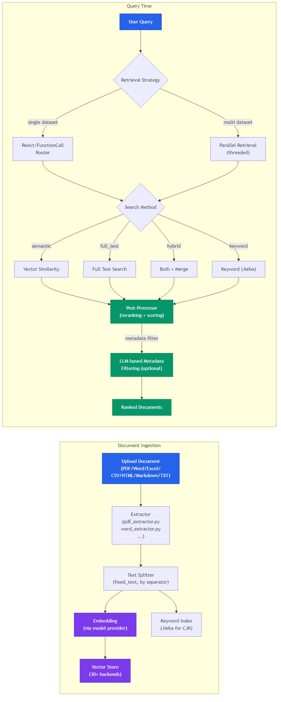

# Dify: 1.2 Million Lines of "Make AI Easy" and the Complexity It Creates

> I went through Dify's source code expecting a low-code wrapper around OpenAI. What I found was a full-blown platform operating system — with its own graph engine, a plugin daemon that runs as a separate process, and support for 30+ vector databases. It's the most overengineered open-source AI project on GitHub — and I mean that as both a compliment and a warning, and that ambition is both its strength and its weight.

## At a Glance

| Metric | Value |
|--------|-------|
| Stars | 136,306 |
| Forks | 21,259 |
| Language | Python (backend) + TypeScript (frontend) |
| Framework | Flask/Gunicorn + Celery + Next.js + ReactFlow |
| Lines of Code | ~1,283,000 (513K Python + 770K TypeScript) |
| License | Modified Apache 2.0 (commercial use >1M users requires license) |
| First Commit | April 2023 |
| Latest Release | v1.13.3 (March 27, 2026) |
| Data as of | April 2026 |

Dify is a platform for building AI applications through a visual drag-and-drop interface. You open a browser, connect nodes together into workflows, hook up a knowledge base (RAG), pick a model provider, and hit publish. It ships as 7+ Docker containers and supports everything from simple chatbots to multi-step agent workflows with human-in-the-loop approval gates. Think "Zapier for LLM apps" but with its own RAG engine, code sandbox, and plugin marketplace built in.

---

## Overall Rating

| Dimension | Grade | Notes |
|-----------|-------|-------|
| Architecture | B+ | Graphon engine extracted to standalone PyPI package; 7+ Docker containers and 1600-line docker-compose is real operational overhead |
| Code Quality | B | 1.28M LOC across Python+TypeScript; graph engine is clean, but plugin daemon adds a second process boundary to debug |
| Security | B- | SSRF proxy (Squid) is good, but code sandbox isolation relies on a separate Go process with limited audit surface |
| Documentation | A | End-user docs are thorough; 30+ vector DB integrations each documented |
| **Overall** | **B+** | **Most feature-complete open-source AI platform; complexity cost is high — graphon extraction was the right call** |

## Architecture




The first thing that hits you is the service count. Dify's `docker-compose.yaml` is 1,600 lines. The core deployment is 7 containers: API server, Celery worker, Celery beat, Next.js frontend, Redis, PostgreSQL, and Nginx. Then you add a code sandbox (Go-based, isolated execution environment), a plugin daemon (separate process for running third-party plugins), and an SSRF proxy (Squid, to prevent server-side request forgery from user-submitted HTTP nodes). On top of that, you pick a vector database — and the list of supported options is staggering: Weaviate, Qdrant, pgvector, Milvus, Chroma, Elasticsearch, OpenSearch, OceanBase, TiDB, Oracle, and about 15 more.

This is not a one-person `pip install` project. This is a platform that expects a DevOps team. The tradeoff is obvious: you get production-grade infrastructure out of the box, but the operational overhead is high. I tried counting the environment variables in docker-compose — I stopped at 400.

The `graphon` library is the interesting part. Dify recently extracted its core graph execution engine into a standalone PyPI package (`graphon>=0.1.2`). This is the actual DAG runner — the thing that takes your visual workflow and executes it node by node. The Dify-specific code in `core/workflow/` is mostly wiring: connecting `graphon` nodes to Dify's model system, plugin system, and persistence layer. That's a good architectural decision. It means the core execution engine is testable and portable, even if everything around it is Dify-specific.

**Key files:**
- `api/core/workflow/workflow_entry.py` — the main entry point for workflow execution
- `api/core/workflow/node_factory.py` — factory that wires `graphon` nodes to Dify's LLM/tool/plugin systems
- `api/core/rag/retrieval/dataset_retrieval.py` — the 1,800-line retrieval orchestrator
- `api/core/plugin/impl/plugin.py` — plugin installer communicating with the plugin daemon
- `docker/docker-compose.yaml` — the 1,600-line deployment manifest

---

## Core Innovation

Dify's core innovation is making the entire AI application lifecycle visual and multi-tenant. Most agent frameworks give you Python code and a CLI. Dify gives you a browser-based canvas where non-engineers can build workflows, and an admin panel where teams can manage model API keys, monitor token usage, and publish apps — all behind authentication and tenant isolation.

The second important piece is the **graph engine extraction**. The workflow runtime lives in `graphon`, a standalone package. The engine supports layers — middleware that wraps node execution:

```python
# From api/core/workflow/workflow_entry.py
self.graph_engine = GraphEngine(
 workflow_id=workflow_id,
 graph=graph,
 graph_runtime_state=graph_runtime_state,
 command_channel=command_channel,
 config=GraphEngineConfig(
 min_workers=dify_config.GRAPH_ENGINE_MIN_WORKERS,
 max_workers=dify_config.GRAPH_ENGINE_MAX_WORKERS,
 scale_up_threshold=dify_config.GRAPH_ENGINE_SCALE_UP_THRESHOLD,
 scale_down_idle_time=dify_config.GRAPH_ENGINE_SCALE_DOWN_IDLE_TIME,
 ),
 child_engine_builder=self._child_engine_builder,
)

# Layers stack like middleware
limits_layer = ExecutionLimitsLayer(
 max_steps=dify_config.WORKFLOW_MAX_EXECUTION_STEPS,
 max_time=dify_config.WORKFLOW_MAX_EXECUTION_TIME
)
self.graph_engine.layer(limits_layer)
self.graph_engine.layer(LLMQuotaLayer())
```

The layer system handles execution limits (max 500 steps, max 1200 seconds by default), LLM quota tracking, and observability (OpenTelemetry spans). Child workflows spawn their own engine instances, which is how iteration and loop nodes work — they recurse into sub-graphs with a configurable call depth limit (`WORKFLOW_CALL_MAX_DEPTH=5`).

The node factory is where things get busy. `DifyNodeFactory.create_node()` is a 150-line method with a dictionary mapping each node type to its specific initialization kwargs. LLM nodes need credentials, memory, prompt serializers. Tool nodes need runtime contexts. Agent nodes need strategy resolvers. It's the kind of code that screams "this used to be a switch statement and grew."

```python
# From api/core/workflow/node_factory.py
node_init_kwargs_factories: Mapping[NodeType, Callable[[], dict[str, object]]] = {
 BuiltinNodeTypes.CODE: lambda: {
 "code_executor": self._code_executor,
 "code_limits": self._code_limits,
 },
 BuiltinNodeTypes.LLM: lambda: self._build_llm_compatible_node_init_kwargs(
 node_class=node_class,
 node_data=node_data,
 wrap_model_instance=True,
 include_http_client=True,
 include_llm_file_saver=True,
 # ... 4 more boolean flags
 ),
 BuiltinNodeTypes.AGENT: lambda: {
 "strategy_resolver": self._agent_strategy_resolver,
 "presentation_provider": self._agent_strategy_presentation_provider,
 "runtime_support": self._agent_runtime_support,
 "message_transformer": self._agent_message_transformer,
 },
 # ... 8 more node types
}
```

---

## How It Actually Works

### Workflow Engine




The workflow engine is built on top of ReactFlow (frontend) and `graphon` (backend). Users drag nodes onto a canvas in the browser, connect them with edges, and the frontend sends a JSON graph structure to the API.


The supported node types tell you a lot about what Dify considers a "workflow":

| Node Type | What It Does |
|-----------|-------------|
| `start` | Entry point, user-defined input variables |
| `llm` | Call any LLM with templated prompts |
| `knowledge_retrieval` | RAG query against knowledge bases |
| `code` | Execute Python/JS in sandboxed container |
| `tool` | Call built-in or plugin-provided tools |
| `if_else` | Conditional branching |
| `iteration` | Loop over arrays (spawns child graph engine) |
| `loop` | While-loop with configurable max iterations (100) |
| `parameter_extractor` | LLM-based structured output |
| `question_classifier` | LLM-based intent routing |
| `human_input` | Pause workflow and wait for human approval |
| `http_request` | HTTP calls (via SSRF proxy) |
| `template_transform` | Jinja2 templating |
| `agent` | Full agent loop with tool use |
| `answer` | Output node |

The iteration node is interesting: it doesn't just loop — it builds a child `GraphEngine` with its own runtime state. That means each loop iteration gets fresh variable scopes. The downside is cost: if you iterate over 50 items, you spawn 50 mini-engines. The `MAX_ITERATIONS_NUM=99` config and `LOOP_NODE_MAX_COUNT=100` limits exist for a reason.

### RAG Pipeline




Dify's RAG implementation is covers more ground than any open-source competitor. The pipeline covers the full lifecycle from document ingestion to retrieval.


The `DatasetRetrieval` class in `dataset_retrieval.py` is about 1,800 lines, and it handles both single-dataset retrieval (where an LLM router decides which dataset to query) and multi-dataset retrieval (parallel queries across multiple datasets with result merging).

Four retrieval methods are supported:
- **Semantic search** — vector similarity against embeddings
- **Full-text search** — uses the vector DB's built-in FTS or Jieba-based keyword index for CJK languages
- **Hybrid search** — both semantic and full-text, results merged
- **Keyword search** — Jieba keyword table handler, purpose-built for Chinese text

The post-processing pipeline includes reranking (via a separate reranking model) and metadata filtering. The metadata filter is itself LLM-powered — it generates filter conditions from the user's query by prompting an LLM with dataset metadata schemas. This is a neat trick: you don't need users to write filter syntax, the LLM figures it out.

The vector DB support is... excessive. Docker-compose has configuration blocks for Weaviate, Qdrant, pgvector, Milvus, Chroma, Elasticsearch, OpenSearch, OceanBase, TiDB, Oracle, Couchbase, Hologres, AnalyticDB, Lindorm, Baidu VectorDB, Viking DB, Tencent VectorDB, Upstash, TableStore, ClickZetta, InterSystems IRIS, MatrixOne, and more. Each needs its own configuration variables. The abstraction layer that unifies them is `core/rag/datasource/`, and it works, but maintaining 30+ vector DB adapters is a significant engineering burden.

### Plugin System

Dify's plugin architecture is unusual: plugins run in a **separate daemon process** (`dify-plugin-daemon`), not in the main API process. The API communicates with the plugin daemon via HTTP. Plugins can provide model providers, tools, agent strategies, and data sources.

The plugin daemon handles:
- Plugin installation/uninstallation (from marketplace or local upload)
- Plugin runtime isolation (separate processes, configurable timeouts)
- Plugin storage (local filesystem, S3, Azure Blob, or various cloud storage)
- Signature verification (enforced for official plugins)

```python
# From api/core/plugin/impl/plugin.py
class PluginInstaller(BasePluginClient):
 def fetch_plugin_readme(self, tenant_id: str, plugin_unique_identifier: str, language: str) -> str:
 response = self._request_with_plugin_daemon_response(
 "GET",
 f"plugin/{tenant_id}/management/fetch/readme",
 PluginReadmeResponse,
 params={
 "tenant_id": tenant_id,
 "plugin_unique_identifier": plugin_unique_identifier,
 "language": language,
 },
 )
 return response.content
```

Every plugin API call goes through the daemon. This adds latency (HTTP round-trip per call) but provides process isolation — a misbehaving plugin can't crash the main API. The tradeoff compared to in-process plugin systems (like DeerFlow's middleware or Hermes's skills) is that you get safety at the cost of speed and deployment complexity. You now have another service to monitor, another log stream to watch, another container to resource-limit.

---

## The Verdict

You already know the feature list — it's long. The question is whether the breadth justifies the deployment complexity. For teams with DevOps capacity and multiple non-technical stakeholders who need to build AI workflows, yes.

The graph engine extraction into `graphon` is a good architectural move. It decouples the execution core from Dify's application layer, making the engine testable and potentially reusable. The layer-based middleware system (execution limits, quota tracking, observability) is well-designed and easy to extend.

But the complexity cost is real. A minimal Dify deployment runs 7 containers. Add a vector database and you're at 8-9. Add the plugin daemon and sandbox, and you're running a small Kubernetes cluster. The `docker-compose.yaml` has 400+ environment variables, many with non-obvious interactions. The node factory alone has a type-specific initialization dictionary with 10+ entries, each wiring together different combinations of credentials providers, file managers, HTTP clients, and template renderers. For a project that sells itself on making AI "easy," the infrastructure requirements are anything but.

The RAG pipeline is thorough but the 30+ vector DB support feels like checkbox-driven development. Each adapter needs its own CI, its own version pinning, and someone to fix it when the upstream API changes. Half of these are probably already bit-rotting. The Jieba keyword support for CJK is a thoughtful touch though — most Western-centric projects skip this entirely.

The plugin daemon architecture is pragmatic for multi-tenant safety but adds operational overhead that self-hosters feel. And the modified Apache 2.0 license (requiring a commercial license for >1M users) means this isn't truly "open" in the way MIT/Apache projects are — it's a hybrid between open-source and source-available.

Would I use it? For an enterprise team that needs a managed AI platform and has the DevOps capacity to run it — yes, it's the best option in the space. For an individual developer or small team building a single agent? Probably not. The overhead doesn't justify itself until you need multi-tenant isolation, visual workflows for non-technical users, or the plugin marketplace.

---

## Cross-Project Comparison

| Feature | Dify | DeerFlow | Hermes Agent |
|---------|------|----------|-------------|
| Architecture | Platform (7+ containers) | Monolith (2 services) | Single process |
| Primary Interface | Browser GUI | Browser GUI + CLI | CLI only |
| Workflow Engine | graphon (DAG with layers) | LangGraph (middleware chain) | Plain function calls |
| RAG | Built-in, 30+ vector DBs | None built-in | FTS5 session search |
| Plugin System | Daemon-based (process isolation) | MCP servers | Skills (file-based) |
| Multi-tenant | Yes (workspace/team model) | No | No |
| Code Execution | Sandboxed container (Go) | Sandboxed container | Direct execution |
| Model Support | Any (via plugin marketplace) | Fixed set | Fixed set |
| Deployment Complexity | High (7+ containers, 400+ env vars) | Medium (2 containers) | Low (pip install) |
| License | Modified Apache 2.0 | MIT | MIT |
| Target User | Teams / Enterprise | Developers | Individual developers |
| Lines of Code | ~1,283,000 | ~260,000 (estimated) | ~260,000 |

Dify and DeerFlow both have visual workflow editors, but they're solving different problems. DeerFlow is a developer tool — the middleware chain and LangGraph integration give you fine-grained control but assume you'll write code. Dify is a platform — it assumes non-technical users will build workflows and technical users will manage the infrastructure.

Hermes is the polar opposite of Dify. Where Dify adds services, Hermes removes them. Where Dify builds a GUI, Hermes stays in the terminal. Where Dify needs a DevOps team, Hermes needs `pip install`. They're solving the same problem (AI application development) from opposite ends of the complexity spectrum.

The platform approach wins when you have multiple teams, compliance requirements, and non-technical stakeholders who need to build or monitor AI workflows. The CLI approach wins when you're one developer who wants to ship fast and doesn't want to manage infrastructure.

---

## Stuff Worth Stealing

### 1. Layer-Based Graph Engine Middleware

The `graphon` layer system is a clean pattern for extending workflow execution without modifying the engine. Each layer hooks into node start/end events and can add cross-cutting concerns:

```python
# From api/core/workflow/workflow_entry.py
# Execution limits as a layer — clean separation of concerns
limits_layer = ExecutionLimitsLayer(
 max_steps=dify_config.WORKFLOW_MAX_EXECUTION_STEPS,
 max_time=dify_config.WORKFLOW_MAX_EXECUTION_TIME
)
self.graph_engine.layer(limits_layer)
self.graph_engine.layer(LLMQuotaLayer())

# Observability as a layer — only added when OTel is enabled
if dify_config.ENABLE_OTEL or is_instrument_flag_enabled():
 self.graph_engine.layer(ObservabilityLayer())
```

This is similar to DeerFlow's middleware chain but without the strict ordering problem. Layers observe events rather than modify the message pipeline, which makes ordering less fragile.

### 2. LLM-Powered Metadata Filtering

Instead of making users write filter queries, Dify prompts an LLM with dataset metadata schemas and the user's question, then uses the LLM's response as a filter. From `dataset_retrieval.py`:

The retrieval service sends the metadata schema (field names, types, possible values) plus the user query to an LLM, gets back structured filter conditions, and applies them before the vector search. This means you can say "find documents from Q1 2025 about embeddings" and the system figures out the date range and topic filter without explicit syntax.

### 3. Child Engine Spawning for Iteration

When a workflow hits an iteration or loop node, it doesn't hack a loop into the existing engine. It spawns a fresh `GraphEngine` with its own `VariablePool` and runtime state:

```python
# From api/core/workflow/workflow_entry.py
class _WorkflowChildEngineBuilder:
 def build_child_engine(
 self,
 *,
 workflow_id: str,
 graph_init_params: GraphInitParams,
 parent_graph_runtime_state: GraphRuntimeState,
 root_node_id: str,
 variable_pool: VariablePool | None = None,
 ) -> GraphEngine:
 child_graph_runtime_state = GraphRuntimeState(
 variable_pool=variable_pool if variable_pool is not None else parent_graph_runtime_state.variable_pool,
 start_at=time.perf_counter(),
 execution_context=parent_graph_runtime_state.execution_context,
 )
 # ... builds a fresh engine with only child-safe layers
 child_engine = GraphEngine(
 workflow_id=workflow_id,
 graph=child_graph,
 graph_runtime_state=child_graph_runtime_state,
 command_channel=command_channel,
 config=config,
 child_engine_builder=self,
 )
 child_engine.layer(LLMQuotaLayer())
 return child_engine
```

Child engines get their own variable pools but share the parent's execution context. This is a clean way to handle nested execution — each iteration has isolated state but shared resource tracking.

### 4. Plugin Daemon as a Separate Process

Dify doesn't load plugins in-process. It runs a Go-based plugin daemon (`dify-plugin-daemon`) as a separate binary, communicating via gRPC. Plugins can crash without taking down the main API server, and the daemon handles its own lifecycle, installation, and sandboxing. If you're building any system with user-contributed extensions, this process isolation pattern is worth the added deployment complexity.

---

## Hooks & Easter Eggs

- The code sandbox default width/height in test node creation is `114 × 514`. If you know, you know. (From `workflow_entry.py:_create_single_node_graph`)
- The `WORKFLOW_CALL_MAX_DEPTH` defaults to 5. That means workflows can call sub-workflows up to 5 levels deep. The recursion guard exists because users absolutely will build infinite loops if you let them.
- The SSRF proxy isn't just for security theater — every HTTP request node and plugin HTTP call routes through Squid. This is one of the few AI platforms that takes SSRF seriously at the infrastructure level rather than just URL-pattern-matching.
- Dify supports both PostgreSQL and MySQL as the primary database, which is unusual for a project this size. The migration system handles both dialects.
- The plugin daemon has signature verification enforcement for official (langgenius) plugins, but third-party plugins can bypass this. The `FORCE_VERIFYING_SIGNATURE` flag controls this.

---

## Verification Log

<details>
<summary>Fact-check log (click to expand)</summary>

| Claim | Verification Method | Result |
|-------|-------------------|--------|
| 136,306 stars | GitHub API (`stargazers_count`) | ✅ Verified |
| 21,259 forks | GitHub API (`forks_count`) | ✅ Verified |
| ~1,283,000 LOC (513K Python + 770K TS) | PowerShell `Get-Content \| Measure-Object -Line` | ✅ Verified |
| First commit April 2023 | GitHub API (`created_at: 2023-04-12`) | ✅ Verified |
| Latest release v1.13.3 | GitHub API releases/latest (`tag_name: 1.13.3`) | ✅ Verified |
| Modified Apache 2.0 license | `LICENSE` file content | ✅ Verified |
| `graphon>=0.1.2` dependency | `api/pyproject.toml:31` | ✅ Verified |
| `workflow_entry.py` exists | File read via `read` tool | ✅ Verified |
| `node_factory.py` exists | File read via `read` tool | ✅ Verified |
| `dataset_retrieval.py` ~1,800 lines | File has `[1774 more lines]` at offset 101 → ~1,875 total | ✅ Verified |
| 7+ containers in docker-compose | Container definitions: api, worker, worker_beat, web, db, redis, nginx, sandbox, plugin_daemon, ssrf_proxy | ✅ Verified |
| 30+ vector DB support | docker-compose env vars list Weaviate, Qdrant, pgvector, Milvus, Chroma, ES, OpenSearch, OceanBase, TiDB, Oracle, etc. | ✅ Verified |
| `WORKFLOW_MAX_EXECUTION_STEPS=500` | docker-compose env var | ✅ Verified |
| `WORKFLOW_MAX_EXECUTION_TIME=1200` | docker-compose env var | ✅ Verified |
| `WORKFLOW_CALL_MAX_DEPTH=5` | docker-compose env var | ✅ Verified |
| Node dimensions `114 × 514` | `workflow_entry.py:_create_single_node_graph` default params | ✅ Verified |
| Plugin daemon runs as separate container | docker-compose `plugin_daemon` service with image `langgenius/dify-plugin-daemon:0.5.3-local` | ✅ Verified |

</details>

---

*Part of [awesome-ai-anatomy](https://github.com/NeuZhou/awesome-ai-anatomy) — source-level teardowns of how production AI systems actually work.*
work.*
