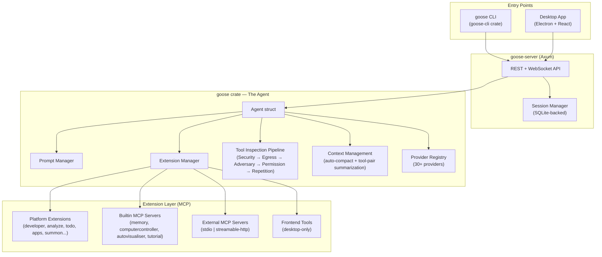
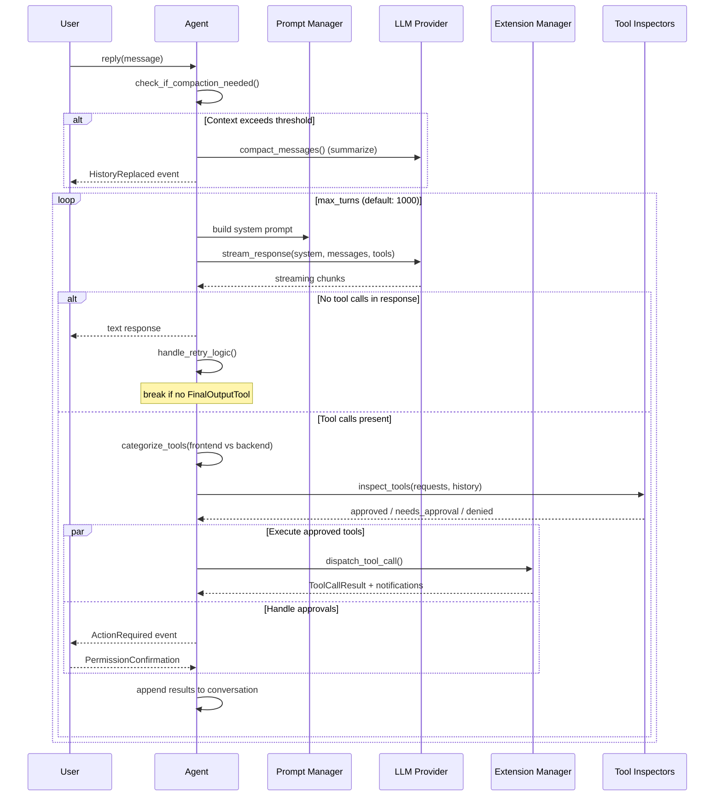
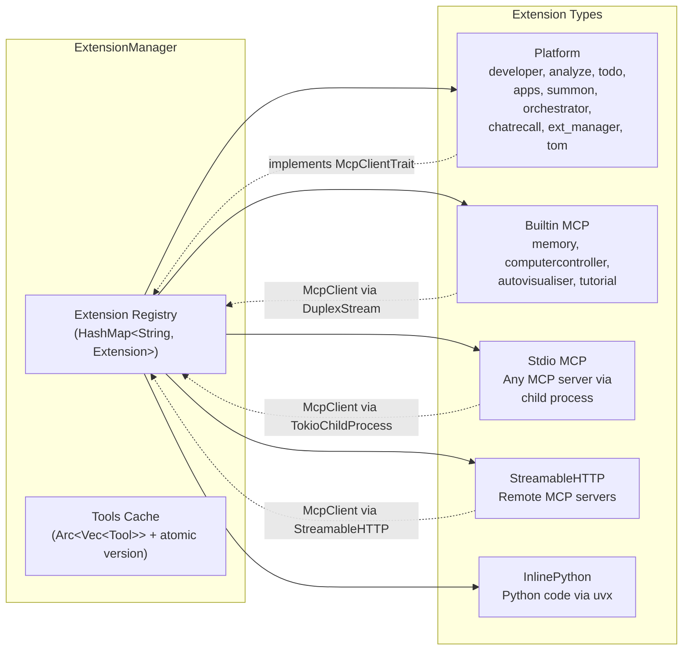

# Block/Goose: The Rust Agent That Treats MCP as a First-Class Citizen

> I expected another Claude Code clone with a Rust wrapper. What I found instead was a system where the agent loop is almost secondary — the real architecture is a distributed extension bus built on top of MCP, with the LLM acting as a scheduler. That distinction matters more than the language choice.

## At a Glance

| Metric | Value |
|--------|-------|
| Stars | 37,343 |
| Forks | 3,589 |
| Language | Rust (core), TypeScript (UI), Python (evals) |
| Framework | Tokio async runtime, Axum HTTP, Electron (desktop) |
| Lines of Code | ~124K Rust + ~74K TypeScript |
| License | Apache-2.0 |
| First Commit | 2024-08-23 |
| Latest Release | v1.29.1 (2026-04-03) |

Goose is an on-machine AI agent that runs shell commands, edits files, manages extensions, and orchestrates sub-agents. It talks to any LLM provider (30+ supported), uses MCP as its extension protocol, and ships as both a CLI (`goose`) and an Electron desktop app. It's built by Block Inc (the company behind Square and CashApp), and it directly competes with Claude Code, OpenClaw, and Cursor.

---

## Architecture



The architecture has three layers. At the top, both CLI and desktop converge on the same `goose-server` (an Axum-based HTTP/WebSocket server). The server manages sessions (SQLite persistence) and hands off messages to the `Agent`. The Agent is the orchestration hub — it owns the prompt manager, extension manager, tool inspection pipeline, and provider connection. Below it, extensions live as MCP clients: some run in-process ("platform extensions"), some spawn as child processes ("builtin" and "stdio"), and some connect over HTTP ("streamable_http").

What surprised me: the Agent doesn't contain any tool execution logic itself. It's purely a dispatcher. Every capability — file editing, shell execution, code analysis, even the todo list — lives in an extension. The `developer` extension (which provides `shell`, `edit`, `write`, `tree` tools) is technically just another MCP client that happens to run in-process. You could rip it out and replace it with an external process and the agent loop wouldn't notice.

The second surprise is how seriously they take the tool inspection pipeline. Before any tool call executes, it passes through five inspectors in priority order: SecurityInspector (prompt injection scanning), EgressInspector, AdversaryInspector (LLM-based review), PermissionInspector, and RepetitionInspector. This is a proper chain-of-responsibility pattern, not an afterthought.

**Files to reference:**
- `crates/goose/src/agents/agent.rs` — The 900-line Agent struct and reply loop
- `crates/goose/src/agents/extension_manager.rs` — Extension lifecycle and tool dispatch (~2,300 lines)
- `crates/goose-server/src/main.rs` — HTTP/WebSocket server entry
- `crates/goose/src/security/mod.rs` — Security manager with prompt injection detection

---

## Core Innovation

Two things stand out: the extension taxonomy and the tool inspection pipeline.

### Extension Taxonomy: Six Flavors of MCP

Most agent frameworks have "tools." Goose has six distinct extension types, all unified under the MCP protocol:

```rust
// From crates/goose/src/agents/extension.rs:151
#[derive(Debug, Clone, Deserialize, Serialize, ToSchema, PartialEq)]
#[serde(tag = "type")]
pub enum ExtensionConfig {
    #[serde(rename = "sse")]
    Sse { ... },                    // Legacy SSE (deprecated, kept for compat)
    #[serde(rename = "stdio")]
    Stdio { cmd, args, envs, ... }, // Child process via stdin/stdout
    #[serde(rename = "builtin")]
    Builtin { name, ... },          // In-process MCP server (memory, visualiser)
    #[serde(rename = "platform")]
    Platform { name, ... },         // In-process with agent context access
    #[serde(rename = "streamable_http")]
    StreamableHttp { uri, ... },    // Remote MCP via HTTP
    #[serde(rename = "frontend")]
    Frontend { tools, ... },        // UI-provided tools (desktop only)
    #[serde(rename = "inline_python")]
    InlinePython { code, ... },     // Python code run via uvx
}
```

This matters because it lets them ship a monolithic binary that still behaves like a distributed system. Platform extensions (developer, analyze, todo) get direct access to the agent's session context and provider. Builtin extensions run as in-process MCP servers using `tokio::io::DuplexStream` — no sockets, no serialization overhead. External extensions talk MCP over stdio or HTTP. The agent loop handles all of them identically through the `McpClientTrait` interface. It's the same dispatch code path regardless of whether the tool lives inside the binary or runs as a separate process across the network.

### Tool Inspection Pipeline: Defense in Depth

```rust
// From crates/goose/src/agents/agent.rs:210
fn create_tool_inspection_manager(
    permission_manager: Arc<PermissionManager>,
    provider: SharedProvider,
) -> ToolInspectionManager {
    let mut tool_inspection_manager = ToolInspectionManager::new();
    tool_inspection_manager.add_inspector(Box::new(SecurityInspector::new()));
    tool_inspection_manager.add_inspector(Box::new(EgressInspector::new()));
    tool_inspection_manager.add_inspector(Box::new(AdversaryInspector::new(provider.clone())));
    tool_inspection_manager.add_inspector(Box::new(PermissionInspector::new(
        permission_manager, provider,
    )));
    tool_inspection_manager.add_inspector(Box::new(RepetitionInspector::new(None)));
    tool_inspection_manager
}
```

Five inspectors, each implementing the `ToolInspector` trait, each producing `InspectionResult` values with `Allow`, `RequireApproval`, or `Deny` actions. The SecurityInspector uses pattern matching and optional ML classification to detect prompt injection. The AdversaryInspector can call the LLM itself to review suspicious tool calls. The RepetitionInspector catches infinite loops. This is not something I've seen in Claude Code or OpenClaw — they handle permissions, yes, but not a configurable inspection pipeline.

---

## How It Actually Works

### The Agent Loop



The reply loop inside `reply_internal` is the heart of the system. It's a `loop` (not a `for`) with a configurable maximum turns counter (default 1000, which is generous). Each iteration: build the prompt, call the provider, parse the response, categorize tool calls into frontend/backend, run them through the inspection pipeline, execute approved ones in parallel, wait for user approval on flagged ones, collect results, append to conversation, and loop.

Three things stand out:

**Compaction happens eagerly.** Before the loop even starts, the agent checks if the conversation exceeds a configurable threshold (default 80% of context window). If it does, it summarizes the history using the LLM and replaces the conversation. This is smarter than Claude Code's approach of waiting until the provider returns a context-length error — though Goose handles that fallback too with a recovery compaction path inside the loop.

**Tool-pair summarization runs concurrently.** While the agent processes the current turn's tool calls, a background `JoinHandle` is summarizing older tool request/response pairs from previous turns. This keeps the context window lean without blocking the main loop. The summarized pairs get their metadata marked `agent_invisible` so the provider doesn't see them, while the summary message replaces them.

**The retry manager is a separate concern.** When the loop ends with no tool calls (the model just returned text), a `RetryManager` checks if the response actually made progress. If the `FinalOutputTool` exists but wasn't called, it nudges the model to call it. If it was called, it extracts the structured output. This is specifically for "recipe" mode (Goose's version of structured workflows).

### The Extension Manager



The `ExtensionManager` maintains a `HashMap<String, Extension>` protected by a `tokio::sync::Mutex`. Each `Extension` wraps a `McpClientBox` (which is `Arc<dyn McpClientTrait>`) plus its config and server info. Tools are cached with an atomic counter for cache invalidation — `tools_cache_version` bumps every time an extension is added or removed, and the cached `Arc<Vec<Tool>>` is only rebuilt when stale.

Tools get prefixed with the extension name (e.g., `developer__shell`, `memory__store`) to avoid namespace collisions. Platform extensions with `unprefixed_tools: true` (like `developer` and `analyze`) skip this prefix. This is a pragmatic choice — the most-used tools don't need ugly prefixes, but third-party extensions are isolated.

Extension lifecycle is interesting: when you add an extension at runtime, the agent persists the config into the session's `extension_data` (stored in SQLite). When you resume a session, `load_extensions_from_session` bulk-loads all extensions in parallel using `futures::future::join_all`. There's also an `add_extensions_bulk` method that acquires the container lock once upfront to prevent serialization of the parallel futures — a concurrency micro-optimization that shows the team has actually hit contention issues in production.

### The Provider System

Goose supports 30+ LLM providers through a trait-based abstraction:

```rust
// From crates/goose/src/providers/base.rs (simplified)
#[async_trait]
pub trait Provider: Send + Sync + Debug {
    fn get_name(&self) -> &str;
    fn get_model_config(&self) -> ModelConfig;

    async fn stream(
        &self,
        model_config: &ModelConfig,
        session_id: &str,
        system: &str,
        messages: &[Message],
        tools: &[Tool],
    ) -> Result<MessageStream, ProviderError>;

    // Default implementations for complete(), permission routing, etc.
}
```

Each provider (Anthropic, OpenAI, Google, Ollama, Bedrock, Azure, etc.) implements this trait. The `stream` method returns a `MessageStream` — a boxed async stream of `(Option<Message>, Option<ProviderUsage>)` tuples. This is streaming-first: every provider must implement streaming, and `complete()` is just a convenience wrapper that collects the stream.

What's unusual: they have a `canonical` model registry that maps model names across providers to a normalized format. So `claude-3-5-sonnet` on Anthropic, `anthropic.claude-3-5-sonnet` on Bedrock, and `claude-3-5-sonnet@20241022` on Vertex all resolve to the same canonical model with known context limits and pricing. This is built from a JSON file (`canonical_models.json`) with 180+ model entries.

They also have "declarative providers" — JSON files in `providers/declarative/` (deepseek.json, groq.json, mistral.json, etc.) that define OpenAI-compatible providers without writing any Rust code. Just a JSON file with the endpoint URL, model name, and header format. Adding a new OpenAI-compatible provider is literally a 10-line JSON file.

---

## The Verdict

The extension system is where Goose shines. The six-flavor taxonomy is well-thought-out and solves real problems. Platform extensions get performance and agent context access. Builtin extensions use in-process MCP servers with zero-copy `DuplexStream` transport. External extensions use the standard MCP protocol so the entire ecosystem is compatible. InlinePython extensions let non-Rust developers write tools in Python without setting up a full MCP server. And Frontend extensions let the desktop app inject tools without touching the backend. Most agent frameworks force you to pick one mechanism and stick with it.

The tool inspection pipeline is the other standout. Claude Code has a permission system, but Goose has a pluggable chain where you can add ML-based classifiers, LLM-powered adversary review, and custom egress policies. The fact that the `AdversaryInspector` can call the LLM to review tool calls before they execute — that's a level of paranoia that production systems actually need.

The provider system is impressively broad but it comes at a cost. The `providers/` directory has 50+ files and 3,000+ lines of format conversion code across Anthropic, OpenAI, Google, Bedrock, and Ollama wire formats. Each provider has subtle differences in how they handle tool calls, thinking/reasoning tokens, streaming chunks, and error responses. The declarative provider system helps for OpenAI-compatible APIs, but the core providers are each 300-800 lines of bespoke serialization code. This is a maintenance surface area that will grow with every new model.

The agent loop itself is solid but unremarkable. It's a standard while loop with streaming, tool dispatch, and context management. The compaction logic (threshold-based + recovery) is better than most, and the tool-pair summarization is a nice touch. But the loop structure is fundamentally similar to what you'd write in Python — Rust doesn't add architectural insight here beyond type safety and performance.

The codebase is well-organized (clear crate boundaries, good use of Cargo features) but the `goose` core crate is massive — 124K lines of Rust in a single crate is pushing it for compile times and code navigation. The `Agent` struct alone is over 900 lines. They'd benefit from splitting the provider layer and the security layer into separate crates.

Would I use it? If I needed an extensible agent with MCP support and didn't want to be locked to one LLM provider, yes. The extension model is the most flexible I've seen. Would I contribute? The Rust barrier is real — this is not a weekend-PR codebase. You need solid async Rust skills and familiarity with the MCP protocol to make meaningful changes.

---

## Cross-Project Comparison

| Feature | Goose | Claude Code | OpenClaw |
|---------|-------|-------------|----------|
| Language | Rust | TypeScript | TypeScript |
| Extension Protocol | MCP (native) | Built-in tools | MCP + Skills |
| Provider Lock-in | None (30+ providers) | Anthropic only | Any (via config) |
| Permission Model | 5-inspector pipeline | Allowlist + deny | Allowlist |
| Context Management | Auto-compact (80%) + tool-pair summarization | 4-layer context mgmt | Configurable compaction |
| Sub-agents | Yes (subagent_handler) | Yes (multi-agent) | Yes (subagents) |
| Desktop App | Electron | Terminal only | Terminal + web |
| Structured Output | Recipes with FinalOutputTool | - | - |
| Security Scanning | Pattern + ML + LLM review | Basic sandbox | Community skills |
| LOC | ~200K | ~510K | ~50K (estimated) |
| Local Inference | Yes (llama.cpp, Whisper) | No | No |

Goose sits between Claude Code and OpenClaw in terms of complexity. It's more opinionated than OpenClaw (which delegates everything to skills and MCP servers) but less monolithic than Claude Code (which bakes everything into one giant TypeScript bundle). The "everything is an MCP extension" philosophy means Goose's core is surprisingly thin — the agent loop is really just a scheduler for MCP tool calls.

---

## Stuff Worth Stealing

### 1. The Declarative Provider Pattern

```json
// From crates/goose/src/providers/declarative/deepseek.json
{
  "name": "deepseek",
  "api_base": "https://api.deepseek.com",
  "api_key_env": "DEEPSEEK_API_KEY",
  "default_model": "deepseek-chat",
  "models": ["deepseek-chat", "deepseek-reasoner"]
}
```

Adding a new OpenAI-compatible provider without writing any code — just a JSON file. This pattern should be standard in every multi-provider agent framework.

### 2. Environment Variable Blocklist for Extensions

```rust
// From crates/goose/src/agents/extension.rs:81
const DISALLOWED_KEYS: [&'static str; 31] = [
    "PATH", "PATHEXT", "SystemRoot",       // Binary path manipulation
    "LD_LIBRARY_PATH", "LD_PRELOAD",       // Dynamic linker hijacking
    "DYLD_INSERT_LIBRARIES",               // macOS injection
    "PYTHONPATH", "NODE_OPTIONS",          // Runtime hijacking
    "APPINIT_DLLS", "ComSpec",             // Windows process hijacking
    // ... 21 more
];
```

When extensions declare environment variables, Goose blocks 31 known-dangerous keys that could enable DLL injection, library preloading, or runtime hijacking. Simple, effective, and I haven't seen this in any other agent framework.

### 3. Tool-Pair Summarization

The idea of background-summarizing old tool request/response pairs while the current turn executes is worth adopting. Instead of waiting for context overflow, this proactively keeps the context lean. The implementation uses `tokio::task::JoinHandle` to run concurrently with the main loop, and marks summarized messages as `agent_invisible` so they're skipped by the provider but preserved for UI display.

---

## Hooks & Easter Eggs

**The "Top of Mind" extension** (`tom`): An extension that injects arbitrary text into every agent turn via environment variables (`GOOSE_MOIM_MESSAGE_TEXT` and `GOOSE_MOIM_MESSAGE_FILE`). It's their equivalent of a system prompt override, but it runs as a regular extension and its content refreshes every turn. Naming it "tom" (Top of Mind) is cute.

**"Code Mode" extension**: An experimental mode where Goose writes Python code that calls the extensions instead of making tool calls directly. The idea is to save tokens by letting the model express multi-tool workflows as code rather than individual tool calls. It's behind a feature flag (`code-mode`) and feels like a prototype, but the concept is interesting — it's essentially treating the extension API as a Python SDK.

**The Envs disallow list comments**: The team left detailed explanations for why each env var is blocked, like `"LD_PRELOAD — Forces preloading of shared libraries — common attack vector"` and `"APPINIT_DLLS — Forces Windows to load a DLL into every process"`. Reading through the 31 entries is basically a crash course in privilege escalation techniques.

**goose humor**: The repo README includes the joke _"Why did the developer choose goose as their AI agent? Because it always helps them 'migrate' their code to production!"_ — complete with rocket emoji. The humor section in a 37K-star enterprise-backed repo is endearing.

**Recipe system**: Goose has a "recipes" concept — YAML files that define pre-configured workflows with specific instructions, extensions, and structured output schemas. Recipes are shareable and can be resolved from GitHub URLs. It's essentially Goose's answer to "prompt templates" but it also locks in the extension set and model configuration. The `FinalOutputTool` enforces that the agent produces a specific JSON schema output — the agent loop won't exit until the model calls it or hits max turns.

---

## Verification Log

<details>
<summary>Fact-check log (click to expand)</summary>

| Claim | Verification Method | Result |
|-------|-------------------|--------|
| 37,343 stars | GitHub API (`/repos/block/goose`) | ✅ Verified |
| 3,589 forks | GitHub API | ✅ Verified |
| ~124K Rust LOC | `Get-ChildItem -Recurse -Include *.rs \| Get-Content \| Measure-Object -Line` on crates/ | ✅ Verified (124,627 lines) |
| ~74K TypeScript LOC | Same method on ui/ directory (.ts, .tsx, .js, .jsx) | ✅ Verified (74,141 lines) |
| Apache-2.0 license | LICENSE file header | ✅ Verified |
| First commit 2024-08-23 | GitHub API `created_at` | ✅ Verified |
| Latest release v1.29.1 | GitHub API `/releases/latest` | ✅ Verified (2026-04-03) |
| Version in Cargo.toml: 1.30.0 | `crates/goose/Cargo.toml` workspace version | ✅ Verified |
| 30+ providers | Provider modules in `crates/goose/src/providers/mod.rs` | ✅ Verified (30+ pub mod entries) |
| 5 tool inspectors | `create_tool_inspection_manager()` in agent.rs | ✅ Verified |
| 6 extension types | `ExtensionConfig` enum in extension.rs | ✅ Verified (Sse, Stdio, Builtin, Platform, StreamableHttp, Frontend, InlinePython = 7 variants, Sse deprecated) |
| `crates/goose/src/agents/agent.rs` exists | File read | ✅ Verified |
| `crates/goose/src/agents/extension.rs` exists | File read | ✅ Verified |
| `crates/goose/src/security/mod.rs` exists | File read | ✅ Verified |
| 31 disallowed env vars | `DISALLOWED_KEYS` array in extension.rs | ✅ Verified |
| Default max turns = 1000 | `DEFAULT_MAX_TURNS` constant in agent.rs | ✅ Verified |
| Default compaction threshold = 0.8 | `DEFAULT_COMPACTION_THRESHOLD` in context_mgmt/mod.rs | ✅ Verified |

</details>

---

*Part of [awesome-ai-anatomy](https://github.com/NeuZhou/awesome-ai-anatomy) — source-level teardowns of how production AI systems actually work.*
