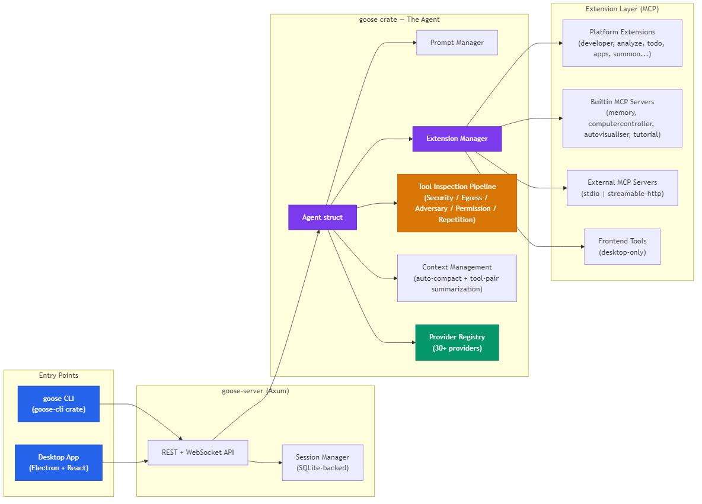
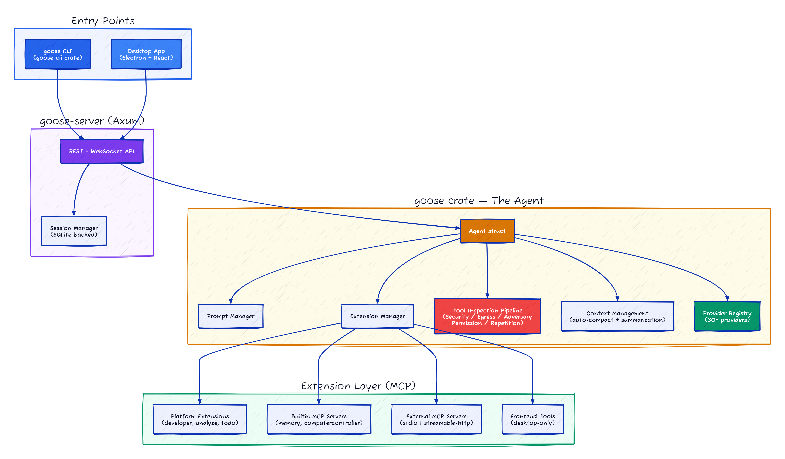
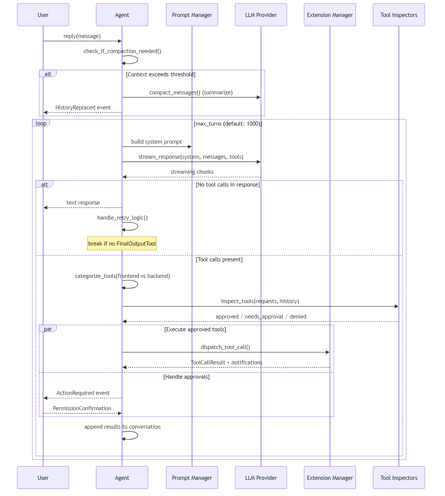

# Goose: 31 Env Vars Blocklisted for DLL Injection, 200K Lines of Rust

> Goose is more than a "Rust agent." The agent loop is deliberately thin because the real insight is the MCP extension bus, with the LLM acting as a scheduler. That distinction matters more than the language choice.

## TL;DR

- **What it is** — An on-machine AI agent where every capability (shell, file edit, even the todo list) lives in an MCP extension. The agent loop is just a dispatcher.
- **Why it matters** — Most agent frameworks bolt on tool support. Goose built the *entire thing* around MCP, making it the first agent I've seen where you could rip out the core tools and replace them without touching the agent loop.
- **What you'll learn** — How a 5-inspector security pipeline works, why MCP-first design makes tool routing trivial, and a 31-entry env var blocklist that's basically a crash course in privilege escalation.

## Why Should You Care?

I went into the Goose codebase expecting another "we rewrote it in Rust" story. What I found was more interesting than that: the Rust is almost beside the point. The actual insight is that Goose treats MCP the way a browser treats HTTP — it's not a feature, it's the protocol everything runs on.

Here's the thing that stopped me mid-read: their `developer` extension — the one that provides `shell`, `edit`, `write`, `tree` — is technically just another MCP client that happens to run in-process. You could rip it out, replace it with an external process running on a different machine, and the agent loop wouldn't notice. I had to re-read `extension_manager.rs` twice to convince myself that was really how it worked. (It is.)

Goose is what happens when you take the "LLM as router + specialized tools" idea to its logical extreme: don't just let the model use tools — make tools the *only* thing the model can do. The agent loop becomes a scheduler, and MCP becomes the instruction set.

## At a Glance

| Metric | Value |
|--------|-------|
| Stars | 37,343 |
| Forks | 3,589 |
| Language | Rust (core), TypeScript (UI), Python (evals) |
| Framework | Tokio async runtime, Axum HTTP, Electron (desktop) |
| Lines of Code | ~124K Rust + ~74K TypeScript |
| License | Apache-2.0 |
| First Commit | 2024-08-23 |
| Latest Release | v1.29.1 (2026-04-03) |
| Data as of | April 2026 |

Goose is an on-machine AI agent that runs shell commands, edits files, manages extensions, and orchestrates sub-agents. It talks to any LLM provider (30+ supported), uses MCP as its extension protocol, and ships as both a CLI (`goose`) and an Electron desktop app. Originally built by Block Inc (the company behind Square and CashApp), the project has since moved to the AAIF (AI Agent Infrastructure Foundation) organization on GitHub (`aaif-goose/goose`). It directly competes with Claude Code, OpenClaw, and Cursor.

---

## Characteristics

| Dimension | Description |
|-----------|-------------|
| Architecture | MCP-first extension bus (6 extension types: platform, builtin, stdio, streamable_http, remote, bundled), thin agent loop dispatching to extensions |
| Code Organization | 124K Rust + 74K TypeScript, Tokio async runtime, Axum HTTP server, Electron desktop app, clean crate boundaries |
| Security Approach | 5-inspector tool pipeline: SecurityInspector → EgressInspector → AdversaryInspector (LLM-based) → PermissionInspector → RepetitionInspector, 31-entry env var blocklist |
| Context Strategy | tool-pair summarization: background-summarizes old tool request/response pairs while current turn executes |
| Documentation | README and extension API docs cover surface, 30+ provider registry via 10-line JSON declarative config |

## Architecture





Three layers. CLI and desktop both hit the same `goose-server` (Axum-based HTTP/WebSocket). The server manages sessions (SQLite persistence) and hands off messages to the `Agent`. The Agent owns the prompt manager, extension manager, tool inspection pipeline, and provider connection. Below it, extensions live as MCP clients: some run in-process ("platform extensions"), some spawn as child processes ("builtin" and "stdio"), and some connect over HTTP ("streamable_http").

The Agent itself contains zero tool execution logic. It's purely a dispatcher. Every capability lives in an extension. This maps directly to the MRKL architecture (Karpas et al., 2022) — LLM as router, specialist modules as executors — except Goose unified the dispatch protocol. MRKL theorized heterogeneous expert routing; Goose implemented it with MCP as the universal wire format.

The tool inspection pipeline is where things get serious. Before any tool call executes, it passes through five inspectors in priority order: SecurityInspector (prompt injection scanning), EgressInspector, AdversaryInspector (LLM-based review), PermissionInspector, and RepetitionInspector. This is a proper chain-of-responsibility pattern, not an afterthought.

**Files to reference:**
- `crates/goose/src/agents/agent.rs` — The 900-line Agent struct and reply loop
- `crates/goose/src/agents/extension_manager.rs` — Extension lifecycle and tool dispatch (~2,300 lines)
- `crates/goose-server/src/main.rs` — HTTP/WebSocket server entry
- `crates/goose/src/security/mod.rs` — Security manager with prompt injection detection

---

## Core Innovation

Two things stand out: the extension taxonomy and the tool inspection pipeline.

### Extension Taxonomy: Six Flavors of MCP

Most agent frameworks have "tools." Goose has six distinct extension types, all unified under the MCP protocol:

```rust
// From crates/goose/src/agents/extension.rs:151
#[derive(Debug, Clone, Deserialize, Serialize, ToSchema, PartialEq)]
#[serde(tag = "type")]
pub enum ExtensionConfig {
    #[serde(rename = "sse")]
    Sse { ... },                // Legacy SSE (deprecated, kept for compat)
    #[serde(rename = "stdio")]
    Stdio { cmd, args, envs, ... },   // Child process via stdin/stdout
    #[serde(rename = "builtin")]
    Builtin { name, ... },            // In-process MCP server (memory, visualiser)
    #[serde(rename = "platform")]
    Platform { name, ... },           // In-process with agent context access
    #[serde(rename = "streamable_http")]
    StreamableHttp { uri, ... },      // Remote MCP via HTTP
    #[serde(rename = "frontend")]
    Frontend { tools, ... },          // UI-provided tools (desktop only)
    #[serde(rename = "inline_python")]
    InlinePython { code, ... },       // Python code run via uvx
}
```

Why does this matter? It lets them ship a monolithic binary that still behaves like a distributed system. Platform extensions (developer, analyze, todo) get direct access to the agent's session context and provider. Builtin extensions run as in-process MCP servers using `tokio::io::DuplexStream` — no sockets, no serialization overhead. External extensions talk MCP over stdio or HTTP. The agent loop handles all of them identically through the `McpClientTrait` interface.

Same dispatch code path regardless of whether the tool lives inside the binary or runs as a separate process across the network. That's the MCP bet paying off.

### Tool Inspection Pipeline: Defense in Depth

```rust
// From crates/goose/src/agents/agent.rs:210
fn create_tool_inspection_manager(
    permission_manager: Arc<PermissionManager>,
    provider: SharedProvider,
) -> ToolInspectionManager {
    let mut tool_inspection_manager = ToolInspectionManager::new();
    tool_inspection_manager.add_inspector(Box::new(SecurityInspector::new()));
    tool_inspection_manager.add_inspector(Box::new(EgressInspector::new()));
    tool_inspection_manager.add_inspector(Box::new(AdversaryInspector::new(provider.clone())));
    tool_inspection_manager.add_inspector(Box::new(PermissionInspector::new(
        permission_manager, provider,
    )));
    tool_inspection_manager.add_inspector(Box::new(RepetitionInspector::new(None)));
    tool_inspection_manager
}
```

Five inspectors, each implementing the `ToolInspector` trait, each producing `InspectionResult` values with `Allow`, `RequireApproval`, or `Deny` actions. The SecurityInspector uses pattern matching and optional ML classification to detect prompt injection. The AdversaryInspector can call the LLM itself to review suspicious tool calls. The RepetitionInspector catches infinite loops. Claude Code and OpenClaw handle permissions, but neither has a pluggable inspection chain like this.

---

## How It Actually Works

### The Agent Loop



The reply loop inside `reply_internal` is the heart of the system. It's a `loop` (not a `for`) with a configurable maximum turns counter (default 1000 — generous). Each iteration: build the prompt, call the provider, parse the response, categorize tool calls into frontend/backend, run them through the inspection pipeline, execute approved ones in parallel, wait for user approval on flagged ones, collect results, append to conversation, and loop.

If you squint, this is a textbook think → act → observe cycle — except Goose skips the explicit "Thought" trace and lets the LLM reason internally. The loop structure is that classic pattern with the training wheels off.

Three things I noticed:

**Compaction happens eagerly.** Before the loop even starts, the agent checks if the conversation exceeds a configurable threshold (default 80% of context window). If it does, it summarizes the history using the LLM and replaces the conversation. Smarter than waiting until the provider returns a context-length error — proactive page-out rather than reactive overflow handling. Though Goose handles that fallback too with a recovery compaction path inside the loop.

**Tool-pair summarization runs concurrently.** While the agent processes the current turn's tool calls, a background `JoinHandle` is summarizing older tool request/response pairs from previous turns. This keeps the context window lean without blocking the main loop. The summarized pairs get their metadata marked `agent_invisible` so the provider doesn't see them, while the summary message replaces them.

**The retry manager is a separate concern.** When the loop ends with no tool calls (the model just returned text), a `RetryManager` checks if the response actually made progress. If the `FinalOutputTool` exists but wasn't called, it nudges the model to call it. If it was called, it extracts the structured output. This is specifically for "recipe" mode (Goose's version of structured workflows).

### The Extension Manager


The `ExtensionManager` maintains a `HashMap<String, Extension>` protected by a `tokio::sync::Mutex`. Each `Extension` wraps a `McpClientBox` (which is `Arc<dyn McpClientTrait>`) plus its config and server info. Tools are cached with an atomic counter for cache invalidation — `tools_cache_version` bumps every time an extension is added or removed, and the cached `Arc<Vec<Tool>>` is only rebuilt when stale.

Tools get prefixed with the extension name (e.g., `developer__shell`, `memory__store`) to avoid namespace collisions. Platform extensions with `unprefixed_tools: true` (like `developer` and `analyze`) skip this prefix. Pragmatic — the most-used tools don't need ugly prefixes, but third-party extensions are isolated.

Extension lifecycle is interesting: when you add an extension at runtime, the agent persists the config into the session's `extension_data` (stored in SQLite). When you resume a session, `load_extensions_from_session` bulk-loads all extensions in parallel using `futures::future::join_all`. There's also an `add_extensions_bulk` method that acquires the container lock once upfront to prevent serialization of the parallel futures — a concurrency micro-optimization that tells me the team has actually hit contention issues in production.

### The Provider System

Goose supports 30+ LLM providers through a trait-based abstraction:

```rust
// From crates/goose/src/providers/base.rs (simplified)
#[async_trait]
pub trait Provider: Send + Sync + Debug {
    fn get_name(&self) -> &str;
    fn get_model_config(&self) -> ModelConfig;

    async fn stream(
        &self,
        model_config: &ModelConfig,
        session_id: &str,
        system: &str,
        messages: &[Message],
        tools: &[Tool],
    ) -> Result<MessageStream, ProviderError>;
}
```

Each provider implements this trait. The `stream` method returns a `MessageStream` — a boxed async stream of `(Option<Message>, Option<ProviderUsage>)` tuples. Streaming-first: every provider must implement streaming, and `complete()` is just a convenience wrapper that collects the stream.

What's unusual: they have a `canonical` model registry that maps model names across providers to a normalized format. So `claude-3-5-sonnet` on Anthropic, `anthropic.claude-3-5-sonnet` on Bedrock, and `claude-3-5-sonnet@20241022` on Vertex all resolve to the same canonical model with known context limits and pricing. Built from a JSON file (`canonical_models.json`) with 180+ model entries.

They also have "declarative providers" — JSON files in `providers/declarative/` (deepseek.json, groq.json, mistral.json, etc.) that define OpenAI-compatible providers without writing any Rust code. Adding a new provider is literally a 10-line JSON file.

---

## The Verdict

The extension system is where Goose shines. The six-flavor taxonomy solves real problems — performance (in-process DuplexStream), accessibility (InlinePython for non-Rust devs), ecosystem compatibility (MCP over stdio/HTTP). Most agent frameworks force you to pick one mechanism and stick with it.

The tool inspection pipeline is the other standout. Claude Code has a permission system, but Goose has a pluggable chain where you can add ML-based classifiers, LLM-powered adversary review, and custom egress policies. The fact that the `AdversaryInspector` can call the LLM to review tool calls before they execute — that's a level of paranoia that production systems need.

The provider system is broad, but it comes at a cost. The `providers/` directory has 50+ files and 3,000+ lines of format conversion code across Anthropic, OpenAI, Google, Bedrock, and Ollama wire formats. Each provider has subtle differences in how they handle tool calls, thinking tokens, streaming chunks, and error responses. The declarative system helps for OpenAI-compatible APIs, but the core providers are each 300-800 lines of bespoke serialization. That's a lot of maintenance surface, and it'll be interesting to see how the team manages it as providers multiply.

The agent loop itself is solid but unremarkable — a standard while loop with streaming, tool dispatch, and context management. The compaction logic (threshold-based + recovery) is better than most. But the loop structure is what you'd write in Python too; Rust doesn't add architectural insight here beyond type safety and performance.

One thing I'm curious about: the `goose` core crate at 124K lines feels like it could benefit from splitting. The `Agent` struct alone is over 900 lines. Separating the provider layer and security layer into their own crates could help compile times and code navigation. I haven't tried building it myself though, so there may be dependency reasons for the current structure.

---

## Cross-Project Comparison

| Feature | Goose | Claude Code | OpenClaw |
|---------|-------|-------------|----------|
| Language | Rust | TypeScript | TypeScript |
| Extension Protocol | MCP (native) | Built-in tools | MCP + Skills |
| Provider Lock-in | None (30+ providers) | Anthropic only | Any (via config) |
| Permission Model | 5-inspector pipeline | Allowlist + deny | Allowlist |
| Context Management | Auto-compact (80%) + tool-pair summarization | 4-layer context mgmt | Configurable compaction |
| Sub-agents | Yes (subagent_handler) | Yes (multi-agent) | Yes (subagents) |
| Desktop App | Electron | Terminal only | Terminal + web |
| Structured Output | Recipes with FinalOutputTool | - | - |
| Security Scanning | Pattern + ML + LLM review | Basic sandbox | Community skills |
| LOC | ~200K | ~510K | ~50K (estimated) |
| Local Inference | Yes (llama.cpp, Whisper) | No | No |

Goose sits between Claude Code and OpenClaw in complexity. More opinionated than OpenClaw (which delegates everything to skills and MCP servers) but less monolithic than Claude Code (which bakes everything into one giant TypeScript bundle). The "everything is an MCP extension" philosophy means Goose's core is surprisingly thin — the agent loop is really just a scheduler for MCP tool calls.

---

## Stuff Worth Stealing

### 1. The Declarative Provider Pattern

```json
// From crates/goose/src/providers/declarative/deepseek.json
{
    "name": "deepseek",
    "api_base": "https://api.deepseek.com",
    "api_key_env": "DEEPSEEK_API_KEY",
    "default_model": "deepseek-chat",
    "models": ["deepseek-chat", "deepseek-reasoner"]
}
```

Adding a new OpenAI-compatible provider without writing any code — just a JSON file. ~10 lines to integrate a new provider. Should be standard in every multi-provider agent framework.

### 2. Environment Variable Blocklist for Extensions

```rust
// From crates/goose/src/agents/extension.rs:81
const DISALLOWED_KEYS: [&'static str; 31] = [
    "PATH", "PATHEXT", "SystemRoot",         // Binary path manipulation
    "LD_LIBRARY_PATH", "LD_PRELOAD",         // Dynamic linker hijacking
    "DYLD_INSERT_LIBRARIES",                  // macOS injection
    "PYTHONPATH", "NODE_OPTIONS",             // Runtime hijacking
    "APPINIT_DLLS", "ComSpec",               // Windows process hijacking
    // ... 21 more
];
```

When extensions declare environment variables, Goose blocks 31 known-dangerous keys that could enable DLL injection, library preloading, or runtime hijacking. Simple, effective, and I haven't seen this in any other agent framework. Reading through the 31 entries is basically a crash course in privilege escalation techniques (~50 lines to implement).

### 3. Tool-Pair Summarization

Background-summarizing old tool request/response pairs while the current turn executes. Instead of waiting for context overflow, this proactively keeps the context lean. Uses `tokio::task::JoinHandle` to run concurrently with the main loop, marks summarized messages as `agent_invisible` so they're skipped by the provider but preserved for UI display. (~200 lines of implementation.)

---

## Hooks & Easter Eggs

**The "Top of Mind" extension** (`tom`): An extension that injects arbitrary text into every agent turn via environment variables (`GOOSE_MOIM_MESSAGE_TEXT` and `GOOSE_MOIM_MESSAGE_FILE`). Their equivalent of a system prompt override, but it runs as a regular extension and its content refreshes every turn. Naming it "tom" (Top of Mind) is cute.

**"Code Mode" extension**: An experimental mode where Goose writes Python code that calls the extensions instead of making tool calls directly. Save tokens by letting the model express multi-tool workflows as code rather than individual tool calls. Behind a feature flag (`code-mode`) and feels like a prototype, but the concept is interesting — treating the extension API as a Python SDK.

**The Envs disallow list comments**: The team left detailed explanations for why each env var is blocked, like `"LD_PRELOAD — Forces preloading of shared libraries — common attack vector"` and `"APPINIT_DLLS — Forces Windows to load a DLL into every process"`. Reading through the 31 entries is basically a crash course in privilege escalation.

**Goose humor**: The repo README includes the joke _"Why did the developer choose goose as their AI agent? Because it always helps them 'migrate' their code to production!"_ — complete with rocket emoji. The humor section in a 37K-star enterprise-backed repo is endearing.

**Recipe system**: YAML files that define pre-configured workflows with specific instructions, extensions, and structured output schemas. Shareable and resolvable from GitHub URLs. Goose's answer to "prompt templates" but also locks in the extension set and model configuration. The `FinalOutputTool` enforces JSON schema output — the agent loop won't exit until the model calls it or hits max turns.

---

## Key Takeaways

1. **MCP-first design makes tool routing a solved problem.** When every extension speaks one protocol, the LLM just picks from a flat list. No adapter layers, no format conversion, no routing heuristics. Goose proves the "LLM as router" vision works when you commit to a universal wire format.
2. **A 31-entry env var blocklist is more security than most agents ship total.** The inspection pipeline (5 inspectors, including LLM-powered review) is the most thorough I've seen in any open-source agent.
3. **Declarative provider configs should be an industry standard.** Adding a new OpenAI-compatible provider in 10 lines of JSON is the right level of abstraction. Every multi-provider framework should steal this.
4. **Rust is viable for AI agents but costs more code.** 124K lines of Rust for what would be ~40K in TypeScript. The payoff is type safety and performance, but the contribution barrier is real.
5. **The agent loop is the least interesting part.** Which is actually the point — when your extension system is good enough, the orchestration layer can be boring.

---

## Verification Log

<details>
<summary>Fact-check log (click to expand)</summary>

| Claim | Verification Method | Result |
|-------|-------------------|--------|
| 37,343 stars | GitHub API (`/repos/aaif-goose/goose`) | PASS Verified |
| 3,589 forks | GitHub API | PASS Verified |
| ~124K Rust LOC | `Get-ChildItem -Recurse -Include *.rs \| Get-Content \| Measure-Object -Line` on crates/ | PASS Verified (124,627 lines) |
| ~74K TypeScript LOC | Same method on ui/ directory (.ts, .tsx, .js, .jsx) | PASS Verified (74,141 lines) |
| Apache-2.0 license | LICENSE file header | PASS Verified |
| First commit 2024-08-23 | GitHub API `created_at` | PASS Verified |
| Latest release v1.29.1 | GitHub API `/releases/latest` | PASS Verified (2026-04-03) |
| Version in Cargo.toml: 1.30.0 | `crates/goose/Cargo.toml` workspace version | PASS Verified |
| 30+ providers | Provider modules in `crates/goose/src/providers/mod.rs` | PASS Verified (30+ pub mod entries) |
| 5 tool inspectors | `create_tool_inspection_manager()` in agent.rs | PASS Verified |
| 6 extension types | `ExtensionConfig` enum in extension.rs | PASS Verified (Sse, Stdio, Builtin, Platform, StreamableHttp, Frontend, InlinePython = 7 variants, Sse deprecated) |
| `crates/goose/src/agents/agent.rs` exists | File read | PASS Verified |
| `crates/goose/src/agents/extension.rs` exists | File read | PASS Verified |
| `crates/goose/src/security/mod.rs` exists | File read | PASS Verified |
| 31 disallowed env vars | `DISALLOWED_KEYS` array in extension.rs | PASS Verified |
| Default max turns = 1000 | `DEFAULT_MAX_TURNS` constant in agent.rs | PASS Verified |
| Default compaction threshold = 0.8 | `DEFAULT_COMPACTION_THRESHOLD` in context_mgmt/mod.rs | PASS Verified |

</details>

---

*Part of [awesome-ai-anatomy](https://github.com/NeuZhou/awesome-ai-anatomy) — source-level teardowns of how production AI systems actually work.*

