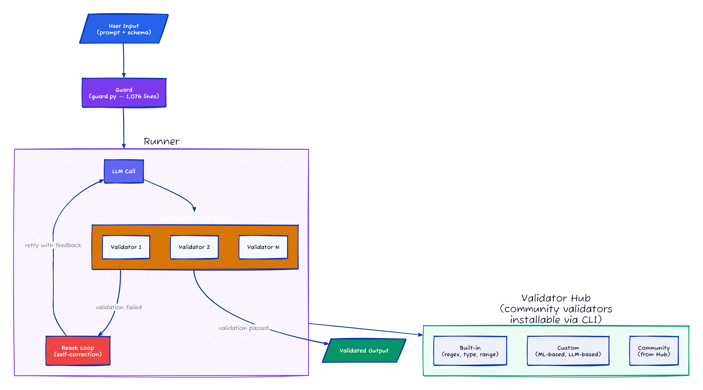
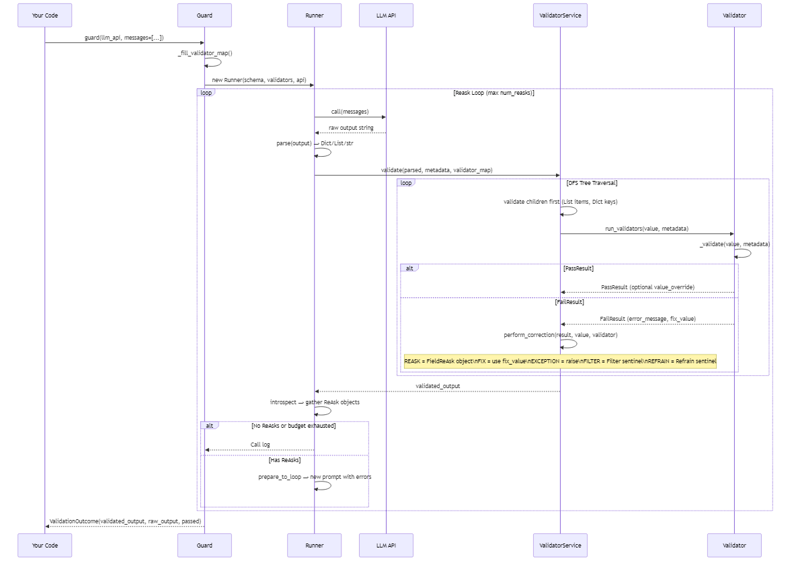

# Guardrails AI: A 1076-Line God Object Guarding Your LLM's Output — and the Reask Loop That Makes It Work

> Guardrails AI is closer to a package manager with a validation engine bolted on than to a security tool — and that distinction matters more than the branding suggests.

## At a Glance

| Metric | Value |
|--------|-------|
| Stars | 6,635 |
| Forks | 561 |
| Language | Python |
| Framework | Pydantic v2, LiteLLM, OpenTelemetry, lxml |
| Lines of Code | 18,079 (178 Python files, `guardrails/` directory) |
| License | Apache-2.0 |
| First Commit | 2023-01-29 |
| Latest Release | v0.10.0 (2026-04-03) |
| Data as of | April 2026 |

Guardrails AI wraps LLM API calls and validates the output against a schema you define. You declare what you want (JSON structure, content constraints), attach validators, and Guardrails handles calling the LLM, checking the output, and optionally re-asking if validation fails. Think of it as a middleware layer between your code and the LLM that enforces output contracts.

---

## Overall Rating

| Dimension | Grade | Notes |
|-----------|-------|-------|
| Architecture | B+ | Single responsibility: validate LLM output against schemas. Validator Hub (pip-install from git) is a distribution model worth noting |
| Code Quality | B+ | 18K LOC in 178 files; Guard class (1076 lines) holds too much state but the reask loop logic is well-separated |
| Security | B | Validators pip-install from git URLs — supply chain risk if Hub packages are compromised |
| Documentation | A- | API docs and validator catalog are thorough; internal reask loop mechanics less documented |
| **Overall** | **B+** | **Focused scope, reask loop is the key innovation; 1076-line Guard class needs decomposition** |

## Architecture





The whole thing flows through a single central class: `Guard`. It holds your validators, your output schema, your execution history, your API client, your telemetry config — everything. When you call it, it builds a `Runner`, which loops through LLM calls and validation steps until the output passes or the reask budget runs out.

What surprised me: the validation service defaults to async execution. `validator_service/__init__.py` tries to grab an event loop and use `AsyncValidatorService` first, falling back to `SequentialValidatorService` only if that fails. Most users probably don't realize their validators are running in an async context by default.

The architecture has a clear "onion" shape: Guard wraps Runner, Runner wraps ValidatorService, ValidatorService wraps individual Validators. Each layer adds its own error handling, telemetry, and state management. This means 4+ stack frames between your code and the actual validation logic — which shows up in stack traces when things go wrong.

**Files to reference:**
- `guardrails/guard.py` — The central orchestrator, 1,076 lines
- `guardrails/run/runner.py` — LLM call + validation loop, 457 lines
- `guardrails/validator_service/__init__.py` — Sync/async dispatch
- `guardrails/validator_base.py` — Base `Validator` class and registry

---

## Core Innovation

Guardrails has two ideas that separate it from "just write an if-statement":

### 1. The Validator Hub — npm for LLM constraints

The `install()` function in `guardrails/hub/install.py` works like `npm install` for validators. You run:

```python
# From guardrails/hub/install.py
from guardrails import install
RegexMatch = install("hub://guardrails/regex_match").RegexMatch
```

Under the hood, it fetches a manifest from the Guardrails Hub service, `pip install`s the validator package from git (or `uv install` if available), optionally downloads ML models for local inference, and registers the validator in a local `.guardrails/hub_registry.json`.

```python
# From guardrails/hub/validator_package_service.py:68
@staticmethod
def detect_installer() -> str:
 env_installer = os.environ.get(_GUARDRAILS_INSTALLER_ENV, "").strip().lower()
 if env_installer in ("uv", "pip"):
 return env_installer
 if shutil.which("uv") is not None:
 return "uv"
 return "pip"
```

Each validator is a separate Python package with its own version, dependencies, and optional ML model. The registry is just a JSON file mapping validator names to import paths:

```python
# From guardrails/types/validator_registry.py:6
class ValidatorRegistryEntry(BaseModel):
 import_path: Optional[str] = Field(default=None)
 exports: list[str] = Field(default_factory=list)
 installed_at: Optional[str] = Field(default=None)
 package_name: Optional[str] = Field(default=None)
```

This is the most commercially significant part of the project. The Hub creates an ecosystem moat — once you have 50+ community validators, switching costs get real.

### 2. The Reask Loop — Automated LLM Self-Correction

When validation fails, Guardrails can automatically re-prompt the LLM with the error messages and ask it to try again. This is implemented as a simple loop in `Runner.__call__`:

```python
# From guardrails/run/runner.py:100
for index in range(self.num_reasks + 1):
 iteration = self.step(
 index=index,
 api=self.api,
 messages=messages,
 prompt_params=prompt_params,
 output_schema=output_schema,
 output=self.output if index == 0 else None,
 call_log=call_log,
 )
 if not self.do_loop(index, iteration.reasks):
 break
 (output_schema, messages) = self.prepare_to_loop(
 iteration.reasks,
 output_schema,
 parsed_output=iteration.outputs.parsed_output,
 validated_output=call_log.validation_response,
 prompt_params=prompt_params,
 )
```

The reask mechanism supports three scenarios: non-parseable output (LLM returned garbage), skeleton errors (JSON structure doesn't match schema), and field-level errors (individual values failed validation). Each gets a different prompt template.

This is where the `OnFailAction` enum comes in — `REASK` triggers the loop, `FIX` applies a static correction, `FIX_REASK` tries the fix first and reasks only if the fix also fails. Simple idea, but having it built into the framework saves a lot of boilerplate.

---

## How It Actually Works

### The Validator Pipeline




The validation traversal is a depth-first search. For a nested JSON object, it validates leaf nodes first and bubbles up. The code in `SequentialValidatorService.validate()` is recursive — for Lists, it iterates items; for Dicts, it iterates keys. Each node gets its own set of validators looked up from the `validator_map` by JSON path.

The `perform_correction` method in `ValidatorServiceBase` is a straightforward switch statement over the 8 `OnFailAction` variants. The `CUSTOM` option lets you pass a lambda that receives the value and the `FailResult`, which is the escape hatch for anything the built-in actions don't cover.

One thing to note: validators run sequentially within a single property path. If you have three validators on the same field, they execute in order, and each one receives the (possibly corrected) output of the previous one. This is a pipeline, not a set of independent checks.

### The RAIL XML Spec

RAIL (Reliable AI Language) is an XML-based specification for defining output schemas with validators inline. It predates the current JSON Schema approach and is now mostly a legacy feature, but it reveals how the project thought about the problem initially:

```xml
<!-- From test_spec.rail -->
<rail version="0.1">
<output>
 <string name="answer" description="A simple answer"/>
</output>
<prompt>
Answer the question: What is 2+2?
</prompt>
</rail>
```

The RAIL parser in `guardrails/schema/rail_schema.py` (550+ lines) converts XML elements to JSON Schema plus a validator map. It supports types like `<string>`, `<integer>`, `<float>`, `<bool>`, `<date>`, `<list>`, `<object>`, and even `<choice>` (discriminated unions). The reverse direction — JSON Schema back to RAIL — is also implemented, which is used for prompt construction.

```python
# From guardrails/schema/rail_schema.py:66
def extract_validators(
 element: _Element, processed_schema: ProcessedSchema, json_path: str
):
 validators = get_validators(element)
 for validator in validators:
 validator_reference = ValidatorReference(
 id=validator.rail_alias,
 on=json_path,
 on_fail=validator.on_fail_descriptor,
 kwargs=validator.get_args(),
 )
 processed_schema.validators.append(validator_reference)
```

The RAIL spec was a bold design choice — creating a DSL for LLM output validation. In practice, it lost out to the Pydantic model approach (`Guard.for_pydantic()`), which is more Pythonic and doesn't require learning a new XML dialect. The codebase still carries all the RAIL parsing infrastructure though, which adds weight.

### The Server Architecture

Guardrails has a client-server mode that most people don't know about. Setting `use_server=True` or calling `guard.save()` sends your Guard configuration to a remote Guardrails API server, and subsequent validations happen server-side:

```python
# From guardrails/guard.py:377
def _single_server_call(self, *, payload: Dict[str, Any]) -> ValidationOutcome[OT]:
 if self._use_server and self._api_client:
 validation_output: IValidationOutcome = self._api_client.validate(
 guard=self,
 openai_api_key=get_call_kwarg("api_key"),
 **payload,
 )
```

This is the commercial angle. The open-source library validates locally; the paid service validates remotely with managed infrastructure, hosted ML models, and a dashboard. The code paths diverge at `_execute` — if `use_server` is True and the model is supported, it calls `_call_server` instead of running the local `Runner`.

---

## The Verdict

The Guard class does too much. It's a schema container, a validator registry, an LLM caller, an API client, a history store, a telemetry manager, and a serialization target — all in one 1,076-line file. This is the kind of kitchen-sink object that works fine at 20 validators but becomes painful to debug at 200. The fact that `__init__` takes 10 parameters and sets 18 instance variables tells the story.

The validator pipeline, on the other hand, is well-thought-out. The `OnFailAction` enum with 8 options covers every reasonable correction strategy. The DFS traversal of nested schemas with per-path validator maps is a clean design that handles real-world JSON structures. And the streaming validation support — accumulating chunks until a sentence boundary before validating — shows attention to production use cases.

The Hub model is commercially smart but architecturally concerning. Each validator is a separate pip package installed from git. That means your validation pipeline's dependencies are spread across N separate packages, each with their own version constraints. In a production environment with pinned dependencies, this gets messy fast. Compare this to ClawGuard's approach of shipping 285+ threat patterns in a single package — fewer moving parts.

The RAIL XML spec is dead weight. It was an interesting idea (a DSL for LLM contracts) but the codebase has clearly moved on to Pydantic models and JSON Schema as the primary interface. The 815 lines of XML parsing code in `rail_schema.py` remain because removing them would break backward compatibility, but new users have no reason to touch it.

The telemetry integration is surprisingly thorough. OpenTelemetry tracing wraps every significant operation — guard calls, validator execution, LLM calls, reask loops. The `@trace` decorator from `hub_tracing.py` appears on every important method. This is the kind of observability infrastructure that separates a weekend project from a production tool.

Would I use this? For validating structured LLM output — yes, it solves a real problem with reasonable ergonomics. For anything security-related — no, and this is where the branding confusion with ClawGuard matters. Guardrails AI validates output format and content constraints. ClawGuard protects against prompt injection, data exfiltration, and agent lifecycle threats. They sound similar but operate at different layers of the stack.

---

## Cross-Project Comparison

| Feature | Guardrails AI | ClawGuard | Claude Code | Hermes Agent |
|---------|--------------|-----------|-------------|--------------|
| Primary Language | Python | TypeScript | TypeScript | Python |
| Core Purpose | LLM output validation | Agent security (immune system) | AI coding agent | Agent framework |
| Lines of Code | 18K | ~15K | 510K | ~8K |
| Validator/Pattern Count | Hub ecosystem (N packages) | 285+ built-in | N/A | N/A |
| Reask/Retry | Built-in (configurable budget) | N/A | Built-in (tool retry) | Configurable |
| Streaming Support | Yes (chunk accumulation) | Yes (real-time scanning) | Yes (SSE) | No |
| Server Mode | Yes (paid) | No | No | No |
| Schema Definition | Pydantic / JSON Schema / RAIL XML | Threat pattern YAML | Tool JSON Schema | Pydantic |
| LLM Agnostic | Yes (via LiteLLM) | Yes | Claude-only | Yes |

Guardrails sits in its own niche: output validation middleware. It's not trying to be an agent framework (Hermes) or a security system (ClawGuard). The closest analogy is Pydantic for LLM outputs — schema enforcement with automatic correction. The Hub model pushes it toward a platform play rather than a pure library.

---

## Stuff Worth Stealing

### 1. The OnFailAction Pattern

The eight variants of `OnFailAction` — `reask`, `fix`, `filter`, `refrain`, `noop`, `exception`, `fix_reask`, `custom` — cover the entire error-handling decision tree for validation failures. Any system that validates external input could adopt this enum as a general pattern for "what do I do when the input is wrong?"

```python
# From guardrails/types/on_fail.py:7
class OnFailAction(str, Enum):
 REASK = "reask"
 FIX = "fix"
 FILTER = "filter"
 REFRAIN = "refrain"
 NOOP = "noop"
 EXCEPTION = "exception"
 FIX_REASK = "fix_reask"
 CUSTOM = "custom"
```

### 2. Streaming Chunk Accumulation

The `validate_stream` method on `Validator` accumulates LLM chunks until a sentence boundary before validating. The sentence detection uses a regex-based splitter inspired by WordTokenizers.jl. This is a pattern worth copying for any system that needs to validate streaming text.

```python
# From guardrails/validator_base.py:166
def validate_stream(self, chunk: Any, metadata: Dict[str, Any], ...) -> Optional[ValidationResult]:
 accumulated_chunks = self.accumulated_chunks
 accumulated_chunks.append(chunk)
 accumulated_text = "".join(accumulated_chunks)
 split_contents = self._chunking_function(accumulated_text)
 if len(split_contents) == 0:
 return None # Not enough accumulated yet
 [chunk_to_validate, new_accumulated_chunks] = split_contents
 self.accumulated_chunks = [new_accumulated_chunks]
 return self.validate(chunk_to_validate, metadata)
```

### 3. Validator-as-pip-package Registry

The local JSON registry pattern (`hub_registry.json`) for dynamically installed validators is a clean approach to plugin management. Each validator knows its import path, exports, and installation timestamp. This could be adapted for any plugin system that needs to track dynamically installed components.

### 4. Reask Loop with Budget Ceiling

The `reask` flow re-prompts the LLM with the specific validation failure, but caps retries at a configurable `num_reasks` to prevent infinite loops. The error message sent back to the LLM includes the exact failing field and the validator's error output — not just "try again." This targeted feedback loop is more token-efficient than blind retries and directly applicable to any LLM pipeline where output quality matters.

---

## Hooks & Easter Eggs

**The `jsonformer` escape hatch:** There's an experimental `output_formatter` parameter on `Guard.for_pydantic()` that hooks into jsonformer for constrained JSON generation. When enabled, it wraps the LLM callable entirely, bypassing the normal text generation → parse → validate pipeline. This is hidden behind a `@experimental` decorator and barely documented.

**The `text2sql` application:** There's an entire `applications/text2sql.py` module that implements a text-to-SQL pipeline with schema validation. It's a full application built on top of Guardrails, living inside the library source code like a demo that never got extracted.

**A typo that ships:** The method `_configure_hub_telemtry` (note the missing 'e' in telemetry) has been in the code since early versions. It's internal so it doesn't affect the API, but it tells you something about the review process.

**Remote inference architecture:** Each Hub validator can optionally run inference remotely via the Guardrails Hub service. The validator's `_inference_remote` method calls a JWT-authenticated endpoint at the Hub. This means your validation can involve network calls to Guardrails' servers — something to be aware of in latency-sensitive or air-gapped environments.

---

## ClawGuard vs Guardrails AI: Honest Comparison

These two projects share the word "guard" but solve different problems at different layers.

**Guardrails AI is stronger at:**
- Structured output validation (JSON schema enforcement, type coercion, field-level constraints)
- LLM self-correction (the reask loop with configurable budget)
- Ecosystem breadth (the Hub has validators for everything from regex to toxicity to PII)
- LangChain/LlamaIndex integration (first-class `Runnable` support)
- Production observability (OpenTelemetry tracing baked in everywhere)

**ClawGuard is stronger at:**
- Security-first threat modeling (prompt injection, jailbreak, data exfiltration)
- Agent lifecycle protection (not just output, but the entire agent execution)
- Single-package simplicity (285+ patterns, no external dependencies per pattern)
- Real-time threat detection (designed for interception, not post-hoc validation)
- OWASP compliance mapping (security standards, not data quality standards)

The honest take: if you're building a chatbot that needs to return valid JSON with specific field constraints, Guardrails AI is the right tool. If you're deploying an autonomous agent that handles sensitive data and you're worried about adversarial inputs, ClawGuard is the right tool. They can even work together — Guardrails for output format, ClawGuard for security boundaries.

---

## Verification Log

<details>
<summary>Fact-check log (click to expand)</summary>

| Claim | Verification Method | Result |
|-------|-------------------|--------|
| 6,635 stars | GitHub API `Invoke-RestMethod` | ✅ Verified (2026-04-06) |
| 561 forks | GitHub API `Invoke-RestMethod` | ✅ Verified (2026-04-06) |
| Apache-2.0 license | GitHub API `license.spdx_id` | ✅ Verified |
| 18,079 lines of Python | `Get-Content | Measure-Object -Line` on 178 .py files in `guardrails/` | ✅ Verified |
| First commit 2023-01-29 | GitHub API `created_at` | ✅ Verified |
| v0.10.0 | `pyproject.toml` version field | ✅ Verified |
| `guard.py` line count | `Get-Content | Measure-Object -Line` | ✅ Verified: 1,076 lines |
| `runner.py` line count | `Get-Content | Measure-Object -Line` | ✅ Verified: 457 lines |
| 8 OnFailAction variants | `types/on_fail.py` source | ✅ Verified |
| RAIL XML parsing in `rail_schema.py` | File exists, 815 lines | ✅ Verified |
| `_configure_hub_telemtry` typo | `guard.py` source grep | ✅ Verified |
| `text2sql.py` exists | `applications/text2sql.py` file check | ✅ Verified |
| Hub registry is JSON | `types/validator_registry.py` + `hub/registry.py` source | ✅ Verified |
| `@experimental` decorator | `guardrails/decorators/experimental.py` file exists | ✅ Verified |

</details>

---

*Part of [awesome-ai-anatomy](https://github.com/NeuZhou/awesome-ai-anatomy) — source-level teardowns of how production AI systems actually work.*
