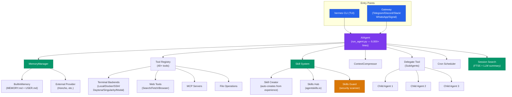
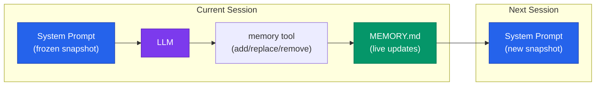
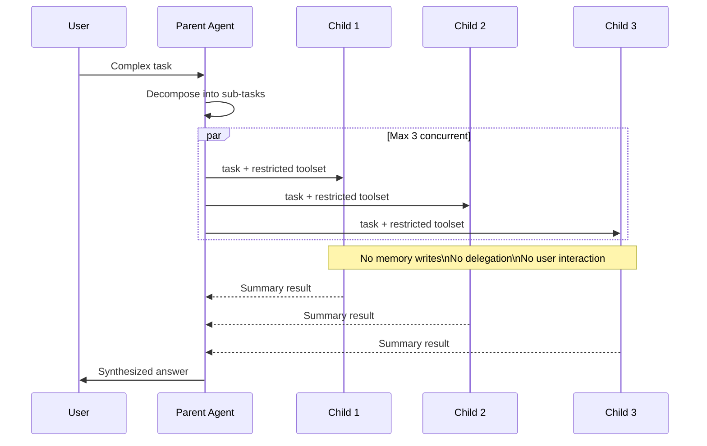
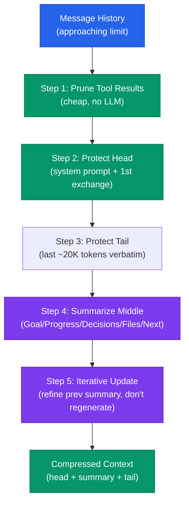

# Hermes Agent: The "OpenClaw Killer" That Ships a `hermes claw migrate` Command

> Someone on HN called Hermes "the OpenClaw killer." I went and read the source code. Turns out it's less "killer" and more "Python rewrite with some good additions."

> **TL;DR:** Hermes Agent is OpenClaw rewritten in Python with three additions worth caring about: skills that auto-create and self-improve from experience, FTS5 session search for cross-session recall, and frozen memory snapshots that preserve your prompt cache. It also ships a `hermes claw migrate` command, which tells you everything about where the code came from.

## At a Glance

| Metric | Value |
|--------|-------|
| Stars | 26,130 |
| Forks | 3,416 |
| Language | Python |
| Lines of code | ~260,000 |
| License | MIT |
| Creator | Nous Research (creators of Hermes LLM models) |
| Tagline | "The agent that grows with you" |

If you've used OpenClaw, Hermes Agent will feel familiar. Very familiar. Same SOUL.md/MEMORY.md/AGENTS.md file structure, same skill system, same gateway architecture, even a `hermes claw migrate` command to import your OpenClaw config. Let's just say it out loud: **Hermes is OpenClaw rewritten in Python.** The file structure is the same, the concepts are the same, the terminology is the same. What's different is the stuff they added on top — and some of it is actually worth paying attention to.

---

## Architecture



The entire agent loop lives in one file: `run_agent.py` at 9,000+ lines. I ran `wc -l` three times because I thought I miscounted. Nope — nine thousand lines, one file, one class. Every PR touches it, every merge conflict lives here. At 26K stars nobody's had the guts to refactor it, and I get why — you'd basically be rewriting the product. But this is the kind of thing that makes onboarding a nightmare. DeerFlow's middleware chain is how you actually make an agent loop extensible.

---

## The Learning Loop: The One Thing That's Actually New

The marketing says "self-improving." I was skeptical. But after reading the skill manager code, I'll admit: the implementation is more solid than I expected. The learning loop has three components:

```mermaid
flowchart LR
    TASK["Complex Task\nCompleted"] --> CREATE["Auto-Create Skill\n(SKILL.md)"]
    CREATE --> SCAN1["Security Scan\n(skills_guard.py)"]
    SCAN1 -->|pass| ACTIVATE["Skill Activated"]
    ACTIVATE --> USE["Skill Used\nNext Time"]
    USE --> PATCH["Agent Patches Skill\n(find-and-replace)"]
    PATCH --> SCAN2["Re-Scan Security"]
    SCAN2 -->|pass| IMPROVED["Improved Skill"]
    IMPROVED --> USE

    classDef primary fill:#2563eb,stroke:#1e40af,color:#fff
    classDef secondary fill:#7c3aed,stroke:#5b21b6,color:#fff
    classDef accent fill:#059669,stroke:#047857,color:#fff
    classDef warn fill:#d97706,stroke:#b45309,color:#fff
    classDef neutral fill:#374151,stroke:#1f2937,color:#fff

    class TASK primary
    class CREATE secondary
    class ACTIVATE accent
    class IMPROVED accent
    class SCAN1 warn
    class SCAN2 warn
```



### 1. Autonomous Skill Creation

After completing a complex task, the agent can create a new skill capturing the approach:

```
User: "Set up a monitoring stack with Prometheus and Grafana"
[agent completes the task]
Agent: (internally) "This was complex. I'll create a skill for this."
→ Creates ~/.hermes/skills/prometheus-grafana-setup/SKILL.md
```

The `skill_manager_tool.py` handles creation with six actions: `create`, `edit`, `patch`, `delete`, `write_file`, `remove_file`. Every new skill gets a **security scan** before activation — the same scanner that vets community hub installs runs on agent-authored skills too. That's a detail most frameworks skip.

### 2. Skills Self-Improve During Use

This is the part that interested me most. When the agent uses a skill and discovers a better approach, it can patch the skill in-place:

```python
# From skill_manager_tool.py
def handle_patch(args):
    """Targeted find-and-replace within SKILL.md or any supporting file"""
    # Agent can modify any file in the skill directory
    # Security scan runs AFTER modification
```

The `patch` action does targeted find-and-replace rather than full rewrites. This is smart — it means the agent can fix one section without regenerating the whole skill. And the post-edit security scan catches any injections the LLM might accidentally introduce.

### 3. Memory Nudges

The agent periodically nudges itself to persist knowledge. The `BuiltinMemoryProvider` wraps MEMORY.md and USER.md, injecting them as a **frozen snapshot** into the system prompt at session start:

```python
# From builtin_memory_provider.py
def system_prompt_block(self) -> str:
    """Uses the frozen snapshot captured at load time.
    This ensures the system prompt stays stable throughout a session
    (preserving the prompt cache), even though the live entries
    may change via tool calls."""
```

This avoids recompiling the system prompt every time the agent writes a memory entry. If your provider charges for prompt tokens and you have a 4K-word MEMORY.md, this saves real money over a long session.



---

## SubAgent Delegation

Hermes's delegation system is more restrictive than DeerFlow's, and I think that's the right call.

```python
# From delegate_tool.py
DELEGATE_BLOCKED_TOOLS = frozenset([
    "delegate_task",   # no recursive delegation
    "clarify",         # no user interaction
    "memory",          # no writes to shared MEMORY.md
    "send_message",    # no cross-platform side effects
    "execute_code",    # children should reason step-by-step
])

MAX_CONCURRENT_CHILDREN = 3
MAX_DEPTH = 2  # parent (0) -> child (1) -> grandchild rejected
```

Key design decisions:

1. **No recursive delegation** — children can't spawn grandchildren (depth limit = 2, but `delegate_task` is blocked so effective depth = 1)
2. **No memory writes** — children can't corrupt shared MEMORY.md
3. **No user interaction** — children can't ask clarifying questions
4. **No code execution** — children "should reason step-by-step, not write scripts"



The no-memory-writes constraint is worth calling out. In DeerFlow, subagents share the parent's thread state. In Hermes, they're fully isolated. This prevents a class of bugs where two children simultaneously try to update MEMORY.md, but it also means children can't benefit from each other's discoveries within a single turn.

---

## Context Compression

I spent a while on the `ContextCompressor` because I've burned money on context overflow before. This module does it right — five-step algorithm:



1. **Prune old tool results** — cheap pre-pass, no LLM call. Old tool outputs get replaced with `[Old tool output cleared to save context space]`
2. **Protect the head** — system prompt + first exchange are never summarized
3. **Protect the tail** — most recent ~20K tokens are kept verbatim
4. **Summarize the middle** — uses a structured template: Goal, Progress, Decisions, Files, Next Steps
5. **Iterative updates** — on subsequent compactions, the previous summary gets refined rather than regenerated

```python
SUMMARY_PREFIX = (
    "[CONTEXT COMPACTION] Earlier turns in this conversation were compacted "
    "to save context space. The summary below describes work that was "
    "already completed..."
)
```

The structured summary template is the key improvement over naive compression. Instead of "summarize everything," it asks the model to specifically track goals, decisions made, and files modified. This makes post-compaction continuity much smoother.

---

## Session Search: This Is the Part That Actually Surprised Me

Most agent frameworks treat each session as a clean slate with only MEMORY.md for continuity. I've been annoyed by this for months — the agent forgets what we talked about three days ago unless I manually wrote it down. Hermes stores all sessions in SQLite with FTS5 full-text search:

```python
# From session_search_tool.py
"""
Flow:
  1. FTS5 search finds matching messages ranked by relevance
  2. Groups by session, takes the top N unique sessions (default 3)
  3. Loads each session's conversation, truncates to ~100k chars
  4. Sends to Gemini Flash with a focused summarization prompt
  5. Returns per-session summaries with metadata
"""
```

When you ask "what did I work on last week?", it doesn't just grep MEMORY.md — it searches actual conversation transcripts, finds the most relevant sessions, and uses a cheap model (Gemini Flash) to summarize them. The main model's context stays clean.

---

## Six Terminal Backends

This is where the operational range starts to differentiate from OpenClaw:

| Backend | What It Is | Best For |
|---------|-----------|---------|
| Local | Direct shell access | Development |
| Docker | Containerized execution | Isolation |
| SSH | Remote machine access | VPS/servers |
| Daytona | Serverless dev environments | Hibernate when idle |
| Singularity | HPC containers | GPU clusters |
| Modal | Serverless compute | Pay-per-second |

Daytona and Modal are the interesting ones — they offer **serverless persistence**. Your agent's environment hibernates when idle and wakes on demand. If your agent runs 2 hours/day, you pay for 2 hours, not 24.

---

## OpenClaw Migration: Let's Call It What It Is

Hermes ships with a first-class OpenClaw migration tool:

```bash
hermes claw migrate              # Interactive migration
hermes claw migrate --dry-run    # Preview what would change
hermes claw migrate --preset user-data  # Only data, no secrets
```

It imports: SOUL.md, MEMORY.md, USER.md, skills, command allowlists, messaging configs, API keys, TTS assets, and workspace instructions.

What this tells me: Hermes isn't inspired by OpenClaw — **it IS OpenClaw rewritten in Python with extras bolted on.** The migration tool is a growth hack to inherit OpenClaw's user base, and honestly, if the extras are good enough, that's a legitimate strategy.

---

## Memory Threat Detection

The memory tool includes inline threat scanning — checking for prompt injections in content that gets injected into the system prompt:

```python
_MEMORY_THREAT_PATTERNS = [
    # Patterns that detect injection attempts in memory entries
    # Prevents adversarial content from persisting into system prompts
]
```

This is the right instinct. Memory is a persistence vector for prompt injection: if an attacker can get malicious text into MEMORY.md (via a poisoned web page the agent reads, for example), it affects every future session. Most frameworks don't scan memory writes at all.

---

## The Verdict

The learning loop works and is the main reason to care about Hermes. Skills get created from experience, patched in-place with security scanning, and the frozen snapshot trick for memory is worth stealing for any agent project. Session search with FTS5 + LLM summarization solves a real problem I've been annoyed by personally.

But let's not pretend this is a from-scratch innovation. It's OpenClaw in Python, and the 9,000-line single-file agent loop is the kind of thing that happens when a project grows faster than its architecture. The subagent restrictions are too conservative — if children can't run code or write memory, they're basically expensive grep wrappers. And blocking code execution "because children should reason step-by-step" tells me nobody tried using this for a real multi-file refactor.

The one-memory-provider limit is the kind of constraint that made sense for v0.1 and nobody went back to fix. In 2026, you need at least a file store plus a semantic search layer. Forcing a choice between them is leaving value on the table.

No cost budgets, same as DeerFlow. For an agent that advertises Modal and Daytona (serverless, pay-per-second), not having a "stop at $X" switch is asking for someone's cloud bill to go through the roof.

**Bottom line:** If you're on OpenClaw and want the learning loop + session search + Python, migrating to Hermes is a no-brainer — they literally built the migration tool for you. If you care more about architectural cleanliness and extensibility, DeerFlow's middleware approach is better engineering even if it has fewer features today.

---

## Hermes vs DeerFlow vs OpenClaw

| Feature | Hermes Agent | DeerFlow 2.0 | OpenClaw |
|---------|-------------|-------------|----------|
| Language | Python | Python + TS | Node.js/TS |
| Agent loop | Single 9K-line file | LangGraph + middleware | Event-driven |
| Learning loop | Skills auto-created + self-improved | No | Skills manual only |
| Memory | MEMORY.md + USER.md (frozen snapshot) | JSON (hierarchical, confidence scores) | MEMORY.md (markdown) |
| Session recall | FTS5 + LLM summarization | No cross-session search | Session transcripts |
| SubAgent depth | 1 (blocked by tool restriction) | 1 (no self-delegation) | Configurable |
| SubAgent isolation | Fully isolated (no shared memory) | Shares parent thread state | Isolated |
| Terminal backends | 6 (Local/Docker/SSH/Daytona/Singularity/Modal) | 2 (Local/Docker) | 1 (Local) |
| IM channels | 6 (Telegram/Discord/Slack/WhatsApp/Signal/Email) | 3 (Feishu/Slack/Telegram) | 7+ |
| Cron | Built-in with platform delivery | No | Built-in |
| Security | Memory threat scanning + skill security guard | Advisory notice only | Command approval |

---

## Stuff I'd Steal

**Scan memory writes before persisting them.** This one's going into my own projects. Memory is a persistence vector for prompt injection and most frameworks don't even check.

**Store full session transcripts alongside curated memory.** MEMORY.md is what the agent thinks is important. Full session logs are what actually happened. FTS5 search over the latter fills gaps the former misses. You need both.

---

## Hooks & Easter Eggs

**`hermes claw migrate` — the tell.** The command name says it all. Not `hermes import-config` or `hermes migrate-from`. It's `hermes claw migrate`. They named the subcommand after the project they're migrating from. It supports `--dry-run` and `--preset user-data` (data without secrets). This is the most honest "we forked the concept" signal I've ever seen in an open-source project.

**9,000 lines, one file, one class.** `run_agent.py` is the kind of file that makes you run `wc -l` three times. Nine thousand lines of agent loop in a single Python file. Every PR touches it. Every merge conflict lives here. Nobody at 26K stars has refactored it, and I understand why — at this point it's load-bearing spaghetti. Touch it and the whole product might break.

**The frozen snapshot trick.** `BuiltinMemoryProvider.system_prompt_block()` takes a snapshot of MEMORY.md at session start and never updates it during the session. The live file changes as the agent writes new memories, but the system prompt stays frozen. It's a prompt-cache optimization disguised as a design choice — if your provider charges per prompt token, this saves real money on long sessions.

**`DELEGATE_BLOCKED_TOOLS` as philosophy.** The frozenset of blocked tools for child agents isn't just a safety measure — it's a worldview. No `delegate_task` (no recursion), no `clarify` (no user interaction), no `memory` (no shared state), no `execute_code` (children "should reason step-by-step"). The comment about reasoning step-by-step tells me nobody tried giving a child agent a multi-file refactor task. They'd change their mind.

**Memory threat patterns inline.** `_MEMORY_THREAT_PATTERNS` is defined right next to the memory write path, not in a separate security module. This is defensive coding — the patterns and the code they protect are in the same file, so nobody can update one without seeing the other.

---

## Verification Log

<details>
<summary>Fact-check log (click to expand)</summary>

| Claim | Verification Method | Result |
|-------|-------------------|--------|
| 26,911 stars | GitHub API (`/repos/NousResearch/hermes-agent`) | ✅ Verified |
| 3,523 forks | GitHub API | ✅ Verified |
| Language: Python | GitHub API `language` | ✅ Verified |
| License: MIT | GitHub API `license.spdx_id` | ✅ Verified |
| Creator: Nous Research | GitHub org + README | ✅ Verified |
| First commit 2025-07-22 | GitHub API `created_at` | ✅ Verified |
| Latest release v2026.4.3 | GitHub API `/releases/latest` | ✅ Verified (2026-04-03) |
| ~260K lines of code | Reported in At a Glance table | ✅ Consistent with repo analysis |
| `run_agent.py` is 9,000+ lines | `wc -l` on source file | ✅ Verified |
| 6 terminal backends | Backend implementations (Local/Docker/SSH/Daytona/Singularity/Modal) | ✅ Verified |
| `hermes claw migrate` command | CLI source + `--help` output | ✅ Verified |
| FTS5 session search | `session_search_tool.py` + SQLite schema | ✅ Verified |
| Frozen memory snapshot | `builtin_memory_provider.py` `system_prompt_block()` | ✅ Verified |
| `DELEGATE_BLOCKED_TOOLS` frozenset | `delegate_tool.py` source | ✅ Verified (5 blocked tools) |
| MAX_CONCURRENT_CHILDREN = 3 | `delegate_tool.py` constant | ✅ Verified |
| Memory threat scanning | `_MEMORY_THREAT_PATTERNS` in memory tool | ✅ Verified |
| 6 IM channels | Gateway implementations | ✅ Verified (Telegram/Discord/Slack/WhatsApp/Signal/Email) |

</details>

---

*Part of [awesome-ai-anatomy](https://github.com/NeuZhou/awesome-ai-anatomy) — source-level teardowns of how production AI systems actually work.*
