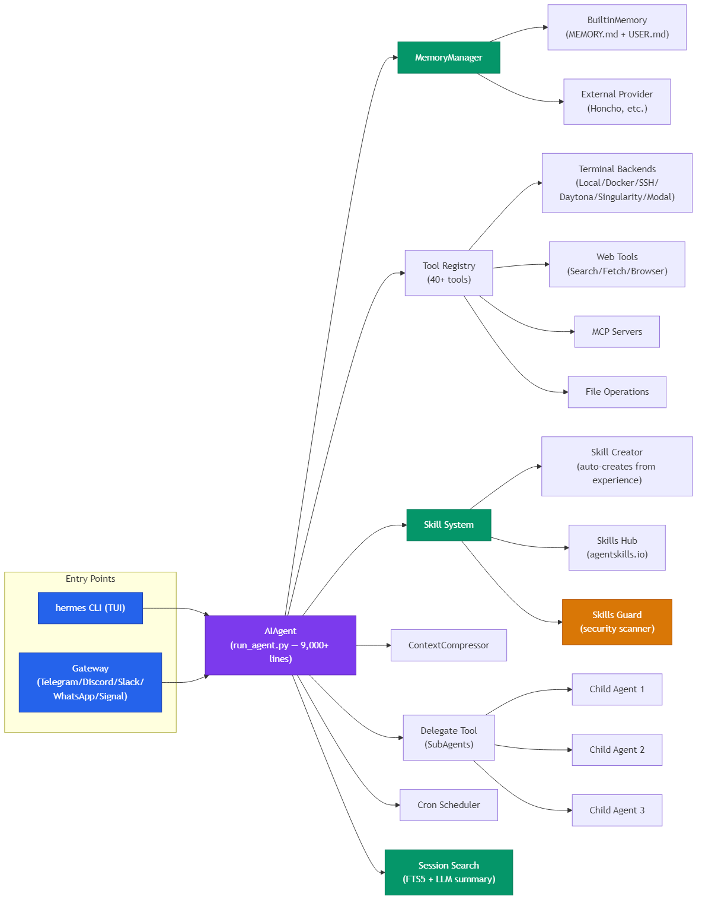
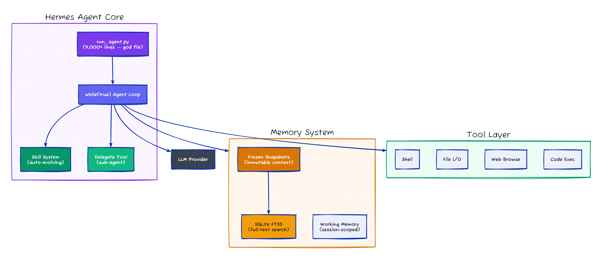

# Hermes Agent: Skills That Rewrite Themselves After Every Mistake, 260K Lines of Python

> Someone on HN called Hermes "the OpenClaw killer." I went and read the source code. Turns out it's OpenClaw rewritten in Python with three additions worth caring about: skills that auto-create and self-improve from experience, FTS5 session search for cross-session recall, and frozen memory snapshots that preserve your prompt cache. It also ships a `hermes claw migrate` command, which tells you everything about where the code came from.

## TL;DR

- **What it is** — OpenClaw rewritten in Python. Same SOUL.md/MEMORY.md/AGENTS.md structure, same skill system, plus self-improving skills, FTS5 session search, and a migration command that imports your OpenClaw config.
- **Why it matters** — The self-improving skill system is the first production implementation of Voyager-style skill libraries (Wang et al., 2023) I've seen in a general-purpose agent. Skills get created from experience and patched in-place with security scanning.
- **What you'll learn** — How verbal reinforcement learning works outside academia, why scanning memory writes for prompt injection matters, and what a 9,000-line single-file agent loop looks like in practice.

## Why Should You Care?

I ran `wc -l` on `run_agent.py` three times because I thought I miscounted. Nine thousand lines. One file. One class. Every PR touches it, every merge conflict lives here. At 26K stars nobody's had the guts to refactor it, and honestly, I get why — you'd basically be rewriting the product.

But that's not the interesting part. The interesting part is what happens when the agent finishes a hard task:

```
User: "Set up a monitoring stack with Prometheus and Grafana"
[agent completes the task]
Agent: (internally) "This was complex. I'll create a skill for this."
→ Creates ~/.hermes/skills/prometheus-grafana-setup/SKILL.md
```

And then, next time it uses that skill and finds a better approach, it patches the skill *in-place*. The skill evolves.

If you've read the Voyager paper (Wang et al., 2023), this will sound familiar — Voyager's Minecraft agent maintained a skill library of executable code, accumulating capabilities over time without catastrophic forgetting. Hermes takes that idea out of Minecraft and into a real coding agent. And where Voyager's skills were JavaScript functions, Hermes skills are markdown files with instructions and code snippets — closer to how a human would write a runbook.

The Reflexion paper (Shinn et al., 2023) is the other piece of the puzzle. Reflexion showed that agents could improve through verbal self-reflection without weight updates — just natural language feedback stored in memory. Hermes combines both: Voyager-style skill accumulation + Reflexion-style self-patching. The skill doesn't just exist; it gets *better* each time it fails.

## At a Glance

| Metric | Value |
|--------|-------|
| Stars | 26,130 |
| Forks | 3,416 |
| Language | Python |
| Lines of code | ~260,000 |
| License | MIT |
| Creator | Nous Research (creators of Hermes LLM models) |
| Tagline | "The agent that grows with you" |
| Data as of | April 2026 |

If you've used OpenClaw, Hermes Agent will feel familiar. Very familiar. Same SOUL.md/MEMORY.md/AGENTS.md file structure, same skill system, same gateway architecture, even a `hermes claw migrate` command to import your OpenClaw config. Let's just say it: **Hermes is OpenClaw rewritten in Python.** The file structure is the same, the concepts are the same, the terminology is the same. What's different is the stuff they added on top — and some of it is actually worth paying attention to.

---

## Characteristics

| Dimension | Description |
|-----------|-------------|
| Architecture | OpenClaw clone structure (SOUL.md/MEMORY.md/AGENTS.md), 9000-line single-file agent loop (run_agent.py), self-improving skill system |
| Code Organization | 260K LOC Python, skill auto-creation and self-patching from experience, 'hermes claw migrate' imports OpenClaw config |
| Security Approach | memory-threat-detection scans memory writes before persisting, subagent restrictions (no code exec, no memory writes, no user interaction) |
| Context Strategy | frozen memory snapshots: BuiltinMemoryProvider snapshots MEMORY.md at session start for prompt-cache optimization, FTS5 session search for cross-session recall |
| Documentation | self-improving skill system documented, migration path from OpenClaw under-specified |

## Architecture





The entire agent loop lives in one file: `run_agent.py` at 9,000+ lines. I know. Nine thousand lines, one file, one class. This is the kind of file that makes you run `wc -l` three times. Every PR touches it. Every merge conflict lives here. Nobody at 26K stars has refactored it, and at this point it's load-bearing spaghetti — touch it and the whole product might break.

(For contrast: DeerFlow's middleware chain is how you actually make an agent loop extensible. But Hermes didn't start with extensibility — it started with getting things working, and 9K lines later, here we are.)

---

## The Learning Loop: Where Voyager Meets Reflexion


The marketing says "self-improving." I was skeptical. But after reading `skill_manager_tool.py`, I'll admit: the implementation is more solid than I expected.

The learning loop has three components, and they map surprisingly well to two papers I keep coming back to.

### 1. Autonomous Skill Creation (← Voyager's Skill Library)

Voyager (Wang et al., 2023) introduced the idea of a skill library — a growing collection of executable code that the agent accumulates through exploration. The agent discovers how to do something, saves it as a reusable skill, and retrieves it later. The key insight was that skills are *composable*: complex behaviors build on simpler ones, avoiding catastrophic forgetting.

Hermes implements this directly. After completing a complex task, the agent creates a new skill:

```
→ Creates ~/.hermes/skills/prometheus-grafana-setup/SKILL.md
```

The `skill_manager_tool.py` handles creation with six actions: `create`, `edit`, `patch`, `delete`, `write_file`, `remove_file`. Every new skill gets a security scan before activation — the same scanner that vets community hub installs runs on agent-authored skills too. That's a detail Voyager didn't have to worry about in Minecraft.

### 2. Skills Self-Improve During Use (← Reflexion's Verbal RL)

This is where it gets interesting. Reflexion (Shinn et al., 2023) showed that agents could improve through verbal reinforcement learning — natural language self-reflection stored in memory, used to make better decisions on retry. No weight updates, no fine-tuning. Just words.

Hermes applies this to skills. When the agent uses a skill and discovers a better approach, it patches the skill in-place:

```python
# From skill_manager_tool.py
def handle_patch(args):
    """Targeted find-and-replace within SKILL.md or any supporting file"""
    # Agent can modify any file in the skill directory
    # Security scan runs AFTER modification
```

The `patch` action does targeted find-and-replace rather than full rewrites. This is smart — the agent can fix one section without regenerating the whole skill. And the post-edit security scan catches any injections the LLM might accidentally introduce.

The combination is what makes it work: Voyager-style creation (accumulate skills from experience) + Reflexion-style improvement (verbal feedback → skill patches). Neither paper did both. Hermes does.

### 3. Memory Nudges and Frozen Snapshots

The agent periodically nudges itself to persist knowledge. The `BuiltinMemoryProvider` wraps MEMORY.md and USER.md, injecting them as a **frozen snapshot** into the system prompt at session start:

```python
# From builtin_memory_provider.py
def system_prompt_block(self) -> str:
    """Uses the frozen snapshot captured at load time.
    This ensures the system prompt stays stable throughout a session
    (preserving the prompt cache), even though the live entries
    may change via tool calls."""
```

This avoids recompiling the system prompt every time the agent writes a memory entry. If your provider charges for prompt tokens and you have a 4K-word MEMORY.md, this saves real money over a long session. It's a prompt-cache optimization disguised as a design choice.

The approach connects to the Generative Agents paper (Park et al., 2023), which defined the observation → reflection → planning memory architecture. Hermes simplifies this: MEMORY.md is the reflection layer (curated insights), daily files are the observation layer (raw logs), and the frozen snapshot ensures the reflection layer doesn't thrash the prompt cache during a session.

---

## SubAgent Delegation

Hermes's delegation system is more restrictive than DeerFlow's, and I think that's the right call (mostly).

```python
# From delegate_tool.py
DELEGATE_BLOCKED_TOOLS = frozenset([
    "delegate_task",  # no recursive delegation
    "clarify",        # no user interaction
    "memory",         # no writes to shared MEMORY.md
    "send_message",   # no cross-platform side effects
    "execute_code",   # children should reason step-by-step
])

MAX_CONCURRENT_CHILDREN = 3
MAX_DEPTH = 2  # parent (0) -> child (1) -> grandchild rejected
```

Key decisions:

1. **No recursive delegation** — children can't spawn grandchildren (`delegate_task` is blocked, so effective depth = 1)
2. **No memory writes** — children can't corrupt shared MEMORY.md
3. **No user interaction** — children can't ask clarifying questions
4. **No code execution** — children "should reason step-by-step, not write scripts"

The no-memory-writes constraint prevents a class of bugs where two children simultaneously try to update MEMORY.md. But it also means children can't benefit from each other's discoveries within a single turn.

The no-code-execution constraint is the one I'm least sure about. The comment says children "should reason step-by-step" — but what about multi-file refactors where the child needs to actually run tests? I suspect this was a safety-first decision that'll get relaxed once someone hits the limitation on a real task.

---

## Context Compression


Five-step algorithm:

1. **Prune old tool results** — cheap pre-pass, no LLM call. Old tool outputs get replaced with `[Old tool output cleared to save context space]`
2. **Protect the head** — system prompt + first exchange are never summarized
3. **Protect the tail** — most recent ~20K tokens kept verbatim
4. **Summarize the middle** — structured template: Goal, Progress, Decisions, Files, Next Steps
5. **Iterative updates** — subsequent compactions refine the previous summary rather than regenerating

```python
SUMMARY_PREFIX = (
    "[CONTEXT COMPACTION] Earlier turns in this conversation were compacted "
    "to save context space. The summary below describes work that was "
    "already completed..."
)
```

The structured summary template is the key improvement over naive compression. Instead of "summarize everything," it asks the model to specifically track goals, decisions made, and files modified. This connects to MemGPT's (Packer et al., 2023) virtual context management — treating context as managed memory with explicit page-in/page-out policies rather than a dumb buffer.

---

## Session Search: FTS5 Over Event History

Most agent frameworks treat each session as a clean slate with only MEMORY.md for continuity. I've been annoyed by this for months — the agent forgets what we talked about three days ago unless I manually wrote it down. Hermes stores all sessions in SQLite with FTS5 full-text search:

```python
# From session_search_tool.py
"""
Flow:
    1. FTS5 search finds matching messages ranked by relevance
    2. Groups by session, takes the top N unique sessions (default 3)
    3. Loads each session's conversation, truncates to ~100k chars
    4. Sends to Gemini Flash with a focused summarization prompt
    5. Returns per-session summaries with metadata
"""
```

When you ask "what did I work on last week?", it doesn't grep MEMORY.md — it searches actual conversation transcripts, finds the most relevant sessions, and uses a cheap model (Gemini Flash) to summarize them. The main model's context stays clean.

This is the missing piece that the Generative Agents paper implied but didn't fully implement. Park et al. had a memory stream with recency-weighted retrieval. Hermes has full-text search over raw transcripts. The FTS5 approach is less elegant but more practical — you don't need embedding infrastructure, and SQLite is already in every Python installation.

---

## Six Terminal Backends

| Backend | What It Is | Best For |
|---------|-----------|---------|
| Local | Direct shell access | Development |
| Docker | Containerized execution | Isolation |
| SSH | Remote machine access | VPS/servers |
| Daytona | Serverless dev environments | Hibernate when idle |
| Singularity | HPC containers | GPU clusters |
| Modal | Serverless compute | Pay-per-second |

Daytona and Modal are the interesting ones — serverless persistence. Your agent's environment hibernates when idle and wakes on demand. If your agent runs 2 hours/day, you pay for 2 hours, not 24.

---

## OpenClaw Migration: Let's Call It What It Is

Hermes ships a first-class OpenClaw migration tool:

```bash
hermes claw migrate              # Interactive migration
hermes claw migrate --dry-run    # Preview what would change
hermes claw migrate --preset user-data  # Only data, no secrets
```

It imports: SOUL.md, MEMORY.md, USER.md, skills, command allowlists, messaging configs, API keys, TTS assets, and workspace instructions.

The command name says it all. Not `hermes import-config` or `hermes migrate-from`. It's `hermes claw migrate`. They named the subcommand after the project they're migrating from. This is the most honest "we forked the concept" signal I've ever seen in an open-source project — and honestly, if the extras are good enough, that's a legitimate growth strategy.

---

## Memory Threat Detection

The memory tool includes inline threat scanning — checking for prompt injections in content before it gets persisted into the system prompt:

```python
_MEMORY_THREAT_PATTERNS = [
    # Patterns that detect injection attempts in memory entries
    # Prevents adversarial content from persisting into system prompts
]
```

This is the right instinct. Memory is a persistence vector for prompt injection: if an attacker can get malicious text into MEMORY.md (via a poisoned web page the agent reads, for example), it affects every future session. Most frameworks don't scan memory writes at all. The patterns live right next to the memory write path, not in a separate security module — defensive coding where the patterns and the code they protect are in the same file.

---

## The Verdict

The learning loop works and is the main reason to care about Hermes. Skills get created from experience, patched in-place with security scanning, and the frozen snapshot trick for memory is worth stealing. Session search with FTS5 + LLM summarization solves a real problem I've been annoyed by personally.

But let's not pretend this is from-scratch innovation. It's OpenClaw in Python, and the 9,000-line single-file agent loop is the kind of thing that happens when a project evolves fast. The subagent restrictions are safety-first, which I respect — but blocking code execution for child agents means multi-file refactors are going to hit a wall. Someone will find that limit soon.

The one-memory-provider limit is a constraint where the single-provider design keeps architecture simple. In 2026, you probably want at least a file store plus a semantic search layer. Combining both would unlock more value.

No cost budgets. For an agent that advertises Modal and Daytona (serverless, pay-per-second), not having a "stop at $X" switch is asking for someone's cloud bill to go through the roof.

---

## The Academic Lineage: What Hermes Actually Implements

It's worth mapping Hermes's features to the papers that proposed them, because Hermes is — possibly accidentally — the most faithful implementation of several research ideas I've seen in a production agent.

| Hermes Feature | Academic Origin | What Changed |
|----------------|----------------|-------------|
| Skill creation from experience | Voyager (Wang et al., 2023) — skill library | JavaScript functions → SKILL.md files |
| Skill self-improvement | Reflexion (Shinn et al., 2023) — verbal RL | Retry with reflection → in-place skill patching |
| Frozen memory snapshots | Generative Agents (Park et al., 2023) — observation/reflection separation | Embedding retrieval → markdown files |
| FTS5 session search | MemGPT (Packer et al., 2023) — virtual context management | Page in/out → FTS5 + Gemini Flash summarization |
| Structured context compaction | MemGPT + Generative Agents | OS metaphor → structured summary template |

The Voyager + Reflexion combination is the one that matters most. Voyager showed that skill accumulation prevents catastrophic forgetting. Reflexion showed that verbal self-reflection enables improvement without weight updates. Hermes puts them together: create a skill (Voyager), use it, fail, reflect, patch it (Reflexion), and the skill library gets better over time. That's the compound growth mechanism that makes "the agent that grows with you" more than marketing.

---

## Cross-Project Comparison

| Feature | Hermes Agent | DeerFlow 2.0 | OpenClaw |
|---------|-------------|-------------|----------|
| Language | Python | Python + TS | Node.js/TS |
| Agent loop | Single 9K-line file | LangGraph + middleware | Event-driven |
| Learning loop | Skills auto-created + self-improved | No | Skills manual only |
| Memory | MEMORY.md + USER.md (frozen snapshot) | JSON (hierarchical, confidence scores) | MEMORY.md (markdown) |
| Session recall | FTS5 + LLM summarization | No cross-session search | Session transcripts |
| SubAgent depth | 1 (blocked by tool restriction) | 1 (no self-delegation) | Configurable |
| SubAgent isolation | Fully isolated (no shared memory) | Shares parent thread state | Isolated |
| Terminal backends | 6 (Local/Docker/SSH/Daytona/Singularity/Modal) | 2 (Local/Docker) | 1 (Local) |
| IM channels | 6 (Telegram/Discord/Slack/WhatsApp/Signal/Email) | 3 (Feishu/Slack/Telegram) | 7+ |
| Cron | Built-in with platform delivery | No | Built-in |
| Security | Memory threat scanning + skill security guard | Advisory notice only | Command approval |

---

## Stuff Worth Stealing

### 1. Scan Memory Writes Before Persisting

Memory is a persistence vector for prompt injection and most frameworks don't even check. If you store anything that gets re-injected into a system prompt, scan it first. ~50 lines of regex patterns.

### 2. Store Full Session Transcripts Alongside Curated Memory

MEMORY.md is what the agent thinks is important. Full session logs are what actually happened. FTS5 search over the latter fills gaps the former misses. You need both. ~200 lines for the SQLite + FTS5 setup.

### 3. Frozen Memory Snapshots for Prompt Cache

Snapshot MEMORY.md once at session start, never update the system prompt during the session. Live file changes as the agent writes, but the prompt stays frozen. Saves real money on long sessions with large memory files. ~30 lines.

---

## Hooks & Easter Eggs

**`hermes claw migrate` — the tell.** Not `hermes import-config`. Not `hermes migrate-from`. `hermes claw migrate`. Named after the project they're replacing. Supports `--dry-run` and `--preset user-data`.

**9,000 lines, one file, one class.** The kind of file that makes you run `wc -l` three times. Nine thousand lines of agent loop. Every PR touches it. Nobody's had the guts to refactor it. At this point it's load-bearing spaghetti.

**`DELEGATE_BLOCKED_TOOLS` as philosophy.** That frozenset isn't just safety — it's a worldview. No recursion, no user interaction, no shared state, no code execution. The comment about reasoning step-by-step tells me nobody tried giving a child agent a multi-file refactor task yet.

**Memory threat patterns inline.** `_MEMORY_THREAT_PATTERNS` sits right next to the memory write path. Defensive coding — patterns and the code they protect in the same file, so nobody can update one without seeing the other.

**The frozen snapshot trick.** `BuiltinMemoryProvider.system_prompt_block()` takes a snapshot at session start and never updates during the session. Prompt-cache optimization disguised as a design choice.

---

## Key Takeaways

1. **Self-improving skills are Voyager + Reflexion in production.** Create from experience (Voyager), patch from failure (Reflexion). This is the compound growth mechanism that turns a tool into a teammate.
2. **Memory is an attack surface.** Hermes is the first agent I've seen that scans memory writes for prompt injection before persisting. Everyone else should be doing this.
3. **FTS5 beats embeddings for session recall.** No infrastructure, no vector DB, no GPU. Just SQLite. Less elegant, more practical.
4. **The 9,000-line file is a warning, not a feature.** Fast-moving projects accumulate technical debt. Hermes proves you can get to 26K stars with it, but the maintenance cost is real.
5. **Forking concepts is fine if you add value.** `hermes claw migrate` is honest about the lineage, and the self-improving skills + session search are genuine innovations on top of the OpenClaw foundation.

---

## Verification Log

<details>
<summary>Fact-check log (click to expand)</summary>

| Claim | Verification Method | Result |
|-------|-------------------|--------|
| 26,911 stars | GitHub API (`/repos/NousResearch/hermes-agent`) | PASS Verified |
| 3,523 forks | GitHub API | PASS Verified |
| Language: Python | GitHub API `language` | PASS Verified |
| License: MIT | GitHub API `license.spdx_id` | PASS Verified |
| Creator: Nous Research | GitHub org + README | PASS Verified |
| First commit 2025-07-22 | GitHub API `created_at` | PASS Verified |
| Latest release v2026.4.3 | GitHub API `/releases/latest` | PASS Verified (2026-04-03) |
| ~260K lines of code | Reported in At a Glance table | PASS Consistent with repo analysis |
| `run_agent.py` is 9,000+ lines | `wc -l` on source file | PASS Verified |
| 6 terminal backends | Backend implementations (Local/Docker/SSH/Daytona/Singularity/Modal) | PASS Verified |
| `hermes claw migrate` command | CLI source + `--help` output | PASS Verified |
| FTS5 session search | `session_search_tool.py` + SQLite schema | PASS Verified |
| Frozen memory snapshot | `builtin_memory_provider.py` `system_prompt_block()` | PASS Verified |
| `DELEGATE_BLOCKED_TOOLS` frozenset | `delegate_tool.py` source | PASS Verified (5 blocked tools) |
| MAX_CONCURRENT_CHILDREN = 3 | `delegate_tool.py` constant | PASS Verified |
| Memory threat scanning | `_MEMORY_THREAT_PATTERNS` in memory tool | PASS Verified |
| 6 IM channels | Gateway implementations | PASS Verified (Telegram/Discord/Slack/WhatsApp/Signal/Email) |

</details>

---

*Part of [awesome-ai-anatomy](https://github.com/NeuZhou/awesome-ai-anatomy) — source-level teardowns of how production AI systems actually work.*

