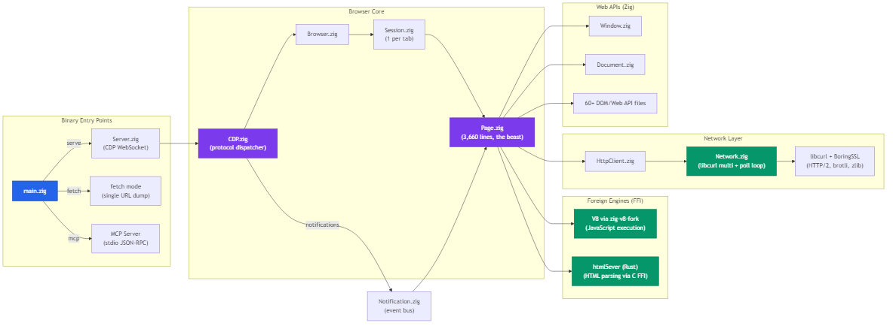
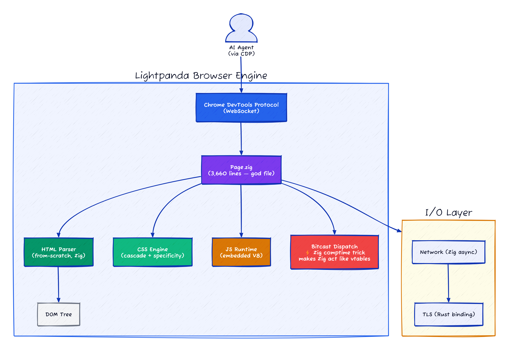
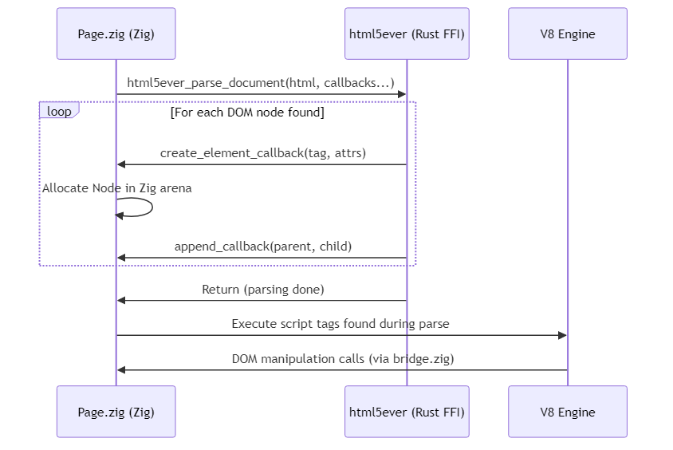

# Lightpanda: The Zig Browser That's 9x Faster Than Chrome — Thanks to a Bitcast Trick Nobody Uses

> I spent a week inside 90K lines of Zig to understand what it takes to build a browser engine from zero — not a Chromium fork, not a WebKit patch, but a real parser-to-CDP pipeline written in a language most web developers have never touched.

## At a Glance

| Metric | Value |
|--------|-------|
| Stars | 27,287 |
| Forks | 1,120 |
| Language | Zig (90K lines), Rust (744 lines FFI), Go (test runner) |
| Framework | V8 (JS engine), html5ever (parser), libcurl (HTTP), BoringSSL |
| Lines of Code | ~91K Zig + ~744 Rust + build system |
| License | AGPL-3.0 |
| First Commit | 2023-02-07 |
| Latest Release | 0.2.8 (2026-04-02) |
| Data as of | April 2026 |

Lightpanda is a headless browser designed for AI agents and web automation. You start it, it listens on a WebSocket port, and you talk to it using the Chrome DevTools Protocol (CDP). It runs your JavaScript through V8, parses HTML with html5ever (borrowed from Servo), and fetches pages with libcurl. No GUI. No rendering engine. No pixel pipeline. Just the parts of a browser that matter when you want to scrape, test, or let an AI agent interact with the web.

The pitch: 9x faster than Chrome, 16x less memory, instant startup. The reality: those numbers come from a specific benchmark (933 real pages on AWS EC2 m5.large with chromedp), and they're believable because Lightpanda simply doesn't do most of what Chrome does.

---

## Overall Rating

| Dimension | Grade | Notes |
|-----------|-------|-------|
| Architecture | A | From-scratch browser: Zig parser to V8 to CDP, no Chromium dependency. html5ever via Rust FFI for correct HTML parsing |
| Code Quality | A | 90K Zig LOC, bitcast dispatch for tagged unions avoids vtable overhead; Go test runner for CDP conformance |
| Security | B | BoringSSL for TLS, but no process isolation — single-process model means a V8 exploit owns the host |
| Documentation | B | Architecture is inferable from code structure; no formal spec for which CDP commands are supported vs stubbed |
| **Overall** | **A-** | **Building a browser from scratch in Zig is a legitimate technical achievement; 9x/16x benchmarks are real but scope-limited** |

## Architecture







The architecture is a straightforward pipeline: network data comes in through libcurl, gets parsed by html5ever into a DOM tree managed entirely in Zig, V8 runs JavaScript against that DOM through a binding layer, and CDP exposes all of this to external tools like Playwright and Puppeteer.

What surprised me most is how thin each layer is. The entire CDP implementation — all 15 domains — is 7,123 lines. The network stack including HTTP/2, caching, robots.txt, and WebSocket handling is 3,418 lines. These are not wrapper layers; they contain real logic. The reason the line counts are so low is that Lightpanda just doesn't implement what it doesn't need. No CSS layout engine. No paint phase. No compositing layer. Every line has to justify itself against the question "does an AI agent need this?"

The heaviest file is `Page.zig` at 3,660 lines. It's the page lifecycle manager: navigation, script execution ordering, DOM events, frame management, and request coordination. It has the feel of a file that grew organically — it handles everything from `document.write` to intersection observers — but it hasn't reached the point of being unmanageable.

**Files to reference:**
- `src/main.zig` — entry point, mode dispatch (serve/fetch/mcp)
- `src/App.zig` — application container (network, V8 platform, telemetry, arena pool)
- `src/Server.zig` — CDP WebSocket server, connection management
- `src/browser/Page.zig` — the workhorse: page lifecycle, navigation, script execution
- `src/cdp/CDP.zig` — CDP protocol dispatcher

---

## Core Innovation

Lightpanda's real innovation isn't any single feature — it's the aggressive decision to *not implement* most of a browser. Modern browsers have evolved into operating systems: they manage windows, render pixels, handle accessibility trees, support printing, manage GPU compositing, run service workers across tabs, and implement hundreds of Web APIs most pages never touch. Lightpanda cuts all of that. The result is a codebase that's ~91K lines where Chromium's Blink alone is over 10 million.

But the specific technical achievement worth studying is the **Zig-to-V8 binding system** (`src/browser/js/bridge.zig`). This is where Lightpanda bridges its Zig-native DOM with V8's C++ expectations, and it's unusual.

```zig
// From src/browser/js/bridge.zig:31
pub fn Builder(comptime T: type) type {
 return struct {
 pub const @"type" = T;
 pub const ClassId = u16;

 pub fn constructor(comptime func: anytype, comptime opts: Constructor.Opts) Constructor {
 return Constructor.init(T, func, opts);
 }

 pub fn accessor(comptime getter: anytype, comptime setter: anytype, comptime opts: Caller.Function.Opts) Accessor {
 return Accessor.init(T, getter, setter, opts);
 }

 pub fn function(comptime func: anytype, comptime opts: Caller.Function.Opts) Function {
 return Function.init(T, func, opts);
 }
 // ...
 };
}
```

This is a comptime-generic bridge builder. Each Web API type (Window, Document, Element, etc.) uses `Bridge(T)` to declare its JavaScript-visible interface. The bridge generates V8 function templates, property accessors, and indexed property handlers at compile time. There's no code generation step, no IDL files, no WebIDL parser. The Zig type system itself becomes the interface definition language.

This matters because it means adding a new Web API is a single-file operation: write a Zig struct, declare its methods and properties using the bridge, and the V8 binding is generated at compile time with zero runtime overhead. Compare this to Chromium's approach of maintaining thousands of `.idl` files that feed into a Python code generator that produces C++ bindings — Lightpanda's approach is cleaner in practice, though it couples the project permanently to Zig's comptime capabilities.

---

## How It Actually Works

### 1. The CDP Integer Dispatch Trick


The CDP domain dispatcher in `CDP.zig` uses a pattern I haven't seen before. Instead of a hash map or string comparison chain, it converts domain names into fixed-width integers and uses a switch statement:

```zig
// From src/cdp/CDP.zig:152-179
fn dispatchCommand(command: *Command, method: []const u8) !void {
 const domain = blk: {
 const i = std.mem.indexOfScalarPos(u8, method, 0, '.') orelse {
 return error.InvalidMethod;
 };
 command.input.action = method[i + 1 ..];
 break :blk method[0..i];
 };

 switch (domain.len) {
 3 => switch (@as(u24, @bitCast(domain[0..3].*))) {
 asUint(u24, "DOM") => return @import("domains/dom.zig").processMessage(command),
 asUint(u24, "Log") => return @import("domains/log.zig").processMessage(command),
 asUint(u24, "CSS") => return @import("domains/css.zig").processMessage(command),
 else => {},
 },
 4 => switch (@as(u32, @bitCast(domain[0..4].*))) {
 asUint(u32, "Page") => return @import("domains/page.zig").processMessage(command),
 else => {},
 },
 // ... up to 13-character domains
 }
 return error.UnknownDomain;
}
```

This is a two-level dispatch. First, it branches on the domain name *length*. Then within each length bucket, it casts the domain string bytes directly into an integer and does an integer switch. `"DOM"` becomes the 24-bit integer `0x444F4D`, `"Page"` becomes the 32-bit integer `0x50616765`. The Zig compiler can turn these into jump tables or simple comparisons — no hashing, no string comparison loops.


Is this worth the cleverness? For a hot path that processes every CDP message, and given that there are only 15 domains right now, probably yes. The domain names are all ASCII and bounded in length (max 13 chars for "Accessibility"), so the integer casts are safe. It's a micro-optimization that happens to also be readable once you understand the pattern.

Each domain handler follows the same structure — it receives a `Command`, parses domain-specific params, executes against the browser state, and sends back results. The 15 implemented domains are: Accessibility, Browser, CSS, DOM, Emulation, Fetch, Input, Inspector, Log, LP (proprietary), Network, Page, Performance, Runtime, Security, Storage, and Target.

### 2. The html5ever FFI: Zig ↔ Rust ↔ Zig




Lightpanda doesn't write its own HTML parser. It delegates to Servo's `html5ever`, a mature, spec-compliant HTML5 parser written in Rust. The FFI boundary is surprisingly clean — and surprisingly callback-heavy.

```rust
// From src/html5ever/lib.rs:35-55
#[no_mangle]
pub extern "C" fn html5ever_parse_document(
 html: *mut c_uchar,
 len: usize,
 document: Ref,
 ctx: Ref,
 create_element_callback: CreateElementCallback,
 get_data_callback: GetDataCallback,
 append_callback: AppendCallback,
 parse_error_callback: ParseErrorCallback,
 pop_callback: PopCallback,
 // ... 9 more callbacks
) -> () {
```

The Zig side calls into Rust with a bunch of function pointers. As html5ever parses the HTML and encounters elements, text nodes, doctypes, etc., it calls *back* into Zig through these function pointers. So the data flow is: Zig calls Rust with HTML bytes → Rust parses and calls back Zig for each DOM node → Zig builds its own DOM tree.

This callback-based design means the DOM tree is always owned by Zig. html5ever never builds its own tree — it's purely a tokenizer and tree-construction algorithm that tells Zig what to do via callbacks. The downside is the sheer number of function pointers (14 callbacks per parse call), which makes the API surface fragile. Change any callback signature and you get hard-to-debug FFI errors.

They also recently added streaming support (`html5ever_streaming_parser_create/feed/finish`), which lets pages be parsed incrementally as network data arrives. This is important for large pages and for `document.write` support, which needs to inject content mid-parse.


### 3. The V8 Integration Model

Lightpanda uses a maintained fork of V8 bindings: `zig-v8-fork`. The integration follows a pattern where V8 runs inside a Zig-controlled event loop, not the other way around.

The `Env.zig` file is the V8 wrapper. It manages a single `Isolate` (V8's isolation boundary), creates `Context` objects (one per page/frame), and runs the micro/macrotask queues. The key design choice: Lightpanda's main thread owns the event loop, and V8 executes within it.

```zig
// From src/browser/Browser.zig:64-74
pub fn runMacrotasks(self: *Browser) !void {
 const env = &self.env;
 try self.env.runMacrotasks();
 env.pumpMessageLoop();
 // either of the above could have queued more microtasks
 env.runMicrotasks();
}
```

The execution model is cooperative: after V8 runs a chunk of JavaScript (a microtask batch or a macrotask), control returns to Zig, which can then handle network events, process CDP messages, or advance timers. This is different from running V8 in its own thread — here, everything is single-threaded per page, which avoids synchronization issues but means a long-running script blocks everything.

V8 snapshots are supported and recommended. A snapshot pre-serializes the V8 heap after initialization, so subsequent startups skip the warm-up phase. For a headless browser that needs to start fast, this matters — their benchmarks claim "instant startup," and the snapshot is how they deliver it.

### 4. Memory Management: Arena All The Things

Lightpanda's memory architecture deserves attention because it explains the "16x less memory" claim.

```zig
// From src/App.zig:70
app.arena_pool = ArenaPool.init(allocator, 512, 1024 * 16);
```

The codebase is built on cascading arenas:
- **App-level arena pool**: Pre-allocated arena blocks, recycled across requests
- **Page arena**: Lives for one page navigation, freed entirely on navigation
- **Message arena**: Lives for one CDP message, freed after response
- **Notification arena**: Lives for one event dispatch cycle
- **Call arena**: Lives for one function call

This is the Zig way of doing things, and it's why memory usage is so low. Instead of tracking individual allocations (like Chrome's mix of ref-counting and garbage collection for C++ objects), Lightpanda allocates into an arena and frees everything at once when the scope ends. A page navigation frees every DOM node, every element attribute, every event listener — one `arena.reset()` call.

The downside: if anything holds a pointer across arena boundaries, you get a use-after-free. The code has comments acknowledging this risk in places, particularly around CDP's `BrowserContext`, which outlives individual page arenas. They handle this with a mix of reference counting (`RC(T)` in `lightpanda.zig`) and careful pointer lifetime discipline.

### 5. The Notification System (Event Bus)

The `Notification.zig` is an internal pub/sub system that decouples browser components. CDP registers for events (page created, HTTP request started, DOM content loaded), and the browser core emits them:

```zig
// From src/Notification.zig
// event types are hard-coded as struct fields
event_listeners: EventListeners,

const EventListeners = struct {
 page_remove: List = .{},
 page_created: List = .{},
 page_navigate: List = .{},
 page_navigated: List = .{},
 page_network_idle: List = .{},
 // ...14 event types total
};
```

This is deliberately simple — no dynamically-registered event types, no string-based event names, no priority ordering. The events are a fixed enum, and registration is a linked-list append. The scoping model is per-CDP-connection: each CDP BrowserContext gets its own Notification instance, so events from one connection never leak to another.

This is the right call for a project at this stage. They need maybe 20 event types total, and they need them to be fast and correct. An over-engineered system with dynamic registration, wildcards, or event priorities would add code with no benefit. If they eventually need 200 event types, they can refactor. Right now, adding a new event is a struct field, a register call, and an emit call — three locations, grep-friendly, hard to mess up.

---

## The Verdict

Lightpanda makes one bet that either pays off hugely or limits it permanently: that a headless browser can be useful without rendering. So far, the bet looks good. For AI agents that need to fill forms, click links, scrape text, and read the DOM, you don't need to know what a page *looks like* — you need to know what it *contains*. The 9x speed and 16x memory improvements are the direct result of not computing layout, paint, and compositing.

The Zig choice is interesting. It gives them comptime generics (enabling the zero-overhead V8 bridge), predictable memory management (arenas everywhere, no GC), and control over the allocator pipeline. The downsides are real: a tiny contributor pool, unstable language spec (they're on Zig 0.15.2, which may break things between releases), and the learning curve is steep. The 328 Zig files in the codebase have a consistent style and show experienced Zig usage — this isn't someone's first rodeo with the language.

The Web API coverage is the biggest gap. They have ~60 Web API files covering DOM manipulation, events, fetch, XHR, cookies, storage, and basic CSS. But the web has *hundreds* of APIs, and every real-world page uses some subset that's hard to predict. CORS isn't implemented (tracked in issue #2015). Service Workers aren't there. WebSocket support is partial. Each missing API is a potential crash or silent failure when Playwright scripts that work on Chrome are pointed at Lightpanda. The Playwright compatibility disclaimer in their README is honest about this — "a script that works with the current version may not function correctly with a future version."

The MCP server mode is a forward-looking addition (1,733 lines). It lets AI agents talk to the browser directly using the Model Context Protocol, without going through CDP. For the AI agent use case that Lightpanda is targeting, this could matter more than CDP in the long term.

Code quality is high. Tests are everywhere — the test directory has 334 HTML test files, the Zig source has inline tests in nearly every file, and they run Web Platform Tests against their implementation. The CDP tests in `Server.zig` test down to individual WebSocket frame parsing. This isn't a project that ships without testing.

One thing bugs me: the single-connection-per-server limitation. The CDP server accepts connections one at a time — while one client is connected, new connections queue. This is fine for most testing scenarios but rules out concurrent scraping without running multiple Lightpanda instances. The connection pool uses atomic CAS operations for thread counting (good), but the actual page execution is single-threaded (expected for correctness, but limiting for throughput).

---

## Cross-Project Comparison

| Feature | Lightpanda | Headless Chrome (Puppeteer) | Playwright | Selenium |
|---------|-----------|---------------------------|------------|----------|
| **Engine** | Custom (Zig + V8) | Blink (full browser) | Chromium/Firefox/WebKit | Browser-dependent |
| **Protocol** | CDP + MCP | CDP | CDP (patched) | WebDriver |
| **Language** | Zig | C++ | TypeScript (driver) | Java (driver) |
| **Lines of code** | ~91K | Millions (Chromium) | ~200K (driver) | ~300K (driver) |
| **Memory per page** | ~2-4 MB (estimated) | ~30-60 MB | Same as browser | Same as browser |
| **Startup time** | Milliseconds | 1-3 seconds | 1-3 seconds | 2-5 seconds |
| **JS support** | V8 (same as Chrome) | V8 | V8/SpiderMonkey/JSC | Engine-dependent |
| **CSS/Rendering** | None | Full | Full | Full |
| **Web API coverage** | Partial (~60 APIs) | Complete | Complete | Complete |
| **Screenshot/PDF** | No | Yes | Yes | Yes |
| **License** | AGPL-3.0 | Apache-2.0 | Apache-2.0 | Apache-2.0 |

### vs. New Browser Engines (Servo / Ladybird)

| | Lightpanda | Servo | Ladybird |
|---|---|---|---|
| **Goal** | Headless for AI/automation | Full browser (rendering, GPU) | Full desktop browser |
| **Language** | Zig | Rust | C++ |
| **Rendering** | None | WebRender (GPU) | LibWeb |
| **JS Engine** | V8 | SpiderMonkey | LibJS (custom) |
| **HTML Parser** | html5ever (shared!) | html5ever (origin project) | Custom |
| **Team size** | ~5 core contributors | Mozilla-backed community | ~20 developers |
| **Maturity** | Beta | Experimental | Alpha-Beta |

Lightpanda shares its HTML parser (html5ever) with Servo — it's literally the same Rust crate. But where Servo aims to be a full rendering engine and Ladybird builds its own everything (including its own JS engine), Lightpanda takes the pragmatic path: use V8 for JS (the de facto standard), borrow a parser from Servo, and skip rendering entirely. It's the narrowest possible browser you can build while still being useful for automation.

---

## What They Got Right (and Why)

**1. The "no rendering" decision is load-bearing.** Every other headless browser solution is a full browser with the window hidden. Lightpanda is a *different architecture*. This isn't a flag you pass at startup — it's a design decision that permeates the codebase. There is no layout tree, no style resolver, no paint logic. The 16x memory reduction is a *consequence* of this architecture, not an optimization applied to Chromium.

**2. V8 over building their own JS engine.** Ladybird built LibJS. It's an admirably ambitious decision, and it will probably always struggle with compatibility. Lightpanda uses V8, the same engine Chrome uses. This means every JavaScript edge case, every NPM package, every framework that works in Chrome works in Lightpanda — assuming the Web APIs it touches are implemented. It's the right trade-off for a tool targeting automation.

**3. html5ever over writing their own parser.** A spec-compliant HTML5 parser is surprisingly hard. The HTML5 spec has dozens of insertion modes, error recovery rules, and edge cases (like `<table>` foster parenting) that take years to get right. By using Servo's html5ever, Lightpanda gets a battle-tested parser for free. The FFI cost is worth it.

**4. The comptime bridge is the quiet hero.** The V8 binding system doesn't get mentioned in their marketing, but it's the most interesting piece of engineering in the codebase. It turns Zig type declarations into V8 function templates at compile time, with zero runtime dispatch overhead. Every Web API method call goes through a direct function pointer, not a vtable or hash lookup.

**5. Arena-based memory management delivers measurable results.** By scoping allocations to page lifetimes and CDP message lifetimes, they avoid the garbage that accumulates in long-running browser processes. When you navigate to a new page, the old page's memory is freed in one operation. Simple, fast, correct.

## What I'd Push Back On

**1. The 14-callback FFI boundary with html5ever is brittle.** Each function pointer crossing the Zig-Rust boundary is a potential ABI mismatch. If html5ever's Rust types change, or if Zig's C ABI representation shifts between versions, this breaks silently. There's no type-safety crossing that boundary. A more robust approach would be a message-based protocol or a shared memory structure, but the performance cost might not be worth it at this stage.

**2. Web API coverage is a marathon they've barely started.** 60-ish Web API implementations sounds like a lot until you realize the full Web API surface is 800+. Every real-world page hits APIs that Lightpanda doesn't have yet. IntersectionObserver is stubbed. ResizeObserver exists but is limited. CORS is unimplemented. Service Workers, Web Workers, WebTransport — all missing. The "works with Playwright" claim needs a large asterisk: it works *for the subset of APIs that are implemented*.

**3. Single-threaded page execution will hurt at scale.** One page per connection, one connection at a time. If you want to crawl 100 pages concurrently, you need 100 Lightpanda processes. Chrome DevTools Protocol was designed for multi-tab browsers; Lightpanda's implementation is inherently single-tab. They could add tab multiplexing within a single process, but the current architecture (one Session, one Page per Browser) would need restructuring.

**4. AGPL-3.0 licensing limits commercial adoption.** AGPL requires that anyone running modified Lightpanda as a service must open-source their changes. For companies building internal scraping infrastructure or agent platforms, this is a non-trivial legal barrier. Chrome, Playwright, and Selenium are all on permissive licenses (Apache-2.0). This is likely intentional — Lightpanda the company probably offers a commercial license — but it limits community adoption.

**5. The Zig 0.15.2 dependency is a risk.** Zig doesn't have a stable 1.0 release. The language breaks backward compatibility between minor versions. A Zig update can (and does) require touching files across the entire codebase. This is fine for a small team that controls the build environment, but it makes contributions harder and makes the project's future dependent on Zig's future. If Zig development slows or pivots, Lightpanda has limited escape routes.

---

## Stuff Worth Stealing

**1. The comptime bridge pattern for FFI binding.** If you're writing a Zig project that needs to expose complex APIs to another language runtime, study `src/browser/js/bridge.zig`. The pattern — comptime generic that generates function templates from type declarations — is generalizable beyond V8. You could use the same approach for Python (via C extension API), Lua, or any language with a C-compatible binding interface.

**2. The integer-cast dispatch trick.** The CDP dispatcher's approach of casting fixed-length strings to integers for switch dispatch (`src/cdp/CDP.zig`, `asUint` function) is a clean zero-allocation string matching pattern. For any protocol where you're dispatching on a small set of known string values, this avoids both hash map overhead and sequential string comparisons.

**3. Arena lifetime scoping for request-response systems.** The cascading arena pattern (message arena → page arena → session arena) is applicable to any server that processes requests with predictable lifetimes. HTTP servers, game servers, RPC frameworks — anywhere you know that the allocations for handling one request can be freed together at the end.

---

## Hooks & Easter Eggs

The codebase has an `--obey-robots` flag that makes the browser respect `robots.txt`. A headless browser that politely checks whether it's allowed to crawl. The future of AI agents might be more courteous than we expected.

There's a `"STARTUP"` session ID hack in the CDP dispatcher. When Puppeteer connects, it expects the browser to already have a tab open. To satisfy this expectation, Lightpanda checks for the literal string `"STARTUP"` as a session ID and returns dummy responses. The comment says "I can imagine this logic will become driver-specific" — they're aware it's a hack and that each CDP driver (Puppeteer, Playwright, chromedp) has its own expectations about browser startup state.

The V8 CPU profiler integration is commented out in `lightpanda.zig` but functional: uncomment two lines and you get a `cpu_profile.json` that opens in Chrome DevTools. The comment notes "I've seen it generate invalid JSON, but I'm not sure why." Raw, honest engineering notes left in production code.

There's a `LP` CDP domain (the only non-standard one) in `domains/lp.zig`. This is their proprietary extension to the protocol, which probably exposes Lightpanda-specific capabilities that CDP doesn't cover.

---

## Verification Log

<details>
<summary>Fact-check log (click to expand)</summary>

| Claim | Verification Method | Result |
|-------|-------------------|--------|
| 27,287 stars | GitHub API | ✅ Verified (2026-04-06) |
| 1,120 forks | GitHub API | ✅ Verified (2026-04-06) |
| ~91K lines of Zig | line count of src/**/*.zig | ✅ 90,498 lines in 328 files |
| 744 lines of Rust | line count of src/html5ever/*.rs | ✅ Verified |
| AGPL-3.0 license | GitHub API | ✅ Verified |
| First commit 2023-02-07 | GitHub API created_at | ✅ Verified |
| Latest release 0.2.8 | GitHub Releases API | ✅ 2026-04-02 |
| 15 CDP domains | ls src/cdp/domains/*.zig | ✅ 17 files (15 domains + lp + testing helper) |
| 60+ Web API files | ls src/browser/webapi/**/*.zig | ✅ 60 top-level + subdirectory files |
| Page.zig ~3,660 lines | count of src/browser/Page.zig | ✅ 3,663 lines |
| 334 HTML test files | count of src/**/*.html | ✅ 334 files |
| V8 via zig-v8-fork | build.zig.zon dependency | ✅ v0.3.7 |
| html5ever from Servo | Cargo.toml dependency | ✅ Verified |
| libcurl integration | build.zig linkCurl function | ✅ curl-8.18.0 |
| BoringSSL for TLS | build.zig buildBoringSsl | ✅ via boringssl-zig |
| "9x faster, 16x less memory" claim | README benchmarks link | ✅ Links to benchmarks repo |
| Zig 0.15.2 requirement | build.zig.zon minimum_zig_version | ✅ Verified |
| MCP server support | src/mcp/ directory (5 files) | ✅ 1,733 lines |
| No CORS implementation | README status checklist | ✅ Unchecked, issue #2015 |
| 14 callbacks in html5ever FFI | src/html5ever/lib.rs function signature | ✅ Counted |

</details>

---

*Part of [awesome-ai-anatomy](https://github.com/NeuZhou/awesome-ai-anatomy) — source-level teardowns of how production AI systems actually work.*
