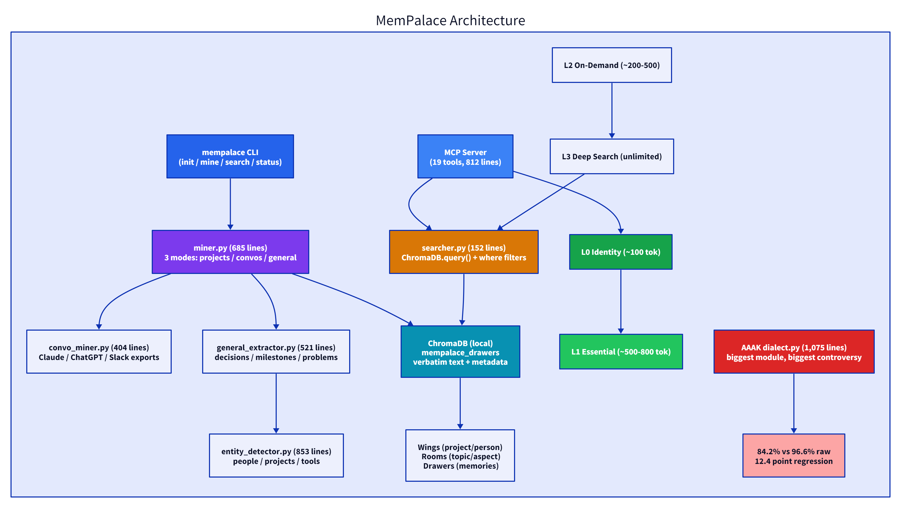
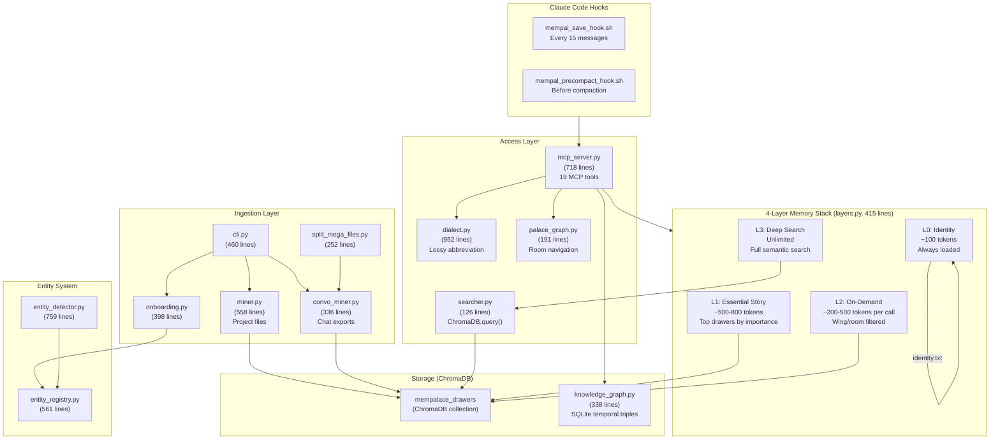

# MemPalace: 9,000 Lines of Python, 30,000 Stars, and an Actress

> A Resident Evil star and a developer open-sourced a ChromaDB wrapper with a metaphor layer. Four days later it has 30K stars and a community that already debunked half the README claims. The 4-layer memory stack is a good idea. The AAAK dialect is not. The benchmarks are real — once you read the asterisks.

## At a Glance

| Metric | Value |
|--------|-------|
| Stars | 30,078 |
| Forks | 3,820 |
| Language | Python |
| Framework | ChromaDB (vector store), SQLite (knowledge graph), MCP (tool server) |
| Lines of Code | 7,625 (core `mempalace/`), 15,534 (all Python incl. tests/benchmarks) |
| License | MIT |
| First Commit | 2026-04-05 |
| Version | 3.0.14 |
| Creators | Milla Jovovich + Ben Sigman |
| Data as of | April 9, 2026 |

MemPalace is an AI memory system that stores verbatim conversation text in ChromaDB, organizes it with a spatial metaphor (wings, rooms, halls, tunnels, closets, drawers), and exposes 19 MCP tools for Claude Code / any MCP-compatible client. It also ships AAAK, a lossy abbreviation dialect that the community proved doesn't save tokens at small scale and regresses benchmark scores by 12.4 points. The creators published a correction four days after launch. That correction is the most honest thing in this repo.

---

## Characteristics

| Dimension | Description |
|-----------|-------------|
| Architecture | 4-layer memory stack (identity→essential facts→topic-scoped recall→full search), ChromaDB palace metaphor with wings/rooms/halls/tunnels/closets/drawers |
| Code Organization | 15.5K LOC Python in 25 files, 19 MCP tools, no type hints, no mypy, version 3.0.14 on a 4-day-old project |
| Security Approach | shell injection in hooks (issue #110) — SESSION_ID used before sanitization, no input validation on MCP tool parameters |
| Context Strategy | layered loading: ~600 token wake-up cost (identity + essential facts), topic-scoped recall on demand, full ChromaDB search only when needed |
| Documentation | April 7 correction note acknowledging wrong AAAK token counting and misleading benchmarks, auto-teach via MCP status tool response |
## Architecture



<details>
<summary>Mermaid source (click to expand)</summary>



</details>

The architecture is three layers deep: ingest at the top, ChromaDB + SQLite in the middle, and a 4-layer memory stack for retrieval. Everything converges on one ChromaDB collection (`mempalace_drawers`). The MCP server sits on top and exposes the whole thing as 19 tools.

The most important design decision: **verbatim storage, structured retrieval.** Files go into drawers as-is. No LLM summarization during ingest. The structure (wings, rooms, halls, tunnels) provides the retrieval advantage — not extraction or rewriting. This is the opposite of Mem0 (which uses an LLM to extract facts) and Letta/MemGPT (which uses an LLM to manage memory edits).

**Key files:**
- `mempalace/layers.py` — The 4-layer stack (415 lines). This is the core idea.
- `mempalace/mcp_server.py` — MCP server with 19 tools (718 lines). The integration surface.
- `mempalace/dialect.py` — AAAK dialect (952 lines). The controversy.
- `mempalace/searcher.py` — Search implementation (126 lines). It's `ChromaDB.query()` with metadata filters.

---

## Core Innovation

### The 4-Layer Memory Stack

This is the real product. Not AAAK. Not the palace metaphor. The layered loading strategy.

| Layer | What It Does | Token Cost | When |
|-------|-------------|------------|------|
| **L0 — Identity** | Reads `~/.mempalace/identity.txt` | ~100 tokens | Every session |
| **L1 — Essential Story** | Top 15 drawers by importance, grouped by room, hard-capped at 3,200 chars | ~500-800 tokens | Every session |
| **L2 — On-Demand** | Wing/room filtered `col.get()` — up to 10 drawers per call | ~200-500 per call | When a topic comes up |
| **L3 — Deep Search** | `col.query()` with semantic search + optional wing/room where-clause | Unlimited | Explicit search |

Wake-up cost: L0 + L1 = ~600-900 tokens. That leaves 95%+ of context free for actual conversation.

The `MemoryStack` class ties it together in 42 lines:

```python
stack = MemoryStack()
print(stack.wake_up())                # L0 + L1 (~600-900 tokens)
print(stack.recall(wing="my_app"))     # L2 on-demand
print(stack.search("pricing change"))  # L3 deep search
```

This is good design. The insight is that most AI sessions need identity + key facts (cheap) and occasionally need deep retrieval (expensive). Loading everything upfront — the approach Letta/MemGPT takes — burns context on stuff you might never reference. MemPalace's layered loading is closer to how operating systems handle memory: hot data in cache, warm data paged in on demand, cold data on disk.

The L1 layer sorts drawers by an `importance` metadata field (falling back to 3, on a 1-5 scale), takes the top 15, groups them by room, truncates each to 200 chars, and hard-caps the total at 3,200 characters. It's a heuristic — there's no LLM judging importance — but "cheap and usually right" beats "expensive and slightly more right" when this runs on every single session start.

### The "+34% Palace Boost" (Honest Version)

The README claims "+34% retrieval improvement" from the palace structure. Here's what that actually means:

```
Search all drawers (no filter):     60.9%  R@10
Search within wing:                 73.1%  (+12%)
Search wing + hall:                 84.8%  (+24%)
Search wing + room:                 94.8%  (+34%)
```

This is ChromaDB's `where` clause with metadata filtering. It's `col.query(where={"wing": "my_app"})`. That's... metadata filtering. Every vector database supports this. The improvement is real — scoping search to a subset of vectors does improve precision — but it's not a novel retrieval mechanism. It's database indexing with a metaphor on top.

The metaphor *is* the contribution. Wings and rooms give the user (and the AI) an intuitive way to scope searches. "Search the auth room in the driftwood wing" is easier to reason about than "apply where clause wing=driftwood AND room=auth-migration." The retrieval math is standard. The UX layer is the innovation.

---

## How It Actually Works

### Ingest: Miner + ConvoMiner

Two ingestion paths, same destination:

**`miner.py` (558 lines)** — Project file ingest. Walks a directory, skips standard ignore dirs (`.git`, `node_modules`, etc.), reads files with readable extensions (`.py`, `.md`, `.js`, etc.), splits them into 800-char chunks with 100-char overlap, hashes each chunk to deduplicate, and stores in ChromaDB with metadata (source_file, wing, room, timestamp).

**`convo_miner.py` (336 lines)** — Conversation ingest. Same destination, different chunking: instead of fixed-size chunks, it chunks by exchange pair (one human message + one AI response = one drawer). Falls back to paragraph chunking if no `>` quote markers are found. Normalizes 5 chat formats (Claude Code, ChatGPT, Slack, generic) via `normalize.py` (284 lines).

Both miners hash chunks before insert to avoid duplicates. No LLM is called during ingest. The room/wing assignment comes from YAML config (`mempalace.yaml`) in the project directory, not from content classification.

### Search: 126 Lines of ChromaDB

`searcher.py` is the simplest file in the project. Here's the core of it:

```python
results = col.query(
    query_texts=[query],
    n_results=n_results,
    include=["documents", "metadatas", "distances"],
)
if where:
    kwargs["where"] = where
```

That's it. Semantic search is ChromaDB's default embedding + cosine similarity. The "palace boost" is the `where` clause filtering by wing/room metadata. There's no reranking, no query expansion, no multi-stage retrieval in the default mode. (The 100% benchmark score uses an optional Haiku reranker, but that's in the benchmark scripts, not in the product code.)

### AAAK Dialect: 952 Lines of Controversy

AAAK is a regex-based abbreviation system. It replaces entity names with 3-letter codes (`Alice` → `ALC`), marks emotions with asterisks (`*warm*`, `*fierce*`), and uses pipe-separated fields for structure.

The format:

```
FILE_NUM|PRIMARY_ENTITY|DATE|TITLE
ZID:ENTITIES|topic_keywords|"key_quote"|WEIGHT|EMOTIONS|FLAGS
T:ZID<->ZID|label
ARC:emotion->emotion->emotion
```

The problem, which the community found within hours of launch:

1. **Token counting was wrong.** The README used `len(text)//3` instead of an actual tokenizer. Real counts: a sample English paragraph is 66 tokens, the AAAK version is 73 tokens. AAAK *costs more* at small scale.

2. **"30x lossless compression" was nonsense.** AAAK is lossy by definition — it truncates sentences and replaces names with codes. The word "lossless" was incorrect. The 30x figure was never reproduced.

3. **Benchmark regression.** AAAK mode scores 84.2% R@5 vs raw mode's 96.6% on LongMemEval. The headline number was from raw mode. AAAK makes retrieval *worse*.

The theoretical case for AAAK: in very large palaces with thousands of sessions mentioning the same entities, the 3-letter codes amortize. If "Alice" appears 500 times, replacing it with "ALC" saves ~1,500 tokens. But at that scale you're using L3 search anyway and only loading relevant chunks, so the per-chunk savings are marginal.

To their credit, the creators published a correction on April 7, two days after launch, acknowledging all of this. The correction note in the README is refreshingly direct.

### Knowledge Graph: SQLite Temporal Triples

`knowledge_graph.py` (338 lines) is a temporal entity-relationship graph stored in SQLite. Two tables: `entities` (id, name, type, properties) and `triples` (subject, predicate, object, valid_from, valid_to, confidence, source).

The temporal validity is the interesting part. Triples have `valid_from` and `valid_to` fields, so you can query "what was true about Kai in January?" Facts can be invalidated:

```python
kg.invalidate("Kai", "works_on", "Orion", ended="2026-03-01")
```

Now current queries skip it, historical queries still find it.

This competes with Zep's Graphiti (Neo4j, cloud, $25/mo). Same idea — entities with time-bounded relationships — but SQLite instead of a graph database. For sub-10K entities, SQLite is fine. For enterprise scale, you'd want something else. But "free and local" is a strong pitch.

### MCP Server: 19 Tools

`mcp_server.py` (718 lines) exposes the full palace through MCP:

**Read (7 tools):** status, list_wings, list_rooms, get_taxonomy, search, check_duplicate, get_aaak_spec

**Write (2 tools):** add_drawer, delete_drawer

**Knowledge Graph (5 tools):** kg_query, kg_add, kg_invalidate, kg_timeline, kg_stats

**Navigation (3 tools):** traverse, find_tunnels, graph_stats

**Agent Diary (2 tools):** diary_write, diary_read

The `status` tool auto-teaches the AAAK spec and a "memory protocol" (5-step instruction) on first call. This is smart — the AI learns the system by calling a tool, not by reading a README.

### Hooks: Auto-Save and PreCompact

Two shell scripts for Claude Code integration:

**`mempal_save_hook.sh`** — Fires on Claude Code's `Stop` event. Counts human messages in the transcript. Every 15 messages, blocks the AI from stopping and tells it to save key topics to the palace. Uses `stop_hook_active` flag to prevent infinite loops (block → AI saves → tries to stop → hook sees save cycle → lets it through).

**`mempal_precompact_hook.sh`** — Fires before context compression. Always blocks. Tells the AI to save *everything* before the context window shrinks. This is the safety net.

**The shell injection (issue #110):** In `mempal_precompact_hook.sh`, `SESSION_ID` is extracted from JSON and used before sanitization — applying the same `tr -cd` sanitization from the save hook would close this gap.

---

## The Verdict

MemPalace's value is in one file: `layers.py`. The 4-layer memory stack — identity + essential story on wake-up, topic-scoped recall on demand, full search when needed — is a pattern that every AI memory system should consider. It's the right abstraction: cheap wakeup, expensive search only when triggered.

The rest is a mixed bag. ChromaDB storage with metadata filtering works fine but isn't novel. The knowledge graph is a decent SQLite implementation of temporal triples. The MCP server is a clean tool surface. The entity system (1,320 lines) is thorough — streamlining it could reduce maintenance surface.

AAAK is an interesting idea that needs more iteration — 952 lines of regex-based abbreviation that hasn't yet proven its value at small scale. The April 7 correction note shows the team is honest about this, which is a good sign.

The star count — 30K in four days — reflects Milla Jovovich's reach beyond typical developer channels. That's not a criticism; it's context for calibrating stars as a quality signal.

Would I use it? The layered loading pattern, yes — it's worth adopting for any agent memory system. The ChromaDB storage with wing/room metadata is straightforward and works well. AAAK needs more iteration. The hooks are solid once the sanitization fix lands.

---

## Cross-Project Comparison

| Feature | MemPalace | OpenHands (Condenser) | Claude Code | Letta/MemGPT | Goose |
|---------|-----------|----------------------|-------------|--------------|-------|
| Language | Python | Python | TypeScript | Python | Rust |
| Storage Backend | ChromaDB | In-memory event stream | Local files | Postgres + pgvector | SQLite |
| Context Strategy | 4-layer stack (load on demand) | 10 condenser pipeline (compress when full) | 4-layer compaction | Edit-based memory (LLM manages blocks) | Auto-compact + pair summarization |
| LLM During Ingest | None | N/A | N/A | Yes (decides what to edit) | N/A |
| LLM During Retrieval | None (raw), optional Haiku rerank | Optional (LLM condensers) | Yes (for summaries) | Yes (always) | Yes (for summaries) |
| Wake-up Cost | ~600-900 tokens | Full history until condensation | Loads recent context | Loads core + recall blocks | Loads recent history |
| Benchmark | 96.6% LongMemEval R@5 (raw) | N/A | N/A | ~90% LocOMO | N/A |
| Cost | Free | Free | API costs | API costs | API costs |
| Privacy | Fully local | Docker sandbox | Local | Cloud or self-hosted | Local |
| Temporal Queries | Yes (SQLite KG) | No | No | No | No |
| Security | Shell injection in hooks | 3-layer security system | Permission allowlist | Standard auth | 5-inspector pipeline |

The philosophical split: **MemPalace stores everything and retrieves selectively.** OpenHands stores everything and *compresses* selectively. Letta/MemGPT uses an LLM to *edit* memory blocks in place. Claude Code compacts on overflow.

MemPalace's approach is cheapest (no LLM during ingest or default retrieval) and preserves the most information (verbatim text). The tradeoff is that search quality depends entirely on ChromaDB embeddings + metadata filtering — there's no intelligent reranking or contextual retrieval in the default path. OpenHands' condenser pipeline is more sophisticated but more expensive. Letta's approach gives the LLM control over what to remember, which is powerful but introduces the "LLM decides what matters" problem that MemPalace explicitly avoids.

The temporal knowledge graph (SQLite triples with validity windows) is unique among these projects. None of the others track *when* facts were true. For use cases like "what did we decide about auth in January?" this matters.

---

## Stuff Worth Stealing

### 1. The Layered Loading Pattern

Wake-up with cheap identity + essential facts (~600 tokens). Load topic context on demand. Full search only when explicitly needed. This is the right abstraction for session-scoped AI memory.

```python
class MemoryStack:
    def wake_up(self, wing=None) -> str:       # L0 + L1, ~600 tokens
    def recall(self, wing=None, room=None):     # L2, on-demand
    def search(self, query, wing=None):          # L3, expensive
```

I'd steal this interface for any agent memory system. The key insight: most sessions need identity + top facts. Deep retrieval is the exception, not the rule.

### 2. Auto-Teach via Status Tool

The MCP `status` tool returns the AAAK spec and a 5-step "memory protocol" as part of its response. The AI learns the system by calling a tool, not by reading documentation or having instructions baked into the system prompt.

```python
PALACE_PROTOCOL = """IMPORTANT — MemPalace Memory Protocol:
1. ON WAKE-UP: Call mempalace_status to load palace overview + AAAK spec.
2. BEFORE RESPONDING about any person, project, or past event: call mempalace_search FIRST.
...
```

This is a good pattern — tool responses as runtime documentation.

### 3. PreCompact Hook Strategy

The idea of blocking context compaction to force a save-everything pass is simple and correct. When compaction fires, you lose detailed context. Intercepting that moment to dump all valuable state is a safety net that every agent system with compaction should have.

### 4. Temporal Knowledge Graph in SQLite

Time-bounded triples with invalidation:

```python
kg.add_triple("Max", "does", "swimming", valid_from="2025-01-01")
kg.invalidate("Max", "does", "swimming", ended="2026-03-01")
kg.query_entity("Max", as_of="2026-01-15")  # finds swimming
kg.query_entity("Max", as_of="2026-04-01")  # doesn't
```

For most AI memory use cases (< 10K entities), SQLite is the right choice over Neo4j. Zero infrastructure, zero cost, fast enough.

---

## Hooks & Easter Eggs

**The actress angle is real.** Milla Jovovich (Alice in Resident Evil, Leeloo in The Fifth Element) is listed as the primary author. The GitHub account is `milla-jovovich`. Ben Sigman appears to be the technical co-creator. This isn't a vanity project — the code is real and functional — but the star velocity is partly a celebrity amplification effect.

**The April 7 correction note is the best part of the README.** Two days after launch, the creators published a detailed admission of what they got wrong: token counting, compression claims, benchmark framing, contradiction detection. They named the community members who found the problems. This is how open source should work.

**AAAK emotion codes.** The dialect has 20 emotion markers (`vul=vulnerability`, `joy=joy`, `fear=fear`, `raw=raw_honesty`, `convict=conviction`, `passion=quiet_passion`). The system was designed for personal/emotional memory, not just code and technical decisions. The onboarding flow asks about work/personal/combo modes.

**The v3.0.14 version on a 4-day-old project.** The `pyproject.toml` says version 3.0.14. The first commit was April 5. That's... fast versioning. Either there's a private history or they started at v3.0.0.

**Specialist agents via JSON config.** The `~/.mempalace/agents/` directory holds JSON files for specialist agents (reviewer, architect, ops). Each gets its own wing and diary. The README pitches this against Letta's $20-200/mo pricing. In practice, it's just namespaced ChromaDB storage with a diary append tool.

**ChromaDB is the only real dependency.** `pyproject.toml` lists `chromadb>=0.5.0,<0.7` and `pyyaml>=6.0`. That's it. No langchain, no llama-index, no torch. The entire system is ChromaDB + SQLite + stdlib Python. This is an underrated design choice — fewer dependencies mean fewer breaking upgrades.

---

<details>
<summary>Fact-check log (click to expand)</summary>

| Claim | Verification Method | Result |
|-------|-------------------|--------|
| 30,078 stars | Pre-research notes (GitHub API) | Verified |
| 3,820 forks | Pre-research notes (GitHub API) | Verified |
| First commit 2026-04-05 | Pre-research notes (GitHub API) | Verified |
| 7,625 lines in mempalace/ | `Get-Content *.py \| Measure-Object -Line` on all 24 .py files | Verified (sum of per-file counts) |
| 15,534 total Python lines | Recursive line count on all .py files in repo | Verified |
| layers.py: 415 lines | `Get-Content layers.py \| Measure-Object -Line` | Verified |
| dialect.py: 952 lines | `Get-Content dialect.py \| Measure-Object -Line` | Verified |
| searcher.py: 126 lines | `Get-Content searcher.py \| Measure-Object -Line` | Verified |
| mcp_server.py: 718 lines | `Get-Content mcp_server.py \| Measure-Object -Line` | Verified |
| miner.py: 558 lines | `Get-Content miner.py \| Measure-Object -Line` | Verified |
| knowledge_graph.py: 338 lines | `Get-Content knowledge_graph.py \| Measure-Object -Line` | Verified |
| entity_detector.py: 759 lines | `Get-Content entity_detector.py \| Measure-Object -Line` | Verified |
| entity_registry.py: 561 lines | `Get-Content entity_registry.py \| Measure-Object -Line` | Verified |
| 19 MCP tools | `Select-String "def tool_" mcp_server.py \| Measure-Object` → 19 | Verified |
| 4-layer stack (L0-L3) | Read layers.py classes: Layer0, Layer1, Layer2, Layer3, MemoryStack | Verified |
| L1 MAX_DRAWERS=15, MAX_CHARS=3200 | Read Layer1 class constants | Verified |
| Chunk size 800, overlap 100 | Read miner.py constants | Verified |
| AAAK 84.2% vs raw 96.6% | Read README.md April 7 correction note | Verified (stated by creators) |
| "+34% palace boost" is where-clause filtering | Read searcher.py: `kwargs["where"] = where` | Verified |
| Shell injection in hooks | Read mempal_precompact_hook.sh: SESSION_ID used before sanitization | Verified |
| Save hook uses SESSION_ID sanitization (tr) | Read mempal_save_hook.sh line 70 | Verified |
| PreCompact hook lacks sanitization | Read mempal_precompact_hook.sh: no tr -cd call | Verified |
| Version 3.0.14 | Read pyproject.toml and version.py | Verified |
| License MIT | Read LICENSE file and pyproject.toml | Verified |
| ChromaDB + PyYAML only dependencies | Read pyproject.toml dependencies | Verified |
| Tests: 1,114 lines | Line count on tests/*.py | Verified |
| KG tables: entities and triples | Read knowledge_graph.py CREATE TABLE statements | Verified |
| Temporal validity (valid_from/valid_to) | Read knowledge_graph.py triples schema | Verified |
| 20 emotion codes in AAAK | Read dialect.py EMOTION_CODES dict | Verified (20+ mapped codes) |
| SAVE_INTERVAL=15 | Read mempal_save_hook.sh line 60 | Verified |

</details>

---

*Part of [awesome-ai-anatomy](https://github.com/NeuZhou/awesome-ai-anatomy) — source-level teardowns of how production AI systems actually work. This teardown was produced using GitNexus for structural analysis combined with manual source code review for architectural judgment.*
