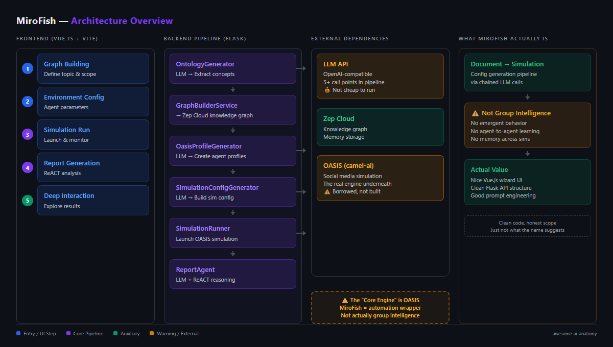
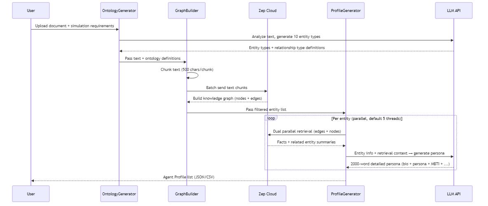
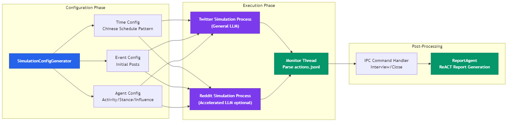

# MiroFish: 50K Stars for "Collective Intelligence" — But There's Zero Collective Intelligence Inside

> I expected to find some clever collective intelligence algorithm — particle swarm, ant colony, or at least some evolutionary computation variant. Cloned the repo, read the code. The core prediction capability runs entirely on LLM role-playing + social media simulation. That finding made me rethink what "collective intelligence" means in 2026.

## At a Glance

| Metric | Value |
|--------|-------|
| Stars | 50,223 |
| Forks | 7,385 |
| Language | Python (backend) + Vue.js (frontend) |
| Framework | Flask + OASIS (camel-ai) + Zep Cloud |
| Lines of Code | ~38,800 (Python 20,025 + Vue/JS 18,790) |
| License | AGPL-3.0 |
| First Commit | 2025-11-26 (repo created) |
| Latest Commit | 2026-04-02 |
| Data as of | April 2026 |

What MiroFish does, in plain terms: you feed it a document (news article, policy draft, novel chapter), it uses an LLM to extract people and organizations, generates a "social media persona" for each character, throws these LLM-driven agents into a simulated Twitter/Reddit environment to interact for N rounds, then compiles the interaction logs into a "future prediction report."

---

## Overall Rating

| Dimension | Grade | Notes |
|-----------|-------|-------|
| Architecture | C+ | Core simulation outsourced to OASIS (camel-ai); MiroFish is a Flask wrapper with 5+ sequential LLM call points |
| Code Quality | C | 38.8K LOC; encoding hacks for Windows (force UTF-8 at startup), OASIS integration is brittle |
| Security | D | No input sanitization on user-uploaded documents fed directly to LLM prompts; no auth layer |
| Documentation | C | README markets "collective intelligence" but the code is LLM role-playing with no algorithmic backing |
| **Overall** | **C** | **50K stars for a Flask+OASIS wrapper; the "simulation to prediction" leap has no methodological support** |

## Architecture





MiroFish's architecture breaks into three layers: the outermost is a Vue.js step-by-step wizard UI bundled with Vite, the middle layer is a Flask API, and the bottom layer is a chain of LLM calls.

The project's "core engine" doesn't live in MiroFish's own code. The actual agent social simulation is handled by OASIS (from the camel-ai team). MiroFish wraps an automation layer on top of OASIS — a "document-to-simulation" pipeline. There are at least 5 independent LLM call points in the pipeline: ontology generation, profile generation, simulation config generation, agent behavior decisions during simulation, and report generation. Each step is one or more LLM API requests. Running a full simulation won't be cheap.

The file structure is clean, though. `backend/app/services/` has one file per pipeline stage, `backend/scripts/` holds the OASIS simulation launch scripts. Frontend and backend are fully separated, communicating via REST API.

**Files to reference:**
- `backend/run.py` — Flask app entry point
- `backend/app/services/graph_builder.py` — Zep knowledge graph construction
- `backend/app/services/simulation_runner.py` — OASIS simulation run manager (longest file, 700+ lines)
- `backend/app/services/report_agent.py` — ReACT report generation (most complex file, 1400+ lines)
- `backend/scripts/run_parallel_simulation.py` — Dual-platform parallel simulation script (900+ lines)

---

## Core Innovation

MiroFish's core selling point isn't algorithmic innovation — it's **packaging LLM-driven multi-agent social simulation into an end-to-end "prediction" product**. Its engineering contribution: wiring up the entire chain from "upload document → extract entities → generate personas → configure simulation → run simulation → generate report" into a flow that previously required tons of manual work.

The most interesting design is the "secondary retrieval" mechanism during profile generation:

```python
# From backend/app/services/oasis_profile_generator.py:283
def _search_zep_for_entity(self, entity: EntityNode) -> Dict[str, Any]:
 """
 Use Zep graph hybrid search to retrieve rich entity information
 """
 comprehensive_query = t('progress.zepSearchQuery', name=entity_name)
 
 def search_edges():
 """Search edges (facts/relationships) - with retry"""
 return self.zep_client.graph.search(
 query=comprehensive_query,
 graph_id=self.graph_id,
 limit=30,
 scope="edges",
 reranker="rrf"
 )
 
 def search_nodes():
 """Search nodes (entity summaries) - with retry"""
 return self.zep_client.graph.search(
 query=comprehensive_query,
 graph_id=self.graph_id,
 limit=20,
 scope="nodes",
 reranker="rrf"
 )
 
 # Parallel execution of edges and nodes search
 with concurrent.futures.ThreadPoolExecutor(max_workers=2) as executor:
 edge_future = executor.submit(search_edges)
 node_future = executor.submit(search_nodes)
```

Before generating each entity's persona, it runs parallel queries against Zep's graph search API for related "edges" (factual relationships) and "nodes" (entity summaries), then stuffs the retrieved context into the LLM prompt. This means generated personas aren't made up from thin air — they're backed by graph data. Practical approach.

Another notable design is the ReportAgent's ReACT loop — it requires the LLM to call tools at least 3 times and at most 5 times per chapter, and actively tracks which tools haven't been used yet:

```python
# From backend/app/services/report_agent.py:695
# Build unused tools hint
unused_tools = all_tools - used_tools
unused_hint = ""
if unused_tools and tool_calls_count < self.MAX_TOOL_CALLS_PER_SECTION:
 unused_hint = REACT_UNUSED_TOOLS_HINT.format(
 unused_list="、".join(unused_tools)
 )
```

This "force multiple tool usage" strategy adds an extra layer of constraint beyond vanilla ReACT — it prevents the LLM from using just one retrieval method and calling it a day.

---

## How It Actually Works

### From Document to Agent: the Profile Generation Pipeline




A few design decisions in this pipeline worth discussing:

The ontology stage hard-codes "exactly 10 entity types, last 2 must be Person and Organization as catch-alls." Looks rigid, but considering Zep's API caps custom types at 10, this is a pragmatic choice within API constraints.

Profile generation distinguishes between "individual entity" and "group/organization entity" prompt templates. Individual entities get age, gender, MBTI, catchphrases; organization entities get "account positioning, speaking style, taboo topics." This distinction is necessary — a university's official account shouldn't have an MBTI personality.

The generation process supports real-time file writes (save after each profile is generated). When generating 20+ agents, this lets the frontend show progress in real time, at the cost of frequent file I/O.

### Dual-Platform Parallel Simulation




How the simulation runs: the Flask backend spawns a subprocess running `run_parallel_simulation.py`, which uses `asyncio.gather` to launch Twitter and Reddit platform simulations in parallel. Each platform maintains its own SQLite database recording all agent actions.

The time simulation design hard-codes Chinese daily patterns (activity 0.05 from midnight–5am, activity 1.5 from 7–10pm). While the README claims to support "predicting everything," this default config is clearly built for Chinese public opinion scenarios.

An interesting detail: on Windows, the simulation script monkey-patches the built-in `open()` function, forcing all file operations without explicit encoding to use UTF-8:

```python
# From backend/scripts/run_parallel_simulation.py:30
import builtins
_original_open = builtins.open

def _utf8_open(file, mode='r', buffering=-1, encoding=None, errors=None, 
 newline=None, closefd=True, opener=None):
 if encoding is None and 'b' not in mode:
 encoding = 'utf-8'
 return _original_open(file, mode, buffering, encoding, errors, 
 newline, closefd, opener)

builtins.open = _utf8_open
```

Crude but effective. This tells you they got burned by encoding issues on Windows, and the OASIS library itself doesn't handle encoding properly.

### Interview System: Post-Simulation Agent Conversations

After simulation ends, MiroFish doesn't shut down the environment. Instead it enters a "waiting for commands" mode — receiving interview requests via filesystem IPC (JSON files in `ipc_commands/` and `ipc_responses/` directories). The frontend can ask any agent questions, and the agent responds from its context on both platforms.

This IPC design is "rustic" — no WebSocket, no message queue, just polling JSON files. Checks the command directory every 0.5 seconds. Works fine at small scale, but becomes a bottleneck if you need high-frequency interactions.

---

## The Verdict

MiroFish did something with real engineering value: it turned "LLM multi-agent social simulation" from academic experiment code into a usable interactive web product. The 5-step wizard UX design lowers the barrier — from uploading a document to seeing a report is fully automated, no coding required. The ReportAgent's ReACT mode with forced multi-tool usage ensures generated reports have data backing instead of being pure fabrication. Dual-platform parallel simulation and post-simulation interviews show real product thinking.

But "collective intelligence engine" is overselling it. There's no collective intelligence algorithm in this project — no particle swarm, no ant colony, no evolutionary computation, no mathematical modeling of emergent mechanisms. The so-called "collective intelligence" is "multiple LLM agents posting and interacting on simulated social platforms according to their personas." All the "intelligence" comes from the underlying LLM's capabilities. The "emergence" between agents is just the LLM reading other agents' posts and doing in-character responses. OASIS (from the camel-ai team) is the actual simulation engine — MiroFish's own code just handles orchestration and wrapping.

Code quality is uneven. `report_agent.py` is 1400+ lines in a single file, cramming logging classes, data classes, prompt constants, ReACT loop logic, and report management all together. `simulation_runner.py` has tons of class methods with complex state management. By contrast, `ontology_generator.py` and `graph_builder.py` are much cleaner. No test files anywhere — `backend/scripts/test_profile_format.py` looks like a "test" from the filename, but it's just a format validation script.

About that 50K star growth rate: this project was created November 2025. By April 2026 it has 50K stars, but only 1 commit (in the shallow history I cloned). The repo has just 60 source files, under 40K total lines, split roughly between frontend Vue components and backend Python. The ratio between that code volume and 50K stars is unusual — typically a 50K-star project shows deeper code accumulation and community contributions. Questions arise about what's driving the growth: concept appeal ("predict everything" is one hell of a vision), strong marketing, or a combination. Either way, the star count reflects the idea's resonance more than its technical depth.

About prediction accuracy: MiroFish's README claims it can do "Financial Prediction" and "Political News Prediction," but the code has zero prediction accuracy evaluation logic, no benchmarks, and no backtesting against real events. The showcased demos are "university public opinion simulation" and "Dream of the Red Chamber ending speculation" — these are creative applications, not serious prediction tools. Equating LLM role-play simulation outputs with "predictions" is a claim that needs serious validation, and that validation is completely absent from the code.

Would I use this project? If the goal is opinion "scenario exploration" (note: not "prediction") — exploring "if event X happens, how might different parties react" — then MiroFish provides a decent framework. But I wouldn't use it for decision support that requires confidence levels, because its output is fundamentally LLM creative writing, not statistical inference.

---

## Cross-Project Comparison

| Feature | MiroFish | Deer-Flow | Claude Code |
|---------|----------|-----------|-------------|
| Language | Python + Vue.js | Python | TypeScript |
| Core Capability | LLM multi-agent social simulation | Deep Research multi-agent collaboration | AI-assisted coding |
| Agent Count | Tens to hundreds in parallel | 5-6 fixed roles | Single agent |
| LLM Call Density | Very high (each agent, each round, 1 call) | High (multiple calls during research) | High (per interaction) |
| External Dependencies | Zep Cloud + OASIS | LangGraph | Anthropic API |
| Core: own vs borrowed | OASIS (borrowed) | LangGraph (borrowed) | In-house |
| Test Coverage | None | Yes | Yes |
| Reproducibility | Low (LLM output is random) | Medium | High |

MiroFish's unique position in this comparison: it may be the only productized project that lets LLM agents "freely interact on simulated social platforms." Deer-Flow's agents collaborate through a structured research workflow, Claude Code's agent assists in a programming context, but MiroFish lets agents post, comment, repost, and follow like real people. This direction has research value — the problem is the leap from "simulation" to "prediction" lacks methodological backing.

---

## Stuff Worth Stealing

**1. Dual-platform parallel simulation log architecture**

Each platform's action log writes to an independent `actions.jsonl` file, and the monitor thread does incremental reads by tracking file position. This design avoids cross-process shared state complexity:

```python
# From backend/app/services/simulation_runner.py:317
# Read Twitter action log
if os.path.exists(twitter_actions_log):
 twitter_position = cls._read_action_log(
 twitter_actions_log, twitter_position, state, "twitter"
 )
```

Simple, reliable, recoverable. If the simulation crashes mid-run, restart picks up from the last file position.

**2. Forced multi-tool retrieval ReACT strategy**

ReportAgent doesn't just implement a ReACT loop — it adds "minimum 3 tool calls" and "unused tool reminders" as constraints. This "force the agent to explore multiple information sources" approach can be directly ported to any RAG+Agent system:

```python
# From backend/app/services/report_agent.py:636
if tool_calls_count < min_tool_calls:
 unused_tools = all_tools - used_tools
 unused_hint = (
 f"(These tools haven't been used yet, try them: {', '.join(unused_tools)})"
 ) if unused_tools else ""
```

**3. Entity-to-agent type differentiation strategy**

`OasisProfileGenerator` maintains `INDIVIDUAL_ENTITY_TYPES` and `GROUP_ENTITY_TYPES` lists, using different prompt templates for different types. This "classify first, then handle separately" pattern applies to any LLM application that needs to batch-process heterogeneous data.

---

## Hooks & Easter Eggs

The Chinese README title translates to "Simple and Universal Collective Intelligence Engine — Predict Everything," but the code's default event configuration examples use a university public opinion scenario (`Student`, `Professor`, `University`). Default agent activity patterns are also designed entirely around Chinese timezone schedules. This shows that despite the "universal" positioning, actual development and testing centered on Chinese public opinion scenarios.

The Acknowledgments mention "MiroFish has received strategic support and incubation from Shanda Group." A Shanda-backed project building a public opinion simulation/prediction tool — the commercial angle isn't hard to see.

The `builtins.open` monkey-patch in the code is the "nuclear option" for Windows compatibility — crude but effective. Shows the team hit real encoding pain in actual deployment, and the OASIS library doesn't handle encoding properly on its own.

---

## Verification Log

<details>
<summary>Fact-check log (click to expand)</summary>

| Claim | Verification Method | Result |
|-------|-------------------|--------|
| 50,223 stars | GitHub API `stargazers_count` | ✅ Verified (2026-04-06) |
| 7,385 forks | GitHub API `forks_count` | ✅ Verified |
| Python + Vue.js | Repo file structure | ✅ Verified |
| ~38,800 LOC | PowerShell `Measure-Object -Line` on *.py + *.vue + *.js | ✅ Verified (Python 20,025 + Vue/JS 18,790) |
| AGPL-3.0 License | `LICENSE` file header | ✅ Verified |
| Created 2025-11-26 | GitHub API `created_at` | ✅ Verified |
| 60 source files | `Get-ChildItem -Include *.py,*.vue,*.js \| Measure-Object` | ✅ Verified |
| OASIS (camel-oasis==0.2.5) | `requirements.txt` | ✅ Verified |
| Zep Cloud dependency | `requirements.txt` (zep-cloud==3.13.0) + `config.py` | ✅ Verified |
| `backend/app/services/report_agent.py` exists | File read | ✅ Verified |
| `backend/scripts/run_parallel_simulation.py` exists | File read | ✅ Verified |
| monkey-patch `builtins.open` | `run_parallel_simulation.py:30` | ✅ Verified |
| No test files | Repo file structure | ✅ Verified (only test_profile_format.py) |
| Shanda Group support | `README.md` Acknowledgments | ✅ Verified |
| Dual-platform parallel simulation | `run_parallel_simulation.py` + `asyncio.gather` | ✅ Verified |
| IPC via filesystem | `ParallelIPCHandler` class | ✅ Verified |

</details>

---

*Part of [awesome-ai-anatomy](https://github.com/NeuZhou/awesome-ai-anatomy) — source-level teardowns of how production AI systems actually work.*
