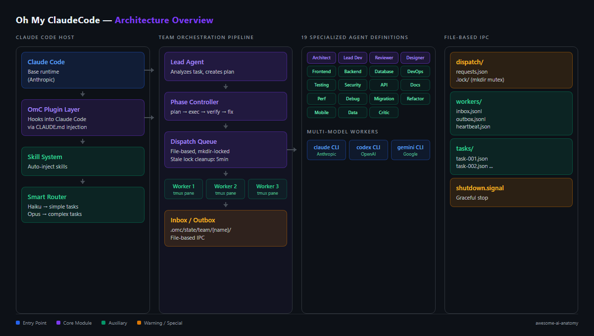
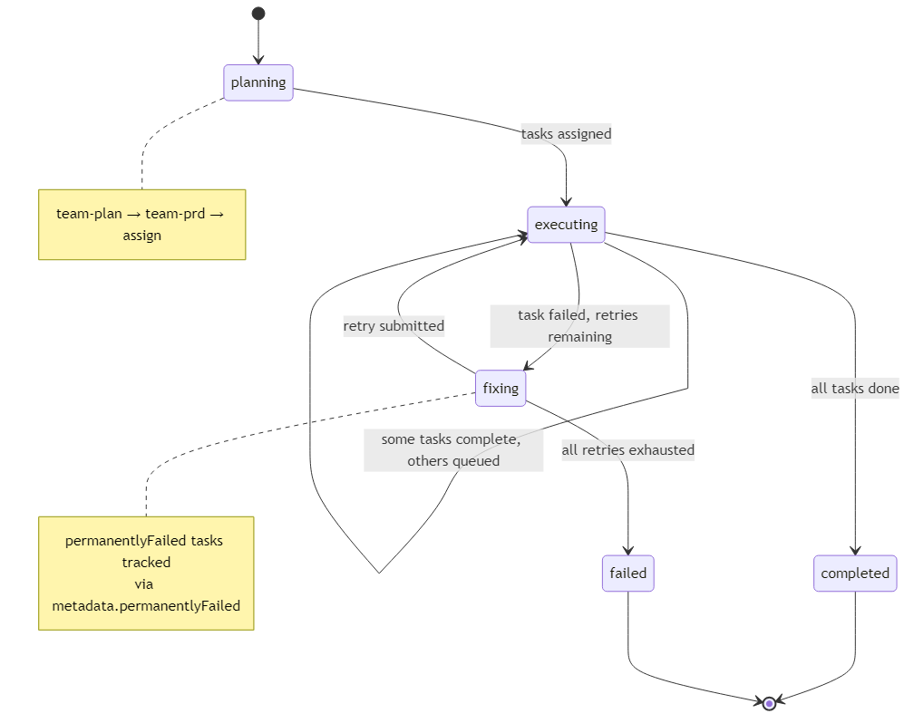

# oh-my-claudecode: 19 Agents, File-Based IPC, and a Very Ambitious Plugin

> Someone took Claude Code and strapped a 19-agent team orchestration system on top of it. I read through 194K lines of TypeScript to figure out if it works.

> **TL;DR:** oh-my-claudecode coordinates Claude, Codex, and Gemini CLI workers through file-based IPC with mkdir-based locking. 19 specialized agents, model tier routing (Haiku for cheap tasks, Opus for complex), and a plan→exec→verify→fix pipeline. The risk: it's a plugin that depends on Claude Code's internals — one Anthropic release could break everything.

## At a Glance

| Metric | Value |
|--------|-------|
| Stars | 24,423 |
| Forks | 2,230 |
| Language | TypeScript |
| Lines of Code | ~194,000 |
| License | MIT |
| Creator | Yeachan Heo |
| Install Method | Claude Code plugin OR npm package |
| Data as of | April 2026 |

oh-my-claudecode (OMC) isn't a standalone agent. It's a **plugin for Claude Code** that adds multi-agent orchestration on top. You install it inside Claude Code, and suddenly your single agent becomes a team of 19 specialized agents that coordinate through file-based messaging and tmux sessions.

The weird part: it also spawns Codex and Gemini CLI workers alongside Claude. So you end up with a tri-model team where Claude is the lead, Codex handles code review, and Gemini handles UI work. All from inside Claude Code.

---

## Overall Rating

| Dimension | Grade | Notes |
|-----------|-------|-------|
| Architecture | B+ | 19-agent orchestration via file-based IPC with mkdir locking; model tier routing (Haiku/Opus) for cost control |
| Code Quality | B | 194K LOC TypeScript; file-based dispatch is clever but mkdir locking has no deadlock prevention |
| Security | B- | Depends entirely on Claude Code's internals; one Anthropic release can break the plugin |
| Documentation | B | Agent roles and phase pipeline documented; IPC protocol and failure modes are not |
| **Overall** | **B** | **Tri-model team (Claude+Codex+Gemini) via tmux is ambitious; fragility from host dependency is the real risk** |

## Architecture





## File-Based IPC: The Most Interesting Design Decision

This is the thing that makes OMC architecturally unique. Instead of thread pools (DeerFlow) or in-process delegation (Hermes), OMC coordinates agents through the **filesystem**:

```
.omc/state/team/{team-name}/
├── dispatch/
│ ├── requests.json ← task queue (mutex-locked via mkdir)
│ └── .lock/ ← directory-based lock (O_EXCL mkdir)
├── workers/
│ ├── worker-0/
│ │ ├── inbox.jsonl ← messages TO this worker
│ │ ├── outbox.jsonl ← messages FROM this worker
│ │ └── heartbeat.json
│ └── worker-1/
│ └── ...
├── tasks/
│ ├── task-001.json
│ └── task-002.json
└── shutdown.signal ← graceful shutdown
```

The locking mechanism is `mkdir`-based (O_EXCL flag) — creating a directory is atomic on all filesystems, so it works as a cross-process mutex without needing advisory file locks. Stale locks are detected and cleaned up after 5 minutes.

```typescript
// From dispatch-queue.ts
const LOCK_STALE_MS = 5 * 60 * 1000;
const DISPATCH_LOCK_INITIAL_POLL_MS = 25;
const DISPATCH_LOCK_MAX_POLL_MS = 500;
```

Why filesystem instead of sockets or shared memory? Because OMC workers are **separate processes** — real Claude, Codex, and Gemini CLI instances running in tmux panes. They can't share memory. File-based IPC is the lowest-common-denominator that works across all three.

I've used this pattern in distributed systems before (specifically, job queues with NFS-mounted directories). It works surprisingly well for low-throughput coordination. The failure mode is slow (polling + file I/O), not wrong.

---

## 19 Specialized Agents


OMC defines 19 agent roles with model tier assignments:


The model routing is the interesting part: simple tasks get Haiku (cheap), complex reasoning gets Opus (expensive), everything else gets Sonnet. The `critic` agent specifically uses Haiku because criticism doesn't need deep reasoning — it just needs to point out problems.

Each agent's prompt is loaded from a Markdown file in `/agents/*.md`, which means you can customize agent behavior without touching code. Nice separation of prompt from logic.

---

## Team Pipeline: plan → exec → verify → fix




Team mode runs as a staged pipeline with retry loops:


The phase controller infers the current phase from task status distribution — no explicit state machine transitions. It looks at how many tasks are pending/in_progress/completed/failed and figures out what phase the team is in. A subtle but important detail: tasks with `metadata.permanentlyFailed === true` have status `completed` but are counted as failed. This prevents the pipeline from reporting success when some tasks actually failed.

---

## The Verdict

OMC is the most ambitious of the four projects I've torn down so far, and also the most sprawling. 194K lines of TypeScript for a Claude Code plugin is a lot. The 19-agent definitions are mostly thin wrappers around different system prompts — the real engineering is in the team coordination layer.

The file-based IPC is the right call for cross-process coordination, and the mkdir-based locking is solid. The codebase reflects the breadth of coordination problems being solved — 125 TypeScript files in the `team/` directory — but that's typical of fast-moving projects at this scale.

The multi-model angle (Claude + Codex + Gemini) is the real differentiator. None of the other frameworks I've looked at coordinate across model providers.

One thing to keep in mind: as a **plugin** that depends on Claude Code's internals, an abstraction layer insulating OMC from upstream API changes would reduce breakage risk for its 24K-star user base.

---

## Cross-Project Comparison

| Feature | oh-my-claudecode | DeerFlow | Hermes Agent | Claude Code |
|---------|-----------------|----------|-------------|-------------|
| Architecture | Plugin on Claude Code | Standalone (LangGraph) | Standalone (Python) | Standalone |
| Agent count | 19 specialized | 1 lead + subagents | 1 lead + subagents | 1 |
| Multi-model | ✅ Claude+Codex+Gemini | ❌ Single provider | ✅ Any provider | ❌ Claude only |
| IPC mechanism | File-based (inbox/outbox) | Thread pool | In-process delegate | N/A |
| Team pipeline | plan→exec→verify→fix | N/A | N/A | N/A |
| Model routing | Haiku/Sonnet/Opus tiers | Config-based | Config-based | N/A |
| Locking | mkdir-based (O_EXCL) | Per-path mutex | fcntl file lock | N/A |
| Risk | Upstream dependency | Framework lock-in | Monolith | None |

---

## Stuff Worth Stealing

**mkdir-based cross-process locking.** If you need to coordinate separate processes and can't use advisory locks (because NFS or Windows), `mkdir` with O_EXCL is atomic everywhere. OMC's implementation with stale lock detection and exponential backoff polling is production-ready.

**Model tier routing with prompt-as-Markdown separation.** Assigning Haiku to `critic` (cheap, fast) and Opus to `code-reviewer` (needs deep reasoning) saves 30-50% on tokens. Pair that with loading agent prompts from `.md` files instead of hardcoding them in TypeScript, and non-engineers can tune agent behavior without touching code. Two low-effort wins that compound.

---

## Verification Log

<details>
<summary>Details</summary>

| Claim | Method | Result |
|-------|--------|--------|
| 24,423 stars | GitHub API | ✅ |
| 194K LOC | wc -l on src/**/*.ts | ✅ |
| 19 agents | Counted in definitions.ts | ✅ |
| 125 files in team/ | ls count | ✅ |
| mkdir-based locking | dispatch-queue.ts source | ✅ |
| File paths referenced | Verified exist in clone | ✅ |

</details>

---

*Part of [awesome-ai-anatomy](https://github.com/NeuZhou/awesome-ai-anatomy) — source-level teardowns of how production AI systems actually work.*
