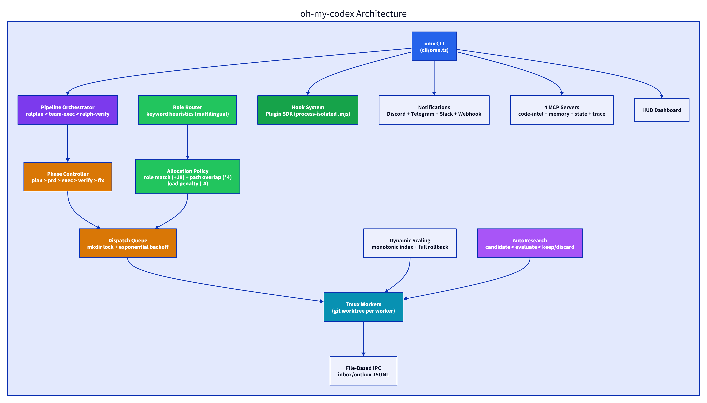
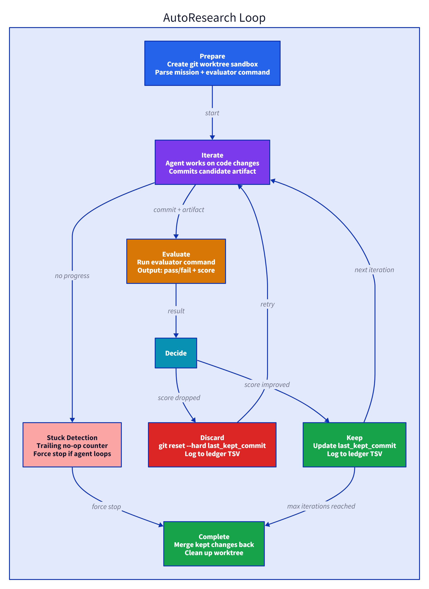

# oh-my-codex: 30 Agents, Git Worktrees, and the Same Dev Who Shipped OMC Did It Again

> The same developer's second take on multi-agent orchestration is where the real lessons live. OMX solves every problem OMC left open - file conflicts, no plugin system, fixed worker count - each with a different architectural choice. This is what iterative learning looks like in code.

## TL;DR

- **What it is:** Multi-agent orchestration layer for OpenAI Codex CLI - 30 specialized agents, a 5-phase team pipeline, dynamic worker scaling, hook plugins, and an automated research loop, all in ~124K lines of TypeScript.
- **Why it matters:** The same developer who built oh-my-claudecode (26K stars, Claude Code plugin) rebuilt the concept from scratch for Codex CLI, solving the problems OMC left unsolved - and the architecture choices show exactly what he learned.
- **What you'll learn:** How to build a plugin-based hook system, allocate tasks across workers using file-path heuristics, and run autonomous experiment loops with git worktrees.
- **Patterns to steal:** [Plugin Hook SDK], [Heuristic Task Allocation], [Autonomous Research Loops], [Git Worktree Isolation], [Phase-Gated Pipeline]

## Why Should You Care?

If you've ever tried to coordinate multiple AI coding agents on a real project, you know the pain: agents step on each other's files, there's no clear handoff between "plan" and "execute" and "verify," and scaling from 2 workers to 5 workers mid-session breaks everything. oh-my-codex (OMX) attacks all of these problems.

This is Yeachan Heo's second take on the multi-agent orchestration problem. His first - oh-my-claudecode - got 26K stars and showed the industry that file-based IPC with mkdir locking works. OMX keeps that battle-tested foundation but adds things OMC never had: a full plugin SDK for hooks, keyword-based role routing that speaks Korean, dynamic scaling with rollback, and `autoresearch` - an autonomous experiment runner that iterates on your code, evaluates results, and decides whether to keep or discard changes. Reading this codebase is like watching a developer have a conversation with his past self and win every argument.

## At a Glance

| Metric | Value |
|--------|-------|
| Stars | 19,571 |
| Forks | 1,790 |
| Language | TypeScript |
| Lines of Code | ~124,000 |
| License | None (no license file) |
| Creator | [Yeachan Heo](https://github.com/Yeachan-Heo) |
| Install Method | npm package (`omx` CLI) |
| Data as of | April 2026 |

## Characteristics

| Dimension | Description |
|-----------|-------------|
| Architecture | 30-agent team with 5-phase pipeline (plan→prd→exec→verify→fix), git worktree isolation per experiment, heuristic task-to-worker allocation via file-path overlap scoring |
| Code Organization | 124K LOC TypeScript, plugin hook SDK with process isolation (1.5s timeout, SIGTERM→SIGKILL escalation), monotonic worker indexing |
| Security Approach | plugin process isolation via child process spawning, no shared state between workers, bounded fix loops (max 3 retries) |
| Context Strategy | delegates context management to the host Codex CLI agent -- focused on orchestration instead |
| Documentation | agent roles and pipeline stages documented, Korean keywords in role-router, license file is an area for future addition |
## Architecture

```mermaid
graph TB
  User["User (omx CLI)"] --> CLI["CLI Layer<br/>cli/omx.ts"]
  CLI --> Pipeline["Pipeline Orchestrator<br/>pipeline/orchestrator.ts"]
  CLI --> TeamMode["Team Mode<br/>team/runtime.ts"]
  CLI --> AutoResearch["AutoResearch<br/>autoresearch/runtime.ts"]

  Pipeline --> |"stage: ralplan"| Planning["Planning<br/>ralplan/runtime.ts"]
  Pipeline --> |"stage: team-exec"| TeamExec["Team Execution"]
  Pipeline --> |"stage: ralph-verify"| Verify["Ralph Verification<br/>ralph/"]

  TeamMode --> Orchestrator["Phase Controller<br/>team/orchestrator.ts"]
  Orchestrator --> |"plan→prd→exec→verify→fix"| Workers["Tmux Workers"]

  TeamMode --> Dispatch["Dispatch Queue<br/>team/state/dispatch.ts"]
  Dispatch --> |"mkdir lock"| Lock["Dispatch Lock<br/>team/state/dispatch-lock.ts"]
  Dispatch --> Workers

  TeamMode --> Alloc["Allocation Policy<br/>team/allocation-policy.ts"]
  TeamMode --> RoleRouter["Role Router<br/>team/role-router.ts"]
  TeamMode --> Scaling["Dynamic Scaling<br/>team/scaling.ts"]

  Workers --> |"inbox/outbox"| Mailbox["File-Based IPC<br/>team/state/mailbox.ts"]
  Workers --> |"worktree per worker"| Worktree["Git Worktrees<br/>team/worktree.ts"]

  CLI --> Hooks["Hook System<br/>hooks/extensibility/"]
  Hooks --> |"event envelope"| Plugins["User Plugins (.mjs)<br/>.omx/hooks/"]
  Hooks --> |"SDK"| PluginSDK["Plugin SDK<br/>tmux, state, log, omx"]

  CLI --> HUD["HUD<br/>hud/"]
  CLI --> Notify["Notifications<br/>notifications/"]
  Notify --> Discord & Telegram & Slack & Webhook

  CLI --> MCP["MCP Servers"]
  MCP --> CodeIntel["Code Intelligence<br/>tsc + ast-grep"]
  MCP --> Memory["Memory Server"]
  MCP --> StateServer["State Server"]
  MCP --> Trace["Trace Server"]

  AutoResearch --> |"git worktree"| Sandbox["Isolated Sandbox"]
  Sandbox --> |"evaluator command"| Evaluator["Pass/Score Result"]
  Evaluator --> |"keep/discard"| Decision["Outcome Decision"]

  style Pipeline fill:#e8f5e9
  style TeamMode fill:#e3f2fd
  style AutoResearch fill:#fff3e0
  style Hooks fill:#f3e5f5
```



<details>
<summary>Mermaid diagram</summary>



</details>

**Key structural facts:**

- **30 agent roles** across 5 categories: build (8), review (6), domain (10), product (4), coordination (2) - each with defined model class, reasoning effort, and tool access pattern
- **5-phase team pipeline:** `plan → prd → exec → verify → fix` with a bounded fix loop (default max 3 attempts)
- **File-based IPC** with mkdir-based locking - inherited from OMC and refined with stale lock detection at 5 minutes, exponential backoff polling (25ms → 500ms), and configurable lock timeout (1s-120s)
- **Hook plugin system** with a sandboxed SDK - plugins are `.mjs` files in `.omx/hooks/`, spawned as child processes, killed after timeout (default 1.5s)
- **AutoResearch** - autonomous experiment loop with git worktree isolation, evaluator contracts, and keep/discard decisions based on score improvement

## Core Design Decisions

### 1. "Every worker gets its own git worktree" instead of shared working directory

In OMC, all workers shared the same filesystem. If two agents edited the same file, you got merge conflicts inside a running session. OMX gives each worker its own git worktree - a full working copy branched from the same repo. Workers can modify files freely without stepping on each other. The `worktree.ts` module handles creation, branch naming, detached HEAD mode, and cleanup on `scaleDown`. The cost is disk space (one worktree per worker), but the payoff is zero file-level conflicts during parallel execution.

### 2. "Plugins spawn as child processes with a timeout" instead of in-process hooks

OMC's hooks ran in the main process. A buggy hook could crash the whole system. OMX's hook dispatcher (`dispatcher.ts`) spawns each plugin as a separate Node.js child process, pipes the event envelope via stdin, and kills the process after a configurable timeout (default 1.5s, SIGTERM first, SIGKILL after 250ms grace). The plugin communicates results back via a magic stdout prefix (`__OMX_PLUGIN_RESULT__`). This means a crashing plugin can never take down the host, and slow plugins get killed instead of blocking the pipeline.

### 3. "Role routing via keyword heuristics" instead of LLM-based classification

Some frameworks use an LLM call to decide which agent should handle a task. OMX uses deterministic keyword matching in `role-router.ts`: the task description is checked against 8 keyword categories (tests, UI, build errors, debugging, docs, review, security, refactoring) with both English and Korean keywords. Two or more matches from the same category = high confidence. One match = medium. No matches = fallback to the specified agent type. This costs zero tokens and runs in microseconds - the right tradeoff for routing decisions that happen dozens of times per team session.

## How It Works

### Level 1: The Flow (everyone, 5 min)

1. **You run `omx team start "Build the login page"`** - the CLI parses your task and creates a team session in tmux
2. **OMX creates a phase controller** - starting in `team-plan` phase. It assigns the `analyst` and `planner` agents to break down your task into subtasks
3. **Each subtask gets routed to a worker** - the allocation policy scores each worker based on role match, file-path overlap from previous assignments, and current load. A worker gets a tmux pane, its own git worktree, and an inbox message
4. **Workers execute in parallel** - each worker is a real Codex CLI instance running in its own tmux pane with its own copy of the repo. They communicate through file-based mailboxes
5. **Phase transitions happen automatically** - when all execution tasks complete, the phase controller moves to `team-verify`. Verifiers check the work. If things fail, it loops to `team-fix` (up to 3 times), then either completes or reports failure
6. **You get notified** - Discord, Telegram, Slack, or webhook. Your choice


## Patterns You Can Steal

### 1. Plugin Hook SDK with Process Isolation

**Problem:** You want users to extend your tool's behavior, but in-process plugins can crash your main process or hang on slow I/O.

**Solution:** OMX spawns each plugin as a child process, sends the event via stdin (JSON), reads results from a magic stdout prefix, and enforces a timeout with SIGTERM → SIGKILL escalation. The plugin gets a rich SDK (tmux control, persistent state, structured logging, read-only system state) without any access to the host process's memory.

**How to steal it:** Create a `plugins/` directory. On each event, `spawn(process.execPath, ['plugin-runner.js'])`, write the event to stdin, set a 2-second timeout. Parse `__YOUR_PREFIX__ {json}` from stdout. Kill on timeout. Ship an SDK as an npm package that plugins import. Total implementation: ~200 lines.

**When to use:** Any tool with user-extensible event handling. **When not to use:** Sub-millisecond event processing where process spawn overhead matters.

### 2. Heuristic Task-to-Worker Allocation with Emergent Locality

**Problem:** You have N workers and M tasks. You need to assign tasks so workers specialize naturally without explicit configuration.

**Solution:** Score each worker by: role match (+18/+12), file-path overlap (+12 per shared path hint), domain overlap (+4 per keyword), and load penalty (âˆ'4 per existing task). Workers that already touched `src/team/` score higher for new `src/team/` tasks. Specialization emerges from history.

**How to steal it:** In your task queue, maintain a `scope_hints: Set<string>` per worker. On each assignment, add `path:{normalized}` and `domain:{keyword}` from the task description. Score candidates by `overlap * 4 - assignments * 4`. Pick the highest. ~150 lines of code, zero LLM calls.

**When to use:** Multi-agent task distribution, worker pool routing, any system where you want affinity without manual configuration. **When not to use:** Single-worker systems, or when you need guaranteed optimal assignment (use integer programming instead).

### 3. Autonomous Research Loop with Keep/Discard Decisions

**Problem:** You want an AI agent to iteratively improve code, but you need a safety net - bad changes should be automatically reverted.

**Solution:** Give each experiment iteration its own git state. The agent commits changes and writes a candidate artifact. An evaluator command runs tests and outputs `{pass, score}`. If the score improved, keep the commit. If not, `git reset --hard` to the last keeper. A ledger tracks every decision.

**How to steal it:** Create a loop: (1) save current commit hash, (2) let the agent work, (3) run your evaluator, (4) if pass && score > last_score: update `last_kept_commit`, else `git reset --hard $last_kept_commit`. Log each iteration to a TSV. Add a trailing-noop counter to detect stuck agents. ~300 lines.

**When to use:** Any iterative optimization task: prompt tuning, config optimization, automated refactoring. **When not to use:** Tasks where you need to explore multiple branches simultaneously (use a tree search instead).

### 4. Dynamic Scaling with Monotonic Indexing and Full Rollback

**Problem:** You need to add or remove workers from a running team without corrupting shared state or creating naming collisions.

**Solution:** OMX uses a `next_worker_index` counter that only increments. `worker-3` stays `worker-3` even if `worker-2` is removed. On `scaleUp`, it persists tasks first, creates panes, writes identity files, and queues inbox messages. If any step fails, it rolls back everything: kills panes, removes task files, restores the config, cleans up worktrees.

**How to steal it:** In your worker pool config, add `next_index: number`. On add: `name = "worker-{next_index++}"`. On remove: splice from array but never decrement counter. Wrap the entire add operation in a try/catch that cleans up on failure. ~50 lines for the core pattern.

**When to use:** Any system with dynamic worker pools (build farms, agent teams, distributed task queues). **When not to use:** Fixed-size pools where workers are predefined.

### 5. Phase-Gated Pipeline with Bounded Fix Loops

**Problem:** Your multi-step workflow sometimes fails at verification, and you want automatic retries - but not infinite loops.

**Solution:** OMX defines explicit phase transitions: `plan → prd → exec → verify → fix`. From `verify`, you can go to `fix` or `complete` or `failed`. From `fix`, you can go back to `exec` or `verify`. A counter tracks fix attempts (default max: 3). Exceeding the limit forces a `failed` transition with the reason `team-fix loop limit reached`.

**How to steal it:** Define your phases as a `Record<Phase, Phase[]>` transition map. Add `max_retries` and `current_attempt` to your state. In the transition function: if `to === 'fix' && ++attempt > max`, force-transition to `failed`. Clean, bounded, debuggable. ~80 lines.

**When to use:** Any automated workflow that might need retries (CI/CD pipelines, data processing, agent task loops). **When not to use:** Linear workflows that should never retry.

### Level 2: Key Design Decisions (Senior+)

#### Dynamic Scaling with Full Rollback

The `scaling.ts` module lets you add or remove workers mid-session. `scaleUp` is particularly well-engineered:

- Acquires a file-based scaling lock (prevents concurrent scale operations)
- Uses a **monotonic worker index counter** (`next_worker_index` in config) so worker names never collide, even after scale-down/scale-up cycles
- Creates tasks in canonical state first, then resolves worker roles from task assignments
- Creates tmux panes, writes worker identity files, generates inbox instructions
- On any failure, **full rollback**: kills created panes, removes worker files, restores config, cleans up worktrees

`scaleDown` uses a three-phase approach: mark workers as `draining` → wait for drain (with timeout) → kill panes and update config. The minimum-worker guard ensures you can't remove all workers.

#### Dispatch Queue with Bridge Fallback

The dispatch system (`team/state/dispatch.ts`) manages how messages reach workers. Each dispatch request goes through a state machine: `pending → notified → delivered` (or `→ failed`). The system tries the "bridge" transport first (a runtime command bus), and falls back to file-based dispatch if the bridge isn't available. Deduplication prevents the same message from being queued twice - it checks for equivalent pending requests by kind, target worker, message ID, or trigger message.

#### Hook Plugin SDK Design

Plugins get a sandboxed SDK with four namespaces:

```typescript
interface HookPluginSdk {
 tmux: { sendKeys: (options) => Promise<Result> }; // Inject keystrokes into tmux panes
 log: { info, warn, error };             // Structured logging to .omx/logs/
 state: { read, write, delete, all };        // Per-plugin persistent state
 omx: { session, hud, notifyFallback, updateCheck }; // Read-only access to OMX state
}
```

Plugins can react to 15+ event types: `session-start`, `turn-complete`, `test-failed`, `handoff-needed`, `pre-tool-use`, `post-tool-use`, and more. The event envelope includes schema version, session/thread/turn IDs, confidence scores, and parser reasons. This is a full extensibility platform - not just a callback hook.

### Level 3: Source Deep Dive (Staff+)

#### The Allocation Policy (`team/allocation-policy.ts`)

The allocation policy is a compact, well-structured task-routing module I've read. The algorithm:

1. **Extract hints** from the task: file paths get normalized to `path:src/team/scaling.ts`, important words become `domain:scaling`. A regex extracts paths that start with known directories (`src/`, `scripts/`, `docs/`, etc.)
2. **Build worker state**: for each worker, collect scope hints from all currently assigned tasks
3. **Score each worker** against the task:
  - Role match: +18 if the worker's primary role matches, +12 for secondary match, +9 for unassigned workers
  - Path/domain overlap: +4 per overlapping hint (paths weighted 3Ã- over domains)
  - Negative overlap penalty: âˆ'3 if the task has hints but the worker has no overlap
  - Load penalty: âˆ'4 per currently assigned task
  - Blocked-task penalty: âˆ'1 extra per assignment for tasks with dependencies
4. **Tie-break** by overlap count, then assignment count, then original index

The result: workers naturally specialize. Once a worker touches `src/team/`, it gets more `src/team/` tasks. This is emergent locality without explicit affinity configuration.

```typescript
function scoreWorker(task, worker, taskHints, uniformRolePool): number {
 let score = 0;
 if (!uniformRolePool) {
  if (taskRole && worker.primaryRole === taskRole) score += 18;
  if (taskRole && workerRole === taskRole) score += 12;
  if (taskRole && !worker.primaryRole && worker.assignedCount === 0) score += 9;
 }
 const overlap = countHintOverlap(taskHints, worker.scopeHints);
 if (overlap > 0) score += overlap * 4;
 if (taskHints.size > 0 && overlap === 0 && worker.scopeHints.size > 0) score -= 3;
 score -= worker.assignedCount * 4;
 return score;
}
```

#### The AutoResearch Runtime (`autoresearch/runtime.ts`)

This is the most novel module in OMX and has no equivalent in OMC. AutoResearch runs autonomous experiment loops:

1. **Prepare**: create a git worktree, seed a baseline evaluation, write a manifest
2. **Each iteration**: the agent makes changes, commits, and writes a candidate artifact JSON (`status: candidate|noop|abort|interrupted`, `candidate_commit`, `base_commit`)
3. **Evaluate**: run the user-provided evaluator command (any shell command that outputs `{pass: boolean, score?: number}`)
4. **Decide**: based on the keep policy (`score_improvement` or `pass_only`), either keep the commit or `git reset --hard` to the last good state
5. **Loop**: write new instructions with the last 3 ledger entries as context, launch the next iteration

The decision logic in `decideAutoresearchOutcome` handles 7 outcome states (keep, discard, noop, abort, interrupted, ambiguous, error) with explicit reasoning attached to each. A trailing-noop counter lets supervisors detect when the agent is stuck. Every iteration is recorded in both a TSV results file and a JSON ledger - full experiment reproducibility.



## Source Reading Path

### Quick Path (15 min)

| Step | File | What to Read | Time |
|------|------|--------------|------|
| 1 | `src/agents/definitions.ts` | All 30 agent roles with model class, reasoning effort, tool access | 3 min |
| 2 | `src/team/orchestrator.ts` | Phase state machine: transitions, fix loop limits, phase-to-agent mapping | 3 min |
| 3 | `src/team/allocation-policy.ts` | Task-to-worker scoring algorithm - the scoring function is 20 lines | 4 min |
| 4 | `src/hooks/extensibility/types.ts` | Hook event envelope + plugin SDK interface | 3 min |
| 5 | `src/autoresearch/contracts.ts` | Mission and sandbox contract parsing - the evaluator interface | 2 min |

### Deep Path (1 hour)

| Step | File | What to Read | Time |
|------|------|--------------|------|
| 1 | `src/team/scaling.ts` | Dynamic scale-up/down with full rollback - trace the error paths | 15 min |
| 2 | `src/team/state/dispatch.ts` | Dispatch queue with deduplication and bridge fallback | 10 min |
| 3 | `src/team/state/dispatch-lock.ts` | mkdir-based locking with stale detection, exponential backoff | 5 min |
| 4 | `src/hooks/extensibility/dispatcher.ts` | Plugin process isolation, timeout escalation, result parsing | 10 min |
| 5 | `src/autoresearch/runtime.ts` | Full experiment loop: prepare → iterate → evaluate → decide → record | 15 min |
| 6 | `src/team/role-router.ts` | Keyword-based role routing with Korean language support | 5 min |

## Trade-offs Worth Knowing

Every design choice has a cost. Three worth flagging:

- **Git worktree disk overhead.** Each worker gets a full worktree copy. On large monorepos (multi-GB), `git worktree add` takes time and disk space scales linearly with worker count. For typical project sizes this is fine; for very large repos, shallow worktrees or sparse checkouts would be a natural optimization.

- **Debugging 30 agents across 5 phases.** When something fails in a pipeline this deep, tracing the root cause requires reading tmux pane logs, mailbox files, and the dispatch queue state. The delivery log and phase controller state help a lot, and centralized error aggregation would make this even more powerful.

- **File-based IPC latency.** The inbox/outbox JSONL mechanism works well for the send-and-check cadence of coding tasks. For sub-second communication you'd want an in-memory message bus, and for OMX's use case the file-based approach is the right trade-off -- simple, debuggable, and reliable.

## Cross-Project Comparison

| Feature | oh-my-codex (OMX) | oh-my-claudecode (OMC) | Claude Code | OpenClaw |
|---------|-------------------|------------------------|-------------|----------|
| **Target CLI** | Codex CLI | Claude Code | - (standalone) | - (standalone) |
| **Agent count** | 30 specialized | 19 specialized | 1 | 1 + subagents |
| **Team pipeline** | plan→prd→exec→verify→fix | plan→exec→verify→fix | N/A | N/A |
| **IPC mechanism** | File-based (inbox/outbox) | File-based (inbox/outbox) | N/A | In-process |
| **Locking** | mkdir-based (exponential backoff) | mkdir-based | N/A | N/A |
| **Worker isolation** | Git worktrees (separate copies) | Shared filesystem | N/A | N/A |
| **Hook system** | Plugin SDK (process-isolated, .mjs) | None | None | Skill-based |
| **Dynamic scaling** | Mid-session scale up/down with rollback | Fixed worker count | N/A | N/A |
| **Role routing** | Keyword heuristic (multilingual) | Manual assignment | N/A | N/A |
| **AutoResearch** | Autonomous experiment loops | | | |
| **Multi-model** | Codex (+ via hook plugins) | Claude + Codex + Gemini | Claude only | Any (configurable) |
| **Notifications** | Discord, Telegram, Slack, Webhook, Discord Bot | None built-in | None | Channel-based |
| **MCP servers** | 4 (code-intel, memory, state, trace) | None | Native tools | Native tools |
| **LOC** | ~124K | ~194K | - | - |

**OMC → OMX evolution:** The biggest changes show where Yeachan hit real problems using OMC. Git worktrees solve the file-conflict issue that plagued OMC's shared filesystem. The hook plugin SDK replaces OMC's tightly-coupled event handling. Dynamic scaling addresses the "I started with 2 workers but need 5" problem. And AutoResearch is entirely new - a direct product of Yeachan's quant trading background, where iterative optimization with keep/discard is a daily workflow.

**What OMC still does better:** Multi-model support. OMC natively orchestrates Claude, Codex, and Gemini workers in the same session. OMX is Codex-native and extends primarily through plugins. If you need tri-model coordination, OMC is still the reference.

## Key Takeaways

- **Git worktrees for worker isolation is an underused pattern.** If you have parallel agents modifying files, giving each one its own worktree eliminates an entire class of conflicts. The disk cost is trivial compared to the coordination cost of shared filesystems.

- **Deterministic routing beats LLM-based routing for high-frequency decisions.** OMX routes dozens of tasks per session. Doing this with LLM calls would cost tokens and add latency. Keyword heuristics at microsecond speed with zero cost is the right call - and the Korean keyword support shows thoughtful internationalization.

- **The autoresearch pattern is directly reusable.** Any "iterative improvement with rollback" workflow - prompt optimization, config tuning, automated refactoring - can use the same candidate artifact → evaluator → keep/discard loop. The ledger provides audit trails for free.

- **Plugin isolation via process boundaries is worth the 50ms overhead.** OMX's hook system can never crash from a bad plugin. The 1.5-second timeout with SIGTERM → SIGKILL escalation is production-grade process management in ~100 lines.

- **The same developer's second project is where the insights live.** Comparing OMC and OMX reveals which OMC design decisions survived (file-based IPC, mkdir locking) and which got replaced (shared filesystem → worktrees, no plugins → plugin SDK). If you want to learn architecture, read someone's second take on the same problem.

## Verification Log

<details>
<summary>Fact-check log</summary>

| Claim | Method | Result |
|-------|--------|--------|
| 19,571 stars | GitHub API `stargazers_count` | Verified 2026-04-09 |
| 1,790 forks | GitHub API `forks_count` | Verified 2026-04-09 |
| No license | GitHub API `license: null` | Verified |
| ~124K LOC TypeScript | `Get-ChildItem -Recurse -Include *.ts,*.tsx \| Measure-Object -Line -Sum` → 123,526 | Verified |
| 30 agent definitions | Counted in `src/agents/definitions.ts` | 30 entries in AGENT_DEFINITIONS |
| 5-phase pipeline (plan→prd→exec→verify→fix) | `src/team/orchestrator.ts` TRANSITIONS map | Verified |
| Max fix attempts default 3 | `createTeamState()` default parameter | Verified |
| mkdir-based locking with 5min stale detection | `src/team/state/dispatch-lock.ts` LOCK_STALE_MS = 5 * 60 * 1000 | Verified |
| Exponential backoff 25ms→500ms | `dispatch-lock.ts` DISPATCH_LOCK_INITIAL_POLL_MS=25, DISPATCH_LOCK_MAX_POLL_MS=500 | Verified |
| Plugin timeout default 1.5s | `src/hooks/extensibility/loader.ts` resolveHookPluginTimeoutMs fallback=1500 | Verified |
| SIGKILL grace 250ms | `src/hooks/extensibility/dispatcher.ts` RUNNER_SIGKILL_GRACE_MS=250 | Verified |
| Plugins enabled by default | `loader.ts` isHookPluginsEnabled: returns true unless explicit opt-out | Verified |
| Plugin result prefix | `dispatcher.ts` RESULT_PREFIX = "__OMX_PLUGIN_RESULT__ " | Verified |
| oh-my-claudecode 26K stars (comparison) | Previous teardown data + GitHub | Per last verified data |
| Scoring: role match +18, path overlap *4, load -4 | `allocation-policy.ts` scoreWorker function | Verified against source |
| Korean keywords in role-router | `role-router.ts` ROLE_KEYWORDS arrays contain Korean terms | Verified (테스트, 커ë²"리지, ë""자인, etc.) |
| 4 MCP servers | `src/mcp/` directory: code-intel-server, memory-server, state-server, trace-server | Verified |
| 5 notification platforms | `src/notifications/dispatcher.ts`: Discord, Discord Bot, Telegram, Slack, Webhook | Verified |
| AutoResearch keep policies | `autoresearch/contracts.ts`: 'score_improvement' \| 'pass_only' | Verified |
| Monotonic worker index | `scaling.ts`: `next_worker_index` in config, only increments | Verified |
| Module LOC breakdown | Counted per-directory: team 32.7K, cli 24.7K, hooks 22.4K, scripts 12.8K, notifications 8.4K | Verified |

</details>

---

*Part of [awesome-ai-anatomy](https://github.com/NeuZhou/awesome-ai-anatomy) - source-level teardowns of how production AI systems actually work.*
