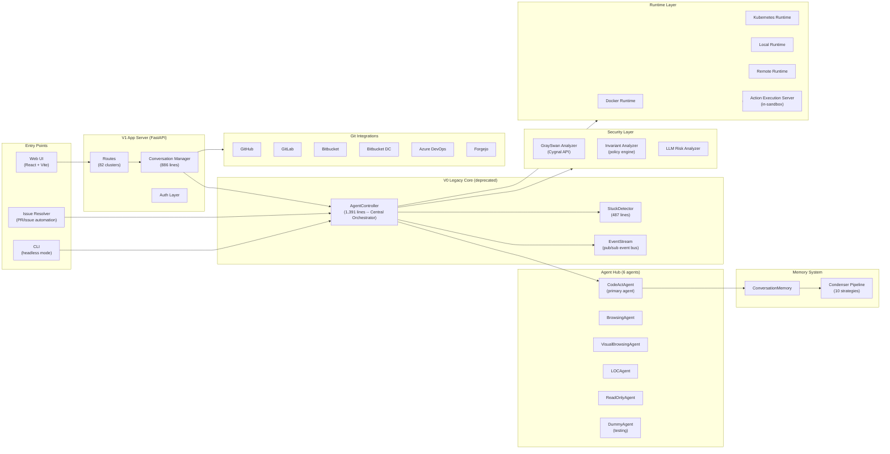

# OpenHands: 10 Ways to Manage Memory on Purpose, 70K Stars, 400K Lines of Active-Migration Python

## TL;DR

- **What it is** - The most popular open-source "build your own Devin" platform, with Docker sandboxing, 6 agent types, and a resolver that auto-fixes GitHub issues
- **Why it matters** - It has the most sophisticated context management system in any open-source agent (10 composable condensation strategies), and a three-layer security stack nobody else matches
- **What you'll learn** - How to build a condenser pipeline, why voluntary memory management matters, and what happens when you deprecate your entire codebase but keep shipping

## Why Should You Care?

Here's the thing that caught me off guard: OpenHands lets the agent *ask* to forget things.

Most agents slam into their context window like a car into a wall - the system either truncates or summarizes, and the agent has no say in it. OpenHands gives the agent a `CondensationRequestTool`. The agent can literally say "my context is getting full, compress me now." That's... not something I'd seen before. (I'm curious how well it works in practice versus the system-triggered condensation -- it'll be interesting to see benchmarks. The idea alone is compelling.)

And then there's the stuck detector. Not a "retry 3 times and give up" counter - a 487-line class that analyzes event history for repeated patterns, detects error-action cycles, and tries to break loops by changing the agent's approach. This thing has its own test suite (409 lines). Most agents pretend loops don't happen.

Oh, and the entire codebase has deprecation banners dated April 1, 2026. That date passed. The old code is still running. Welcome to OpenHands.

## At a Glance

| Metric | Value |
|--------|-------|
| Stars | 70,860 |
| Forks | 8,886 |
| Language | Python (287K lines) + TypeScript (114K lines) |
| Framework | FastAPI (server), LiteLLM (providers), Docker (sandboxing) |
| Total Lines of Code | ~400K |
| License | NOASSERTION (MIT header in LICENSE file) |
| First Commit | 2024-03-13 |
| Originally | OpenDevin - renamed to OpenHands |
| GitNexus Index | 21,157 nodes, 66,716 edges, 1,102 clusters, 300 execution flows |
| Data as of | April 2026 |

OpenHands is a web-based AI agent platform for software development. Runs code in Docker sandboxes, supports 6 agent types, has 10 memory condensation strategies, 3 security analyzers, integrations with 7 git platforms, and an enterprise layer. Originally called OpenDevin (the "let's build open-source Devin" project), it rebranded to OpenHands and the GitHub org moved from `All-Hands-AI` to `OpenHands` (`OpenHands/OpenHands`).

> **Paper link:** The OpenHands platform paper - *"OpenHands: An Open Platform for AI Software Developers as Generalist Agents"* (Wang, Neubig et al., arXiv:2407.16741, ICLR 2025) - covers the architecture, sandbox design, and multi-agent coordination.

---

## Characteristics

| Dimension | Description |
|-----------|-------------|
| Architecture | event-driven agent loop (1391 lines), 6 agent types, Docker sandbox per session, V0/V1 architecture coexisting during active migration |
| Code Organization | 400K LOC (287K Python + 114K TypeScript), FastAPI server, LiteLLM providers, 21157-node GitNexus index with 1102 clusters |
| Security Approach | 3-layer: GraySwan (adversarial testing) + Invariant (runtime policy) + LLM-analyzer (semantic review of agent actions) |
| Context Strategy | 10-condenser pipeline: progressive compression from observation masking to structured summarization to amortized forgetting |
| Documentation | code comments solid, architectural docs assume familiarity with V0/V1 split, deprecation banners dated April 1 2026 |

## Architecture


<details>
<summary>Mermaid source (click to expand)</summary>



</details>

Five layers. Three entry points (web UI, CLI, issue resolver) funnel into the V1 App Server, which routes to the V0 Legacy Core. The core is event-driven, centered on the `AgentController` - a 1,391-line class that does... kind of everything. Agent loop, stuck detection, delegation, security checks. Agents (mainly CodeActAgent) produce actions that pass through Memory and Security before hitting the Runtime, which executes stuff inside Docker containers.

The important thing to internalize: **this codebase is actively migrating.** Every file in `controller/`, `agenthub/`, `security/`, and `runtime/` has a deprecation banner pointing to a V1 Software Agent SDK. The V1 app server (`app_server/`) is already here with 15,218 lines, and it still calls the V0 controller for the actual agent loop. So routing is V1 while the agent brain is V0. Think of it as renovating a house while living in it -- impressive that everything keeps working.

**Files to dig into:**
- `openhands/controller/agent_controller.py` -- The 1,391-line central orchestrator (Legacy V0)
- `openhands/controller/stuck.py` - 487-line stuck detection (Legacy V0)
- `openhands/memory/condenser/condenser.py` - Condenser base class and registry
- `openhands/security/grayswan/analyzer.py` - GraySwan security analyzer
- `openhands/server/conversation_manager/standalone_conversation_manager.py` - 886-line V1 conversation manager

---

## Core Innovation

### The Condenser System: 10 Ways to Forget


Most agents have one context management strategy. "Summarize when full" or "truncate from the beginning." Pick one, that's it. OpenHands has **ten**, and you can chain them.

This draws directly from the MemGPT paper (Packer et al., arXiv:2310.08560) - the idea of treating the LLM's context window like an OS treats main memory, with intelligent paging in and out. But OpenHands goes further than a simple two-tier approach by offering a whole menu of condensation strategies with different tradeoffs:

| Condenser | Lines | Strategy |
|-----------|-------|----------|
| `NoOpCondenser` | 22 | Pass-through (no condensation) |
| `RecentEventsCondenser` | 31 | Keep only the N most recent events |
| `ObservationMaskingCondenser` | 39 | Replace observation content with placeholders |
| `BrowserOutputCondenser` | 49 | Specifically condense verbose browser output |
| `AmortizedForgettingCondenser` | 69 | Probabilistically drop older events (exponential decay) |
| `LLMAttentionCondenser` | 140 | Use LLM to score event importance, keep high-scoring ones |
| `LLMSummarizingCondenser` | 182 | LLM generates a summary that replaces the history |
| `ConversationWindowCondenser` | 188 | Sliding window with configurable keep-first/keep-last |
| `StructuredSummaryCondenser` | 329 | LLM generates structured summary with task progress tracking |
| `Pipeline` | 50 | Chain multiple condensers in sequence |

The `Pipeline` combinator is the key piece. You could run `BrowserOutputCondenser` → `ObservationMaskingCondenser` → `LLMSummarizingCondenser` to first clean browser noise, then mask verbose observations, then summarize. Each step tightens the context progressively.

The `RollingCondenser` base class introduces a `should_condense` / `get_condensation` split that I think is underappreciated. The condenser doesn't just return events - it can return a `Condensation` object, which is an action that goes into the event stream. So condensation itself becomes an auditable event. You can look at the history and see exactly when and why context was compressed. (Most systems just silently drop stuff and you never know what got lost.)

The `AmortizedForgettingCondenser` (69 lines) is probably my favorite. Instead of hard-truncating at a window boundary, it assigns each event a survival probability that decays with age. Older events get probabilistically dropped. The agent gradually forgets rather than cliff-edging. Simple idea, 69 lines, and I haven't seen it anywhere else in production.

### Three-Layer Security


```
SecurityAnalyzer (base)
├── GraySwanAnalyzer     → External API (Cygnal) - ML-based risk scoring
├── InvariantAnalyzer    → Policy engine - rule-based action filtering
└── LLMRiskAnalyzer      → LLM-based - asks the model to evaluate its own actions
```

**GraySwan** (208 lines) ships recent conversation history to an external API (Cygnal), gets back a safety score, and maps it to LOW/MEDIUM/HIGH. The "phone a friend" approach - outsource security judgment to a specialized model.

**InvariantAnalyzer** (133 lines) uses a policy engine. You define rules about what the agent can/cannot do, and it checks each action against them. There's an "ask for confirmation" mode where violations trigger user approval instead of denial. Pretty flexible.

**LLMRiskAnalyzer** (48 lines) is the lightest - it asks the *same LLM* driving the agent to evaluate its own action. Self-evaluation has known limitations (self-reflection helps and continues to improve), and this approach is zero-cost in dependencies while catching obvious stuff.

No other open-source agent I've looked at combines all three. Goose has pattern matching + LLM review. Claude Code has an allowlist. OpenHands stacks external ML + policy engine + self-evaluation, and they're composable.

### The Stuck Detector: 487 Lines of Paranoia

`StuckDetector` isn't a utility function or a retry counter. It's a dedicated class that analyzes event history for patterns:

- Repeated identical actions (same command N times)
- Error-action cycles (same error → same fix → same error)
- Syntax error loops (specific Python error messages it watches for)
- Different behavior in interactive vs headless mode (interactive only looks at history after the last user message)
- Produces a `StuckAnalysis` dataclass with loop type, repeat count, and start index

When stuck is detected, the controller emits a `LoopDetectionObservation` and calls `_handle_loop_recovery_action` to break the loop by changing approach. There's also a 409-line test class (`TestAgentControllerLoopRecovery`) just for recovery logic.

This is the most serious stuck-detection in any open-source agent. Most agents either ignore loops (Cline, Dify - they'll happily spin forever) or have a "max retries" counter (Claude Code). OpenHands treats it as a first-class engineering problem. Which, honestly, it is - anyone who's watched an agent retry the same broken `pip install` five times knows this.

---

## How It Actually Works

### The Agent Hub: 6 Agents with Different Jobs

OpenHands ships six agents, but `CodeActAgent` does the heavy lifting. The rest are for specialized tasks or testing:

| Agent | Purpose | Key Trait |
|-------|---------|-----------|
| `CodeActAgent` | Primary coding agent | Function calling with 8 tools (bash, browser, edit, ipython, think, finish, condensation request, task tracker) |
| `BrowsingAgent` | Web browsing only | Dedicated browser interaction |
| `VisualBrowsingAgent` | Screenshot-based browsing | Uses screenshots instead of DOM |
| `LOCAgent` | Localization agent | Finds relevant code locations |
| `ReadOnlyAgent` | Read-only analysis | Cannot modify files |
| `DummyAgent` | Testing | Predictable actions for CI |

`CodeActAgent` (316 lines) uses function calling to invoke tools - not free-form text. Each tool is a class: `create_cmd_run_tool` for bash, `BrowserTool` for web, `LLMBasedFileEditTool` for AI edits, `create_str_replace_editor_tool` for surgical replacements, `CondensationRequestTool` for voluntary context compression, `ThinkTool` for scratchpad reasoning, `create_task_tracker_tool` for progress tracking, and `FinishTool` for completion.

The tool design here reflects a key insight: the interface you give the agent matters more than which model you use. CodeActAgent's 8 tools are carefully scoped: bash for general work, two different edit tools (AI-powered vs surgical), and that meta-cognitive condensation request tool.

### The Event-Driven Core

Everything is an event. Actions, observations, messages, state changes - all flow through an `EventStream` pub/sub bus. The controller, agents, and runtime all subscribe.

```
User message → MessageAction → EventStream
                                    ↓
AgentController.on_event() → step() → agent.step(state)
                                    ↓
                              Action (e.g., CmdRunAction)
                                    ↓
                          SecurityAnalyzer.security_risk()
                                    ↓
                          Runtime.execute(action)
                                    ↓
                          Observation (e.g., CmdOutputObservation)
                                    ↓
                              EventStream → AgentController
                                    ↓
                              Next step...
```

This is essentially a think → act → observe loop implemented as event sourcing. The `ActionType` enum has 20+ variants: `RUN`, `READ`, `WRITE`, `EDIT`, `BROWSE`, `BROWSE_INTERACTIVE`, `RUN_IPYTHON`, `DELEGATE`, `FINISH`, `REJECT`, `MCP`, `THINK`. Each maps to a typed dataclass. The event sourcing means you can replay the entire agent session from the event log - useful for debugging, less useful for your storage bill.

### Docker Sandboxing

The runtime provisions Docker containers for code execution. An `ActionExecutionServer` runs inside each container and accepts commands from the host. Four runtime implementations:

- **Docker** - Standard container lifecycle
- **Kubernetes** - K8s pod management
- **Local** - Direct host execution (development only, probably don't do this in prod)
- **Remote** - Connects to a pre-provisioned runtime

The Docker runtime mounts a workspace directory and runs an `action_execution_server.py` inside. File operations, shell commands, Jupyter cells, browser automation - all flow over HTTP between host and sandbox.

### Agent Delegation

`AgentController` supports hierarchical delegation. When CodeActAgent emits an `AgentDelegateAction`, the controller spawns a child `AgentController` with a different agent type. The child has its own state, its own iteration budget, and can delegate further. Parent/child tracked via `parent` and `delegate` properties.

So you get patterns like: CodeActAgent delegates web research to BrowsingAgent, which finishes and returns results to the parent. Each delegate runs within a global iteration budget. The pattern is the same as any orchestrator dispatching to specialized agents - but implemented as a concrete runtime mechanism rather than prompt engineering.

---

## The V0/V1 Split

The elephant in the room. Every core file has this:

```python
# IMPORTANT: LEGACY V0 CODE - Deprecated since version 1.0.0, scheduled for removal April 1, 2026
# V1 replacement for this module lives in the Software Agent SDK.
```

V1 is split between:
1. **Software Agent SDK** (external repo: `github.com/OpenHands/software-agent-sdk`) - The new agent core
2. **`openhands/app_server/`** (15,218 lines in this repo) - The new web server

The V1 app server handles conversations, settings, auth, git integrations, user management. But for the actual agent loop? Still delegates to V0 `AgentController`. The migration is in-progress, the deprecation date passed, and the V0 code is what actually runs.

An interesting situation for contributors: the comments explicitly say "please avoid extending this legacy file," while the legacy file *is* the product right now. In practice, most teams navigate this by contributing to V1 for new features and making surgical fixes to V0 when needed.

---

## The Verdict

The condenser pipeline is the standout. Ten composable strategies, voluntary condensation requests, auditable condensation events -- it's the most thoughtful context management in any open-source agent I've read. If you're building an agent and need context management inspiration, start here. (I'd love to see benchmarks on which pipeline combinations work best -- the code is there, and the evaluation data would be a great addition.)

Security is more structured than anything else in the open-source agent space. Three complementary approaches that can be used alone or together. Compare to Claude Code's static allowlist or Cline's ¯\_(ツ)_/¯ approach.

Stuck detection is what other projects should steal tomorrow. A 487-line dedicated class with pattern analysis and a real test suite. This is what "treating a problem seriously" looks like.

But. The V0/V1 migration is worth keeping in mind. 287K lines of Python with deprecation banners and a deferred timeline means it's worth checking which code path is canonical before building on top. The `AgentController` at 1,391 lines is a candidate for decomposition into focused modules - and the V1 SDK promises exactly that.

The `critic` module is thin - 57 lines total. `AgentFinishedCritic` checks if the agent called finish and if the git patch is non-empty. The base class is clean; adding richer evaluators would be high-impact. (An integration with SWE-bench scoring here would be interesting.)

Would I use it? For automated issue resolution and PR workflows - absolutely, the resolver module (7,039 lines) with 7 git platform integrations is battle-tested. For interactive coding, CodeActAgent + Docker sandboxing is safer than most alternatives. And it's worth tracking the V0/V1 situation before building anything long-term on internal APIs.

---

## Cross-Project Comparison

| Feature | OpenHands | Claude Code | Goose | Cline |
|---------|-----------|-------------|-------|-------|
| Language | Python + TS | TypeScript | Rust | TypeScript |
| Sandboxing | Docker containers | OS seatbelt/landlock | MCP process isolation | None |
| Context Mgmt | 10 condenser strategies | 4-layer compaction | Auto-compact + pair summarization | Sliding window |
| Security | GraySwan + Invariant + LLM | Permission allowlist | 5-inspector pipeline | User-managed |
| Stuck Detection | Dedicated 487-line detector | Basic retry | RepetitionInspector | None |
| Agent Types | 6 (specialized) | 1 (general) | 1 (general) | 1 (general) |
| Self-Criticism | AgentFinishedCritic (minimal) | None | None | None |
| Git Integrations | 7 platforms | GitHub only | None | None |
| Delegation | Hierarchical sub-agents | Multi-agent | Sub-agent handler | None |
| LOC | ~400K | ~510K | ~200K | ~560K |

OpenHands wins on breadth. More agent types, more condensation strategies, more security layers, more git integrations. That breadth does come with complexity: the V0/V1 transition and a 400K-line codebase being rewritten while it ships are worth keeping in mind. Claude Code and Goose are more cohesive - fewer things, unified code. Cline takes a different approach: focused on VS Code integration and provider breadth rather than sandboxing or stuck detection, and it's the most approachable to read.

---

## Stuff Worth Stealing

### 1. The Condenser Pipeline Pattern

Composable, registerable condensation strategies with a pipeline combinator:

```python
class Condenser(ABC):
    @abstractmethod
    def condense(self, view: View) -> View | Condensation:
        pass

CONDENSER_REGISTRY: dict[type[CondenserConfig], type[Condenser]] = {}
```

Any agent framework could use this. Define condensation strategies as plugins, register them, chain them. The `Condensation` return type (an action in the event stream) makes it auditable. ~50 lines for the pipeline, ~20-330 lines per strategy.

### 2. Voluntary Condensation Requests

Give the agent a tool to say "compress my history now." Meta-cognitive memory management - the agent participates in its own context budget. The agent isn't just a passive consumer of its context window, it actively manages what stays and what goes.

### 3. Probabilistic Forgetting (AmortizedForgettingCondenser)

Instead of hard window cutoffs, assign survival probabilities that decay with age. Older events are probabilistically dropped. 69 lines. Graceful degradation instead of cliff-edge.

---

## Hooks & Easter Eggs

**The Resolver is basically its own product.** `openhands/resolver/` (7,039 lines) auto-reviews PRs and fixes issues across 7 git platforms. Could be extracted as standalone.

**LiteLLM is load-bearing.** The import block at the top of `agent_controller.py` imports 12 specific LiteLLM exception types. Switching away would be a major refactor. (For better or worse, LiteLLM is the jQuery of the LLM world.)

**The `microagent` system.** A separate module (416 lines) for lightweight task-specific agents that skip the full AgentController. Closer to "skills" in OpenClaw - small focused capabilities without spinning up a whole session.

**Enterprise layer.** `enterprise/` has org management, solvability prediction (ML model guessing if an issue is solvable), Jira/Linear/Slack integrations, usage billing. The commercial moat.

**Memory monitor VSCode extension.** Inside `openhands/runtime/utils/vscode-extensions/memory-monitor/` - a tiny extension that watches memory usage in the Docker sandbox. The kind of thing you build after an OOM kills your agent mid-task and you lose two hours of work. (Been there.)

---

## Verification Log

<details>
<summary>Fact-check log (click to expand)</summary>

| Claim | Verification Method | Result |
|-------|-------------------|--------|
| 70,860 stars | GitHub API | Verified |
| 8,886 forks | GitHub API | Verified |
| ~287K Python LOC | Line count on *.py files | Verified (287,036 lines) |
| ~114K TypeScript LOC | Line count on *.ts + *.tsx files | Verified (113,613 lines) |
| ~400K total LOC | Sum of Python + TypeScript | Verified (400,649 lines) |
| License NOASSERTION | GitHub API `license.spdx_id` | Verified |
| First commit 2024-03-13 | GitHub API `created_at` | Verified |
| GitNexus: 21,157 nodes | `gitnexus analyze` output | Verified |
| GitNexus: 66,716 edges | `gitnexus analyze` output | Verified |
| GitNexus: 1,102 clusters | `gitnexus analyze` output | Verified |
| AgentController 1,391 lines | `agent_controller.py` line range (111-1391) | Verified |
| StuckDetector 487 lines | `stuck.py` line range (27-487) | Verified |
| 10 condenser implementations | Directory listing of `memory/condenser/impl/` | Verified |
| 3 security analyzers | `security/grayswan/`, `security/invariant/`, `security/llm/` | Verified |
| 6 agent types | `agenthub/` directory listing | Verified |
| 7 git integrations | `integrations/` directory listing (GitHub, GitLab, Bitbucket, Bitbucket DC, Azure DevOps, Forgejo + protocols) | Verified |
| V0 deprecation banner present | File headers in controller, agenthub, security | Verified |
| `critic` module 57 lines total | Line count of `critic/base.py` + `critic/finish_critic.py` | Verified |
| Resolver 7,039 lines | Line count of `resolver/` directory | Verified |
| App server 15,218 lines | Line count of `app_server/` directory | Verified |
| CodeActAgent 316 lines | `codeact_agent.py` line range (56-316+) | Verified |
| GraySwanAnalyzer 208 lines | `grayswan/analyzer.py` line range (24-208) | Verified |
| InvariantAnalyzer 133 lines | `invariant/analyzer.py` line range (22-133) | Verified |
| Community clusters from GitNexus | Cypher query on Community nodes | Verified (1,102 total; top: Unit 103, App_server 89, Storage 89, Routes 82) |

</details>

---

*Part of [awesome-ai-anatomy](https://github.com/NeuZhou/awesome-ai-anatomy) - source-level teardowns of how production AI systems actually work. This teardown was produced using GitNexus for structural analysis combined with manual source code review for architectural judgment.*
