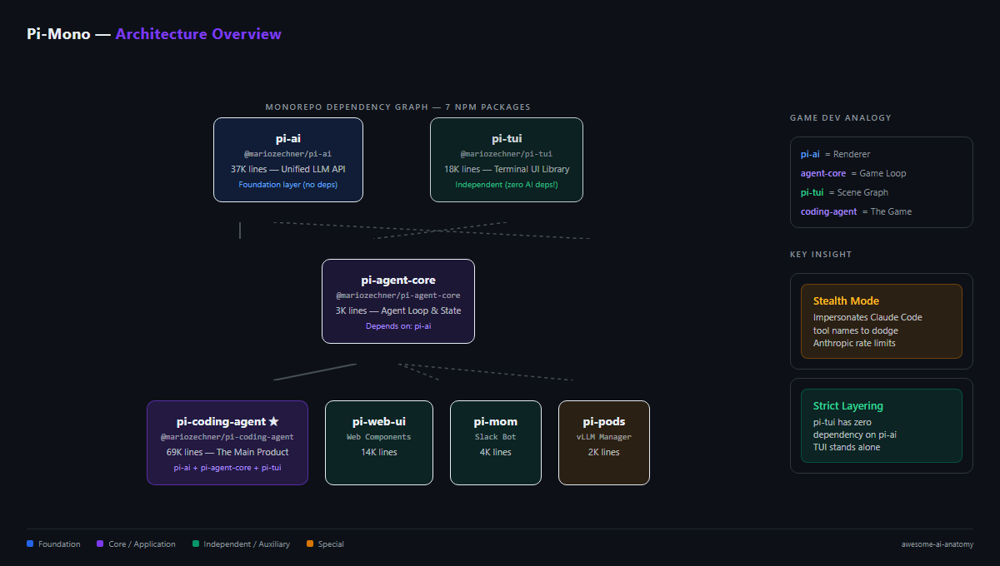
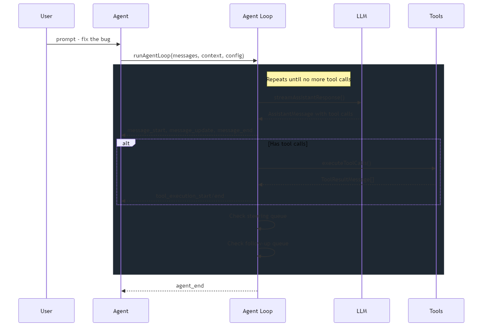

# Pi Mono: A "Stealth Mode" That Impersonates Claude Code's Tool Names, 147K Lines

> Mario Zechner (the libGDX guy) built a Claude Code alternative, and you can tell it's from a game developer. Scene-graph thinking applied to LLM provider abstraction, lazy loading patterns borrowed from texture streaming, and a "stealth mode" that renames tools to match Claude Code's exact casing. The website is literally called `shittycodingagent.ai`.

## TL;DR

- **What it is** — A 7-package TypeScript monorepo that layers a coding agent like a game engine: renderer abstraction (LLM providers), game loop (agent core), scene graph (TUI), and content (the actual agent).
- **Why it matters** — It's the only open-source coding agent with a standalone, reusable TUI library and LLM API layer that you can npm-install independently. Also ships a Claude Code compatibility mode that's... audacious.
- **What you'll learn** — Why lazy-loading provider modules saves real startup time, how two-lane input queuing lets users steer agents mid-flight, and what happens when a game dev applies scene-graph thinking to terminal rendering.

## Why Should You Care?

I was halfway through `packages/ai/src/providers/anthropic.ts` when I hit this:

```typescript
const claudeCodeVersion = "2.1.75";
const claudeCodeTools = [
    "Read", "Write", "Edit", "Bash", "Grep", "Glob",
    "AskUserQuestion", "EnterPlanMode", "ExitPlanMode", ...
];
```

Pi renames its tools to match Claude Code's exact casing before sending requests to Anthropic. Why? Because Anthropic likely gives Claude Code preferential treatment — better rate limits, prompt caching, or routing. By mimicking Claude Code's tool names, Pi piggybacks on that treatment.

This is audacious. And it's shipped as *default behavior*, not an opt-in flag.

The thing is, beyond the stealth mode, there's genuinely good engineering here. The monorepo has the cleanest package boundaries I've seen in any coding agent project. `pi-tui` has zero dependency on `pi-ai` — the TUI library stands completely alone. In a world where most agent frameworks smear LLM concerns across every layer, that discipline is rare.

The SWE-agent paper (Yang et al., 2024) showed that ACI design — how the agent interfaces with tools — matters more than model choice for coding performance. If that's true, then tool naming conventions become a competitive moat — and Pi is choosing to breach it rather than build its own.

## At a Glance

| Metric | Value |
|--------|-------|
| Stars | 32,049 |
| Forks | 3,488 |
| Language | TypeScript |
| Framework | Node.js (pure, no React/Electron) |
| Lines of Code | 147,444 (583 .ts files) |
| License | MIT |
| First Commit | 2025-08-09 |
| Latest Release | v0.65.2 (npm) |
| Data as of | April 2026 |

Pi is a monorepo of seven npm packages that together form a full stack for building AI-powered coding agents. Run `npx @mariozechner/pi-coding-agent` and you get an interactive terminal agent that reads, edits, and writes code — like Claude Code, but open source, multi-provider, and with a TUI library you can actually reuse.

---

## Characteristics

| Dimension | Description |
|-----------|-------------|
| Architecture | 7-package monorepo with game-engine layering: pi-ai (renderer abstraction), pi-agent-core (game loop), pi-tui (scene graph), pi-coding-agent (content) |
| Code Organization | 147K LOC TypeScript across 583 .ts files, strict dependency graph (pi-tui has zero dependency on pi-ai), lazy provider loading via dynamic import + promise caching |
| Security Approach | Stealth mode renames tools to match Claude Code's exact casing for compatibility, focused on agent functionality rather than a dedicated security layer |
| Context Strategy | Summarize-based compaction, steering/follow-up two-lane input queue during agent execution |
| Documentation | shittycodingagent.ai as honest branding, internal package boundaries need docs, 10 provider configs via registry |

## Architecture




The stack is layered in a way that'll feel familiar if you've worked with game engines: `pi-ai` is the renderer abstraction (swap OpenGL for Anthropic), `pi-agent-core` is the game loop (stream→toolcall→execute→repeat), `pi-tui` is the scene graph (differential rendering, component hierarchy), and `pi-coding-agent` is the actual game (all the content, modes, UI).

This isn't just nice architecture — it's load-bearing. Because `pi-ai` is a standalone npm package, you can use it to build completely different things. The Slack bot (`pi-mom`) does exactly that: imports the AI layer and agent core, bolts on Slack-specific tools, runs without the TUI at all. The web UI similarly imports `pi-ai` and `pi-agent-core` as Lit-based web components.

The dependency graph is *strict*. `pi-tui` has zero dependency on `pi-ai`. The TUI library stands alone. In a world where most agent frameworks smear LLM concerns across every layer, this discipline is rare.

**Files to reference:**
- `packages/ai/src/types.ts` — 305 lines defining the unified message/model/stream protocol
- `packages/agent/src/agent.ts` — the Agent class with steering/followUp queues
- `packages/coding-agent/src/core/agent-session.ts` — 1500+ line session orchestrator
- `packages/tui/src/tui.ts` — differential terminal renderer

---

## Core Innovation

### 1. The Unified Provider Protocol with Lazy Loading

Pi doesn't use an LLM SDK wrapper library like Vercel AI or LiteLLM. It defines its own protocol — `Model<TApi>`, `Context`, `StreamFunction`, `AssistantMessageEventStream` — and implements every provider natively.

```typescript
// From packages/ai/src/types.ts:9-11
export type KnownApi =
    | "openai-completions"
    | "mistral-conversations"
    | "openai-responses"
    | "azure-openai-responses"
    | "openai-codex-responses"
    | "anthropic-messages"
    | "bedrock-converse-stream"
    | "google-generative-ai"
    | "google-gemini-cli"
    | "google-vertex";
```

Each provider is loaded lazily via dynamic import. First time you call `streamSimple()` for Anthropic, it dynamically imports `./anthropic.js`, caches the module, and forwards the stream. If you never use Google, that provider code never loads.

```typescript
// From packages/ai/src/providers/register-builtins.ts (simplified)
function loadAnthropicProviderModule() {
    anthropicProviderModulePromise ||= import("./anthropic.js").then((module) => ({
        stream: module.streamAnthropic,
        streamSimple: module.streamSimpleAnthropic,
    }));
    return anthropicProviderModulePromise;
}
```

This is straight from game development: don't load the texture until the player sees the wall. Startup cost doesn't scale with the number of supported providers.

### 2. "Stealth Mode" — Impersonating Claude Code

The most audacious thing in the codebase. From `packages/ai/src/providers/anthropic.ts`:

```typescript
// Stealth mode: Mimic Claude Code's tool naming exactly
const claudeCodeVersion = "2.1.75";

// Claude Code 2.x tool names (canonical casing)
const claudeCodeTools = [
    "Read", "Write", "Edit", "Bash", "Grep", "Glob",
    "AskUserQuestion", "EnterPlanMode", "ExitPlanMode",
    "KillShell", "NotebookEdit", "Skill", "Task",
    "TaskOutput", "TodoWrite", "WebFetch", "WebSearch",
];
```

Pi renames its tools to match Claude Code's exact casing before sending requests to Anthropic. Anthropic likely gives Claude Code preferential treatment — better rate limits, prompt caching, or routing. By mimicking Claude Code's tool names, Pi piggybacks on that treatment.

The author even runs `https://cchistory.mariozechner.at`, a side project that archives Claude Code's system prompts across versions. That's some serious competitive intelligence.

It's technically impressive and solves a real problem (Anthropic's rate limits are brutal for third-party agents). It is also impersonating another product's API surface, which is something to watch for forward-compatibility. Anthropic could detect it and adjust routing. The fact that it ships as default behavior and not opt-in is a bold choice.

This touches on a broader tension in the agent ecosystem. If ACI design matters more than model choice, then tool naming conventions become a competitive moat — and Pi is choosing to breach it rather than build its own.

---

## How It Actually Works

### The Agent Loop — Scene-Graph-Style Event Pumping



If you squint, this is a game loop. Every "frame" (turn):

1. Poll input (steering messages — the user typing while the agent is working)
2. Run simulation (LLM call → tool execution → state update)
3. Render (emit events to UI subscribers)

The steering/follow-up queue system is the standout design. Most coding agents block user input while processing. Pi lets you type a correction *while the agent is running*, and it gets injected between tool calls. Two lanes: "steering" messages (injected immediately after the current turn) and "follow-up" messages (wait until the agent would otherwise stop).

```typescript
// From packages/agent/src/agent.ts:110-114
/** Queue a message to be injected after the current assistant turn finishes. */
steer(message: AgentMessage): void {
    this.steeringQueue.enqueue(message);
}
/** Queue a message to run only after the agent would otherwise stop. */
followUp(message: AgentMessage): void {
    this.followUpQueue.enqueue(message);
}
```

This maps directly to how game engines handle input buffering — you don't process the jump command mid-physics-step; you queue it and apply it at the right phase boundary. It's the classic think → act → observe loop with human-in-the-loop steering bolted on, and it's a pattern I wish more agents adopted.

### The Extension System — "Everything is a Plugin" Done Right


Pi's extension system has more event types than most agent frameworks have total API surface. Extensions can:

- Intercept and modify tool calls before execution (`tool_call` event with mutable `event.input`)
- Replace tool results after execution (`tool_result` event)
- Replace the entire compaction strategy (`session_before_compact`)
- Register custom LLM providers with OAuth flows
- Render custom TUI components for tool results
- Register keyboard shortcuts and CLI flags

The `ToolDefinition` type shows how deeply the TUI-rendering concern is integrated:

```typescript
// From packages/coding-agent/src/core/extensions/types.ts (simplified)
export interface ToolDefinition<TParams, TDetails, TState> {
    name: string;
    description: string;
    parameters: TParams;
    execute(toolCallId, params, signal, onUpdate, ctx): Promise<AgentToolResult<TDetails>>;
    renderCall?: (args, theme, context) => Component;  // TUI renderer
    renderResult?: (result, options, theme, context) => Component;
}
```

Each tool definition includes optional `renderCall` and `renderResult` methods that return TUI Components. A tool controls *exactly* how it looks in the terminal. The `bash` tool shows truncated output with keybinding hints. The `edit` tool shows a unified diff with syntax highlighting. This isn't possible when tools are decoupled from their rendering.

### Context Compaction — Automatic and Extension-Overridable

Pi tracks token usage across turns and compacts automatically when approaching the context window threshold. The compaction itself calls the LLM to summarize the conversation, but extensions can completely replace this:

```typescript
// From packages/coding-agent/src/core/extensions/types.ts
export interface SessionBeforeCompactEvent {
    type: "session_before_compact";
    preparation: CompactionPreparation;
    branchEntries: SessionEntry[];
    customInstructions?: string;
    signal: AbortSignal;
}
```

There's also overflow recovery: if an LLM returns a context-overflow error, Pi automatically removes the error message, runs compaction, and retries. Combined with auto-retry for rate limits (exponential backoff with configurable max retries), the system handles most transient failures without user intervention. The approach treats the context window as managed memory rather than a fixed buffer — proactive compression instead of crash-and-retry.

---

## The Verdict

The monorepo structure is the best I've seen in the coding agent space. Package boundaries are clean and meaningful — `pi-ai` (37K lines) and `pi-tui` (18K lines) are genuine standalone libraries that could live in their own repos. The dependency graph flows one way, and there's no "utils" dumping ground. This is unusual for agent projects.

The 69K-line `coding-agent` package is the densest part of the codebase. It contains everything from compaction algorithms to TUI components to extension loading to session management. The `AgentSession` class alone is over 1,500 lines coordinating multiple concerns: model management, compaction, retry logic, bash execution, extension lifecycle, session persistence — all in one class. This is a natural candidate for decomposition as the project grows. In a game engine analogy, the physics system, renderer, and input handler would be separate objects — and the same pattern could be applied here to unlock even cleaner extensibility.

The TUI library is legitimately good and underappreciated. Differential terminal rendering (only redraw changed lines/cells) is hard to get right, and Pi handles it with cursor marker protocols, Kitty image support, and proper ANSI escape handling. This is where Zechner's libGDX experience shows most clearly — game rendering is all about minimizing draw calls, and that's exactly what differential TUI rendering is.

Would I use pi-ai as a standalone LLM library? Yes, if I needed multi-provider support without Vercel AI's framework opinions. Would I use Pi as my daily coding agent? Depends on how much you trust the stealth mode — and whether you want to bet on a one-person project vs. Anthropic's Claude Code team.

---

## The Compatibility Question: Where "Compatible" Ends and "Impersonating" Begins

The stealth mode deserves a deeper discussion because it touches something the agent ecosystem hasn't resolved.

When the MCP spec standardizes tool interfaces, and projects like Goose build entire architectures around protocol compatibility, a natural question emerges: who owns a tool naming convention? If tool names are part of the ACI (Agent-Computer Interface), then Claude Code's `Read`/`Write`/`Edit`/`Bash` convention is arguably the most battle-tested ACI in the ecosystem.

Pi's stealth mode is the logical conclusion of that insight: if ACI matters most, use the best ACI available. The fact that it also happens to unlock rate limit benefits is either a bonus or the whole point, depending on how cynical you are.

This matters beyond Pi. As agents increasingly adopt MCP and tool-calling conventions solidify, we'll see more projects converging on the same tool names. When that happens, "compatibility" and "impersonation" become a spectrum, not a binary. Pi is just the first project that's honest about where it sits on that spectrum.

---

## Cross-Project Comparison

| Feature | Pi Mono | Claude Code | OpenClaw | DeerFlow |
|---------|---------|-------------|----------|----------|
| **Architecture** | Monorepo, layered packages | Monolithic CLI | Gateway + channel plugins | LangGraph middleware |
| **Provider support** | 10+ (native implementations) | Claude only | Multi-model (via config) | Single provider |
| **UI framework** | Custom TUI + Web Components | Custom TUI (Ink-based) | Terminal + multi-channel | Web UI (Next.js) |
| **Extension model** | 30+ event hooks + custom tools | Internal tools only | Skill system + MCP | Middleware chain |
| **Context management** | Auto-compaction + overflow recovery | 4-layer cascade | Memory DAG + compaction | SummarizationMiddleware |
| **Multi-agent** | No (single agent) | No | Subagent spawning | Thread pool (max 3) |
| **Session persistence** | JSONL tree (branching) | .claude/ directory | MEMORY.md + daily files | JSON file |
| **Self-hosted LLM** | Yes (pi-pods for vLLM) | No | No | No |
| **Slack/messaging** | Yes (pi-mom) | No | Yes (multi-channel) | Yes (Feishu/Slack) |

Pi occupies a unique spot: the only project that ships a standalone LLM API library *and* a GPU pod management tool alongside the coding agent. Also the only one with native web components for custom chat UIs. Where OpenClaw goes wide on channels and DeerFlow goes deep on middleware, Pi goes deep on developer infrastructure.

---

## Stuff Worth Stealing

### 1. Lazy Provider Loading Pattern

Dynamic import + promise caching for provider modules. Zero cost until first use, module loaded exactly once. ~20 lines to implement.

```typescript
// From packages/ai/src/providers/register-builtins.ts
let modulePromise: Promise<Module> | undefined;
function loadModule() {
    modulePromise ||= import("./provider.js").then(m => ({
        stream: m.streamFn,
        streamSimple: m.streamSimpleFn,
    }));
    return modulePromise;
}
```

### 2. Steering/Follow-Up Queue System

Two-lane input queuing during agent execution — "steering" for interruptions, "follow-up" for post-completion. The right abstraction for any interactive agent where users want to correct course mid-flight. ~100 lines.

### 3. Tool Definition with Integrated TUI Rendering

Coupling tool execution with tool rendering in a single definition means tools own their entire user experience. The `renderCall` / `renderResult` split is clean and easy to reason about. You could adapt this pattern to web UIs too.

---

## Hooks & Easter Eggs

**The website URL:** `shittycodingagent.ai`. Zechner registered this domain and the README links to it as the official site. This tells you everything about the marketing philosophy.

**Claude Code History Tracker:** Zechner runs `https://cchistory.mariozechner.at`, archiving Claude Code's system prompts across versions. Used as a reference for the stealth mode. Linked from within the source code.

**The "mom" package name:** The Slack bot is called "mom." No documentation explains why. My best guess: it's the thing that tells the agent what to do.

**OSS Weekend Mode:** There's a script (`scripts/oss-weekend.mjs`) that auto-closes all issues and PRs from non-maintainers for a configurable date range. The README banner says "I'm deep in refactoring internals, and need to focus." A one-person project being honest about capacity.

**The libGDX Connection:** Zechner created libGDX, the most popular open-source Java game framework (22K+ stars). The parallels are visible: both use layered abstraction over platform-specific backends (OpenGL/Vulkan for libGDX, LLM APIs for Pi), both ship a custom rendering system (scene2d for libGDX, pi-tui for Pi), both maintain strict package dependency discipline. The man builds things the same way regardless of domain.

**Armin and Daxnuts:** Look in `packages/coding-agent/src/modes/interactive/components/` — files named `armin.ts` and `daxnuts.ts`. Hidden TUI components. Easter eggs for the Discord community.

---

## Key Takeaways

1. **Game-engine layering works for agents.** Renderer abstraction → game loop → scene graph → content. Pi proves this pattern produces the cleanest package boundaries in the coding agent space.
2. **Lazy loading is free performance.** Dynamic import + promise caching for provider modules means startup cost stays constant regardless of how many providers you support. Every agent framework should do this.
3. **Stealth mode is a canary for agent ecosystem politics.** When tool naming conventions become competitive moats, impersonation becomes a tempting strategy. Pi is just the first project to ship it openly.
4. **A one-person project can compete at 32K stars.** The OSS Weekend Mode and dense `AgentSession` class show how much one talented maintainer can ship. Decomposing the core session class is a natural next step that would open the door to more contributors.
5. **The TUI is the hidden gem.** `pi-tui` at 18K lines with differential rendering, Kitty image support, and zero LLM dependencies is genuinely reusable. If you're building any terminal UI for AI tools, look here first.

---

## Verification Log

<details>
<summary>Fact-check log (click to expand)</summary>

| Claim | Verification Method | Result |
|-------|-------------------|--------|
| 32,049 stars | GitHub API (`/repos/badlogic/pi-mono`) | PASS Verified |
| 3,488 forks | GitHub API | PASS Verified |
| 147,444 LOC | PowerShell line count across 583 .ts files | PASS Verified |
| First commit 2025-08-09 | GitHub API `created_at` | PASS Verified |
| Latest release v0.65.2 | npm registry `@mariozechner/pi-coding-agent` | PASS Verified |
| MIT License | LICENSE file | PASS Verified |
| 7 packages in monorepo | `packages/` directory listing | PASS Verified (ai, agent, coding-agent, tui, web-ui, mom, pods) |
| pi-ai: 37,165 lines | Package-level line count | PASS Verified |
| pi-agent-core: 3,152 lines | Package-level line count | PASS Verified |
| pi-coding-agent: 69,493 lines | Package-level line count | PASS Verified |
| pi-tui: 17,659 lines | Package-level line count | PASS Verified |
| pi-web-ui: 13,808 lines | Package-level line count | PASS Verified |
| pi-mom: 3,578 lines | Package-level line count | PASS Verified |
| pi-pods: 1,546 lines | Package-level line count | PASS Verified |
| Stealth mode `claudeCodeVersion = "2.1.75"` | `packages/ai/src/providers/anthropic.ts:68` | PASS Verified |
| Tool names list (17 tools) | `packages/ai/src/providers/anthropic.ts:72-89` | PASS Verified |
| Steering/followUp queue in Agent class | `packages/agent/src/agent.ts:110-114` | PASS Verified |
| `armin.ts` and `daxnuts.ts` exist | Directory listing of `modes/interactive/components/` | PASS Verified |
| `shittycodingagent.ai` URL | README.md anchor tag | PASS Verified |
| Lazy provider loading pattern | `packages/ai/src/providers/register-builtins.ts` | PASS Verified |
| 10 API types (KnownApi union) | `packages/ai/src/types.ts:3-13` | PASS Verified |
| AgentSession class >1500 lines | `packages/coding-agent/src/core/agent-session.ts` full read | PASS Verified |
| libGDX creator (Mario Zechner) | GitHub profile `badlogic` + libGDX repo | PASS Known fact |

</details>

---

*Part of [awesome-ai-anatomy](https://github.com/NeuZhou/awesome-ai-anatomy) — source-level teardowns of how production AI systems actually work.*

